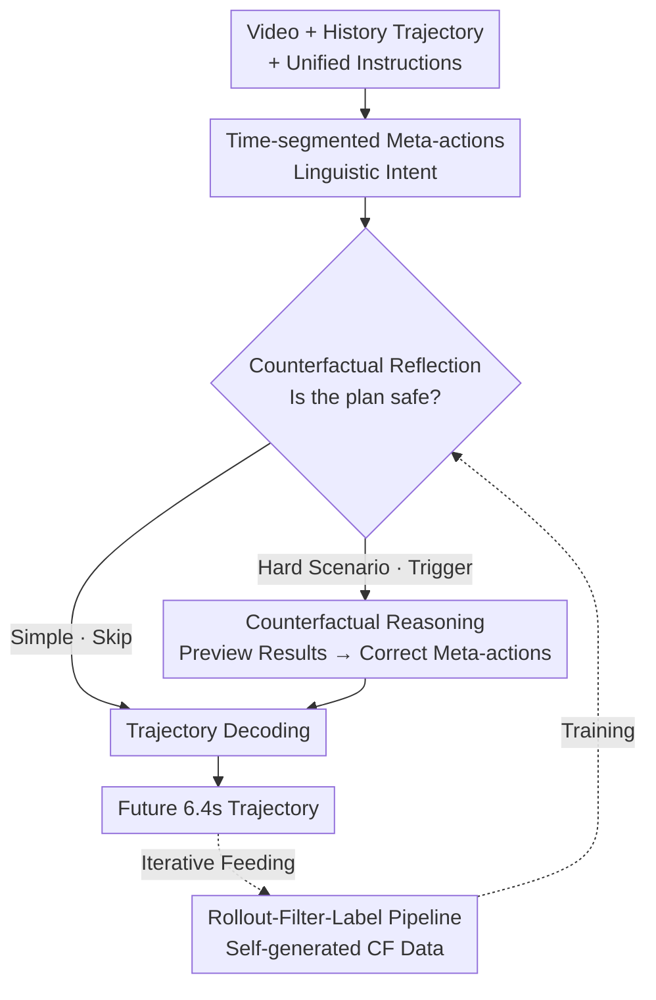

# Counterfactual VLA: Self-Reflective Vision-Language-Action Model with Adaptive Reasoning

**Conference**: CVPR 2026  
**Paper**: [CVF Open Access](https://openaccess.thecvf.com/content/CVPR2026/html/Peng_Counterfactual_VLA_Self-Reflective_Vision-Language-Action_Model_with_Adaptive_Reasoning_CVPR_2026_paper.html)  
**Code**: None (NVIDIA internal dataset, not open-sourced)  
**Area**: Autonomous Driving / Vision-Language-Action  
**Keywords**: VLA, Counterfactual Reasoning, Self-Reflection, Autonomous Driving, Adaptive Thinking

## TL;DR
CF-VLA enables an autonomous driving VLA to first generate "time-segmented meta-actions" and then perform counterfactual reasoning on its own proposed actions ("What would happen if I follow this plan, and should I modify it?") to self-correct before outputting a trajectory. Coupled with a rollout–filter–label data pipeline that labels counterfactual traces only for difficult scenarios, the model learns "adaptive reasoning"—thinking only when necessary—improving trajectory accuracy by approximately 17.6% and safety metrics by roughly 20%.

## Background & Motivation

**Background**: Reasoning-augmented VLAs have recently become a mainstream advancement in end-to-end autonomous driving and robotic manipulation. Large vision-language backbones generate an intermediate linguistic trace describing observations and intentions before executing actions, thereby enhancing interpretability and robustness (e.g., SimLingo, Alpamayo-R1, AutoVLA).

**Limitations of Prior Work**: Existing traces are almost entirely **descriptive** rather than **self-reflective**. Models may state, "A pedestrian is crossing the road ahead" or "I should be careful," but once a textual intention is generated, it is treated as ground truth and fed directly to the low-level policy. **There is no mechanism to look back and verify if the instruction itself conflicts with visual cues or requires adjustment.** In other words, models can "narrate" but cannot "question themselves."

**Key Challenge**: Current "self-correction" methods are either reactive (replanning/failure recovery after an observed failure) or rely on external world models/verifiers to simulate futures and judge plans. While external simulation can evaluate a plan, it **cannot help the VLA understand its own reasoning process**—a fundamental difference from true self-reflection. Two primary obstacles prevent internal counterfactual self-reflection: ① Most VLA actions are represented as latent tokens, leaving the language model with **no handle to discuss its own actions** (lack of action-to-language alignment); ② Standard training pipelines do not teach models to address counterfactual questions like "What will happen if I follow the plan I just proposed, and how should I fix it?"

**Goal**: To embed a counterfactual self-reflection loop within the VLA's forward pass to perform causal analysis and correction of predicted control signals before execution, without relying on external verifiers.

**Key Insight**: Utilize **time-segmented meta-actions** as an alignment handle between language and action. Upgrade reasoning from "one-time scene description" to "counterfactual analysis of one's own behavioral plan + executable self-correction," utilizing a self-generated data pipeline to label counterfactual supervision only in difficult scenarios where "meta-actions are the bottleneck."

## Method

### Overall Architecture

The input to CF-VLA consists of two front-view video streams (120° wide-angle + 30° telephoto, 2 Hz, past 2 seconds), the ego-vehicle's historical trajectory (past 1.6 seconds encoded as a history token), and a unified instruction prompt. The output is a discrete trajectory token covering the next 6.4 seconds. Unlike standard VLAs that map `meta-actions → trajectory`, CF-VLA inserts a self-reflection loop:

$$\text{meta-actions} \to \text{CF Reasoning} \to \text{Updated meta-actions} \to \text{trajectory}$$

The model first predicts a sequence of linguistic time-segmented meta-actions (summarizing driving intent). It then performs counterfactual chain-of-thought, **conditioned on the visual context and its just-proposed meta-actions**: "What will happen if I follow this plan, and is it desirable?" The model identifies unsafe or suboptimal plans (e.g., "Accelerating toward an intersection" → "Decelerating early to yield"), outputs corrected meta-actions, and decodes the final trajectory. Crucially, the model decides whether to trigger this reflection (adaptive thinking), while the ability to perform counterfactual reasoning is acquired through a rollout–filter–label pipeline that generates synthetic training data.

The system comprises two sides: the **inference side** follows the `meta→CF→meta→traj` self-reflection forward pass; the **data side** involves rolling out the current model, filtering high-value scenarios where "meta-actions are the bottleneck," labeling them with a teacher model, and fine-tuning. The trained CF-VLA can be reintroduced into the pipeline to generate new rounds of data, creating a self-enhancing flywheel.

### Key Designs

**1. Time-segmented Meta-actions: Providing a Handle for Self-Discussion**

To overcome the obstacle of actions being latent tokens, CF-VLA moves away from continuous control signals or uninterpretable tokens. Instead, it decomposes driving intent into linguistic primitives across three orthogonal dimensions: Longitudinal (Accelerate / Decelerate / Keep Speed / Wait / Reverse), Lateral (Straight / Left Turn / Right Turn), and Lane (Keep Lane / Left/Right Lane Change). Each dimension is partitioned into **non-overlapping time segments** within the 6.4s planning window, such as "0.0–2.8s: Keep Speed, 2.8–6.4s: Accelerate."

This "time segmentation" is critical: it aligns naturally with the temporal structure of continuous trajectories, allowing the model to **reason compositionally about action transitions** in language space (e.g., when to switch from maintaining speed to decelerating) and providing a concrete object for counterfactual reasoning to modify. Ablations (see below) show that when meta-actions are pre-filled with ground truth, trajectory error is halved, indicating that remaining errors stem primarily from inaccurate meta-action prediction rather than trajectory decoding—the primary motivation for counterfactual reasoning at the meta-action level.

**2. Self-Reflective Counterfactual Reasoning Loop: Questioning Plans Before Execution**

This is the core contribution. While standard reasoning-VLAs treat meta-actions as final answers, CF-VLA treats them as "drafts for auditing." Conditioned on the visual context and its own proposed meta-actions, the model generates a counterfactual trace diagnosing "why the current plan is inferior to an expert plan" and "how it should be adjusted," subsequently outputting **updated meta-actions** before decoding the trajectory. For example, if the draft is "Accelerate into the roundabout" while a pedestrian is crossing, the reasoning identifies the violation of right-of-way and collision risk, correcting the longitudinal action to "Decelerate early + Wait."

The fundamental difference from existing "self-correction": it does not rely on external world models or verifiers. Counterfactual evaluation occurs **during the same forward pass** as online self-correction. Mechanistically, this is unified in language space: both meta-actions and reasoning are linguistic tokens. Whether to enter reflection is determined by a control word generated after the first set of meta-actions (`Action:` triggers the trajectory directly, while `Thinking:` enters counterfactual reasoning).

**3. Rollout–Filter–Label Counterfactual Data Pipeline: Targeted Labeling**

Standard training does not teach counterfactual reasoning, and manual labeling is expensive. CF-VLA uses a self-generation pipeline to extract high-value scenarios from the model's own behavior:

- **Rollout**: A base VLA (capable of meta-actions but not counterfactual reasoning) is run on the training set to produce two sets of trajectories: free generation $x_{\text{free}}$ (predict meta-actions then decode) and pre-filled $x_{\text{pf}}$ (use ground-truth meta-actions to decode), sampling 6 trajectories for each.
- **Filter**: Using minimum Average Displacement Error $\text{minADE}(x, x^\star)$ as the metric against the expert future, scenarios are selected if $\text{minADE}(x_{\text{pf}}, x^\star) < \text{minADE}(x_{\text{free}}, x^\star)$ and $\text{minADE}(x_{\text{free}}, x^\star) > \epsilon$ ($\epsilon=0.5$). The intuition is: these are scenarios where the model performs poorly during free generation but succeeds when meta-actions are correct—**proving that meta-actions are the bottleneck**. Correcting meta-actions here directly yields trajectory improvements. Scenarios where free generation is already sufficient are excluded.
- **Label**: For filtered scenarios, a high-capacity teacher model (Qwen2.5-VL-72B-Instruct) generates a concise counterfactual trace explaining why the current meta-action is suboptimal and how to adjust it, forming the counterfactual dataset $D_{\text{CF}}$.

The design of "filtering by trajectory divergence" is key to performance (see Table 3). Labeling only bottleneck scenarios is both more accurate and results in shorter outputs than labeling the entire dataset.

**4. Adaptive Thinking + Multi-round Flywheel: Learning "When to Think"**

CF-VLA does not use explicit rules or RL to judge scenario difficulty. Instead, it mixes samples with and without counterfactual traces under the **same unified instruction prompt**. The model implicitly learns when to reflect—rarely triggering for simple scenarios (following a car) and significantly more frequent for difficult ones (lane changes, turns, vulnerable road users). Training proceeds in stages: basic trajectory generation ($D_{\text{traj}}$), introduction of meta-actions ($D_{\text{traj}} \cup D_{\text{meta}}$), and finally fine-tuning the complete CF-VLA ($D_{\text{traj}} \cup D_{\text{meta}} \cup D_{\text{CF}}$). All parameters are unfrozen. Loss is calculated only on assistant-generated tokens, and the **first segment (uncorrected) of meta-actions in counterfactual samples is masked** to prevent the model from learning from its own mistakes.

Furthermore, the trained CF-VLA can be fed back into the pipeline to generate new data ($D_{\text{CF}}^{\text{Round2}}$). Unlike CoT, which produces nearly deterministic explanations for a scene, CF-VLA's reasoning is conditioned on predicted meta-actions, allowing **the same scene to yield diverse reasoning traces**. Experimental results show that the second round improves performance while cutting the "think rate" nearly in half, achieving a win-win of higher accuracy and lower inference-time computation.

### Loss & Training
Cross-entropy loss is applied only to assistant tokens; prompt/system/user tokens are masked. The first meta-action block in counterfactual samples is masked to prevent learning errors. Different loss weights are assigned to meta-actions, reasoning, and trajectory tokens. Trajectories are represented as discrete tokens, requiring an expanded VLM vocabulary to include trajectory tokens and special markers like `<begin_of_traj>` and `<end_of_traj>`. Model scale and design are comparable to Alpamayo-R1.

## Key Experimental Results

The dataset comprises 80,000 hours of NVIDIA internal human driving data across 25 countries. $D_{\text{traj}}$ includes ~11.6 million 20s clips; $D_{\text{meta}}$ includes 433K segments (801K samples) for training; $D_{\text{CF}}$ includes ~200K samples. Metrics are categorized into Trajectory Accuracy (MinADE/AvgADE, MinFDE/AvgFDE, Corner Distance), Safety (Collision Rate, Off-road Rate), and Reasoning Quality (Meta-Action IOU, Output Length, Think Rate).

### Main Results (Table 1, Selected; ↓ Lower is better, ↑ Higher is better)

| Model | MinADE↓ | MinFDE↓ | Corner Dist.↓ | Collision↓ | Off-road↓ | IOU↑(init→edited) | Output Len. (Think Rate) |
| :--- | :--- | :--- | :--- | :--- | :--- | :--- | :--- |
| traj-only | 0.9283 | 2.5912 | 0.8563 | 0.0244 | 0.0720 | – | 10.00 (–) |
| meta-act (w/o route) | 0.8411 | 2.3647 | 0.7720 | 0.0224 | 0.0625 | 0.9169 | 85.32 (–) |
| lang-meta-act | 0.8021 | 2.2540 | 0.7358 | 0.0206 | 0.0617 | 0.9183 | 144.28 (1.00) |
| **CF-VLA (w/o route, R1)** | **0.7650** | **2.1416** | 0.6975 | 0.0191 | 0.0601 | 0.9153→0.9212 | 113.36 (0.148) |
| CF-VLA (w/o route, R2) | 0.7647 | 2.1365 | 0.6996 | 0.0194 | 0.0583 | 0.9174→0.9228 | 102.12 (0.083) |
| meta-act (w/ route) | 0.7263 | 1.9561 | 0.6600 | 0.0196 | 0.0619 | 0.9236 | 87.20 (–) |
| **CF-VLA (w/ route, R1)** | **0.6712** | **1.7988** | **0.6010** | **0.0177** | 0.0593 | 0.9207→0.9231 | 125.67 (0.219) |
| CF-VLA (w/ route, R2) | 0.6813 | 1.8291 | 0.6168 | **0.0174** | 0.0585 | 0.9238→0.9276 | 109.36 (0.123) |

- **Performance hierarchy is clear**: `traj-only < meta-act < lang-meta-act < CF-VLA`. Meta-actions reduce MinADE/FDE by ~9% over `traj-only`; adding language reduces it by another ~5%.
- CF-VLA further reduces MinADE/FDE by ~9–10% over non-reflective `meta-act`, with IOU improving by ~0.5–1.0 points after counterfactual editing.
- **Safety**: Compared to `traj-only`, the best CF model reduces collision rates by ~25–30%, off-road rates by ~15–20%, and corner distance by ~30% (Trajectory accuracy ↑17.6%, Safety ↑20.5%).
- **Multi-round**: Round 2 outperforms Round 1 in AvgADE/FDE and edited IOU, while the think rate is nearly halved, improving both accuracy and inference efficiency.

### Ablation Study (Table 2 & 3)

| Configuration | MinADE↓ | AvgADE↓ | IOU(init→edited) | Think Rate | Description |
| :--- | :--- | :--- | :--- | :--- | :--- |
| meta-act (baseline) | 0.8411 | 1.6216 | 0.9169 | – | Baseline meta-actions |
| meta-act (pre-filled) | 0.4831 | 0.9968 | 1.0 | – | GT meta-actions (halves error) |
| **CF-VLA (adaptive)** | **0.7650** | 1.5606 | 0.9153→0.9212 | 0.148 | Adaptive reflection (Best trade-off) |
| CF-VLA (force no think) | 0.7897 | 1.4890 | 0.9133 | 0.0 | No thinking; fails hard scenes |
| CF-VLA (force think) | 0.9319 | 2.1144 | 0.9132→0.8565 | 1.0 | Always thinking; causes degradation |
| CF-VLA (filtered ds) | 0.6712 | 1.4574 | 0.9207→0.9231 | 0.219 | Targeted labeling (Best performance) |
| CF-VLA (whole ds) | 0.6811 | 1.4185 | 0.9207→0.9231 | 0.668 | Full labeling; 3x higher think rate |

### Key Findings
- **Meta-actions are the bottleneck**: Pre-filling meta-actions with ground truth drops MinADE from 0.84 to 0.48. This confirms that "remaining error originates from meta-action prediction," justifying the focus of counterfactual reasoning on meta-actions rather than trajectories.
- **Selective thinking is optimal**: "Force think" (always reasoning) not only consumes significantly more compute (257 vs 87 tokens) but also degrades trajectory accuracy (MinADE 0.93). "Adaptive" achieves the best balance.
- **Filtering is crucial**: `filtered ds` achieves better MinADE/MinFDE than `whole ds` with much shorter outputs (think rate 0.219 vs 0.668).
- **Difficulty correlates with thinking**: The think rate is strongly linked to MinADE. Simple scenarios (car following) rarely trigger reasoning, while high-risk scenarios (lane changes, VRU) trigger it significantly more.

## Highlights & Insights
- **Internalizing Self-Reflection**: Counterfactual evaluation and correction happen within a single generation pass via control tokens (`Action:`/`Thinking:`), eliminating the need for external world models. This is a fundamental departure from replanning or world-model-based VLAs.
- **Automatic Bottleneck Discovery**: The divergence between "pre-filled" and "free-generation" trajectories automatically identifies hard cases. If $\text{minADE}(x_{\text{pf}})$ is much better than $\text{minADE}(x_{\text{free}})$, the meta-action is the bottleneck. This trick is transferable to any two-stage "intention → execution" strategy.
- **Emergent Adaptive Reasoning via SFT**: Adaptive thinking emerges purely from SFT on mixed data without explicit rules or RL (unlike AdaThinkDrive). The model implicitly learns to allocate compute based on scene difficulty.
- **Diversity in Counterfactual Data**: Since reasoning is conditioned on predicted actions, a single scene can generate diverse traces across rollout rounds, allowing multi-round self-training to extract continuous value.

## Limitations & Future Work
- **Closed-source & Private Data**: Uses 80,000 hours of NVIDIA internal data with no open code, making external reproduction nearly impossible.
- **Teacher Model Dependency**: Counterfactual traces rely on Qwen2.5-VL-72B; the quality is capped by the teacher's capability and may contain hallucinations.
- **Open-loop Evaluation**: Metrics like MinADE and Collision rate are geometric comparisons against expert futures. Whether this translates to reduced accidents in closed-loop driving remains to be verified.
- **Implicit Trigger Mechanism**: The "when to think" decision is purely implicit; there is a lack of explicit steering knobs.

## Related Work & Insights
- **vs. SimLingo / CAST / VLAPS**: These use counterfactuals "externally"—generating counterfactual instruction-action pairs or searching simulated futures to improve policies. CF-VLA performs counterfactuals on its **own predicted meta-actions** internally.
- **vs. World-model VLAs**: External simulations can evaluate plans but do not help the VLA understand its internal reasoning; CF-VLA is a model-internal self-reflection.
- **vs. OneTwoVLA / AdaThinkDrive**: OneTwoVLA switches thinking at task boundaries; AdaThinkDrive uses rules and RL. CF-VLA uses **pure SFT** to let adaptive reasoning emerge from data, concentrating compute on the hardest scenarios.
- **vs. AutoVLA / Alpamayo-R1**: Their CoT serves as a one-time rationale; CF-VLA upgrades the trace to a self-correcting signal.

## Rating
- Novelty: ⭐⭐⭐⭐⭐ Internalizing counterfactual self-reflection and achieving emergent adaptive reasoning through SFT is a novel paradigm.
- Experimental Thoroughness: ⭐⭐⭐⭐ Solid main results and ablations, but limited by private data and open-loop metrics.
- Writing Quality: ⭐⭐⭐⭐ Clear motivation and well-structured diagrams for the `meta→CF→meta→traj` loop.
- Value: ⭐⭐⭐⭐ The data mining tricks and adaptive SFT approach are transferable and highly relevant to the safety of end-to-end autonomous driving.

<!-- RELATED:START -->

## Related Papers

- [\[CVPR 2026\] NoRD: A Data-Efficient Vision-Language-Action Model that Drives without Reasoning](nord_a_data-efficient_vision-language-action_model_that_drives_without_reasoning.md)
- [\[ICLR 2026\] AutoDrive-R²: Incentivizing Reasoning and Self-Reflection Capacity for VLA Model in Autonomous Driving](../../ICLR2026/autonomous_driving/autodrive-r²_incentivizing_reasoning_and_self-reflection_capacity_for_vla_model_.md)
- [\[CVPR 2026\] HybridDriveVLA: Vision-Language-Action Model with Visual CoT reasoning and ToT Evaluation for Autonomous Driving](hybriddrivevla_vision-language-action_model_with_visual_cot_reasoning.md)
- [\[CVPR 2026\] E3AD: An Emotion-Aware Vision-Language-Action Model for Human-Centric End-to-End Autonomous Driving](e3ad_an_emotion-aware_vision-language-action_model_for_human-centric_end-to-end_.md)
- [\[CVPR 2026\] Drive My Way: Preference Alignment of Vision-Language-Action Model for Personalized Driving](drive_my_way_preference_alignment_of_vision-language-action_model_for_personaliz.md)

<!-- RELATED:END -->
## Related Papers

- [\[CVPR 2026\] AT-VLA: Adaptive Tactile Injection for Enhanced Feedback Reaction in Vision-Language-Action Models](at-vla_adaptive_tactile_injection_for_enhanced_feedback_reaction_in_vision-langu.md)
- [\[CVPR 2026\] TRM-VLA: Temporal-Aware Chain-of-Thought Reasoning and Memorization for Vision-Language-Action Models](trm-vla_temporal-aware_chain-of-thought_reasoning_and_memorization_for_vision-la.md)
- [\[CVPR 2026\] ACoT-VLA: Action Chain-of-Thought for Vision-Language-Action Models](acot-vla_action_chain-of-thought_for_vision-language-action_models.md)
- [\[CVPR 2026\] AwareVLN: Reasoning with Self-awareness for Vision-Language Navigation](awarevln_reasoning_with_self-awareness_for_vision-language_navigation.md)
- [\[CVPR 2026\] SRPO: Self-Referential Policy Optimization for Vision-Language-Action Models](srpo_self-referential_policy_optimization_for_vision-language-action_models.md)

<!-- RELATED:END -->
