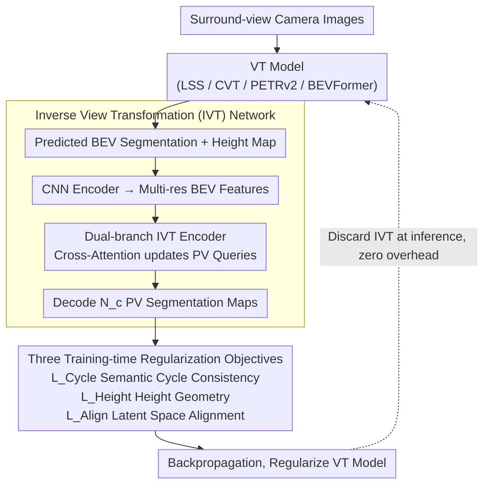

# CycleBEV: Regularizing View Transformation Networks via View Cycle Consistency for Bird's-Eye-View Semantic Segmentation

**Conference**: CVPR2026  
**arXiv**: [2602.23575](https://arxiv.org/abs/2602.23575)  
**Code**: [JeongbinHong/CycleBEV](https://github.com/JeongbinHong/CycleBEV)  
**Area**: Autonomous Driving  
**Keywords**: BEV Semantic Segmentation, View Transformation, Cycle Consistency, Inverse View Transformation, Regularization

## TL;DR

Ours proposes the CycleBEV regularization framework: an Inverse View Transformation (IVT) network is introduced during training to map BEV segmentation maps back to Perspective View (PV) segmentation maps. The existing BEV semantic segmentation models are enhanced through cycle consistency loss, height-aware geometric regularization, and cross-view latent space alignment, with zero additional overhead during inference.

## Background & Motivation

1. **BEV representation is fundamental for autonomous driving**: Surround-view images to BEV semantic maps form the core front-end for motion planning/control, but the mapping from perspective to orthographic view is heavily affected by depth ambiguity and occlusion.
2. **Limitations of three major VT paradigms**: LSS (per-pixel depth estimation + 3D projection), CVT/PETRv2 (Transformer cross-attention), and BEVFormer (deformable attention) perform poorly on small and occluded objects.
3. **Cycle consistency is under-utilized in BEV**: The CycleGAN concept of cycle consistency is naturally suited for the PV↔BEV bidirectional mapping, but previous methods like CVTM and FocusBEV only utilize it partially or implicitly, leading to limited effectiveness.
4. **Prior work embeds inverse mapping into the inference path**: CVTM/FocusBEV integrate BEV→PV modules into the inference architecture, increasing computational complexity and model size.
5. **Semantic ambiguity in feature-space cycle consistency**: CVTM imposes consistency in the feature space rather than the semantic space, resulting in weak semantic signals; FocusBEV does not even apply an explicit cycle loss.
6. **BEV space lacks height information**: Standard BEV maps only contain the x-y plane, missing object height, which makes inverse mapping learning difficult and requires additional geometric constraints.

## Method

### Overall Architecture

The Key Challenge in BEV semantic segmentation is that the perspective-to-orthographic mapping is hindered by depth ambiguity and occlusion, often losing small and occluded objects. CycleBEV does not modify the inference structure but adds a regularization loop **during training**: it trains an IVT network to "translate" predicted BEV maps back into multi-view PV segmentation maps, forcing the main model to learn accurate BEV representations via cycle consistency. This is supplemented by height geometric regularization and cross-view latent space alignment. At inference, the IVT and all auxiliary branches are discarded, running only the original VT model with **zero overhead**.

### Key Designs

**1. Inverse View Transformation (IVT) Network: Completing the PV↔BEV "Inverse Mapping"**

The Mechanism of cycle consistency requires an inverse path, but standard BEV maps lack height information, making inverse mapping difficult. Inspired by CVT, IVT uses a dual-branch structure: the input is either GT BEV maps (early training) or the concatenation of predicted BEV and height maps $[\mathbf{H}; \mathbf{O}]$. A CNN encoder first generates multi-resolution BEV features $\{\bar{\mathbf{B}}_s\}$, and two IVT encoders process high/low resolution features. PV queries are updated via Transformer cross-attention and decoded into $N_c$ PV segmentation maps. To provide spatial awareness, camera parameters $\mathbf{K}_i, \mathbf{R}_i, \mathbf{T}_i$ project BEV coordinates into image coordinates, which are added as positional encodings after MLP processing. Ablation shows the dual-branch outperforms the single-branch (41.78 vs 41.67).

**2. Three Training-time Regularization Objectives: Cycle Consistency, Height Geometry, and Latent Space Alignment**

To propagate signals effectively, CycleBEV imposes cycle consistency $\mathcal{L}_{Cycle}$ in the **semantic space** rather than the feature space used by CVTM. The path "VT Prediction → IVT Inverse Mapping → PV Segmentation" is supervised by GT PV maps using BCE, providing direct semantic signals. Height-aware geometric regularization $\mathcal{L}_{Height}$ uses height map MSE to force the VT to learn object heights (z-axis information). Cross-view latent space alignment $\mathcal{L}_{Align}$ uses Smooth-L1 to align BEV features with IVT's multi-resolution features. Ablation shows these three components are additive (39.70 → 40.55 → 41.40 → 41.78).

### Loss & Training

The overall loss is defined as:

$$\mathcal{L}_{Overall} = \mathcal{L}_{BCE}^1 + \lambda_1 \mathcal{L}_{Height} + \lambda_2 \mathcal{L}_{Align} + \lambda_3 \mathcal{L}_{Cycle} + \lambda_4 \mathcal{L}_{BCE}^2$$

| Loss | Function | Weight |
|------|----------|--------|
| $\mathcal{L}_{BCE}^1$ | Main BEV segmentation loss | 1.0 |
| $\mathcal{L}_{Height}$ | Height map MSE, forcing VT to learn height information | $\lambda_1=1.0$ |
| $\mathcal{L}_{Align}$ | Smooth-L1 alignment between BEV and IVT features | $\lambda_2=10^{-3}$ |
| $\mathcal{L}_{Cycle}$ | Cycle consistency: VT pred → IVT inv → PV BCE | $\lambda_3=0.4$ |
| $\mathcal{L}_{BCE}^2$ | IVT network's own PV segmentation BCE | $\lambda_4=1.0$ |

Training occurs in two stages: first, pre-train the IVT using GT BEV maps → GT PV segmentation (labels generated by Mask2Former); second, jointly train the VT model with the pre-trained IVT. Gaussian noise is added to IVT inputs to adapt to noisy VT predictions, and the system is optimized via $\mathcal{L}_{Overall}$.

## Key Experimental Results

### Main Results — nuScenes Validation (mIoU)

| Model | Drivable | Vehicle | Pedestrian | Avg |
|------|----------|---------|------------|-----|
| CVT | 76.80 | 31.41 | 10.89 | 39.70 |
| **CVT+Ours** | **77.40** (+0.6) | **34.24** (+2.83) | **13.69** (+2.8) | **41.78** (+2.08) |
| PETRv2 | 78.80 | 31.51 | 8.31 | 39.54 |
| **PETRv2+Ours** | **79.54** (+0.74) | **34.25** (+2.74) | **11.74** (+3.43) | **41.84** (+2.3) |
| LSS | 67.58 | 16.85 | 1.34 | 28.59 |
| **LSS+Ours** | **67.87** (+0.29) | **21.71** (+4.86) | **5.08** (+3.74) | **31.55** (+2.96) |
| BEVFormer | 78.06 | 33.23 | 11.70 | 41.00 |
| **BEVFormer+Ours** | **78.20** (+0.14) | **34.46** (+1.23) | **13.39** (+1.69) | **42.02** (+1.02) |

In contrast, CVTM's maximum Gains were only 0.65/0.2/0.6, and FocusBEV even reduced performance in most cases.

### Ablation Study — CVT Baseline

| VCC | Height | Align | Avg mIoU |
|-----|--------|-------|----------|
| ✗ | ✗ | ✗ | 39.70 |
| ✔ | ✗ | ✗ | 40.55 |
| ✔ | ✔ | ✗ | 41.40 |
| ✔ | ✔ | ✔ | **41.78** |
| Single-branch ✔ | ✔ | ✔ | 41.67 |

Each component contributes positively; the dual-branch IVT is superior to the single-branch.

### Key Findings

- **Occlusion Robustness**: For low-visibility (<40%) objects, CVT+Ours improved Vehicle/Pedestrian mIoU by 0.54/0.36 respectively, whereas CVTM was ineffective. CVT+Ours even outperformed the original BEVFormer in low-visibility scenarios.
- **Compatibility with Augmentation**: BEVFormer + Augmentation + CycleBEV: Vehicle 36.38 (+3.15), Pedestrian 15.19 (+3.49), showing complementarity with augmentation strategies.

## Highlights & Insights

- **Plug-and-play Regularization**: Applicable across four models in three paradigms (LSS / CVT / PETRv2 / BEVFormer), yielding consistent improvements.
- **Zero Inference Overhead**: IVT is only used during training and completely discarded at inference, maintaining original model size and latency.
- **Semantic-level Cycle Consistency**: Imposing constraints in the semantic space is more direct and effective than the feature-space consistency in CVTM.
- **Height Information as Geometric Supervision**: First to introduce object height map prediction as a regularization signal in BEV segmentation to compensate for the missing z-axis.
- **Significant Gains on Occluded Objects**: The largest improvements occur in low-visibility categories (Pedestrian up to +3.74 Gain).
- **Experimental Thoroughness**: Extensive coverage including ablation, occlusion analysis, AE comparison, SA comparison, augmentation compatibility, and temporal extensions.

## Limitations & Future Work

1. **Limited gains on Drivable area** (max +0.74), suggesting less room for improvement in large static regions.
2. **Lack of temporal modeling**: The current framework focuses on spatial regularization, ignoring temporal consistency between adjacent frames.
3. **IVT pre-training requires PV pseudo-labels**: Requires training Mask2Former beforehand to generate PV labels, introducing preprocessing overhead and potential error propagation.
4. **Validated only on nuScenes**: Generalization tests on other datasets like Waymo or Argoverse were not conducted.
5. **Smaller relative Gain on BEVFormer** (Avg +1.02), likely due to diminishing marginal returns on a stronger baseline.
6. **Height map GT construction details**: The specific process for generating normalized height maps from 3D boxes is not fully detailed.

## Related Work & Insights

| Method | IVT Usage | Inference Overhead | Cycle Consistency Type | CVT Avg mIoU |
|------|-------------|---------|---------------|-------------|
| CVTM | Embedded in path | +Computation/Params | Feature-space (partial) | 39.95 (+0.25) |
| FocusBEV | Embedded in path | +Computation/Params | Implicit (no explicit loss) | 39.49 (-0.21) |
| **CycleBEV** | **Training only** | **Zero** | **Semantic-space (explicit)** | **41.78 (+2.08)** |

Compared to BEV Auto-Encoder supervision, the multi-resolution BEV features provided by IVT serve as more effective supervision signals (CVT Avg 40.47 vs 39.88).

## Rating

- **Novelty**: ⭐⭐⭐⭐ — Cycle consistency is not new, but the systematic application (regularization + height + latent alignment) in BEV segmentation is well-designed.
- **Experimental Thoroughness**: ⭐⭐⭐⭐⭐ — Four models across three paradigms, comprehensive ablation, and multi-dimensional analysis make for an exemplary design.
- **Writing Quality**: ⭐⭐⭐⭐ — Clear structure with intuitive visual comparisons against CVTM/FocusBEV.
- **Value**: ⭐⭐⭐⭐ — A plug-and-play regularization framework with zero inference overhead offers high practical utility.

<!-- RELATED:START -->

## Related Papers

- [\[CVPR 2026\] BEV-CAR: Enhancing Monocular Bird's Eye View Segmentation with Context-Aware Rasterization](bev-car_enhancing_monocular_birds_eye_view_segmentation_with_context-aware_raste.md)
- [\[CVPR 2026\] VIRD: View-Invariant Representation through Dual-Axis Transformation for Cross-View Pose Estimation](vird_view-invariant_representation_through_dual-axis_transformation_for_cross-vi.md)
- [\[CVPR 2026\] Spe-BEVHead: Rethinking the Detection Head Design for Bird's-Eye-View Object Detection](spe-bevhead_rethinking_the_detection_head_design_for_birds-eye-view_object_detec.md)
- [\[CVPR 2026\] BEV-SLD: Self-Supervised Scene Landmark Detection for Global Localization with LiDAR Bird's-Eye View Images](bev-sld_self-supervised_scene_landmark_detection_for_global_localization_with_li.md)
- [\[CVPR 2026\] SToRe3D: Sparse Token Relevance in ViTs for Efficient Multi-View 3D Object Detection](store3d_sparse_token_relevance_in_vits_for_efficient_multi-view_3d_object_detect.md)

<!-- RELATED:END -->
