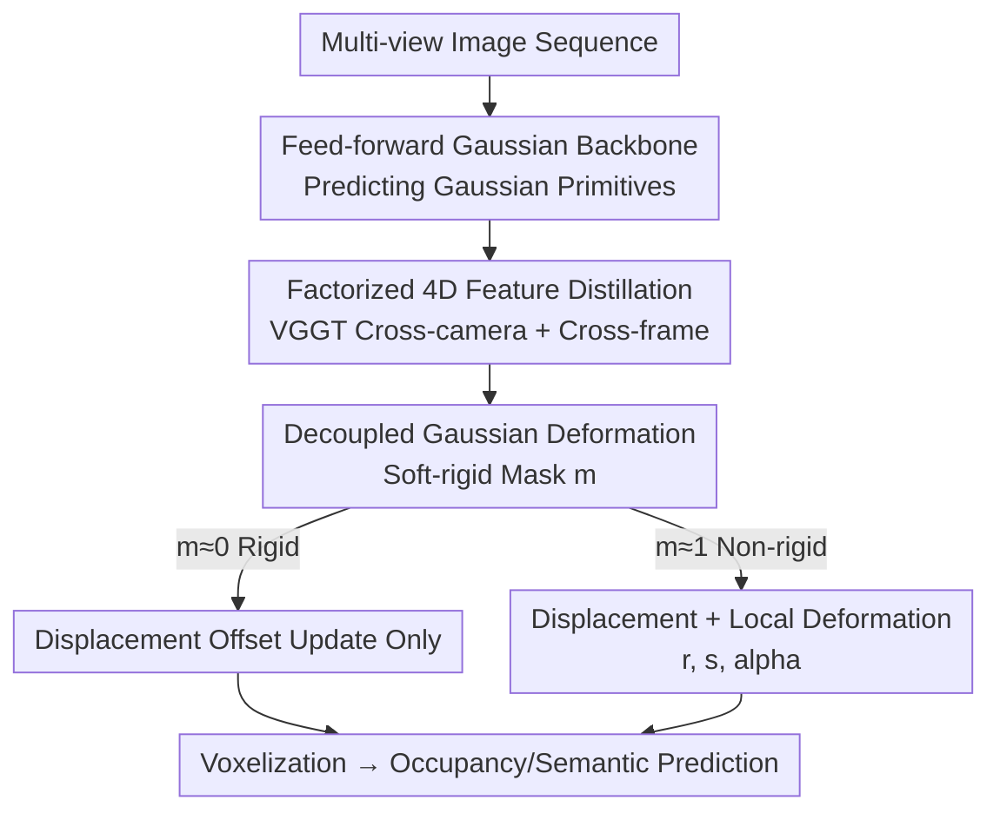

# Deformable Gaussian Occupancy: Decoupling Rigid and Nonrigid Motion with Factorized Distillation

**Conference**: CVPR 2026  
**arXiv**: [2605.28587](https://arxiv.org/abs/2605.28587)  
**Code**: https://github.com/vita-epfl/DeGO (Yes)  
**Area**: Autonomous Driving / 3D Occupancy Prediction / Gaussian Splatting  
**Keywords**: Weakly-supervised occupancy prediction, Deformable Gaussians, Rigid/Non-rigid decoupling, 4D foundation model distillation, VGGT  

## TL;DR
DeGO introduces a "soft-rigid mask" for every 3D Gaussian in weakly-supervised camera-based occupancy prediction, allowing adaptive selection between "rigid displacement" and "non-rigid deformation." By distilling factorized cross-camera and cross-frame features from the VGGT 4D foundation model, it achieves a 10.9% improvement in overall mIoU and a 13.5% increase in human-centric metrics on Occ3D-NuScenes.

## Background & Motivation
**Background**: Camera-only 3D occupancy prediction unifies scene representation into geometry and semantics within a voxel grid. However, dense 3D labels are prohibitively expensive. To eliminate the need for dense labels, weakly-supervised approaches have emerged, utilizing differentiable rendering to project 3D Gaussians/NeRF into 2D, supervised by pseudo-depth, pseudo-segmentation (e.g., Grounded-SAM, Metric3D), and cross-frame consistency. Feed-forward Gaussian splatting methods (e.g., GaussianOcc, GaussTR, GaussianFlowOcc) have become mainstream due to their efficiency and strong performance.

**Limitations of Prior Work**: These methods face two critical issues in dynamic scenes. First, Gaussian primitives are **uniformly** distributed across the 3D volume, where large static backgrounds (roads, walls) consume significant capacity, leaving insufficient resolution for small but safety-critical targets like pedestrians. Second, motion models are often restricted to **rigid translations** or simple inter-frame offsets (e.g., per-Gaussian temporal offsets in GaussianFlowOcc), which fail to capture the non-rigid, frame-by-frame deformations characteristic of human movement. Combined, these factors lead to poorly represented human geometry, lower human-related mIoU, and unreliable temporal consistency.

**Key Challenge**: Directly applying "deformable Gaussians" from dynamic rendering is insufficient. Driving scenes are a mixture of rigid structures and highly non-rigid humans. Using a **single unified deformation field** entangles incompatible dynamics, leading to unstable geometric updates. Furthermore, deformable Gaussians optimized solely under weak supervision lack stable 4D guidance.

**Goal**: Enable each Gaussian to **self-determine** its deformation behavior while injecting stable 4D spatio-temporal priors into the weakly-supervised training process.

**Core Idea**: Use a learnable soft-rigid mask to **decouple** rigid motion and non-rigid deformation for each Gaussian. Subsequently, use factorized 4D distillation to transfer cross-camera and cross-frame knowledge from VGGT into Gaussian features. This alignment between deformation-awareness and foundation models creates a mutually reinforcing mechanism.

## Method

### Overall Architecture
DeGO addresses weakly-supervised, camera-only dynamic 3D occupancy prediction with a focus on non-rigid human representation. The system utilizes a feed-forward Gaussian backbone: multi-view images are processed to predict a set of 3D Gaussian primitives (position, rotation, scale, opacity, and latent features). During training, past and future frames are sampled, and Gaussian features are passed through two collaborative modules: **Factorized Feature Distillation (FFD)**, which aligns cross-camera/cross-frame features from a VGGT teacher with the Gaussian features, and **Decoupled Gaussian Deformation (DGD)**, which predicts rigid offsets and non-rigid deformations weighted by a soft-rigid mask. Finally, reference frame Gaussians are voxelized for occupancy and semantic prediction. Crucially, **temporal deformation is used only during training as augmentation**; at inference, only single-frame multi-view images are required to predict current-frame Gaussians, maintaining zero additional inference overhead.

### Key Designs

**1. Decoupled Gaussian Deformation (DGD): Adaptive Motion via Soft-rigid Masks**

To solve the entanglement of rigid and non-rigid dynamics, DGD assigns a learnable soft-rigid mask $m_i \in [0, 1]$ to each Gaussian $G_i$, where $m_i \approx 1$ indicates non-rigid and $m_i \approx 0$ indicates rigid behavior. A deformation head (lightweight MLP) predicts two update paths for each Gaussian at each timestamp: rigid offset $\Delta G_i^{\text{rig}}(t)$ and non-rigid deformation $\Delta G_i^{\text{def}}(t)$. The final update is a weighted fusion:

$$\Delta G_i(t)=(1-m_i)\,\Delta G_i^{\text{rig}}(t)+m_i\,\Delta G_i^{\text{def}}(t)$$

Input positions and timestamps are processed via positional encodings $\gamma_p(\boldsymbol{\mu})$ and $\gamma_t(t)$. The temporal encoding is projected to an embedding $\mathbf{e}_t$, concatenated with Gaussian features, and processed by a FeatureNet to produce latent features $\mathbf{h}_i(t)$ for the deformation head. Rigid Gaussians update only position $\boldsymbol{\mu}_i(t)$, while non-rigid Gaussians additionally update rotation, scale, and opacity $(\mathbf{r}_i, \mathbf{s}_i, \alpha_i)$. To push the mask towards binary values (0 or 1), a regularization term is applied: $\mathcal{L}_{\text{mask}}=[\mathbf{m}_i(1-\mathbf{m}_i)]$. This allows the model to adaptively allocate deformation capacity to regions that actually require it, such as pedestrians.

**2. Factorized 4D Feature Distillation (FFD): Distilling Spatio-temporal Knowledge from VGGT**

Weakly-supervised 2D pseudo-labels often lack temporal consistency. Previous distillation methods used 2D teachers (e.g., DINO/CLIP), which provide only per-frame image-space features. FFD instead uses VGGT, pre-trained on multi-view temporal data, where Transformer blocks alternate between **cross-camera (spatial) attention** $\text{Attn}_{\text{sp}}$ and **cross-frame (temporal) attention** $\text{Attn}_{\text{tmp}}$. FFD extracts both spatial and temporal tokens from a selected block $\ell$, removes camera/register tokens, reshapes them back to feature maps, and **concatenates** them along the channel dimension to form a spatio-temporal teacher feature $\mathbf{T}_0^{(\ell)}(v)=[\mathbf{T}_0^{(\ell,\text{sp})};\mathbf{T}_0^{(\ell,\text{tmp})}]$. The student renders reference frame Gaussians into a per-pixel feature map $\mathbf{S}'_0(v)$ and aligns them using cosine similarity:

$$\mathcal{L}_{\text{distill}}=\frac{1}{|\mathcal{V}||\Omega|}\sum_{v\in\mathcal{V}}\sum_{u\in\Omega}\Big(1-\cos\big(\mathbf{T}'^{(\ell)}_0(v)[u],\,\mathbf{S}'_0(v)[u]\big)\Big)$$

This "factorization" ensures that spatial and temporal information are both preserved. Ablations show that cross-camera and cross-frame distillation contribute +2.0% and +1.4% respectively (+4.4% combined), indicating complementary roles.

**3. Multi-frame Training, Single-frame Inference: Temporal Knowledge as Augmentation**

Deformable Gaussians typically imply costly multi-frame inference. DeGO treats temporal deformation strictly as a **training-time augmentation**. During training, the model samples frames $t \in [-T, +T]$ to enforce geometric and semantic consistency under motion. During inference, the network processes a single frame to produce $\{G_i(0)\}$, which are then voxelized. This allows the model to learn motion-aware priors without the computational burden at deployment.

### Loss & Training
The framework follows the 2D weak supervision of GaussianFlowOcc: Grounded-SAM provides pseudo-segmentation, and Metric3D provides pseudo-depth. These are supervised via pixel-wise cross-entropy $\mathcal{L}_{\text{seg}}$ and L1 depth regression $\mathcal{L}_{\text{dep}}$. Combined with distillation $\mathcal{L}_{\text{distill}}$ and deformation regularization $\mathcal{L}_{\text{def}}=\lambda_{\text{reg}}\mathcal{L}_{\text{reg}}+\lambda_{\text{mask}}\mathcal{L}_{\text{mask}}$, the total loss is:

$$\mathcal{L}_{\text{total}}=\lambda_{\text{seg}}\mathcal{L}_{\text{seg}}+\lambda_{\text{dep}}\mathcal{L}_{\text{dep}}+\lambda_{\text{distill}}\mathcal{L}_{\text{distill}}+\lambda_{\text{def}}\mathcal{L}_{\text{def}}$$

## Key Experimental Results

### Main Results
On Occ3D-NuScenes, DeGO is compared against other weakly-supervised methods. Metrics include standard IoU/mIoU, Instance mIoU (InsM), Scene mIoU (ScnM), and a new Human-centric mIoU (HCM).

| Metric | Prev. SOTA (GaussianFlow*) | DeGO (Ours) | Gain |
|------|------|------|------|
| mIoU | 16.27 | 18.05 | +10.9% |
| IoU | 40.39 | 45.38 | +12.4% |
| HCM (Human Classes) | 9.73 | 11.04 | +13.5% |
| InsM (Instance-level) | 9.59 | 10.34 | +7.8% |
| ScnM (Scene-level) | 29.62 | 33.46 | +13.0% |

DeGO outperforms the previous SOTA across all metrics. The significant boost in HCM and InsM validates its superior handling of non-rigid and rigid dynamics.

### Ablation Study

| Config (Def. / DINOv2 / VGGT) | mIoU | IoU | Description |
|------|------|------|------|
| ✗ / ✗ / ✗ | 12.06 | 36.41 | Baseline |
| ✗ / ✗ / ✓ | 12.26 | 36.54 | Distillation ineffective without deformation |
| ✓ / ✗ / ✗ | 17.29 | 43.67 | Deformation module added (+43.4%) |
| ✓ / ✓ / ✗ | 17.35 | 43.15 | DINOv2 distillation provides marginal gain |
| ✓ / ✗ / ✓ | **18.05** | **45.38** | VGGT distillation adds +4.4% |

**Sub-component ablation**: Adding scale deformation contributes the most (12.77 → 17.06), followed by the soft-rigid mask which pushes mIoU to 18.05.

### Key Findings
- **Synergy between Deformation and Distillation**: Distillation from VGGT is only effective when paired with the deformation module (12.06 → 12.26 without vs. 17.29 → 18.05 with), as 4D knowledge requires deformable primitives to be properly expressed.
- **Scale is Critical**: Scale directly modifies occupancy geometry; adding it alone increases performance from 12.77 to 17.06.
- **Temporal Window Optimization**: An 8-frame window is optimal. Performance degrades severely at 12 frames (predicting ~6 seconds ahead), indicating the difficulty of long-term temporal forecasting.
- **Distillation Target**: Distilling into Gaussian features is superior to image features (which caused a 5.2% drop), suggesting better compatibility between 3D Gaussian representations and VGGT features.

## Highlights & Insights
- The **soft-rigid mask combined with binary regularization** is a lightweight yet effective decoupler. It avoids the need for explicit category priors and allows Gaussians to self-organize into rigid or non-rigid clusters, a paradigm applicable to any hybrid dynamic point-cloud task.
- The **factorized spatio-temporal distillation** from VGGT is clever. Instead of distilling a generic feature, it explicitly extracts and concatenates spatial and temporal output tokens, providing the student with complementary cross-camera and cross-frame alignment.
- The **"Train for Motion, Infer for Static"** approach achieves zero inference overhead, making it highly practical for real-world deployment.

## Limitations & Future Work
- **Absolute HCM remains low** (11.04). Human occupancy is inherently difficult, and the quality of weak supervision (Grounded-SAM/Metric3D) poses an upper bound on performance.
- **Dependency on VGGT**: The gains are tied to the specific multi-view temporal distribution of the VGGT teacher.
- **Limited Temporal Extrapolation**: Performance degrades beyond 8 frames, suggesting that reliable long-term 4D Gaussian forecasting remains a challenge.
- **Future Directions**: Introducing confidence weights for pseudo-labels in deformation loss and exploring continuous mask transitions for semi-rigid objects.

## Related Work & Insights
- **vs. GaussianFlowOcc [2]**: While GaussianFlowOcc uses per-Gaussian rigid offsets, DeGO introduces non-rigid deformation and 4D distillation, achieving a 13.5% boost in human-centric metrics.
- **vs. GaussTR [19]**: GaussTR focuses on open-vocabulary reasoning via per-frame image-space distillation (e.g., DINO). DeGO focuses on temporal consistency via 4D spatio-temporal distillation.
- **vs. Deformable Gaussians in Dynamic Rendering [43, 44]**: Traditional deformable Gaussians use a single field for all motion, which leads to geometric instability in driving scenes. DeGO's decoupled mask is specifically designed for the rigid/non-rigid mixture of road environments.

## Rating
- Novelty: ⭐⭐⭐⭐ The combination of soft-rigid mask decoupling and factorized 4D distillation is novel, though components build on existing concepts.
- Experimental Thoroughness: ⭐⭐⭐⭐ Comprehensive ablations on components, frames, and distillation targets, though validated on a single benchmark (Occ3D-NuScenes).
- Writing Quality: ⭐⭐⭐⭐ Clear motivation, well-defined metrics (HCM), and complete mathematical formulation.
- Value: ⭐⭐⭐⭐ Significant improvement in human-centric occupancy with zero inference overhead, offering high utility for safe autonomous driving perception.

<!-- RELATED:START -->

## Related Papers

- [\[CVPR 2026\] MAD: Motion Appearance Decoupling for Efficient Driving World Models](mad_motion_appearance_decoupling_for_efficient_driving_world_models.md)
- [\[CVPR 2026\] GEM: Generating LiDAR World Model via Deformable Mamba](gem_generating_lidar_world_model_via_deformable_mamba.md)
- [\[CVPR 2026\] Generalizing Visual Geometry Priors to Sparse Gaussian Occupancy Prediction](generalizing_visual_geometry_priors_to_sparse_gaussian_occupancy_prediction.md)
- [\[CVPR 2025\] Spatiotemporal Decoupling for Efficient Vision-Based Occupancy Forecasting](../../CVPR2025/autonomous_driving/spatiotemporal_decoupling_for_efficient_vision-based_occupancy_forecasting.md)
- [\[ICLR 2026\] S2GO: Streaming Sparse Gaussian Occupancy](../../ICLR2026/autonomous_driving/s2go_streaming_sparse_gaussian_occupancy.md)

<!-- RELATED:END -->
