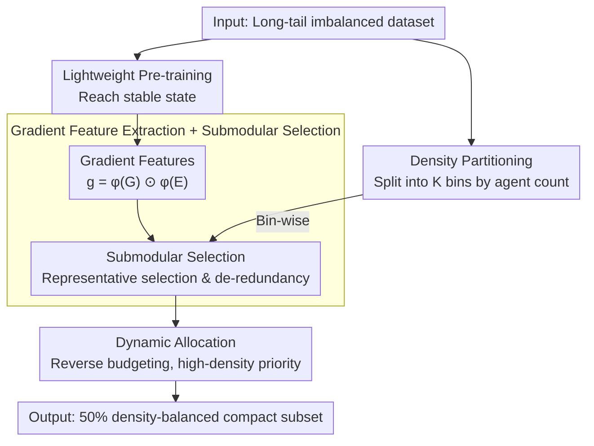

# Den-TP: A Density-Balanced Data Curation and Evaluation Framework for Trajectory Prediction

**Conference**: CVPR 2026  
**arXiv**: [2409.17385](https://arxiv.org/abs/2409.17385)  
**Code**: None  
**Area**: Autonomous Driving / Trajectory Prediction  
**Keywords**: Trajectory prediction, data-centric, density balance, submodular optimization, long-tail distribution

## TL;DR

From a data-centric perspective, the Den-TP framework is proposed to address the long-tail density imbalance in trajectory prediction datasets through density-aware data curation and evaluation protocols. It maintains overall performance and significantly improves robustness in high-density scenarios using only 50% of the data.

## Background & Motivation

Trajectory prediction is a critical task in autonomous driving. Recent methods based on Transformers and GNNs have achieved high performance on standard benchmarks. However, examining these from a data perspective reveals an overlooked and serious issue: existing trajectory prediction datasets exhibit significant long-tail density imbalance.

In mainstream datasets like Argoverse 1 and 2, low-density scenarios (few interactors) constitute the vast majority of samples, while safety-critical high-density scenarios (complex multi-agent interactions with 60+ agents) account for less than 2.5%. This leads to two Core Problems: (1) training signals are dominated by low-density samples, resulting in models being severely under-trained in high-density scenarios; (2) standard evaluation protocols use average errors across the full dataset, masking performance degradation in high-density scenarios—models appear performant on overall metrics but may fail critically in dense interaction scenarios.

**Key Challenge**: High-density scenarios are the most safety-critical (involving complex multi-agent interactions where prediction errors directly jeopardize safety) but have the least influence during training and evaluation. Existing strategies (resampling, reweighting, data augmentation) change sampling frequency but do not reshape the data distribution in a principled manner.

**Core Idea**: Treat scenario density as a conditional variable. Construct a compact yet balanced subset through a density-aware partitioning-selection strategy. Employ gradient-based submodular optimization to select representative samples within each density bin, while implementing a dynamic allocation biased toward high-density scenarios across bins.

## Method

### Overall Architecture

Den-TP addresses the issue where high-density scenarios are too scarce in datasets for effective learning and remain undetected during evaluation. The pipeline consists of two stages: extraction and selection. In the extraction stage, a lightweight pre-training step is used to reach a stable state, obtaining reliable gradient features for each sample; simultaneously, the dataset is partitioned into several density bins based on the number of agents in the scene. In the selection stage, submodular optimization is used within each bin to pick the most representative and least redundant samples. Budget allocation across bins follows the "rarity-first" rule to explicitly up-weight previously neglected high-density scenes. The final output is a compact training subset (approximately 50% of the original size) with a rebalanced density distribution.

### Key Designs

**1. Density Partitioning: Unfolding the long-tail for balanced sampling**

The root of the problem is the overwhelming number of low-density samples, which dominate gradient updates and cause systematic under-training of high-density scenes. The first step for correction is to explicitly stratify the data by complexity. Den-TP calculates a density level $\rho(S_j)$ for each sample (using the agent count) and partitions the dataset into $K$ disjoint subsets $\mathcal{D}_k$ using a fixed interval $\tau$: a sample $S$ falls into $\mathcal{D}_k$ if and only if $\rho(S) \in [\rho_{\min}+(k-1)\tau,\ \rho_{\min}+k\tau)$. While agent count does not fully capture scenario complexity (e.g., 20 independent agents vs. 20 densely interacting agents), it is dataset-agnostic and allows consistent cross-dataset comparison, serving as a sufficient density proxy for the partitioning-selection logic.

**2. Gradient Feature Extraction + Submodular Selection: Identifying samples of "highest value" per bin**

Within each bin, a decision must be made on which samples to retain. Den-TP avoids clustering in the raw feature space and instead looks at the actual contribution to training. For each sample, backpropagation is performed to obtain the gradient $\mathbf{G} = \nabla_{\hat{\mathbf{Y}}} \mathcal{L}$ at the prediction output, which is then fused with the decoder embedding $\mathbf{E}$ via element-wise multiplication: $\mathbf{g} = \phi(\mathbf{G}) \odot \phi(\mathbf{E})$. These features encode both loss sensitivity and decoder representation, reflecting sample importance more effectively than pure feature clustering. A submodular scoring function is defined to measure the similarity of a candidate $S_j$ to the selected set $\mathcal{C}_k$ (to be minimized for redundancy) and the unselected set $\mathcal{D}_k \setminus \mathcal{C}_k$ (to be maximized for representativeness):

$$P(S_j) = \sum_{S_i \in \mathcal{C}_k} \frac{\mathbf{g}_i \cdot \mathbf{g}_j}{\|\mathbf{g}_i\|\|\mathbf{g}_j\|} - \sum_{S_i \in \mathcal{D}_k \setminus \mathcal{C}_k} \frac{\mathbf{g}_i \cdot \mathbf{g}_j}{\|\mathbf{g}_i\|\|\mathbf{g}_j\|}$$

Greedily selecting samples that minimize $P$ ensures the subset has minimum redundancy and maximum representativeness, covering a broader range of training signals with fewer samples.

**3. Dynamic Allocation: Reverse budgeting to preserve rare high-density scenes**

Given a total budget $B = \lfloor \alpha |\mathcal{D}| \rfloor$, allocating proportionally would still disadvantage high-density bins. Den-TP uses a reverse approach: starting from the highest density bin and moving toward lower densities, the $k$-th bin is allocated $n_k = \min(|\mathcal{D}_k|,\ \lfloor B/k \rfloor)$ slots. If a high-density bin contains fewer samples than its allocated budget, the entire bin is retained, skipping gradient selection. Surplus budget flows into the next (lower-density) bin. This reverse processing ensures high-density scenarios are not squeezed out early. The strategy is supported by the observation that interaction patterns learned from high-density scenes transfer to low-density ones, whereas the reverse transfer is weak.

### Loss & Training

The training loss used for gradient extraction is $\mathcal{L} = \mathcal{L}_{\text{reg}} + \mathcal{L}_{\text{cls}}$, where $\mathcal{L}_{\text{reg}}$ is the negative log-likelihood regression loss on the best-matched prediction mode, and $\mathcal{L}_{\text{cls}}$ is the cross-entropy loss for optimizing prediction mode probabilities. A lightweight pre-training step is required for stable gradient estimation.

## Key Experimental Results

### Main Results

| Dataset | Method | Retention Ratio | minADE↓ | minFDE↓ | MR↓ |
|--------|------|------|----------|------|------|
| Argoverse 1 | Full (HiVT-64) | 100% | 0.695 | 1.037 | 0.109 |
| Argoverse 1 | Random | 50% | 0.750 | 1.175 | 0.137 |
| Argoverse 1 | Herding | 50% | 0.728 | 1.107 | 0.126 |
| Argoverse 1 | **Den-TP** | **50%** | **0.706** | **1.074** | **0.110** |
| Argoverse 1 | Full (HPNet) | 100% | 0.647 | 0.871 | 0.070 |
| Argoverse 1 | **Den-TP** (HPNet) | **50%** | **0.661** | **0.913** | **0.074** |

### Ablation Study

| Strategy | Data Volume | minADE↓ | minFDE↓ | MR↓ | Description |
|------|---------|------|------|------|------|
| Augmenting | 220k | 0.718 | 1.106 | 0.115 | Replicating high-density samples |
| Weighting | 190k | 0.715 | 1.108 | 0.114 | Reweighting high-density |
| Epoch-wise | 95k | 0.752 | 1.189 | 0.130 | Every-epoch resampling |
| High-density+Random | 95k | 0.724 | 1.111 | 0.117 | Retain high-density + random padding |
| **Den-TP** | **95k** | **0.706** | **1.074** | **0.110** | Density-balanced selection |

### Key Findings

- **Matching full performance with 50% data**: Den-TP using 50% data on HiVT-64 (minADE 0.706) outperformed 100% data (0.695) on the MR metric, with minADE lagging by only 1.6%.
- **Transferability of high-density capabilities**: Interaction patterns learned in dense scenarios generalize to simple scenarios, but back-transfer is weak, validating the density-priority allocation.
- **Cross-model generalization**: Subsets selected via HiVT-64 maintained advantages when used with HiVT-128 and HPNet, indicating policy independence from specific architectures.
- **Naive strategies are insufficient**: Reweighting and augmentation increase redundancy rather than coverage; epoch-wise resampling introduces instability.

## Highlights & Insights

- **Data-centric perspective in trajectory prediction**: This is the primary highlight. While the field has been model-centric, this work systematically reveals the impact of density imbalance. Using simple agent counts as a proxy proves highly effective.
- **Density-conditioned evaluation protocol**: Aggregated metrics mask long-tail failures. Reporting performance by density bin exposes genuine safety risks.
- **Submodular optimization + Gradient features**: This combination can be transferred to other long-tail domains (e.g., small objects in detection, rare pathologies in medical imaging).

## Limitations & Future Work

- Agent count as a density proxy is simplified and cannot distinguish between different interaction complexities at the same density (e.g., 20 independent agents vs. 20 converging agents).
- Gradient extraction requires a pre-training step, adding computational overhead.
- Validated only on Argoverse 1 and 2; tests on other datasets like nuScenes or INTERACTION are needed.
- The $\lfloor B/k \rfloor$ design in dynamic allocation lacks theoretical proof of optimality.

## Related Work & Insights

- **vs Random Selection**: At 50% budget, Den-TP's minADE (0.706) is 5.9% lower than Random (0.750).
- **vs Herding**: Herding performs greedy selection based on feature means but ignores density distribution. Den-TP outperforms it across all metrics.
- **vs K-Means Clustering**: Methods based on trajectory feature clustering ignore gradient information and density balance, with performance falling between Random and Den-TP.

## Rating

- Novelty: ⭐⭐⭐⭐ Systematic analysis of density imbalance from a data-centric view; methodological contribution via density-conditioned evaluation.
- Experimental Thoroughness: ⭐⭐⭐⭐ Comprehensive cross-dataset, cross-model, and cross-strategy comparisons.
- Writing Quality: ⭐⭐⭐⭐ Clear problem definition, rich visualizations, and standardized algorithm descriptions.
- Value: ⭐⭐⭐⭐ High practical value for reducing training costs and identifying safety risks.

<!-- RELATED:START -->

## Related Papers

- [\[CVPR 2026\] RAG-TP: A General Framework for Vehicle Trajectory Prediction via Retrieval-Augmented Generation](rag-tp_a_general_framework_for_vehicle_trajectory_prediction_via_retrieval-augme.md)
- [\[CVPR 2026\] W2W: Language-Model-Based Trajectory Prediction with Reinforcement Learning](w2w_language-model-based_trajectory_prediction_with_reinforcement_learning.md)
- [\[CVPR 2026\] A Prediction-as-Perception Framework for 3D Object Detection](a_prediction-as-perception_framework_for_3d_object_detection.md)
- [\[CVPR 2026\] FoSS: Modeling Long-Range Dependencies and Multimodal Uncertainty in Trajectory Prediction via Fourier–State Space Integration](foss_modeling_long_range_dependencies_and_multimodal_uncertainty_in_trajectory_p.md)
- [\[ECCV 2024\] UniTraj: A Unified Framework for Scalable Vehicle Trajectory Prediction](../../ECCV2024/autonomous_driving/unitraj_a_unified_framework_for_scalable_vehicle_trajectory_prediction.md)

<!-- RELATED:END -->
