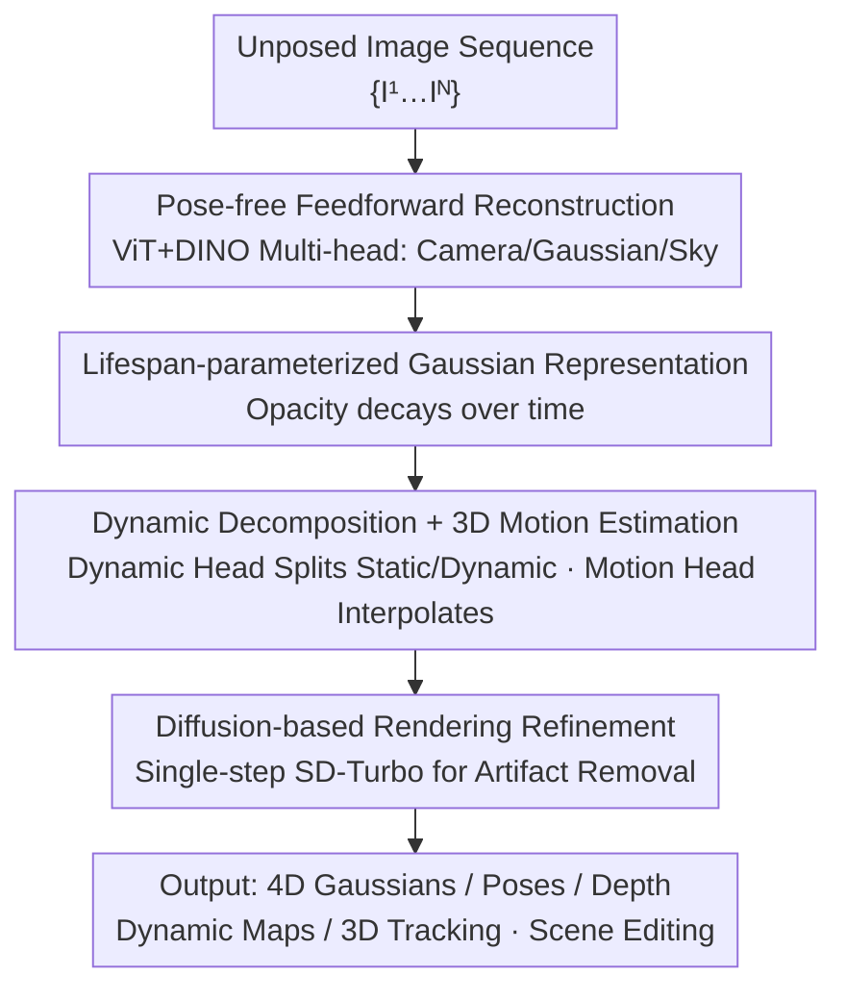

# DGGT: Feedforward 4D Reconstruction of Dynamic Driving Scenes using Unposed Images

**Conference**: CVPR 2026  
**Paper**: [CVF Open Access](https://openaccess.thecvf.com/content/CVPR2026/html/Chen_DGGT_Feedforward_4D_Reconstruction_of_Dynamic_Driving_Scenes_using_Unposed_CVPR_2026_paper.html)  
**Code**: https://github.com/xiaomi-research/dggt (yes)  
**Area**: Autonomous Driving / 3D Vision  
**Keywords**: 4D Reconstruction, Feedforward Gaussian Splatting, Unposed Reconstruction, Dynamic Scenes, Autonomous Driving Simulation

## TL;DR
By reformulating "camera pose" from an input into an output, a ViT multi-head network directly reconstructs the 4D Gaussian representation (including poses, depth, dynamic maps, and 3D motion) of dynamic driving scenes from **unposed** sparse images in a single forward pass, followed by single-step diffusion refinement for rendering. It achieves 27.41 PSNR on Waymo with a per-scene reconstruction time of 0.39 seconds, supporting arbitrary input frames and zero-shot cross-dataset transfer.

## Background & Motivation

**Background**: To train and evaluate perception and planning stacks at scale, autonomous driving requires rapidly converting massive raw driving logs into "editable, re-renderable" scene representations (4D reconstruction + re-simulation). Current mainstream dynamic scene reconstruction methods, such as NeRF or 3DGS, fall into two categories: one treats time as an explicit input (e.g., periodic vibration signals in PVG), while the other constructs scene graphs where each dynamic object is modeled individually.

**Limitations of Prior Work**: The first category lacks object-level decoupled representation, making editing tasks like "deleting cars/adding pedestrians" impossible. Although the second category allows object-level operations, it relies on external 3D annotations (such as bounding boxes), which are expensive to acquire. More critically, most methods rely on **per-scene optimization**, taking fifteen minutes to half an hour per scene (EmerNeRF takes 14 min, DeformableGS takes 29 min), making them impractical as a routine step for log preprocessing.

**Key Challenge**: Feedforward methods are the solution—training a network that can generalize to new scenes with real-time inference in a single forward pass. However, existing feedforward 3DGS methods (MVSplat, NoPoSplat, DepthSplat) can only reconstruct **static** scenes. STORM, the only feedforward method for dynamic driving, has two major drawbacks: ① it still **requires camera poses** as input, and ② it is constrained by a **fixed and short input frame window**, which degrades over long sequences. Treating poses as input inherently limits the flexibility of deployment across uncalibrated datasets.

**Goal**: Build a 4D reconstruction framework that is feedforward, capable of handling dynamics, scalable to arbitrary sequence lengths, and entirely free of pose input requirements.

**Key Insight**: The authors' high-level design philosophy is to predict the entire 4D scene state in a single forward pass, while cleanly separating the static background from moving objects and maintaining temporal consistency. The critical shift in perspective is to **reformulate camera poses as model outputs rather than inputs**.

**Core Idea**: Utilize a shared ViT backbone with multiple prediction heads to jointly predict poses, pixel-aligned Gaussians, dynamic maps, and 3D motion in a single pass. A lifespan parameter is introduced to stabilize temporal appearance variations in static regions, while an explicit 3D motion field interpolates between sparse timestamps. Finally, a single-step diffusion refinement model removes interpolation artifacts.

## Method

### Overall Architecture

The input to DGGT is an **unposed** RGB image sequence $\{I^t\}_{t=1}^N$, and the goal is to produce a temporally consistent 4D representation in a single forward pass. The pipeline consists of four main steps: ① **Pose-free feedforward reconstruction**—a ViT backbone integrates DINO features and distributes them to multiple heads, simultaneously outputting camera parameters, pixel-aligned Gaussian maps, and lifespan parameters for each frame; ② **Lifespan-parameterized Gaussian representation**—each primitive is assigned a lifespan parameter that decays its opacity over time to capture appearance changes in static regions; ③ **Dynamic decomposition + 3D motion**—a dynamic head splits Gaussians into static and dynamic components, while a motion head predicts dense 3D displacements to interpolate dynamic Gaussians for intermediate frames between sparse timestamps; ④ **Diffusion-based rendering refinement**—a single-step diffusion network utilizes the rendered image and a reference image to eliminate ghosting and occlusion-induced disocclusion gaps. This unified design inherently supports arbitrary input frames and long sequences without requiring recalibration or per-scene optimization. Since Gaussians are explicitly decomposed into static and dynamic parts, instance-level editing such as "removing, adding, or moving cars" can be performed directly at the Gaussian level.

### Key Designs

**1. Pose-free Feedforward Reconstruction: Changing Camera Pose from "Input" to "Output"**

Existing feedforward methods treat poses as essential inputs, which restricts their deployment in uncalibrated scenarios and across different datasets, requiring driving logs to first undergo SfM or external calibration. DGGT predicts camera poses directly: a ViT backbone splits the input image into patches, passes them through a pre-trained DINO feature extractor to get $F_{\text{dino}}$, and refines them into $F_{\text{attn}}$ via alternating attention. These features are then distributed to multiple heads: the camera head $H_{\text{cam}}$ yields the intrinsic and extrinsic parameters for each frame $\Pi^t = H_{\text{cam}}(F_{\text{attn}})$, the Gaussian head $H_{\text{gs}}$ estimates pixel-aligned Gaussians, the lifespan head $H_{\text{life}}$ predicts lifespan parameters, and a lightweight sky head $H_{\text{sky}}$ handles distant skies. The camera origin of the first frame $I^1$ is set as the world coordinate origin, and subsequent frames are aligned to it, ensuring cross-temporal 3D consistency.

A key observation is that $F_{\text{attn}}$ primarily encodes high-level semantics and lacks the fine details required for appearance reconstruction. Therefore, the Gaussian head merges $F_{\text{attn}}$ with the original DINO features, i.e., $G^t = H_{\text{gs}}(F_{\text{dino}}, F_{\text{attn}})$, to recover spatial fidelity. The sky region is processed separately by uniformly sampling a set of sky Gaussians on a hemisphere with a fixed radius $r_{\text{sky}}$, projecting them to retrieve pixel colors as initialization, and refining them with a lightweight MLP $H_{\text{sky}}$. During training, the feature extractor and camera head are frozen to leverage pre-trained priors, while the other heads are trained from scratch. This pose-free design also brings an unexpected benefit—contributing to strong cross-dataset generalization. By not relying on explicit input poses, the model avoids overfitting to specific trajectory patterns or camera configurations of a single dataset, thereby bridging the domain gap.

**2. Lifespan-parameterized Gaussian Representation: Enabling Static Gaussians to Model Time-varying Appearance**

Each scene frame is represented by a pixel-aligned Gaussian map $G^t \in \mathbb{R}^{H\times W\times 15}$. In addition to the standard color $c$, 3D position $\mu$, rotation quaternion $r$, scale $s$, and opacity $o$, each primitive is assigned a lifespan parameter $\sigma^t \in \mathbb{R}^+$. It functions to decay the opacity of an individual Gaussian over time. Given the predicted parameters at timestamp $t$, the opacity at another timestamp $t'$ is formulated as:

$$o^{t'} = o^t \cdot e^{-\frac{1}{2}\cdot\frac{(t'-t)^2}{\sigma^t}}$$

A larger $\sigma$ allows a Gaussian to persist longer in time, while a smaller $\sigma$ causes it to decay faster. The pain point in driving scenes is that even "static" regions experience appearance variations (e.g., changes in lighting, headlights, shadows). If a static Gaussian is accumulated statically over the entire sequence, it disrupts the stability of dynamic decomposition. The lifespan parameter provides each Gaussian with a temporal decay window, ensuring it only dominates the rendering during its active period, thereby capturing progressive appearance changes in static regions. Ablation studies demonstrate that this is the most critical component—removing it drops the PSNR from 27.41 to 24.21.

**3. Dynamic Decomposition + Explicit 3D Motion Interpolation: Aligning Dynamic Objects between Sparse Timestamps with Motion Fields**

Directly accumulating Gaussian maps across time leads to ghosting artifacts for moving objects. DGGT introduces a dynamic head $H_{\text{dy}}$ to predict the per-pixel probability of belonging to a dynamic region, $M_d^t = H_{\text{dy}}(F_{\text{attn}})$. Each Gaussian map is then decomposed into static components $G_s^t = G^t \odot (1-M_d^t)$ and dynamic components $G_d^t = G^t \odot M_d^t$. The complete representation at any timestamp $t$ is composed of the union of static Gaussians across all frames, the dynamic Gaussians of the current frame, and the sky Gaussians:

$$\hat{G}^t = \left(\bigcup_{t'=1}^{N} G_s^{t'}\right) \cup G_d^t \cup G_{\text{sky}}$$

This is then rendered using a differentiable renderer $\hat{I}^t = \text{Renderer}(\hat{G}^t, \Pi^t)$. The challenge lies in the sparsity of input timestamps, meaning intermediate timestamps $t_i$ lack readily available dynamic Gaussians. Unlike STORM, which only models Gaussian velocity, DGGT utilizes a transformer motion head $H_{\text{motion}}$ to explicitly predict the *complete 3D motion trajectory*. For a pair of timestamps $(t_a, t_b)$, it estimates the 3D displacement of query pixels $F(t_a, t_b)\in\mathbb{R}^{q\times3}$. It encodes images into multi-scale features, associates them as spatio-temporal feature clouds with the 3D points in the Gaussian maps, unprojects pixels with a dynamic mask value of 1 to initialize 3D positions, and iteratively refines trajectories using neighborhood-to-neighborhood attention. With 3D motion, the mean coordinates of dynamic Gaussians at intermediate timestamps are obtained via linear interpolation: $\mu_d^{t_i} = \mu_d^{t_a} + \omega^{t_i}\cdot F(t_a, t_b)$ (where $\omega^{t_i} = \frac{t_i - t_a}{t_b - t_a}$). Camera poses are linearly interpolated for translation, and SLERP is used for rotation quaternions. Explicit 3D trajectories capture non-linear motion much more accurately than velocity-only models, explaining why its 3D tracking EPE3D of 0.183m significantly outperforms STORM's 0.276m.

**4. Diffusion-based Interpolation Refinement: Mending Ghosting and Occlusion Gaps via Single-step Diffusion**

Even with reasonable object dynamics from the motion field, interpolation results can still exhibit ghosting and disocclusion gaps due to motion estimation errors and the sensitivity of 3DGS under large rotations and translations. DGGT introduces a post-rendering image-space refinement phase. Based on a single-step diffusion framework (SD-Turbo), this module consists of a frozen VAE encoder, a UNet denoiser, and a LoRA-fine-tuned decoder. Given the rendered image $\hat{I}^{t_i}$ and a reference image $I_{\text{ref}}$ randomly sampled from the input sequence, both are concatenated along the frame dimension and encoded into the latent space, denoised by the UNet, and decoded to yield the refined image $\tilde{I}^{t_i} = f_{\text{diffusion}}(\hat{I}^{t_i}, I_{\text{ref}})$. To leverage the pre-trained generative prior while performing efficient artifact removal, only the UNet decoder is fine-tuned with LoRA, keeping other weights frozen to ensure rapid inference. The training data comprises approximately 2,000 video segments with artifacts curated from 798 Waymo scenes, trained with a reconstruction loss $\ell_2$, LPIPS, and a style loss based on the VGG-16 Gram matrix to enhance sharp details. Notably, this block yields marginal numerical gains in PSNR/SSIM (27.32 $\rightarrow$ 27.41) but qualitatively resolves artifacts in the sky and on dynamic objects, filling disocclusion gaps. Since PSNR/SSIM assess pixel-wise fidelity rather than structural correctness, diffusion primarily corrects structural defects, boosting downstream editing capabilities and robustness to sparse inputs.

### Loss & Training
The feedforward reconstruction is trained end-to-end (including the motion head). Each iteration randomly samples $N\in[4,8]$ input images + $2N$ ground truth target images, and the model predicts and is supervised on $2N$ interpolated frames. The reconstruction loss is $\mathcal{L}_{\text{rgb}} = \mathcal{L}_{\ell_2} + \lambda_{\text{LPIPS}}\mathcal{L}_{\text{LPIPS}}$. Opacity and dynamic masks are supervised via BCE: $\mathcal{L}_{\text{opacity}} = \mathrm{BCE}(M_{\text{sky}},\hat{M}_{\text{sky}})$ and $\mathcal{L}_{\text{dynamic}} = \mathrm{BCE}(M_d,\hat{M}_{\text{dynamic}})$. An $\ell_1$ regularization is imposed on the lifespan parameters: $\mathcal{L}_{\text{lifespan}} = \lVert\frac{1}{\sigma}\rVert_1$, assuming most of the scene is static. The overall objective is a weighted sum: $\mathcal{L}_{\text{feedforward}} = \mathcal{L}_{\text{rgb}} + \lambda_{\text{opacity}}\mathcal{L}_{\text{opacity}} + \lambda_{\text{dynamic}}\mathcal{L}_{\text{dynamic}} + \lambda_{\text{lifespan}}\mathcal{L}_{\text{lifespan}}$. The diffusion module is trained separately.

## Key Experimental Results

### Main Results

4D reconstruction comparison on Waymo (3 views, interpolating intermediate frames). DGGT leads across the board in quality while remaining highly competitive in speed (0.39s vs. fifteen to thirty minutes for optimization-based methods):

| Method | PSNR↑ | SSIM↑ | D-RMSE↓ | Inference Time | Dynamic | Unposed |
|------|-------|-------|---------|---------|------|--------|
| EmerNeRF | 24.51 | 0.738 | 33.99 | 14min | ✓ | ✗ |
| DeformableGS | 25.29 | 0.761 | 14.79 | 29min | ✓ | ✗ |
| NoPoSplat | 24.31 | 0.751 | 9.08 | 23.22s | ✗ | ✓ |
| DepthSplat | 23.26 | 0.696 | 10.05 | 0.11s | ✗ | ✗ |
| STORM | 26.38 | 0.794 | 5.48 | 0.18s | ✓ | ✗ |
| VGGT++ | 22.50 | 0.749 | 3.80 | 0.24s | ✗ | ✓ |
| **DGGT (Ours)** | **27.41** | **0.846** | **3.47** | 0.39s | ✓ | ✓ |

Cross-dataset generalization (zero-shot transfer with Waymo-only training, or training on target datasets)—DGGT significantly outperforms STORM in zero-shot:

| Method | Setting | nuScenes PSNR↑ | Argoverse2 PSNR↑ |
|------|------|----------------|------------------|
| STORM | Zero-shot | 17.77 | 20.83 |
| **DGGT** | Zero-shot | **25.31** | **26.34** |
| STORM | Training | 24.54 | 24.97 |
| **DGGT** | Training | **26.63** | **26.96** |

3D motion estimation (Waymo Scene Flow), SOTA across all metrics:

| Method | EPE3D(m)↓ | Acc5(%)↑ | Acc10(%)↑ | θ(rad)↓ |
|------|-----------|----------|-----------|---------|
| STORM | 0.276 | 81.12 | 85.61 | 0.658 |
| **DGGT** | **0.183** | **85.42** | **90.42** | **0.328** |

### Ablation Study

| Configuration | PSNR↑ | SSIM↑ | LPIPS↓ | Remarks |
|------|-------|-------|--------|------|
| w/o lifespan | 24.21 | 0.774 | 0.169 | Drops 3.2 PSNR without lifespan parameters (largest contribution) |
| w/o diffusion | 27.32 | 0.844 | 0.108 | Drops slightly in metrics without diffusion refinement but degrades qualitatively |
| **Full** | **27.41** | **0.846** | **0.109** | Full model |

Robustness to the number of input views (NVS column, DGGT remains stable as view count increases, whereas STORM degrades sharply):

| Method | 4 Views | 8 Views | 16 Views |
|------|--------|--------|---------|
| STORM | 26.05 | 25.44 | 22.98 |
| **DGGT** | **27.41** | **27.74** | **28.14** |

### Key Findings
- **Lifespan parameters are the core contributor**: Removing them drops the PSNR by 3.2 (27.41 $\rightarrow$ 24.21). Since they model time-varying appearance changes in static regions (e.g., lighting), without them, static Gaussians fail to model subtle shifts, leading to unstable reconstruction.
- **Diffusion refinement focuses on "Qualitative > Quantitative" improvement**: While it only mildly improves PSNR/SSIM, these metrics measure pixel-wise alignment. Diffusion refinement corrects structural flaws and fills missing elements (sky, dynamic object artifacts, post-editing holes), significantly improving downstream usability.
- **Scalability is a clear advantage over STORM**: With 16 views, STORM degrades to 22.98, whereas DGGT improves to 28.14, maintaining quality for longer sequences.
- **Zero-shot generalization stems from the pose-free design**: Eliminating explicit pose reliance prevents overfitting to dataset-specific trajectory patterns or camera configurations, resulting in zero-shot PSNR improvements of 7-8 dB over STORM.

## Highlights & Insights
- **"Pose as output" is the fundamental paradigm shift**: Re-formulating camera poses from essential inputs to network outputs addresses uncalibrated deployment, cross-dataset generalization, and arbitrary frame counts in one go—an elegant engineering and conceptual choice transferable to any SfM-dependent reconstruction.
- **Lifespan parameters elegantly model time-varying static regions with a temporal decay window**: This details-oriented aspect, often overlooked in dynamic scene reconstruction, uses a single parameter $\sigma$ to both stabilize dynamic decomposition and capture smooth illumination shifts, demonstrating high utility.
- **Explicit 3D trajectories vs. velocity modeling**: Modeling full trajectories (instead of STORM's instantaneous velocities) allows for more accurate non-linear interpolation between sparse timestamps, nearly halving 3D tracking EPE3D. This represents an insightful design choice of representation target.
- **Gaussian-level static-dynamic decoupling inherently supports instance editing**: Removing, shifting, or inserting vehicles and pedestrians from other scenes requires no retraining, and gaps are patched by diffusion, bridging 4D reconstruction and simulation editing in a single representation.

## Limitations & Future Work
- **Limitations acknowledged by the authors**: Failure cases occur when dynamic masks are incorrect or under severe occlusion. Future efforts will target improving dynamic modeling and tracking robustness.
- **Our identified limitations**:
  ① The refinement relies on a diffusion model trained solely on ~2,000 Waymo sequences; its zero-shot generalization across other datasets and cameras is not fully analyzed.
  ② Dynamic decomposition, motion estimation, and diffusion refinement are highly sensitive to dynamic mask quality—mask errors propagate and amplify down the pipeline.
  ③ Most key results are evaluated under a 3-view, 20-frame setting. Performance under extreme sparsity (e.g., single-view) is only shown in teaser figures and lacks systematic quantification.
  ④ The $\ell_1$ regularization of lifespan parameters assumes "mostly static scenes", which might be weak in congested locations or busy intersections with many dynamic objects.
- **Potential improvements**: Adapt the diffusion refinement module for cross-dataset generalization (rather than training only on Waymo); incorporate dynamic mask uncertainty estimation to make downstream blocks more robust to mask errors.

## Related Work & Insights
- **vs STORM (ICLR 2025)**: Both are feedforward dynamic driving scene reconstruction methods, but STORM requires pose inputs, is constrained by a short fixed window, and only models Gaussian velocity, causing degradation in long sequences. DGGT is pose-free, supports arbitrary frames, models complete 3D trajectories, and introduces lifespan parameters + diffusion refinement, outperforming it heavily in quality and scalability (28.14 vs. 22.98 in 16-view setup).
- **vs NoPoSplat / DepthSplat / MVSplat**: These are similarly feedforward GS methods (some pose-free), but are restricted to **static** scenes and cannot capture moving objects; DGGT handles dynamics with its dynamic and motion heads.
- **vs EmerNeRF / DeformableGS (optimization-based)**: Optimization-based methods take minutes or hours per scene, whereas DGGT computes a forward pass in 0.39s with higher quality, suitable for routine log preprocessing.
- **vs PVG / Scene Graph methods**: PVG lacks object-level decoupling for editing, while scene graph approaches require external 3D bounding boxes. DGGT automatically decouples static and dynamic components using dynamic masks, enabling instance-level editing without manual annotations.

## Rating
- Novelty: ⭐⭐⭐⭐⭐ The four-part framework (pose-as-output + lifespan parameters + explicit 3D motion + diffusion refinement) significantly advances feedforward dynamic driving scene reconstruction.
- Experimental Thoroughness: ⭐⭐⭐⭐ Covers three major datasets, zero-shot transfer, view scalability, tracking, and editing, though systematic evaluation under extreme single-view sparsity is limited.
- Writing Quality: ⭐⭐⭐⭐ Clear motivation and methodology, comprehensive formulation, and detailed pipeline diagrams.
- Value: ⭐⭐⭐⭐⭐ Transforming raw driving logs into editable 4D scenes in 0.4 seconds makes this highly practical infrastructure for autonomous driving re-simulation.

<!-- RELATED:START -->

## Related Papers

- [\[CVPR 2026\] Unposed-to-3D: Learning Simulation-Ready Vehicles from Real-World Images](unposed-to-3d_learning_simulation-ready_vehicles_from_real-world_images.md)
- [\[AAAI 2026\] Understanding Dynamic Scenes in Egocentric 4D Point Clouds](../../AAAI2026/autonomous_driving/understanding_dynamic_scenes_in_ego_centric_4d_point_clouds.md)
- [\[ICLR 2026\] UniSplat: Unified Spatio-Temporal Fusion via 3D Latent Scaffolds for Dynamic Driving Scene Reconstruction](../../ICLR2026/autonomous_driving/unisplat_unified_spatio-temporal_fusion_via_3d_latent_scaffolds_for_dynamic_driv.md)
- [\[AAAI 2026\] LiDARCrafter: Dynamic 4D World Modeling from LiDAR Sequences](../../AAAI2026/autonomous_driving/lidarcrafter_dynamic_4d_world_modeling_from_lidar_sequences.md)
- [\[CVPR 2026\] TopoHR: Hierarchical Centerline Representation for Cyclic Topology Reasoning in Driving Scenes with Point-to-Instance Relations](topohr_hierarchical_centerline_representation_for_cyclic_topology_reasoning_in_d.md)

<!-- RELATED:END -->
