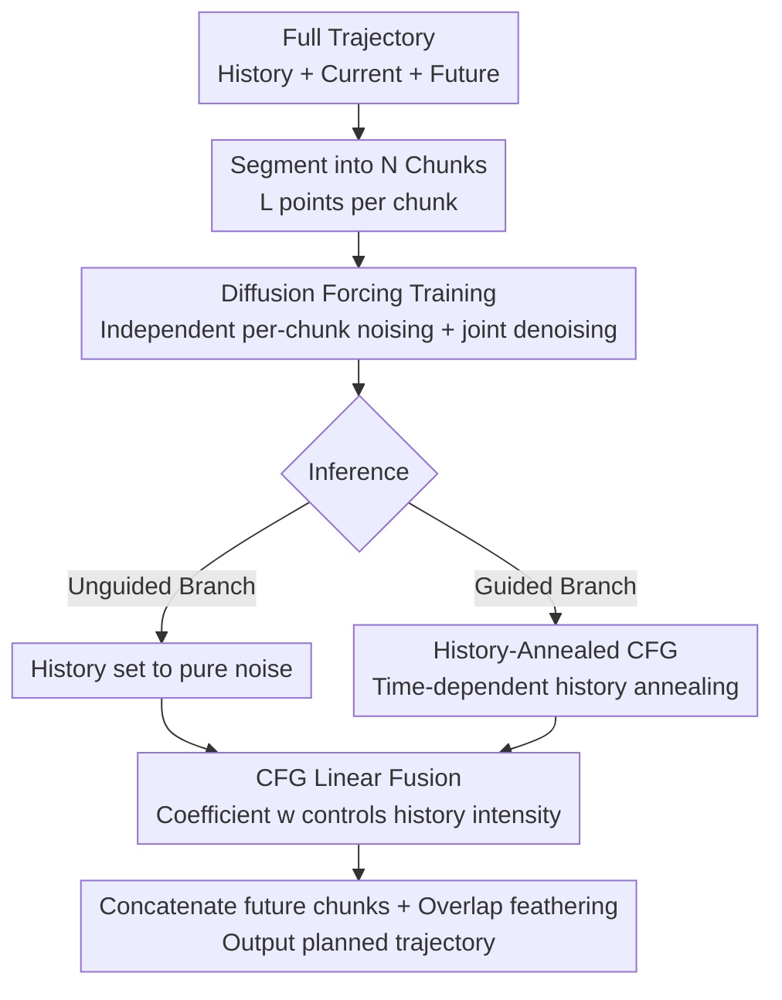

# Diffusion Forcing Planner: History-Annealed Planning with Time-Dependent Guidance for Autonomous Driving

**Conference**: CVPR 2026  
**Paper**: [CVF Open Access](https://openaccess.thecvf.com/content/CVPR2026/html/Zhang_Diffusion_Forcing_Planner_History-Annealed_Planning_with_Time-Dependent_Guidance_for_Autonomous_CVPR_2026_paper.html)  
**Code**: To be confirmed  
**Area**: Autonomous Driving / Diffusion Models  
**Keywords**: Motion Planning, Diffusion Models, Diffusion Forcing, Classifier-Free Guidance, Temporal Consistency  

## TL;DR
To address the dilemma of "frame-by-frame jitter" and "copying historical trajectories" in learned planners, DFP segments the entire trajectory into historical/current/future chunks, independently adds noise to each for joint denoising, and employs "History-Annealed CFG" during inference to controllably adjust the intensity of historical influence. It achieves SOTA among learned baselines on nuPlan closed-loop benchmarks by being both stable and scene-adaptive.

## Background & Motivation

**Background**: Diffusion models naturally capture multi-modal distributions and generate long-sequence outputs. Recently, they have been extensively integrated into End-to-End (E2E) and VLA autonomous driving pipelines for trajectory planning. Diffuser, Diffusion Policy, and Diffusion Planner are representative of this trend.

**Limitations of Prior Work**: Diffusion policies trained via imitation learning are highly sensitive to demonstrations and scene noise—even minor environmental perturbations can cause significant drift in the output trajectory, leading to **frame-by-frame instability**. In closed-loop settings, this manifests as passenger discomfort and safety hazards. Planning is inherently **non-Markovian**: reasonable actions depend not only on current observations but also on past observations and actions. Thus, "utilizing history" is a natural approach to stabilize output.

**Key Challenge**: However, history is a double-edged sword. If history is treated as a **static condition**—equivalent to environmental context—as many methods do, the model tends to take a shortcut by **replicating historical motion patterns** (causal confusion) instead of adjusting future decisions based on environmental changes. this leads to worse closed-loop performance under distribution shift. Consequently, some methods (like PlanTF) carefully design architectures + dropout to use history, while others (most diffusion planners) simply **discard ego-history entirely** to avoid bias, sacrificing temporal coherence. Neither path resolves the fundamental tension between "stability" and "responsiveness to the real-time environment."

**Goal**: To make history **neither ignored nor treated as an unconditional hard constraint**, but rather participate in generation in a **controllable** manner—ideally with this "controllable intensity" adjustable during **inference**.

**Key Insight**: The authors draw inspiration from the Diffusion Forcing Transformer (DFoT) in video diffusion, which uses a "noising-as-masking" mechanism to selectively expose/anneal historical segments, balancing generation quality and stability. The key insight is that motion planning and video generation **share the same causal structure**, but with an essential difference: historical frames in videos are ground-truth content, whereas in driving, **outdated motion patterns can actively mislead current decisions**. Therefore, history must be **controllably modulated** under strong scene context.

**Core Idea**: Segment the entire trajectory into historical/current/future chunks, sample **independent diffusion timesteps** for each to implement noising-as-masking, and jointly predict history and future during training. During inference, use **History-Annealed Classifier-Free Guidance (CFG)**, allowing a tunable coefficient to weigh "temporal stability" against "real-time responsiveness" online.

## Method

### Overall Architecture

DFP (Diffusion Forcing Planner) is built upon Diffusion Planner and is a **chunk-level Diffusion Transformer**. Given scene context $C$ (surrounding agents, static objects, lanes, navigation) and history $H$, the goal is to transform the source distribution $p_0(x_0)$ along a probability path to a target distribution $q(x_1|C,H,w)$, where $x_1$ is the generated future trajectory and $w$ is the guidance factor for historical influence. The learning objective is to capture **well-calibrated dependencies** between history, future, and the environment while preventing the model from degenerately copying history $H$ into $x$.

The pipeline consists of two main parts: **Training** using Diffusion Forcing (independent per-chunk noising + joint history/future prediction) and **Inference** using History-Annealed CFG (dual-branch parallelization + linear fusion). These are supported by a chunk-wise DiT: each chunk is treated as a token with token-level positional embeddings and per-token temporal embeddings. Conditions are injected via adaLN (FiLM-style) within DiT blocks; self-attention captures long-range history-current-future dependencies along the token axis, and cross-attention injects perception context $C$ into each token.

### Key Designs

**1. Diffusion Forcing Training: Chunking + Independent Noising, forcing the model to learn causally consistent conditional generation**

The goal is to prevent history from being copied as a static condition. DFP splits the full trajectory $x_0=[x_0^{-H},\dots,x_0^0,\dots,x_0^F]\in\mathbb{R}^{S\times4}$ ($S=H+1+F$; each state is a 4-tuple of coordinates + heading) into $N$ uniform chunks of length $L$, categorized into $N_H$ history chunks, 1 current chunk, and $N_F$ future chunks, ensuring **no chunk mixes history and future points**. The current state (a single moment) is replicated $L$ times into a chunk for uniform processing. Crucially, each block $b$ samples an **independent noise level** $t_b\sim U(0,1)$, adding noise via SDE marginals: $x_{t_b}^{(b)}=\alpha(t_b)x_0^{(b)}+\sigma(t_b)\varepsilon^{(b)}$. The model inputs the concatenated noisy blocks $X_t$, per-chunk times $t=[t_1;\dots;t_N]$, and global conditions $(C,H)$, training a Diffusion Transformer $f_\theta$ using $x_0$-prediction.

The mechanism works because randomizing $t_b$ implements "noising-as-masking"—a large $t_b$ drowns a chunk in high noise (masking it), while a small $t_b$ exposes it cleanly. During training, the current chunk's noise level is fixed at $t_{\text{cur}}=0$, serving as a **hard boundary** for the plan. The weighted denoising loss targets both historical and future chunks:

$$\mathcal{L}_{\text{denoise}}=\frac{\lambda_{\text{hist}}}{N_H}\sum_{b=1}^{N_H}\mathbb{E}\big[\|\hat{x}^{(b)}-x_0^{(b)}\|_2^2\big]+\frac{\lambda_{\text{futr}}}{N_F}\sum_{b=N_H+2}^{N}\mathbb{E}\big[\|\hat{x}^{(b)}-x_0^{(b)}\|_2^2\big]$$

This enables the model to learn stable, causally consistent conditional generation under various mixed configurations of visible/masked history and future, rather than simple replication.

**2. History-Annealed CFG Inference: Dual-branch linear fusion making "historical intensity" a tunable knob**

Training alone is insufficient—how is history used **controllably** during inference? DFP employs Classifier-Free Guidance (CFG), running two branches with shared samplers that differ only in historical chunk construction. All future chunks are initialized from noise, concatenated with the clean current chunk for a hard boundary. At denoising step $s$ (global time $t_s\in[0,1]$):

- **Unguided Branch**: Replaces historical chunks at every step with pure noise $\varepsilon\sim N(0,1)$, cutting off historical signal leakage; its associated time is reset to 1. Future chunk times decrease with the diffusion process, yielding a time vector $t=\{1,\dots,1,t_0,t_s,\dots,t_s\}$. This produces $\hat{X}_{0,\text{unguided}}=f_\theta([\varepsilon,X_{t_s}],t,C)$.
- **Guided Branch**: Concatenates clean history $X_{\text{history}}$ (post-annealing, see Design 3) with $X_{t_s}$, producing $\hat{X}_{0,\text{guided}}=f_\theta(X_{\text{guidance}};X_{t_s},t|C)$.

The two branches are fused linearly:

$$\hat{X}_0=\hat{X}_{0,\text{unguided}}+w\big(\hat{X}_{0,\text{guided}}-\hat{X}_{0,\text{unguided}}\big)$$

where $w\in[0,1]$ directly controls the impact of historical guidance on the final prediction. This makes the stability-flexibility trade-off a **tunable inference-time coefficient** without retraining. Finally, predicted future chunks are concatenated, applying **linear feathering** at overlaps for smooth transitions.

**3. Time-Dependent History Annealing: Returning history from noise to ground truth to prevent future misalignment**

Using "clean history" throughout the guided branch causes issues—Ablation A6 shows that if history remains clean, it can become **overpowering**, making the policy sluggish and stuck in historical patterns. The solution is a **time-dependent annealing** schedule for the ground-truth history: starting near noise and **rapidly** returning to clean values:

$$X_{\text{guidance}}=\alpha(t)X_{\text{history}}+\sigma(t)\varepsilon,\quad t=(t_s)^\beta$$

With $\beta\ge1$, $(t_s)^\beta$ keeps history closer to noise in **early steps** and closer to ground truth in **final steps**. Intuitively, early in diffusion, future uncertainty is high; weakening history prevents "locking" the future into a strict continuation of the past. Future chunks anneal **independently per chunk**, consistent with the training setup, ensuring flexibility and continuity across blocks.

### Loss & Training

Training was conducted on 1M nuPlan clips (2s history, 8s future, 10 Hz sampling). Each point is encoded as $(x,y,\cos\theta,\sin\theta)$ in the ego-coordinate system (origin at current pose, x-axis aligned with heading) with z-score normalization. Noise levels $t$ for historical segments are sampled from a **Beta distribution**, concentrating samples at $t\approx0$ (clean) and $t\approx1$ (pure noise) to align with inference settings. Chunking uses $N=6, L=20$. Inference uses DPM-Solver. Hyperparameters: Batch size 2048, 500 epochs (5 epoch warmup), AdamW, learning rate $2\times10^{-4}$.

## Key Experimental Results

### Main Results

Evaluated on nuPlan closed-loop benchmarks: Non-Reactive (NR, log-replay for others) and Reactive (R, IDM for others). **All methods use raw model outputs without post-processing.**

| Dataset | Setting | Diffusion Planner | DFP (Ours) | DFP-FM (Ours) |
|--------|------|-------------------|-------------|----------------|
| Val14 | NR | 89.87 / 87.87\* | 90.33 | **92.68** |
| Val14 | R | 82.80 / 77.48\* | 79.97 | 81.30 |
| Test14 | NR | 89.19 / 90.01\* | 90.69 | 90.62 |
| Test14 | R | 82.93 / 79.61\* | 81.96 | **83.59** |
| Test14-hard | NR | 75.99 / 74.26\* | 76.91 | **79.43** |
| Test14-hard | R | 69.22 / 61.25\* | 63.56 | 67.94 |

\* denotes authors' reproduction; DFP-FM uses the Flow Matching sampler. Compared to the reproduced Diffusion Planner\*, DFP gains +2.46 / +2.49 on Val14 NR/R and +2.65 on Test14-hard NR, slightly exceeding CoPlanner (76.82).

### Scene-level Case Study (Val14, NR)

| Scene Type | Method | Score | Comfort | Collision |
|----------|------|-------|---------|-----------|
| All (1118) | DP | 87.80 | 91.86 | 95.53 |
| All (1118) | **DFP** | **90.33** | **96.69** | **96.60** |
| High speed (99) | DP | 84.50 | 60.61 | 95.96 |
| High speed (99) | **DFP** | **94.95** | **96.97** | **98.99** |
| Low speed (100) | DP | 86.51 | 94.00 | 97.00 |
| Low speed (100) | **DFP** | **91.08** | **96.00** | **98.00** |

In high-speed scenarios, Comfort scores surged from 60.61 (DP) to 96.97 (DFP). Qualitatively, DFP maintains stable heading and speed during near-straight constant-velocity driving, whereas DP jittered.

### Ablation Study (Val14)

| ID | Diffusion Forcing | Chunk (L>1) | History Guidance | Annealed History | NR | R |
|----|:--:|:--:|:--:|:--:|------|------|
| A1 | ✗ | ✗ | ✗ | ✗ | 87.87 | 77.48 |
| A4 | ✓ | ✓ | ✗ | ✗ | 88.79 | 77.49 |
| A6 | ✓ | ✓ | ✓ | ✗ | 89.24 | 79.16 |
| A7 | ✓ | ✓ | ✓ | ✓ | **90.33** | **79.97** |

### Key Findings

- **Point-wise noising (L=1) degrades performance**: Treating each point as an independent chunk (A2) caused scores to drop. Without chunk-level semantics, the model struggles with credit assignment. **Grouping points into chunks (L>1)** is essential for performance restoration and gains.
- **Guidance requires chunking**: History guidance without chunking (A5) showed minimal improvement. Success requires the combination of chunked decoding and history guidance (A6).
- **Annealing is the final touch**: Adding Annealed History (A6→A7) further improved NR (+1.09), confirming that constant clean history is overpowering; annealing balances history while allowing adjustments based on scene changes.
- **Hyperparameter Sensitivity**: The best balance for guidance strength $w$ and annealing speed $\beta$ was found at $w=0.2$ and $\beta=2.0$.

## Highlights & Insights

- **Turning history usage into a continuous knob**: Unlike prior methods that either discard or force history, DFP uses $w$ to make historical influence **continuously adjustable online**. This allows the same model to be tuned for stability or flexibility depending on the scenario.
- **Precise adaptation for cross-domain transfer**: Simply porting video-based noising-as-masking is insufficient because driving history can actively mislead. The addition of "History Annealing + Dual-branch CFG" is a prime example of adapting a concept by identifying fundamental domain differences.
- **Chunk granularity is the hidden key**: The failure of point-wise noising serves as a reminder that Diffusion Forcing in the trajectory domain requires appropriate chunk lengths to maintain semantics.

## Limitations & Future Work

- **Hyperparameter tuning**: While $w=0.2$ and $\beta=2.0$ worked for Val14, their stability across different data distributions and vehicle types was not deeply explored.
- **Reactive (R) gains are modest**: DFP's improvement in reactive settings is less pronounced, especially in Test14-hard R. This suggests that in dense interaction scenarios where opponents react, pure history guidance offers limited benefits for "game-theoretic" responses.
- **Improvement directions**: Dynamically predicting $w/\beta$ as functions of scene context (velocity, interaction density) or combining history annealing with interaction modeling (e.g., contingency planning) could address reactive scenario shortcomings.

## Related Work & Insights

- **vs. PlanTF / History-discarding methods**: While PlanTF uses careful architecture/dropout and others discard history to avoid causal confusion, DFP argues history should be **dynamically modulated** rather than discarded. It decouples temporal consistency from real-time responsiveness.
- **vs. Post-processing methods**: Unlike methods that treat temporal consistency as a post-generation correction (e.g., using history for ODE initialization), DFP integrates history into the **diffusion process itself**, allowing for dynamic modulation based on environment context.
- **vs. DFoT (Video Diffusion)**: DFP identifies that driving history can mislead current decisions, leading to the original contribution of dual-branch CFG and time-dependent annealing to refine historical guidance for motion planning.

## Rating
- Novelty: ⭐⭐⭐⭐ 
- Experimental Thoroughness: ⭐⭐⭐⭐ 
- Writing Quality: ⭐⭐⭐⭐ 
- Value: ⭐⭐⭐⭐

<!-- RELATED:START -->

## Related Papers

- [\[CVPR 2026\] CogDriver: Integrating Cognitive Inertia for Temporally Coherent Planning in Autonomous Driving](cogdriver_integrating_cognitive_inertia_for_temporally_coherent_planning_in_auto.md)
- [\[CVPR 2026\] ActiveAD: Planning-Oriented Active Learning for End-to-End Autonomous Driving](activead_planning-oriented_active_learning_for_end-to-end_autonomous_driving.md)
- [\[ICLR 2026\] BridgeDrive: Diffusion Bridge Policy for Closed-Loop Trajectory Planning in Autonomous Driving](../../ICLR2026/autonomous_driving/bridgedrive_diffusion_bridge_policy_for_closed-loop_trajectory_planning_in_auton.md)
- [\[CVPR 2026\] Open-Ended Instruction Realization with LLM-Enabled Multi-Planner Scheduling in Autonomous Vehicles](open-ended_instruction_realization_with_llm-enabled_multi-planner_scheduling_in_.md)
- [\[CVPR 2026\] GuideFlow: Constraint-Guided Flow Matching for Planning in End-to-End Autonomous Driving](guideflow_constraint-guided_flow_matching_for_planning_in_end-to-end_autonomous_.md)

<!-- RELATED:END -->
