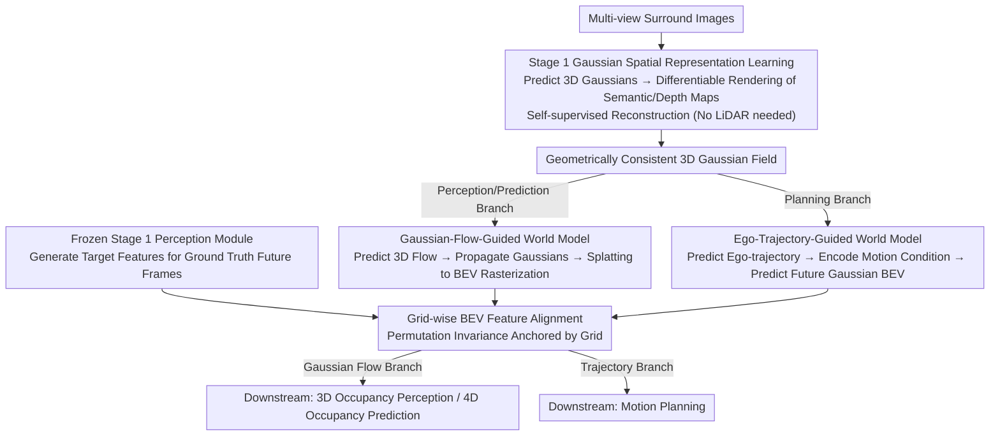

# DLWM: Dual Latent World Models enable Holistic Gaussian-centric Pre-training in Autonomous Driving

**Conference**: CVPR 2026  
**arXiv**: [2604.00969](https://arxiv.org/abs/2604.00969)  
**Code**: Yes  
**Area**: Autonomous Driving / 3D Scene Understanding  
**Keywords**: World Models, 3D Gaussian Splatting, Self-supervised Pre-training, Occupancy Prediction, Motion Planning

## TL;DR
DLWM is proposed as a holistic Gaussian-centric pre-training paradigm for autonomous driving via dual latent world models. Stage 1 involves self-supervised learning of 3D Gaussian scene representations (rendering multi-view semantics and depth maps). Stage 2 trains dual latent world models: a Gaussian-flow-guided model for downstream occupancy perception/prediction (+1.02/+2.68 mIoU), and an ego-trajectory-guided model for motion planning (-16% L2 error). This architecture addresses the permutation invariance challenge of Gaussian queries across frames, which previously prevented direct supervision.

## Background & Motivation

1. **Background**: In vision-based autonomous driving, 3D Gaussian representations strike a superior balance between expression and efficiency for perception, prediction, and planning compared to BEV or sparse queries. However, reliance on massive annotations limits scalable deployment.
2. **Limitations of Prior Work**: (1) MAE-style pre-training does not explicitly learn 3D geometry; (2) rendering-based pre-training (e.g., UniPAD, ViDAR) requires LiDAR depth; (3) while latent world models are effective for planning, their application in **perception and prediction remains unexplored**; (4) permutation invariance of Gaussian queries—Gaussians initialized independently across frames lack one-to-one correspondence, making direct feature supervision infeasible.
3. **Key Insight**: Rasterizing Gaussian queries into dense BEV grids preserves height information while establishing clear spatial correspondences across frames, allowing them to serve as a latent space for temporal supervision in world models.
4. **Core Idea**: A two-stage approach—Stage 1 learns Gaussian spatial representations via reconstruction; Stage 2 employs dual world models: (a) Gaussian-flow-guided for perception/prediction and (b) ego-trajectory-guided for planning.

## Method

### Overall Architecture
DLWM aims to resolve a practical contradiction: 3D Gaussian representations are efficient for driving tasks but traditionally require heavy supervision. The proposed solution uses two-stage self-supervised pre-training to remove annotation dependency. Stage 1 focuses on "Space"—predicting a set of 3D Gaussians from multi-view images and performing differentiable rendering back to semantic and depth maps for self-supervision via reconstruction. Stage 2 builds on this to learn "Time." Instead of a unified model, it bifurcates into dual branches: one driven by Gaussian flow for perception/prediction, and another driven by ego-trajectories for planning. Both branches use features generated by frozen Stage 1 modules from future frames as supervision targets.

### Key Designs

**1. Stage 1 Gaussian Spatial Representation Learning: Learning 3D Geometry without LiDAR**
Previous vision pre-training either ignores explicit 3D geometry (MAE) or relies on LiDAR depth for rendering supervision (UniPAD/ViDAR), raising deployment barriers. In Stage 1, DLWM predicts 3D Gaussian positions, scales, rotations, colors, and semantic attributes from a 2D backbone. These are rendered into multi-view semantic and depth maps. Self-supervised reconstruction is performed against image-side pseudo-labels. Since the depth map is also rendered, the pipeline does not require LiDAR, ensuring the Gaussian queries encode fine-grained scene context.

**2. Stage 2a Gaussian-Flow-Guided World Model: Bypassing Permutation Invariance via BEV Rasterization**
Applying latent world models to perception and prediction is hindered by the permutation invariance of Gaussian queries—independently initialized Gaussians across frames lack correspondence. DLWM solves this by predicting 3D flow (displacement vectors) for each Gaussian to propagate them to future positions. These are then projected via splatting into a dense BEV latent feature map. Supervision signals come from the frozen Stage 1 module processing actual future frames. BEV rasterization transforms permutation-equivariant sparse Gaussians into a fixed grid where temporal supervision becomes feasible.

**3. Stage 2b Ego-Trajectory-Guided World Model: Modeling Causal Observations for Planning**
Planning requires different temporal information than perception. While perception focuses on external movements (other cars, pedestrians), planning focuses on how ego-decisions change observations. This branch encodes predicted ego-trajectories as motion conditions to predict future Gaussian BEV features. It models the causal relationship: "If I drive this way, what will the scene look like next?"

**4. Why Dual World Models Instead of a Single Model?**
The optimization targets for perception and planning are fundamentally different. Perception/prediction relies on scene-level motion (Gaussian flow), whereas planning relies on the consequences of ego-decisions (trajectory conditioning). Forcing these into a unified model leads to interference between heterogeneous temporal signals. Separating them allows each branch to focus on its specific temporal prediction task, as verified in ablation studies.

### A Complete Example: Temporal Supervision in the Gaussian Flow Branch
Taking a frame pair with a 0.5s interval in Stage 2a:
1. **Current Frame**: Stage 1 predicts an unordered set of 3D Gaussians from images.
2. **Flow Prediction**: The world model estimates a 3D displacement vector for each Gaussian (e.g., a Gaussian belonging to a lead car moves several meters forward).
3. **Rasterization**: Propagated Gaussians are splatted onto a fixed BEV grid. The specific index of a Gaussian no longer matters; features falling into grid $(i,j)$ are aggregated.
4. **Supervision Target**: Real future images are fed into the frozen Stage 1 module to obtain "target" features on the same BEV grid.
5. **Alignment**: Since both are in a fixed coordinate system, grid-to-grid feature alignment is performed, resolving the permutation invariance issue.

### Loss & Training
Stage 1 employs self-supervised reconstruction losses for rendered semantic and depth maps. Both Stage 2 branches use alignment losses between "predicted BEV latent features" and "target features from the frozen Stage 1 module." The world model branches are trained separately.

## Key Experimental Results

### Main Results (SurroundOcc + nuScenes)

| Downstream Task | Baseline | +DLWM Pre-training | Gain |
|----------|:---:|:---:|:---:|
| 3D Occupancy Perception (mIoU) | Base | +1.02 | Significant |
| 4D Occupancy Prediction (mIoU) | Base | +2.68 | More Significant |
| Motion Planning (L2 error) | Base | -16% | Substantial |

### Ablation Study

| Configuration | Perception | Prediction | Planning |
|------|:---:|:---:|:---:|
| Without Stage 1 | Decrease | Decrease | Decrease |
| Without Stage 2a (Gaussian Flow WM) | Decrease | Large Decrease | Constant |
| Without Stage 2b (Trajectory WM) | Constant | Constant | Decrease |
| **Full DLWM** | **Optimal** | **Optimal** | **Optimal** |

### Key Findings
- 4D Occupancy Prediction benefits most (+2.68 mIoU), indicating temporal tasks gain significantly from world model pre-training.
- Gaussian-flow-guided WM also aids perception (+1.02), learning better dynamic scene representations.
- Trajectory-guided WM specifically benefits planning, validating the decoupled training approach.
- BEV rasterization successfully resolves Gaussian permutation invariance, making temporal latent supervision viable.

## Highlights & Insights
- **Permutation Invariance Solution**: Transitioning from sparse Gaussians to fixed BEV grids via splatting is the key enabler for cross-frame supervision.
- **Task-specific World Models**: Perception/prediction driven by scene flow vs. planning driven by trajectories. Distinct temporal signals necessitate decoupled branches.
- **Holistic Pre-training**: Spans from spatial (Stage 1) to temporal (Stage 2), covering the entire perception-prediction-planning chain.

## Limitations & Future Work
- Stage 2 world models are trained separately; joint training might reveal shared temporal features.
- BEV rasterization loses fine-grained height information; 3D voxel rasterization could be better but is computationally expensive.
- The two-stage pipeline is complex; potential for simplification into a single-stage end-to-end framework.
- Current models predict a single future step; multi-step prediction would benefit long-horizon planning.

## Rating
- Novelty: ⭐⭐⭐⭐ Dual world models + Gaussian-flow temporal pre-training.
- Experimental Thoroughness: ⭐⭐⭐⭐ Validated across three tasks on nuScenes.
- Writing Quality: ⭐⭐⭐⭐ Clear explanations of the permutation invariance solution.
- Value: ⭐⭐⭐⭐⭐ Significant advancement for Gaussian-centric autonomous driving.

<!-- RELATED:START -->

## Related Papers

- [\[CVPR 2025\] VisionPAD: A Vision-Centric Pre-training Paradigm for Autonomous Driving](../../CVPR2025/autonomous_driving/visionpad_a_vision-centric_pre-training_paradigm_for_autonomous_driving.md)
- [\[CVPR 2026\] WorldLens: Full-Spectrum Evaluations of Driving World Models in Real World](worldlens_full-spectrum_evaluations_of_driving_world_models_in_real_world.md)
- [\[CVPR 2026\] ParkGaussian: Surround-view 3D Gaussian Splatting for Autonomous Parking](parkgaussian_surround-view_3d_gaussian_splatting_for_autonomous_parking.md)
- [\[CVPR 2026\] An Instance-Centric Panoptic Occupancy Prediction Benchmark for Autonomous Driving](an_instance-centric_panoptic_occupancy_prediction_benchmark_for_autonomous_drivi.md)
- [\[CVPR 2026\] MAD: Motion Appearance Decoupling for Efficient Driving World Models](mad_motion_appearance_decoupling_for_efficient_driving_world_models.md)

<!-- RELATED:END -->
