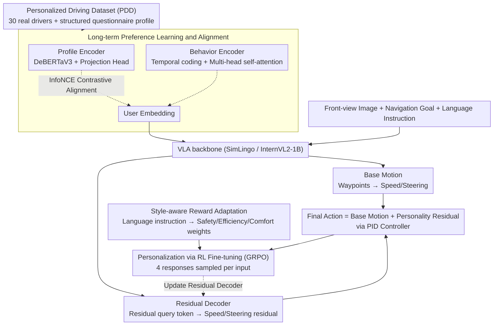

# Drive My Way: Preference Alignment of Vision-Language-Action Model for Personalized Driving

**Conference**: CVPR 2026  
**arXiv**: [2603.25740](https://arxiv.org/abs/2603.25740)  
**Code**: [https://dmw-cvpr.github.io/](https://dmw-cvpr.github.io/)  
**Area**: Autonomous Driving  
**Keywords**: Personalized Driving, VLA Model, Preference Alignment, Reinforcement Fine-Tuning, User Embedding

## TL;DR

DMW (Drive My Way) is proposed as a personalized VLA driving framework that learns long-term driving habits via user embeddings and adapts to short-term preferences through natural language instructions, utilizing GRPO reinforcement fine-tuning and style-aware rewards to generate personalized driving behaviors.

## Background & Motivation

Driving behavior is inherently highly individualized—different drivers exhibit distinct preferences in acceleration, braking, lane changing, and overtaking. However, existing end-to-end autonomous driving systems suffer from the following deficiencies:

**Generic Optimization**: Existing systems typically optimize for universal goals such as safety and efficiency, ignoring individual differences.

**Fixed Predefined Modes**: They only provide a few modes like "Sport/Comfort/Eco," failing to capture subtle and continuously evolving user preferences.

**Inability to Understand Natural Language**: Users cannot adjust driving styles using intuitive language such as "I am tired" or "I am late for work."

Two major limitations of existing personalization methods:
- **Data-driven methods** (Behavior Cloning/IRL): Require large-scale data, possess poor scalability, and cannot handle real-time linguistic interaction.
- **Language-driven methods** (e.g., Talk2Drive): Only verified in simple scenarios and do not consider long-term driving habits.

The core idea of DMW is to simultaneously address **long-term preference alignment** and **short-term instruction adaptation**.

## Method

### Overall Architecture

DMW utilizes SimLingo (based on InternVL2-1B) as the VLA backbone. Inputs include front-view camera images, navigation goals, user profiles, and language instructions, while outputs are personalized driving actions (throttle/brake/steering). The pipeline consists of two steps: first, using real human data from the "Personalized Driving Dataset (PDD)," profiles and behaviors are aligned into "user embeddings" via contrastive learning and injected into the policy to model long-term habits. Second, the VLA backbone predicts safe base motions, upon which a residual decoder overlays "personality residuals." Finally, personalization is achieved through GRPO reinforcement fine-tuning driven by "style-aware rewards" to reflect short-term language instructions in the residuals.

### Key Designs

**1. Personalized Driving Dataset (PDD): Real human preference data as the foundation**

The primary lack in personalized driving is data regarding "real human preferences in diverse scenarios." The authors recruited 30 drivers from diverse backgrounds to complete 20 standardized scenarios in CARLA (overtaking, merging, intersections, pedestrian crossings, etc.) using a Logitech steering wheel and pedals. Ego-motion states, surrounding perception (vehicles/pedestrians/cyclists/roadside hazards), and traffic context (signals/speed limits/routes) were recorded. Each driver also completed a structured questionnaire (demographics, driving history, trip purpose) as a profile. Human speed deviation relative to the PDM-Lite expert target speed was used as a style descriptor. This dataset enables modeling "long-term habits" rather than relying on predefined modes.

**2. Long-term Preference Learning and Alignment: Mapping "questionnaires" and "driving styles" to a shared space**

To capture evolving personal habits, it is crucial to align static profiles with dynamic behaviors. The authors use contrastive learning to build a shared latent space between profile embeddings and behavior embeddings. A profile encoder $f_p(\cdot)$ (DeBERTaV3 + projection head) produces user embeddings $z_p^m$, and a behavior encoder $f_b(\cdot)$ (temporal encoder + multi-head self-attention, processing a trajectory window of the past $k$ steps) produces behavior embeddings $z_{b,t}^m$. InfoNCE contrastive loss is used to pull the profile and behavior of the same driver closer while pushing different drivers apart. The learned user embedding $z_p^m$ is injected into the VLA policy and further adapted via reinforcement fine-tuning. To mitigate long-tail issues, data augmentation is performed: a driver $u$ with the most dissimilar embedding to the target is selected, and augmented actions are scaled based on action statistics: $\tilde{a}_t^m = \frac{\bar{a}^m}{\bar{a}^u} \cdot a_t^m$.

**3. Personalization via RL Fine-tuning (GRPO): Overlaying "personality residuals" on safe base motions**

Learning personalization completely end-to-end is risky—it may sacrifice safety to imitate a certain individual. The authors instead use Group Relative Policy Optimization (GRPO) for reinforcement fine-tuning and design a residual decoder. Learnable residual query tokens are injected into the language model to output discrete residual adjustments (speed change + steering change), resulting in final actions $a_t = a_t^{base} + a_t^\Delta$. Thus, base motions ensure safe planning while personalization is reflected only in the residuals, decoupling "safety" from "style."

**4. Style-aware Reward Adaptation: Translating natural language instructions into safety/efficiency/comfort weights**

To allow users to adjust styles temporarily using natural language like "I am tired" or "I am late," language must be mapped to optimizable rewards. The reward is a weighted sum: $\mathcal{R}(s_t, a_t) = w_s \cdot R_{safety} + w_e \cdot R_{efficiency} + w_c \cdot R_{comfort}$. The safety term is based on Time-to-Collision (TTC): $R_{safety} = \mathbb{I}(TTC_t \geq \beta_{safety})$. The efficiency term $R_{efficiency} = \exp(-\alpha \cdot |v_t - v_{pref}|)$ encourages alignment with the preferred speed. The comfort term requires steering and acceleration not to exceed thresholds. Weights, thresholds, and preferred speeds are dynamically adjusted based on language instructions and scenarios. Initial values are derived via GPT-5 reasoning and refined by expert review, allowing short-term instructions to overlay on long-term preferences.

### Loss & Training

- User embedding training: AdamW, weight decay 1e-3, lr 1e-4.
- Preference encoders are frozen after convergence; motion predictor and residual decoder are fine-tuned.
- LoRA is used for adapting Qwen2-0.5B.
- 8 A6000 GPUs, per-GPU batch size 8.
- GRPO samples 4 responses per input.

## Key Experimental Results

### Main Results

**Bench2Drive Closed-loop Driving Metrics**:

| Method | Style | DS | SR | Efficiency | Comfort | Speed | TT |
|------|------|-----|-----|-----------|---------|-------|-----|
| SimLingo | Aggressive | 78.56 | 65.83 | 247.60 | 18.61 | 7.66 | 25.35 |
| SimLingo | Conservative | 78.18 | 65.56 | 238.77 | 26.99 | 7.21 | 33.02 |
| DMW | Aggressive | 79.50 | 67.36 | **281.56** | 21.62 | 7.72 | 26.93 |
| DMW | Conservative | **82.72** | **71.56** | 237.06 | **34.62** | 6.18 | **47.38** |

DMW improves efficiency by 18.77% in Aggressive mode (SimLingo only 3.70%), while DS only decreases by 3.89%.

**Long-term Preference Alignment (User Study)**:

| Method | AS (ID) D1/D2 | AS (OOD) D3/D4 | Ratings (ID) | Ratings (OOD) |
|------|-------------|---------------|-------------|--------------|
| MORL-PD | 0.42/0.58 | 0.25/0.33 | 5.1/6.2 | 3.9/3.5 |
| **DMW** | **0.92/0.92** | **0.83/0.83** | **8.7/8.3** | **7.8/8.0** |

### Ablation Study

**Adaptive Average Pooling (AAP) Ablation**:

| Driver | w/ AAP | w/o AAP | Description |
|--------|--------|---------|------|
| D1 AS | 0.92 | 0.67 | High alignment score with AAP |
| D2 AS | 0.92 | 0.58 | |
| D3 AS | 0.83 | 0.25 | Larger gap for OOD |

| Configuration | Key Metrics | Description |
|------|---------|------|
| w/o AAP | Avg. AS 0.50, Avg. Ratings 5.5 | Global average pooling reduces embedding expressiveness |
| w/ AAP | Avg. AS 0.88, Avg. Ratings 8.2 | Retains semantically important embeddings |

### Key Findings

1. **DMW achieves effective style differentiation while maintaining safety**: DS/SR are highest in Conservative mode, and efficiency significantly improves in Aggressive mode.
2. **Long-term preference alignment is effective for OOD drivers**: Alignment Score remains at 0.83 for unseen drivers D3/D4.
3. **Significant policy behavior differences across drivers**: Aggressive drivers (D1/D4) exhibit higher speed and acceleration, while conservative drivers (D2/D3) maintain larger following distances.
4. **Short-term instructions can overlay on long-term preferences**: The two personalization dimensions are complementary and mutually beneficial.

## Highlights & Insights

1. **Decoupling of Long- and Short-term Preferences**: Decomposing driving personalization into long-term habits (user embeddings) and short-term intentions (language instructions) is simple and effective.
2. **Residual Action Design**: $a_t = a_t^{base} + a_t^\Delta$ overlays personalization on a safety foundation, mitigating the risks of fully end-to-end approaches.
3. **Real Driver Data**: The PDD dataset, collected from 30 real humans in CARLA, offers greater behavioral diversity than synthetic data.
4. **Interpretability of Style-aware Rewards**: The approach of mapping language instructions to safety/efficiency/comfort weights is traceable.
5. **GRPO Reinforcement Fine-tuning**: Offers better specialization to individual styles compared to pure Behavior Cloning.

## Limitations & Future Work

1. **Validation limited to CARLA simulation**: Performance on real roads is unknown, and the sim-to-real gap may be significant.
2. **Limitations of Profile questionnaires**: Driving styles may change dynamically with mood or road conditions; static profiles struggle to capture this fully.
3. **Diversity of 30 drivers**: The sample size is limited, and its ability to cover global driving cultural differences is questionable.
4. **Risks at safety boundaries**: Reduced TTC thresholds in Aggressive mode may pose safety hazards.
5. **Computational overhead**: The real-time performance of VLA + GRPO + user embedding inference is not fully discussed.

## Related Work & Insights

- **SimLingo**: Serves as the VLA backbone, providing basic language-vision-action capabilities.
- **Talk2Drive**: A pioneer in language-driven personalization, though only verified in simple scenarios.
- **MAVERIC**: Learns latent spaces for diverse socially-aware driving behaviors.
- **StyleDrive**: A contrastive method for injecting fixed style conditions into policies.
- Insight: The paradigm of preference alignment + reinforcement fine-tuning may be applicable to other embodied AI tasks requiring personalization, such as robotic manipulation.

## Rating

- Novelty: ⭐⭐⭐⭐ — The decoupling of long/short-term preferences and the GRPO+residual design are innovative, though the overall concept is not entirely groundbreaking.
- Experimental Thoroughness: ⭐⭐⭐⭐ — Includes closed-loop evaluation and user studies, but is restricted to CARLA simulation.
- Writing Quality: ⭐⭐⭐⭐ — Clear structure and reasonable experimental design, though contains many symbols.
- Value: ⭐⭐⭐⭐ — Personalized driving is a practical need, and the PDD dataset has potential reuse value.

<!-- RELATED:START -->

## Related Papers

- [\[CVPR 2026\] Learning Vision-Language-Action World Models for Autonomous Driving](vla_world_learning_vision_language_action_world_models_for_autonomous_driving.md)
- [\[CVPR 2026\] NoRD: A Data-Efficient Vision-Language-Action Model that Drives without Reasoning](nord_a_data-efficient_vision-language-action_model_that_drives_without_reasoning.md)
- [\[CVPR 2026\] DriveMoE: Mixture-of-Experts for Vision-Language-Action Model in End-to-End Autonomous Driving](drivemoe_mixture-of-experts_for_vision-language-action_model_in_end-to-end_auton.md)
- [\[CVPR 2026\] HybridDriveVLA: Vision-Language-Action Model with Visual CoT reasoning and ToT Evaluation for Autonomous Driving](hybriddrivevla_vision-language-action_model_with_visual_cot_reasoning.md)
- [\[CVPR 2026\] Unifying Language-Action Understanding and Generation for Autonomous Driving](unifying_language-action_understanding_and_generation_for_autonomous_driving.md)

<!-- RELATED:END -->
