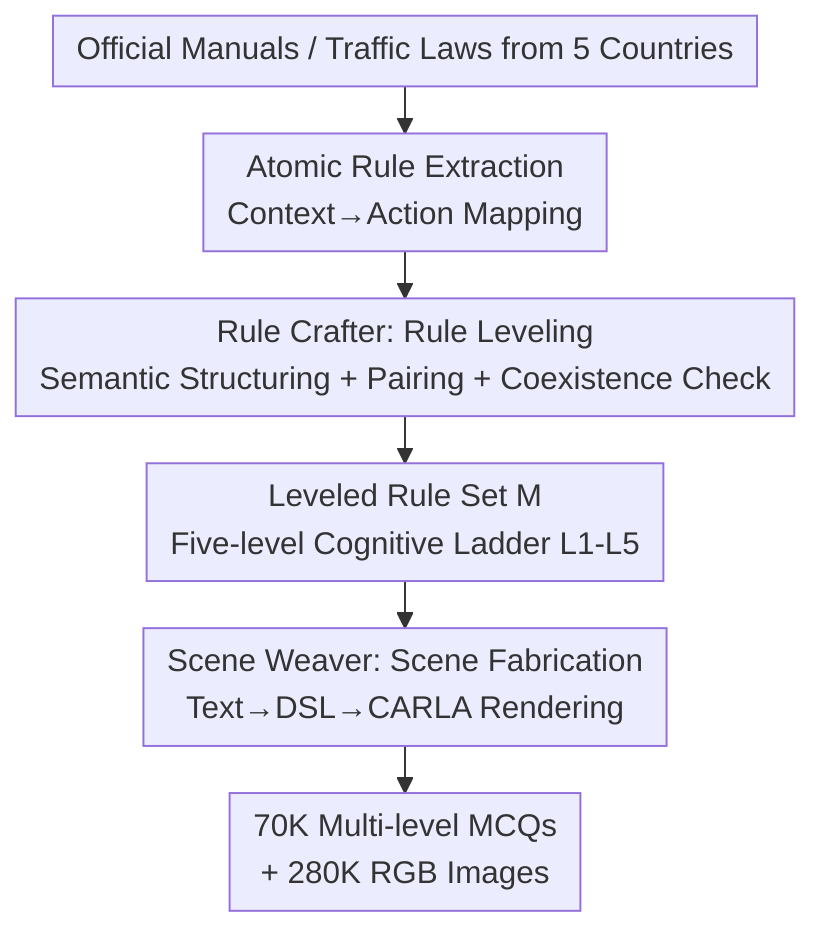

# DriveCombo: Benchmarking Compositional Traffic Rule Reasoning in Autonomous Driving

**Conference**: CVPR 2026  
**Paper**: [CVF Open Access](https://openaccess.thecvf.com/content/CVPR2026/html/Ma_DriveCombo_Benchmarking_Compositional_Traffic_Rule_Reasoning_in_Autonomous_Driving_CVPR_2026_paper.html)  
**Code**: None  
**Area**: Autonomous Driving / Multimodal VLM Benchmark  
**Keywords**: Traffic Rule Reasoning, Autonomous Driving Benchmark, Multimodal Large Language Models (MLLMs), Rule Composition, CARLA Simulation  

## TL;DR
DriveCombo is the first multimodal benchmark for "compositional traffic rule reasoning." It organizes 70,000 multiple-choice questions (MCQs) using a five-level cognitive ladder—ranging from single-rule understanding to rule conflict arbitration. It utilizes a Rule2Scene Agent to automatically convert textual regulations into executable 3D driving scenarios in CARLA. Evaluations of 14 mainstream MLLMs reveal a sharp drop in accuracy to 41%–44% on the highest-level conflict arbitration tasks, significantly lower than the human performance of >98%.

## Background & Motivation
**Background**: Multimodal Large Language Models (MLLMs) are becoming the "brains" of end-to-end autonomous driving systems. By integrating visual perception, linguistic reasoning, and world knowledge, they significantly enhance scene understanding and trajectory planning.

**Limitations of Prior Work**: Safe driving depends not only on trajectory safety but also on legal compliance—the ability to make lawful, context-appropriate decisions in complex scenarios. Traditional end-to-end benchmarks only measure physical metrics like trajectory deviation and collision rates, completely ignoring the model's understanding of traffic rules. Furthermore, the few rule-focused benchmarks (e.g., DriveQA, IDKB) only cover "single atomic rules" and rely on 2D static images (such as traffic sign recognition), failing to capture the complexity of multiple co-existing and conflicting rules on real roads.

**Key Challenge**: In real-world driving, multiple regulations often apply simultaneously or even conflict (e.g., "slow down for an accident ahead" while "crossing a solid line is prohibited"). Simplified settings in existing benchmarks create a "performance illusion"—models score high on single rules but fail when faced with compositional rules. A massive gap exists between current evaluation paradigms and the cognitive demands of real-world safe and compliant driving.

**Goal**: To build a benchmark capable of systematically evaluating the "compositional traffic rule reasoning" abilities of MLLMs in complex scenarios. This requires solving two sub-problems: (1) how to clearly decompose and quantify reasoning complexity according to cognitive hierarchies; (2) how to batch-convert abstract textual regulations into visual, evaluatable scenarios.

**Key Insight**: The authors draw inspiration from the cognitive development patterns of human drivers—evolving from understanding single rules to coordinating multiple constraints and finally learning to resolve rule conflicts. This development process is mapped onto a quantifiable evaluation ladder.

**Core Idea**: A "five-level cognitive ladder" is used to organize questions from single rules to conflict arbitration. A "Rule2Scene Agent" generates structured rules on the linguistic side and reconstructs their physical semantics on the simulation side, creating a "rule reasoning ↔ scene execution" closed loop. This automatically transforms regulatory text into scene-level visual reasoning problems.

## Method
DriveCombo is essentially a data production pipeline: "regulatory text → leveled rule sets → 3D scenes → multi-level MCQs." The input consists of official driving manuals and traffic regulations from five countries, and the output comprises approximately 70K MCQs and 280K images organized into five cognitive levels. The pipeline is supported by two components: a **five-level cognitive ladder** defining evaluation difficulty, and a **Rule2Scene Agent** (comprising Rule Crafter and Scene Weaver modules) that grounds rules into scenes.

### Overall Architecture
The process follows three steps: first, **atomic rules** are parsed from regulatory manuals (one rule = one "context → action" mapping); next, the **Rule Crafter** performs semantic structuring, pairwise matching, and spatio-temporal coexistence verification for each atomic rule, then automatically **assigns a cognitive level $l_i$** to each pair based on perceptual and normative attributes to form a leveled rule set $M$ covering L1–L5; finally, the **Scene Weaver** translates the leveled rules into textual scene descriptions, converts them into a structured DSL, and maps them into the CARLA simulator to render RGB image sequences, which are then assembled into MCQs with a stem and four options.

### Key Designs

**1. Five-level Cognitive Ladder: Explicitly Decomposing Rule Reasoning Complexity into Quantifiable Difficulty Gradients**

To address the issue of existing benchmarks having flat difficulty and only testing single rules, the authors align evaluation difficulty with the cognitive trajectory of human drivers. They designed a progressive five-level ladder: L1 understands single atomic rules; L2 integrates multiple **non-conflicting static** rules (e.g., speed limit + road sign); L3 involves reasoning under interaction with dynamic traffic participants (e.g., yielding at an intersection); L4 coordinates a mix of static and dynamic rules; L5 judges priorities and makes legal decisions when rules **conflict**. These five levels are not subjective; they are automatically determined by the attributes of the rule pairs (see Design 2), allowing for a precise level-by-level analysis of a model's evolution from basic recognition to conflict arbitration. Its value was validated in experiments: all models scored high on L1, but scores declined monotonically from L2 to L5, with L5 dropping to 41%–44%, exposing a cognitive bottleneck where models "appear to know but cannot compose," proving the ladder effectively distinguishes reasoning depth.

**2. Rule Crafter: Automatic Rule Categorization via Normative Attributes for Scalable Generation**

Relying on manual annotation for L1–L5 difficulty would be slow and inconsistent. Instead, Rule Crafter first structures the semantics of each atomic rule into a quadruple $r_i = (c_i, b_i, a_i, n_i)$—content $c_i$, perception type $b_i \in \{\text{static}, \text{dynamic}\}$, action type $a_i$, and normative type $n_i \in \{\text{permissive}, \text{obligatory}, \text{forbidden}\}$. It then pairs rules with **consistent action types** $p_i = \{r_j, r_k\}$, deriving a combined perception type $b_i'$ (Double Static / Double Dynamic / Hybrid) and a normative relationship $n_i'$ (defined as Norm Conflict if $\{n_j, n_k\} = \{\text{obligatory}, \text{forbidden}\}$, otherwise Norm Harmony). Crucially, the level is **deterministically** assigned based on these two attributes:

$$l_i = \begin{cases} 2, & b_i'=\text{Double Static},\ n_i'=\text{Norm Harmony}\\ 3, & b_i'=\text{Double Dynamic},\ n_i'=\text{Norm Harmony}\\ 4, & b_i'=\text{Hybrid},\ n_i'=\text{Norm Harmony}\\ 5, & n_i'=\text{Norm Conflict} \end{cases}$$

All atomic rules $r_i$ are labeled $l_i=1$. Thus, "difficulty" shifts from subjective judgment to a label derived from rule attributes—as long as the LLM structures the rules correctly, the level is naturally determined. After pairing, a **spatio-temporal coexistence check** $v_i = f_{\text{LLM}}(r_j, r_k) \in \{0,1\}$ is performed: the LLM extracts road types, agent states, and environmental attributes for both rules to determine if they can coexist in the same physical and temporal context, filtering out incompatible combinations. Only valid pairs $\hat{P}$ where $v_i=1$ are kept, resulting in a final rule set $M = R \cup \hat{P}$ covering L1–L5. This step ensures that the generated multi-rule scenarios are physically plausible rather than just two unrelated rules forced together.

**3. Scene Weaver: Grounding Abstract Rules into Executable High-Fidelity 3D Scenes in CARLA**

To create visual questions from leveled rules, Scene Weaver follows a multi-stage "Generate → SelfCheck → Align" pipeline. First, an LLM rewrites each rule $m_i \in M$ into a natural language **textual scene description** $s_i$ (integrating single or multiple rule constraints). These are then translated into **structured semantic representations** $d_i = \{E_i, L_i, W_i\}$, covering entities (vehicles, pedestrians, lights), spatial/interactive relationships ("in front of," "to the left"), and environmental conditions (weather, time, road type), using a Domain-Specific Language (DSL) based on traffic simulation schemas. These structured semantics $d_i^*$ are mapped into CARLA's 3D coordinate system to generate OpenSCENARIO files $\omega_i$ containing entity positions, traffic structures, weather, and trajectories. Finally, CARLA renders the 3D scene, and a camera mounted in front of the ego vehicle captures an RGB image sequence of $K$ frames (where $K=4$). At each stage, another LLM performs quality scoring, with scores below a threshold prompting human expert correction, ensuring the visuals are realistic and strictly adhere to rule semantics. This path—generating structured rules on the language side and reconstructing physical semantics on the simulation side—guarantees semantic consistency between the rules and generated scenes.

### A Complete Example
Consider an L5 conflict question: a three-lane highway, thick fog, visibility approximately 50 m. Two rules meet—"speed limit 30 km/h when visibility is below 50 m" (obligatory/deceleration) and "minimum speed limit 110 km/h in the leftmost lane of a three-lane highway" (conflicts with deceleration). Rule Crafter pairs these and, because the normative relationship is Norm Conflict, assigns $l_i=5$. A coexistence check confirms this fog + three-lane scenario is physically possible. Scene Weaver converts it into a textual scene and a DSL for "three-lane road + thick fog + ego car," which is then rendered in CARLA from a foggy driving perspective across 4 frames. The final MCQ asks, "What is the correct speed limit?" with options A. 110, B. 70, C. 50, D. 30. The correct answer is determined by priority principles (safety obligations over traffic efficiency), which is deceleration. If a model only recognizes the "minimum speed limit 110," it will answer incorrectly—identifying exactly the conflict arbitration bottleneck L5 aims to test.

## Key Experimental Results

### Main Results
14 mainstream MLLMs were evaluated (GPT-5 nano/mini/pro, Gemini-2.5-Flash/Pro, Claude-Sonnet-4.5 for closed-source; Gemma-3, Llama-3.2, Qwen3-VL, GLM-4.5V for open-source) in a zero-shot setting, averaged over 3 runs. The table below shows accuracy (%) for the visual version (DriveCombo); all models show a monotonic decline across levels, with all crashing to 41%–44% at L5:

| Model | Size | L1 | L2 | L3 | L4 | L5 |
|------|------|------|------|------|------|------|
| Gemma 3 | 27B | 73.94 | 67.39 | 65.55 | 63.10 | 37.42 |
| Qwen3-VL | 32B | 78.54 | 76.09 | 68.84 | 65.42 | 39.86 |
| GLM-4.5V | 106B | 80.44 | 78.49 | 69.54 | 68.22 | 41.86 |
| Gemini 2.5 Pro | - | 85.71 | 77.19 | 70.32 | 68.03 | 43.06 |
| Claude Sonnet 4.5 | - | 83.80 | 82.16 | 70.96 | 69.62 | 43.99 |
| GPT-5 pro | - | 86.91 | 83.66 | 72.06 | 69.82 | **44.19** |

Even the strongest model, GPT-5 pro, achieved only 44.19% on L5, while 30 human drivers scored >98% on 100 randomly sampled questions across all levels, highlighting a massive gap in conflict arbitration. On the text-only variant (DriveCombo-Text), all models showed slight improvements (GPT-5 pro L5 rose to 47.42%), indicating that while visual understanding introduces some semantic loss, L5 remains stuck below 50% even without visual pressure.

### Ablation Study
DriveCombo was used as a "knowledge injector" to compare training-free methods (CoT, RAG) with training-related methods (SFT). SFT significantly outperformed the former, markedly improving compositional rule reasoning (Average Gain %):

| Model | Baseline Avg | +CoT | +CoT+RAG | +CoT+RAG+SFT | L5(Post-SFT) |
|------|------|------|------|------|------|
| Gemma 3 (4B) | 44.8 | +2.70 | +7.31 | **+29.37** | 51.3 |
| Qwen3-VL (8B) | 58.7 | +1.52 | +4.13 | **+21.89** | 60.2 |
| Llama 3.2 (11B) | 43.0 | +2.62 | +5.42 | **+29.70** | 50.1 |

Downstream end-to-end planning (nuScenes validation set, L2 trajectory error ↓) also demonstrated that data effectively transfers to real tasks:

| Model | SFT Data | 1s | 2s | 3s | Avg |
|------|---------|------|------|------|------|
| LLaVA-1.6-Mistral-7B | - | 1.66 | 3.54 | 4.54 | 3.24 |
| LLaVA-1.6-Mistral-7B | DriveQA | 1.30 | 3.46 | 3.98 | 2.91 |
| LLaVA-1.6-Mistral-7B | DriveCombo | 1.27 | 3.29 | 3.92 | **2.68** |
| InternVL-2.5-8B | DriveCombo | 1.26 | 3.03 | 3.58 | **2.53** |

### Key Findings
- **Cognitive Ladder Distinguishes Reasoning Depth**: L1 scores are generally high, but L2→L5 shows a monotonic decline. L5 conflict arbitration is a universal bottleneck, proving the benchmark successfully exposes the "recognizes rules but cannot compose them" defect.
- **Complexity Increases Failure Rate**: Complexity analysis shows that while models like GPT-5 pro and Qwen3-VL 32B are strong with two rules, accuracy drops by over 20 percentage points when rules increase to 4–5, showing difficulty in maintaining consistent reasoning in high-dimensional traffic semantics.
- **SFT Outperforms Training-Free Methods but is Insufficient**: While Llama-3.2's accuracy improved by 29.7% on DriveCombo after SFT, the best fine-tuned model (Qwen3-VL-8B) reached only 60.2% on L5, suggesting conventional optimization cannot fully solve complex rule reasoning.
- **DriveCombo Transfers Better than DriveQA**: Downstream E2E planning L2 errors were consistently lower when fine-tuned on DriveCombo compared to DriveQA, with the paper citing a 17.3% reduction in L2 loss.

## Highlights & Insights
- **Converting "Difficulty" from Manual Annotation to Attribute Derivation**: Level $l_i$ is determined deterministically by the rule pair's perception type and normative relationship (e.g., Norm Conflict). This allows five-level questions to be generated at scale with consistent standards—a methodology transferable to any hierarchical compliance/reasoning evaluation.
- **Language-Simulation Closed Loop for Data Generation**: By structuring rules on the linguistic side before reconstructing physical semantics in CARLA, and using LLM scoring with human Expert-in-the-Loop for quality assurance, the pipeline allows for the mass production of scarce visual data for compliant driving.
- **Conflict Arbitration is a True Blind Spot**: The collective failure of all models at L5 (around 40% accuracy) and the subsequent 20-point drop as rule count increases clearly demonstrates that MLLMs lack multi-rule priority reasoning rather than single-rule knowledge, providing a clear direction for future work.

## Limitations & Future Work
- **Acknowledged Limitations**: Scene generation depends on the CARLA simulator, which limits scene diversity due to its 3D asset library; there are plans to integrate generative models to expand asset categories.
- **Sim-to-Real Gap**: While downstream nuScenes planning improved, all training data comes from CARLA rendering. The domain gap between simulated images and real road conditions might limit the transfer of high-level L5 capabilities. ⚠️ The paper lacks a quantitative analysis of the sim-to-real domain gap.
- **Reliability of Priority Determination**: L5 correct answers are decided by "priority principles," but priorities can be ambiguous across different countries or contexts. The consistency of annotations and the proportion of controversial samples deserve further disclosure.
- **Future Directions**: Real road test videos could be introduced to supplement CARLA assets, rule coverage could expand beyond 5 countries, and evaluation could move from MCQs to open-ended compliant decision generation for more realistic sequential decision-making.

## Related Work & Insights
- **vs DriveQA / IDKB**: These also use CARLA for rule-based QA but only cover single atomic rules (#Rules=1) and rely on 2D static images. DriveCombo focuses on multi-rule composition (#Rules≥1) and 3D scene sequences, using a five-level ladder to map the full spectrum from understanding to conflict arbitration.
- **vs nuScenes-QA / DriveLM / DriveBench**: These benchmarks mainly measure perception and semantic understanding (relational reasoning, multi-stage QA) and lack systematic evaluation of traffic rules and decision logic. DriveCombo shifts the focus from "understanding the scene" to "compliant decision-making."
- **vs Traditional End-to-End Benchmarks (KITTI / Waymo / nuScenes planning)**: These measure physical metrics like trajectory deviation and collision rates but cannot determine if a system truly understands or obeys traffic rules. DriveCombo quantifies rule-compliant reasoning directly and proves that fine-tuning on it improves real-world planning performance.

## Rating
- Novelty: ⭐⭐⭐⭐⭐ First compositional traffic rule reasoning benchmark; the five-level cognitive ladder and automatic leveling via rule attributes are novel and address a real pain point.
- Experimental Thoroughness: ⭐⭐⭐⭐⭐ Includes 14 MLLMs, text/visual variants, CoT/RAG/SFT enhancement, downstream E2E planning transfers, human controls, and multi-rule complexity analysis.
- Writing Quality: ⭐⭐⭐⭐ Clear motivation, complete pipeline descriptions, and formulas, though some formulas have minor formatting issues and some details are deferred to the appendix.
- Value: ⭐⭐⭐⭐⭐ Exposes the true bottleneck of MLLMs in rule conflict arbitration and provides data that directly improves downstream planning, offering a practical push for compliant autonomous driving.

<!-- RELATED:START -->

## Related Papers

- [\[CVPR 2026\] MindDriver: Introducing Progressive Multimodal Reasoning for Autonomous Driving](minddriver_introducing_progressive_multimodal_reasoning_for_autonomous_driving.md)
- [\[CVPR 2026\] Beyond Rule-Based Agents: Active Markov Games for Realistic Multi-Agent Interaction in Autonomous Driving](beyond_rule-based_agents_active_markov_games_for_realistic_multi-agent_interacti.md)
- [\[CVPR 2026\] Perceiving the Near, Reasoning the Distant: Coherent Long-Horizon Trajectory Prediction for Autonomous Driving](perceiving_the_near_reasoning_the_distant_coherent_long-horizon_trajectory_predi.md)
- [\[CVPR 2026\] ColaVLA: Leveraging Cognitive Latent Reasoning for Hierarchical Parallel Trajectory Planning in Autonomous Driving](colavla_leveraging_cognitive_latent_reasoning_for_hierarchical_parallel_trajecto.md)
- [\[CVPR 2026\] HybridDriveVLA: Vision-Language-Action Model with Visual CoT reasoning and ToT Evaluation for Autonomous Driving](hybriddrivevla_vision-language-action_model_with_visual_cot_reasoning.md)

<!-- RELATED:END -->
