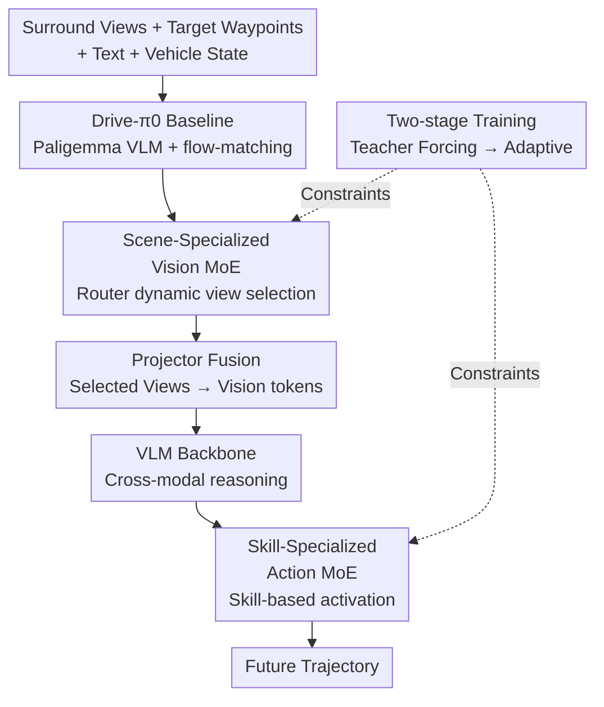

# DriveMoE: Mixture-of-Experts for Vision-Language-Action Model in End-to-End Autonomous Driving

**Conference**: CVPR 2026  
**arXiv**: [2505.16278](https://arxiv.org/abs/2505.16278)  
**Code**: https://thinklab-sjtu.github.io/DriveMoE/ (Project Page)  
**Area**: Autonomous Driving / End-to-End Planning / VLA / Mixture-of-Experts  
**Keywords**: End-to-End Autonomous Driving, Mixture-of-Experts, Vision-Language-Action, Multi-view Perception, Closed-loop Evaluation

## TL;DR
DriveMoE integrates Mixture-of-Experts (MoE) into both the perception and decision-making components of a VLA autonomous driving model. The perception side utilizes a Vision MoE to dynamically select critical camera views to save tokens, while the decision-making side employs an Action MoE to allocate dedicated experts for different driving skills. On the Bench2Drive closed-loop benchmark, it improves the Driving Score (DS) from 55.85 to 74.22 and the Success Rate (SR) from 30% to 48.64%.

## Background & Motivation
**Background**: End-to-end autonomous driving (E2E-AD) directly maps multi-view sensor inputs to planned trajectories, bypassing the engineering complexity and error propagation of modular pipelines. Recently, VLM/VLA models have been introduced to driving due to their strong generalization and cross-domain transfer capabilities, aiming to resolve frequently encountered out-of-distribution (OOD) scenarios in closed-loop settings.

**Limitations of Prior Work**: The authors identify two specific issues when applying VLA to driving. First is **visual redundancy**: mainstream approaches either feed all six surround-view images into the vision tower (vanilla processing, resulting in token explosion and soaring computational costs) or use Q-Former-style query compression (losing precise geometric/spatial information and requiring extensive pre-training). Second is **mode-averaging**: existing VLA models use a single unified policy head for all driving behaviors. Training tends to favor high-frequency scenarios, leading to poor performance in rare but safety-critical long-tail maneuvers like emergency braking or aggressive turns.

**Key Challenge**: There is a trade-off in the vision component between "preserving spatial structure" and "compressing token volume." In the action component, using a dense policy network to fit multi-modal trajectory distributions inevitably averages the behavioral patterns of different skills (mode-averaging), causing rare skills to be overshadowed.

**Goal**: (i) Reduce visual tokens per frame without losing spatial structure; (ii) Explicitly allocate dedicated modeling capacity for rare driving skills.

**Key Insight**: The authors draw inspiration from human driving cognition: drivers do not monitor all fields of view simultaneously but direct attention to critical visual cues based on the current context. Similarly, they switch smoothly between skills like "cruising, merging, overtaking, and emergency braking." MoE has proven in LLMs that "expert specialization + sparse activation" can expand capacity without a proportional increase in computation, which aligns perfectly with these observations.

**Core Idea**: Introduce MoE into both perception and decision-making—using one router to dynamically select camera views (Vision MoE) and another to activate skill-specific experts based on driving intent (Action MoE), making perception more efficient and decision-making more specialized.

## Method

### Overall Architecture
DriveMoE is built upon the authors' self-developed VLA baseline, **Drive-$\pi_0$** (transferred from the embodied AI model $\pi_0$ to driving, with a Paligemma VLM backbone and a flow-matching trajectory generator). The pipeline operates as follows: surround-view images first enter the **Vision MoE router**, which calculates selection probabilities for each view using front-view embeddings and future target waypoints, skipping irrelevant views before expensive backbone computation. Selected views (typically front-view + one or two side/rear views) are fused into a unified representation via a projector and sent to the VLM alongside text prompts and vehicle states. The VLM's hidden states enter a flow-matching decoder equipped with **Action MoE**, where a router activates corresponding experts based on driving skills to generate future trajectories. The model is trained using a two-stage "teacher-forcing to adaptive" strategy.

### Key Designs

**1. Drive-$\pi_0$: Transferring Embodied VLA Foundation to Driving**

It is difficult for existing driving models to integrate "visual perception + language understanding + action planning." The authors first migrate the $\pi_0$ VLA framework from embodied AI to serve as the Drive-$\pi_0$ baseline. Its inputs consist of two consecutive front-view frames (to estimate agent speeds), a fixed text prompt (e.g., "Please predict future trajectory"), and current vehicle states (speed, yaw rate, historical trajectory). The network follows the $\pi_0$ structure—Paligemma VLM as the backbone + flow-matching action module for trajectories. While this baseline achieves a DS of 55.85 on Bench2Drive, the authors identify its weaknesses (surround-view token bottleneck and mode-averaging), which the MoE components address.

**2. Scene-Specialized Vision MoE: Router selection before backbone computation**

To address visual redundancy, view selection is formulated as an MoE routing problem. A lightweight router $\boldsymbol{R}_\text{vision}$ takes front-view embeddings $\boldsymbol{e}^\text{front}_t$ and future target waypoints $\boldsymbol{g}_t$ as input to calculate the probability distribution $\boldsymbol{p}_t = \text{Softmax}(\boldsymbol{R}_\text{vision}(\boldsymbol{e}^\text{front}_t, \boldsymbol{g}_t)) \in \mathbb{R}^N$ for $N$ views. The key innovation is that **routing occurs before the expensive backbone**; unselected views are skipped entirely, saving computational power rather than just tokens. Unlike Q-Former, it operates at the view level, preserving complete spatial structures. Learnable position encodings (PE) are added to each view to maintain cross-view spatial relationships. Selection labels are automatically generated via heuristic filters (future trajectories + bounding boxes + maps). The router is supervised by cross-entropy $\mathcal{L}_\text{Vision-Router} = -\lambda_0 \sum_{v=1}^N \boldsymbol{y}_t^v \log(\boldsymbol{p}_t^v)$. This reduces token counts while forcing the model to focus on decision-relevant views.

**3. Skill-Specialized Action MoE: Replacing dense FFN with skill experts to break mode-averaging**

To address the bias of a single policy head toward high-frequency behaviors, each dense FFN in the decoder is replaced with an MoE layer containing $K$ shared experts and $M$ non-shared experts. Each non-shared expert specializes in a specific driving skill (merging, overtaking, emergency braking, yielding, traffic sign recognition, etc.). The router computes logits followed by softmax $\boldsymbol{r}_k = \text{Softmax}(\boldsymbol{R}_\text{action}(\mathbf{h}^{(\ell-1)}))$, updating features as $\boldsymbol{h}^{(\ell)} = \sum_{k=1}^K \boldsymbol{r}_k \boldsymbol{y}_k + \sum_{m=1}^M \boldsymbol{y}_m$. Sparse activation (Top-1/Top-2) is used to save computation and prevent inter-expert interference. Two routing styles were explored: **Token-level** (independent expert selection per token/step, suitable for short-term dependencies like acceleration) and **Trajectory-level** (averaging the entire trajectory token sequence before routing, treating each trajectory as a unified scene/skill entity). Trajectory-level routing uses cross-entropy supervision $\mathcal{L}_\text{Action-Router} = -\boldsymbol{y}_k \log(\boldsymbol{r}_k)$ with skill labels. The total action module loss is $\mathcal{L}_\text{Action} = \lambda_1 \mathcal{L}_\text{FM} + \lambda_2 \mathcal{L}_\text{Action-Router}$. Noise is injected into the action router to encourage exploration and prevent expert collapse. Experiments show trajectory-level routing significantly outperforms token-level routing.

**4. Two-stage Training: From Teacher Forcing to Adaptive Routing**

Allowing the MoE router to select experts autonomously from the start can lead to instability. The authors mitigate this in two stages. In the first stage, both Vision and Action MoE select only **ground-truth experts** (based on annotated view/skill labels). The router and experts are trained jointly, allowing experts to learn under clean division of labor. In the second stage, the model switches to **selecting experts based on actual router output**, removing dependency on GT labels and making the model robust to potential routing errors, thereby generalizing better during inference.

### Loss & Training
- Vision Router: Cross-entropy $\mathcal{L}_\text{Vision-Router}$ (weight $\lambda_0$).
- Action Module: Flow-matching trajectory loss + action routing cross-entropy, $\mathcal{L}_\text{Action} = \lambda_1 \mathcal{L}_\text{FM} + \lambda_2 \mathcal{L}_\text{Action-Router}$.
- Action router injects noise to encourage exploration and prevent expert collapse.
- Model is fine-tuned on driving scenarios after loading Paligemma pre-trained weights, using a two-stage (Teacher Forcing $\rightarrow$ Adaptive) strategy.

## Key Experimental Results

Dataset/Benchmark: CARLA 0.9.15.1 + Bench2Drive (220 routes, each with a corner case; official base set 1000 clips: 950 training / 50 validation). Metrics include closed-loop DS (Driving Score), SR (Success Rate), Efficiency, Comfort, and open-loop L2.

### Main Results

Bench2Drive Closed-loop + Open-loop Comparison (Abridged):

| Method | Source | DS ↑ | SR(%) ↑ | Avg. L2 ↓ |
|------|------|------|---------|-----------|
| UniAD-Base | CVPR 2023 | 45.81 | 16.36 | 0.73 |
| DriveTrans | ICLR 2025 | 63.46 | 35.01 | 0.62 |
| DiffAD | Arxiv 2025 | 67.92 | 38.64 | 1.55 |
| Raw2Drive | NeurIPS 2025 | 71.36 | 50.24 | - |
| Drive-$\pi_0$ (Baseline) | Ours | 55.85 | 30.00 | 1.13 |
| DriveMoE (Token-Level) | Ours | 66.94 | 35.45 | 0.96 |
| **DriveMoE (Traj-Level)** | **Ours** | **74.22** | **48.64** | **1.01** |

Multi-ability Evaluation (Table 1, Ability %):

| Method | Merger | Overtake | Emergency Brake | Yield | Traffic Sign | Mean |
|------|------|------|------|------|----------|------|
| Drive-$\pi_0$ | 26.25 | 26.67 | 45.00 | 30.00 | 38.95 | 33.37 |
| DriveMoE (Token) | 28.75 | 31.11 | 51.67 | 40.00 | 52.63 | 40.83 |
| **DriveMoE (Traj)** | **34.67** | **40.00** | **65.45** | **40.00** | **59.44** | **47.91** |

Compared to the Drive-$\pi_0$ baseline, DriveMoE (Traj-Level) improves DS from 55.85 to 74.22 and SR from 30.00% to 48.64% (a relative gain of ~62.1%). It leads across all five categories, specifically jumping from 45.00 to 65.45 in emergency braking.

### Ablation Study

Vision MoE (Table 3, Fixed View vs. Dynamic View):

| Configuration | DS ↑ | SR(%) ↑ | Latency ↓ | Memory (MB) |
|------|------|---------|--------|----------|
| Exp1 Front-only (Base) | 55.85 | 30.00 | 100ms | 4100 |
| Exp5 Front+FL+FR Fixed | 64.92 | 33.64 | 400ms | 7400 |
| Exp7 Full 6-view Fixed | 62.27 | 31.36 | 700ms | 11800 |
| Exp8 Dynamic (Unsup.) | 69.71 | 44.09 | 260ms | 5100 |
| **Exp9 Dynamic+Sup. (Ours)** | **74.22** | **48.64** | **260ms** | **5100** |

Module Ablation (Table 7) and Expert Count Ablation (Table 6):

| Configuration | DS ↑ | SR(%) ↑ | Description |
|------|------|---------|------|
| Drive-$\pi_0$ | 55.85 | 30.00 | Baseline |
| w/o Vision MoE | 68.68 | 42.45 | Remove view selection |
| w/o Action MoE | 67.31 | 40.56 | Remove skill experts |
| **DriveMoE (full)** | **74.22** | **48.64** | Complete model |
| 6 Non-shared Exp. | 74.22 | 48.64 | Optimal (Table 6 Exp2) |
| 13 Non-shared Exp. | 70.88 | 44.50 | Load imbalance |
| 44 Experts | 68.22 | 43.18 | Over-segmentation drop |

### Key Findings
- **Fixed views saturate or backfire**: Increasing from 1 to 3 fixed views (Exp5) improves DS to 64.92, but all 6 views (Exp7) drops it to 62.27, while latency jumps from 100ms to 700ms and memory from 4.1GB to 11.8GB—token explosion hinders convergence. Dynamic selection (Exp8/9) achieves 74.22 DS with only 260ms/5.1GB, proving "selecting the right view" is more important than "seeing all views."
- **Supervision is crucial for Vision MoE**: Unsupervised dynamic selection yields 69.71 DS; adding manual view supervision raises it to 74.22 (+4.5) and SR from 44.09% to 48.64%.
- **Complementary MoE modules**: Removing either MoE module drops DS to the 67~69 range; both are required to reach 74.22.
- **Trajectory-level >> Token-level** (Table 5): With identical expert counts, Traj-level achieves 73.88 DS / 48.64 SR, while Token-level only reaches 65.62 / 32.27—driving skills are best modeled as entire trajectory intents.
- **More experts aren't always better**: 6 non-shared experts are optimal. Increasing to 13 or 44 causes performance degradation due to load imbalance. Router accuracy: Vision 88.85%, Action 65.40%.

## Highlights & Insights
- **"Select Views" not "Select Tokens"**: By placing MoE routing before the backbone at camera granularity, the model saves actual computation (skipping image encoding) while preserving spatial structure, avoiding Q-Former's geometric loss. This "routing before expensive computation" strategy is transferable to any multi-sensor system.
- **Explicitly Combating mode-averaging**: Assigning rare skills to dedicated experts directly improves long-tail metrics (e.g., emergency braking 45 $\rightarrow$ 65.45), addressing the inherent flaw of single-head multi-modal modeling.
- **Trajectory vs. Token comparison**: The results provide an empirical answer for behavior-level semantics—driving intent is trajectory-level; token-level routing disrupts the coherence of intents.
- **Two-stage Transition**: The teacher-forcing to adaptive transition is a practical trick for stabilizing MoE routers with explicit labels, applicable to scenarios with expert annotations where autonomous routing is required at inference.

## Limitations & Future Work
- **Reliance on manual annotations**: Labels for view selection and skills rely on heuristic filters. Switching datasets or sensor configs requires re-labeling, limiting scalability.
- **Action Router accuracy**: At 65.40% (vs. Vision 88.85%), skill boundaries are inherently fuzzy, and routing errors may cap performance; load imbalance remains a risk with more experts.
- **Comfort metric fluctuations**: Comfort for Traj-level (15.31) is significantly lower than methods like VAD (46.01), suggesting trajectory smoothness might be compromised.
- **Simulation-only validation**: Evaluated only on CARLA/Bench2Drive; lacks real-world or large-scale real-data verification.
- Future Directions: Self-supervised/weakly-supervised routing labels, introducing load-balancing losses, and explicitly optimizing for comfort metrics.

## Related Work & Insights
- **vs. Vanilla Vision Processors**: These feed all views indiscriminately, causing token redundancy and high cost (Exp7 confirms 700ms/11.8GB overhead). DriveMoE dynamic selection caps cost at 260ms/5.1GB with higher performance.
- **vs. Q-Former Compression**: Query compression reduces tokens but loses geometry and requires extra pre-training. DriveMoE selects at the view level, preserving structure.
- **vs. Single-policy VLA**: Unified heads fail on long-tail behaviors; DriveMoE uses skill experts to specialize, significantly boosting long-tail performance.
- **vs. LLM MoE (DeepSeek-MoE, etc.)**: This work extends MoE from language only to both perception and action in driving, representing the first systematic exploration of "dual-end specialization" in autonomous driving.

## Rating
- Novelty: ⭐⭐⭐⭐ First to use MoE for both perception (view selection) and decision-making (skill experts) in a driving VLA.
- Experimental Thoroughness: ⭐⭐⭐⭐ Comprehensive closed-loop evaluation + 7 ablation tables; however, lacks real-vehicle testing.
- Writing Quality: ⭐⭐⭐⭐ Clear logic from motivation to method; well-explained trajectory vs. token contrast.
- Value: ⭐⭐⭐⭐ The ideas of "routing before backbone" and "allocating experts for long-tail skills" are directly applicable to E2E-AD and multi-sensor systems.

<!-- RELATED:START -->

...

<!-- RELATED:END -->

## Related Papers

- [\[CVPR 2026\] Learning Vision-Language-Action World Models for Autonomous Driving](vla_world_learning_vision_language_action_world_models_for_autonomous_driving.md)
- [\[CVPR 2026\] ActiveAD: Planning-Oriented Active Learning for End-to-End Autonomous Driving](activead_planning-oriented_active_learning_for_end-to-end_autonomous_driving.md)
- [\[CVPR 2026\] Scaling-Aware Data Selection for End-to-End Autonomous Driving Systems](scaling-aware_data_selection_for_end-to-end_autonomous_driving_systems.md)
- [\[CVPR 2026\] ResAD: Normalized Residual Trajectory Modeling for End-to-End Autonomous Driving](resad_normalized_residual_trajectory_modeling_for_end-to-end_autonomous_driving.md)
- [\[CVPR 2026\] HybridDriveVLA: Vision-Language-Action Model with Visual CoT reasoning and ToT Evaluation for Autonomous Driving](hybriddrivevla_vision-language-action_model_with_visual_cot_reasoning.md)

<!-- RELATED:END -->
