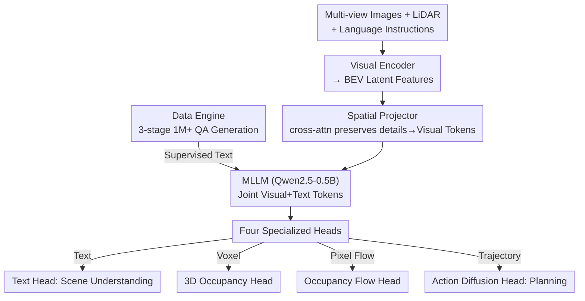

# DrivePI: Spatial-aware 4D MLLM for Unified Autonomous Driving Understanding, Perception, Prediction and Planning

**Conference**: CVPR 2026  
**Paper**: [CVF Open Access](https://openaccess.thecvf.com/content/CVPR2026/html/Liu_DrivePI_Spatial-aware_4D_MLLM_for_Unified_Autonomous_Driving_Understanding_Perception_CVPR_2026_paper.html)  
**Code**: https://github.com/happinesslz/DrivePI (To be open-sourced)  
**Area**: Autonomous Driving / Multimodal VLM  
**Keywords**: 4D MLLM, End-to-end driving, 3D occupancy, occupancy flow, VLA  

## TL;DR
DrivePI utilizes a Qwen2.5 backbone of only 0.5B parameters to integrate LiDAR point clouds, multi-view images, and language instructions into a single MLLM. Through four specialized heads, it simultaneously outputs scene descriptions, 3D occupancy, occupancy flow, and planned trajectories. This allows the VLA model to possess language interaction capabilities while recovering the fine-grained spatial perception typical of VA models. End-to-end joint training enables it to surpass 7B-scale VLA and specialized VA methods.

## Background & Motivation

**Background**: Current end-to-end autonomous driving follows two main paradigms. One is the VA (Vision-Action) model (e.g., UniAD, VAD), which uses LiDAR and images as input to produce action signals via a modular pipeline of "3D perception → prediction → planning," offering precise and interpretable spatial perception. The other is the VLA (Vision-Language-Action) model (e.g., OpenDriveVLA, ORION), which leverages MLLM reasoning to process multi-view images and language instructions for direct action generation, offering user-friendly, human-like decision-making.

**Limitations of Prior Work**: Both paradigms have significant drawbacks. VA models lack natural language interaction, making them unfriendly to users. VLA models, often relying solely on camera images and **lacking fine-grained intermediate 3D perception and prediction outputs**, cannot guarantee reliable outputs, compromising both interpretability and safety. The model effectively "decides" on an action without verifiable geometric intermediate quantities like occupancy.

**Key Challenge**: The "precise spatial perception" of VA and the "natural language interaction" of VLA have long been treated as mutually exclusive. The next-token prediction paradigm of VLA models is inherently difficult for directly outputting dense, pixel-level geometric results like 3D occupancy and occupancy flow—precisely the strengths of VA models.

**Goal**: To create a unified framework that **simultaneously** incorporates the precise spatial perception of VA and the language interaction of VLA into a single model, making intermediate products (3D occupancy, occupancy flow) visible and verifiable to ensure interactivity, interpretability, and safety.

**Key Insight**: The authors observe that spatial information is inherently contained within MLLM output features. By supplementing LiDAR for precise geometry and attaching specialized decoding heads to restore features into dense predictions, a language model can effectively perform dense perception tasks.

**Core Idea**: Unified driving tasks are treated as "coarse-grained language understanding + fine-grained spatial learning." A 4D MLLM (so named because it outputs both 3D occupancy and temporal flow) produces text, occupancy, flow, and trajectories in parallel through four heads, optimized via end-to-end joint training.

## Method

### Overall Architecture
The input to DrivePI includes multi-view images, LiDAR point clouds, and language instructions, while the output consists of scene description text + 3D occupancy + occupancy flow + planned trajectories. The pipeline follows a single-tower structure: "Encoding → Projection into visual tokens → Entry into MLLM with text tokens → Extraction by four heads." All tasks share the same MLLM parameters and are jointly optimized.

Specifically, a multimodal visual encoder compresses images and point clouds into compact BEV latent features $F_{bev}$. A **spatial projector** then maps BEV features into the language space to obtain visual tokens $F_v$. Visual and text tokens are concatenated and fed into a trainable MLLM (Qwen2.5-0.5B). The output tokens from the MLLM are distributed to four specialized heads: a text head for autoregressive scene understanding, a 3D occupancy head for voxel-level perception, an occupancy flow head for pixel-level motion prediction, and an action diffusion head for trajectory planning. Training data is automatically generated by a three-stage data engine.

### Key Designs

**1. LiDAR + Image Dual-Modality Input: Providing Precise Geometry to MLLM**

Mainstream VLAs typically rely only on camera images, forcing the model to guess depth and geometry, which results in inherent spatial reasoning deficiencies. DrivePI introduces LiDAR point clouds as a supplementary sensing modality. Point clouds provide precise 3D geometric information that cameras cannot, better "triggering" the MLLM's spatial understanding capabilities. The authors also note that LiDAR point clouds in nuScenes inherently contain temporal information, effectively bringing the time dimension into the model. The visual encoder encodes images and point clouds into unified BEV latent features, ensuring all subsequent tasks rely on the same geometry-aware representation.

**2. Spatial Projector: Compressing Tokens via Cross-Attention Without Losing Detail**

BEV feature maps usually exceed $100\times100$ in resolution. Feeding them directly into an MLLM at the pixel level would cause a computational explosion. The most direct method for efficiency is pooling: segmenting BEV features into $N$ patches of size $K\times K$ to obtain $F_{patch}\in\mathbb{R}^{N\times K^2\times C}$, which is then pooled into $F_{pool}\in\mathbb{R}^{N\times1\times C}$. However, pooling flattens fine-grained spatial information within the $K\times K$ region. DrivePI uses a cross-attention mechanism to "compensate": it uses the pooled $F_{pool}$ as the query and $F_{patch}$ as both the key and value:

$$F = \mathrm{CrossAttn}(Q{=}F_{pool},\ K{=}F_{patch},\ V{=}F_{patch})$$

This compresses each patch into a single token (controlling sequence length) while allowing the token to retrieve details from the original patch via attention. Finally, a linear layer aligns the channels to the MLLM hidden dimension $C_l$, resulting in visual tokens $F_v\in\mathbb{R}^{N\times C_l}$. This achieves a compromise between "token efficiency" and "spatial detail preservation."

**3. Fine-grained Visual Heads: Enabling Dense Geometric Prediction from Language Models**

While language descriptions excel at high-level semantics and global spatial relationships, they naturally lack precise geometric localization. Driving requires dense 3D occupancy and motion. DrivePI attaches three fine-grained visual heads (3D occupancy, occupancy flow, and action diffusion) on top of the MLLM to "translate" language space representations back into dense spatial predictions. The Mechanism: corresponding visual tokens $F'_v\in\mathbb{R}^{N\times C_l}$ are extracted from the multimodal representation, up-projected via a linear layer to $F^{out}_v\in\mathbb{R}^{N\times K^2C}$, and reshaped back into spatial feature maps $F_{out}\in\mathbb{R}^{H\times W\times C}$. This is the inverse operation of the patchify step, spreading "one token" back into its representative $K\times K$ spatial grid. Once the structured spatial feature map is obtained, it can be seamlessly connected to the three prediction heads like a standard VA model. This step is the key to fusing the VLA and VA paradigms: the MLLM handles understanding, while the visual heads ground that understanding into geometry.

**4. Three-Stage Data Engine: Converting Occupancy/Flow GT into Language QA**

For the MLLM to learn "spatial dynamics reasoning via text," a large amount of training data that verbalizes geometric ground truth is required. DrivePI designed a three-stage data pipeline to generate over 1 million QA pairs: ① **Scene Description**—Using InternVL3-78B to generate captions for front and rear view images separately (to avoid view confusion), then merging/refining them into a full scene description; ② **4D Spatial Understanding**—Creating text-occupancy/text-flow QA based on GT, with questions like "What occupies position (70, 120, 15)?" or "What is its velocity?", forcing the model to investigate dense occupancy and flow in text form; ③ **Planning Reasoning**—Generating text-planning QA based on future ego-trajectory labels to provide high-level driving commands and suggested trajectories. The final dataset includes 84K scene descriptions, 560K 4D spatial reasoning QA, 24K planning QA, and 377K from nuScenes-QA, totaling over 1.0M.

### Loss & Training
The total loss is a weighted sum of the four heads:

$$L_{total} = \lambda_1 L_{llm} + \lambda_2 L_{occ} + \lambda_3 L_{flow} + \lambda_4 L_{action}$$

Where $L_{llm}$ is the text head loss, $L_{occ}$ is occupancy, $L_{flow}$ is occupancy flow, and $L_{action}$ is action diffusion. All weights are set to 1. Training occurs in two stages: Stage I freezes the visual encoder and MLLM, training only the spatial projector on captions for 1 epoch for representation alignment. Stage II freezes the visual encoder and jointly optimizes the projector, MLLM, and all task heads for 1 epoch. Experiments were conducted on 8×NVIDIA L40S.

## Key Experimental Results

### Main Results

3D Occupancy and Occupancy Flow (OpenOcc val set, using only 0.5B backbone):

| Method | OccScore↑ | RayIoU↑ | mAVE↓ |
|------|-----------|---------|-------|
| FB-Occ | 39.2 | 39.0 | 0.591 |
| ALOcc-Flow-3D (Prev. SOTA) | 43.0 | 41.9 | 0.556 |
| **DrivePI** | **49.3** | **49.3** | **0.509** |

Ours outperforms FB-Occ by 10.3 RayIoU and exceeds the previous SOTA ALOcc-Flow-3D by 6.3 OccScore / 7.4 RayIoU, while reducing flow mAVE from 0.556 to 0.509—a 0.5B language model outperforming specialized VA occupancy models.

Planning (nuScenes val set, with/without ego status):

| Method | VLM | L2 avg(m)↓ | Col. avg(%)↓ |
|------|-----|-----------|--------------|
| VAD (no ego) | ✗ | 0.72 | 0.22 |
| ORION | ✓ | 0.34 | 0.37 |
| OpenDriveVLA-7B | ✓ | 0.66 | 0.25 |
| **DrivePI (with ego)** | ✓ | 0.40 | **0.11** |
| **DrivePI (no ego)** | ✓ | **0.49** | 0.38 |

With ego status, the collision rate is 0.11%, a ~70% reduction compared to ORION's 0.37%. Without ego status, the L2 error is 0.49m, ~32% lower than VAD's 0.72m. In text understanding (nuScenes-QA), DrivePI achieves 60.7% accuracy with 0.5B, 2.5% higher than OpenDriveVLA-7B's 58.2%.

### Ablation Study

Text head vs. Visual head (Table 5):

| Configuration | RayIoU↑ | mAVE↓ | L2↓ | Col.↓ | QA Acc↑ |
|------|---------|-------|-----|-------|---------|
| I Text head only | – | – | – | – | 61.2 |
| II Visual heads only | 47.5 | 0.69 | 1.02 | 0.39 | – |
| III Text+Visual (Full) | 49.3 | 0.51 | 0.49 | 0.38 | 60.7 |

Data Scaling (Table 6, Qwen2.5-3B text head only): Expanding occupancy QA from 28K to 560K improves occupancy status prediction accuracy by ~14% and category accuracy from 14.3% to ~44.9%.

### Key Findings
- **Unified training is mutually beneficial**: The full model (III) improves RayIoU by 1.8, reduces mAVE by 0.18, and reduces L2 by 0.52 compared to the visual-only model (II), while text accuracy only slightly decreases from 61.2 to 60.7. The authors attribute this to language supervision helping align features better for visual tasks.
- **Data scale is a bottleneck for spatial understanding**: The jump from 28K to 560K occupancy QA results in a ~30-point increase in category accuracy, showing 4D spatial reasoning's high dependence on the data engine.
- **Small models can outperform large models**: The 0.5B DrivePI outperforms specialized VAs in occupancy/flow and the 7B OpenDriveVLA in text, highlighting the effectiveness of "supplementing geometric input + attaching decoding heads + using verbalized geometric data."
- **Long-tail generalization**: Using only 20% data on WOD-E2E, DrivePI-vision achieved 7.52 RFS, validating adaptability in challenging scenarios.

## Highlights & Insights
- **"4D MLLM" is a strategic positioning**: It identifies that the weakness of VLA is not reasoning, but the lack of verifiable intermediate geometric quantities. By forcing the LM to output occupancy/flow, safety and interpretability are restored.
- **Spatial Projector's cross-attention is a reusable trick**: Using pooled results as queries to "fish for details" from original patches is applicable to any high-resolution multimodal scenario needing token compression.
- **Symmetric structure of patchify ↔ upsampling**: Compressing a $K\times K$ grid into one token and then up-projecting back allows seamless switching between language and dense prediction spaces.
- **Verbalizing geometry**: Using existing occupancy/flow GT to generate 1M QA pairs is a cost-effective way to leverage MLLM spatial capabilities.

## Limitations & Future Work
- The code is marked "Code will be available," but as of this note, it is not yet open-sourced. ⚠️ Refer to the original paper.
- Planning evaluation uses nuScenes open-loop metrics; gaps exist between open-loop L2/collision rates and real-world closed-loop safety.
- The performance gap with/without ego status suggests a reliance on ego information for planning metrics; while the authors avoid ego status to prevent shortcut learning, the best collision rates depend on it.
- Detail on occupancy flow and specific head structures are delegated to the supplement; some implementation specifics are unverified here. ⚠️ Refer to the original paper.
- The data scaling ablation used a 3B text-only model, which differs from the final 0.5B joint training setup.

## Related Work & Insights
- **vs. UniAD / VAD (VA models)**: These are precise but lack interaction; DrivePI maintains dense geometric output (even surpassing FB-Occ) while adding language capability.
- **vs. OpenDriveVLA / ORION (VLA models)**: These directly output actions but lack intermediate geometry. DrivePI reduces collision rates relative to ORION by 70% and outperforms the 7B OpenDriveVLA using only 0.5B parameters.
- **vs. Gemini Robotics-ER / Seed1.5-VL**: While those focus on "object-level bounding boxes/coarse relationships," DrivePI pushes spatial intelligence to voxel-level occupancy and pixel-level flow.

## Rating
- Novelty: ⭐⭐⭐⭐⭐ First unified framework to truly integrate VA's dense geometry and VLA's language interaction into a single 4D MLLM.
- Experimental Thoroughness: ⭐⭐⭐⭐ Covers occupancy, flow, planning, and text with solid ablations, though planning is restricted to open-loop.
- Writing Quality: ⭐⭐⭐⭐ Logical motivation and clear comparisons with VA/VLA, though some symbols are concise.
- Value: ⭐⭐⭐⭐⭐ 0.5B outperforming 7B models and specialized VAs sets a strong precedent for unified driving models with verifiable intermediates.

<!-- RELATED:START -->

## Related Papers

- [\[CVPR 2026\] Spatial Retrieval Augmented Autonomous Driving](spatial_retrieval_augmented_autonomous_driving.md)
- [\[CVPR 2026\] Unifying Language-Action Understanding and Generation for Autonomous Driving](unifying_language-action_understanding_and_generation_for_autonomous_driving.md)
- [\[CVPR 2026\] SpaceDrive: Infusing Spatial Awareness into VLM-based Autonomous Driving](spacedrive_infusing_spatial_awareness_into_vlm-based_autonomous_driving.md)
- [\[CVPR 2026\] GaussianDWM: 3D Gaussian Driving World Model for Unified Scene Understanding and Multi-Modal Generation](gaussiandwm_3d_gaussian_driving_world_model_for_unified_scene_understanding_and_.md)
- [\[ICLR 2026\] $AutoDrive\text{-}P^3$: Unified Chain of Perception-Prediction-Planning Thought via Reinforcement Fine-Tuning](../../ICLR2026/autonomous_driving/autodrivetext-p3_unified_chain_of_perceptionpredictionplanning_thought_via_reinf.md)

<!-- RELATED:END -->
