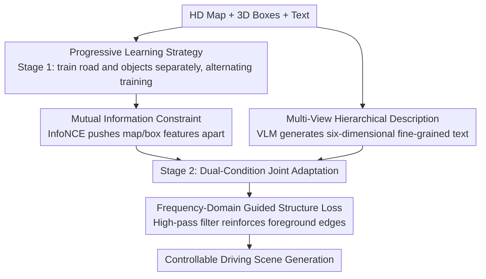

# DrivePTS: A Progressive Learning Framework with Textual and Structural Enhancement for Driving Scene Generation

**Conference**: CVPR 2026  
**Paper**: [CVF Open Access](https://openaccess.thecvf.com/content/CVPR2026/html/Wang_DrivePTS_A_Progressive_Learning_Framework_with_Textual_and_Structural_Enhancement_CVPR_2026_paper.html)  
**Code**: None  
**Area**: Autonomous Driving / Diffusion Models  
**Keywords**: Driving scene generation, progressive learning, geometric condition decoupling, multi-view fine-grained description, frequency-domain structural loss  

## TL;DR
DrivePTS addresses three major pain points in controllable autonomous driving scene generation: the coupling of maps and 3D boxes, coarse textual descriptions, and blurred foreground structures. It proposes a progressive training strategy that learns roads before objects (with mutual information constraints for decoupling), VLM-generated 6D multi-view descriptions, and frequency-guided structural loss. On nuScenes, it reduces FID to 11.45, increases road mIoU to 63.95, and successfully generates rare road conditions where previous methods failed.

## Background & Motivation
**Background**: Synthesizing diverse driving scenes using diffusion models is a crucial method for validating autonomous driving system robustness and performing data augmentation. Mainstream approaches (such as BEVControl, MagicDrive, PerLDiff, etc.) utilize HD maps and 3D bounding boxes as geometric conditions, combined with a text description, for conditional generation within diffusion models.

**Limitations of Prior Work**: The authors identify three specific issues. First, maps and 3D boxes are **jointly learned**, causing the model to overfit to their co-occurrence patterns—for instance, "a row of parked cars" always accompanies a "straight road," and "roadblocks" always accompany "no road." Consequently, when only the map layout is modified, the generator stubbornly refuses to change (as shown in Figure 1, where MagicDrive fails to generate the corresponding scene after a map change). Second, the default text descriptions in nuScenes are **short and view-agnostic**, containing only basic information and failing to characterize view-specific fine-grained environments, resulting in weak background modeling and high FID. Third, the standard denoising loss **uniformly weights all image regions**, neglecting foreground details and causing distorted or blurry edges for generated vehicles and roads.

**Key Challenge**: The root cause lies in "mixing multiple conditions and optimizing with a uniform target." Implicit dependencies between geometric conditions stem from joint learning; semantic poverty comes from coarse-grained captions; and structural blurring arises from spatially uniform losses. All three issues stem from treating elements that should be handled separately as a single unit.

**Goal**: To individually solve the sub-problems of condition decoupling, textual enhancement, and structural enhancement, and integrate them into a unified training objective.

**Key Insight**: A key observation is that humans understand driving scenes sequentially: first the road, then the objects on it. If the model is also forced to "learn the road first, then the objects" and explicitly pushes the features of these two conditions apart, the co-occurrence coupling can be broken.

**Core Idea**: Use "progressive phased learning + mutual information (MI) constraints" instead of "joint geometric condition learning" for decoupling; replace "coarse captions" with "VLM 6D multi-view descriptions" for semantic supplementation; and replace "uniform denoising loss" with "frequency-domain structural loss" for foreground structural enhancement.

## Method

### Overall Architecture
DrivePTS is built upon Stable Diffusion 2.1. Instead of using heavy ControlNet branches for geometric conditions, it employs lightweight **T2I-Adapters**: HD maps and 3D boxes are treated as image inputs and fed into their respective adapters to extract multi-scale features $F_c = T(C)$, which are then added scale-by-scale to the UNet encoder $\hat F^i_{enc} = F^i_{enc} + F^i_c$ ($i\in\{1,2,3,4\}$). This "branch-by-condition, additive injection" structure naturally fits the requirement of "treating the two geometric conditions separately."

The entire pipeline consists of three components: (1) A **progressive learning strategy** that splits map and box conditions into two training phases—first learning separately, then joint adaptation, with MI constraints added during the joint phase for further decoupling; (2) **VLM multi-view hierarchical descriptions**, which generate fine-grained text across six semantic dimensions offline for each view to replace original coarse captions; (3) **Frequency-guided structural loss**, which adds an extra term to the denoising loss specifically targeting high-frequency edges of roads and objects.

### Key Designs

**1. Progressive Learning Strategy: Road first, then objects, to break geometric co-occurrence coupling**

To address the overfitting to co-occurrence patterns caused by joint learning, the authors separate the two geometric conditions into different training phases. **Phase 1 (Separate Learning)**: First, **road generation** is performed using only HD maps and text as conditions, explicitly excluding areas occupied by traffic objects from the loss to focus on the road surface and background. Then, **object generation** is performed using 3D boxes and text, excluding non-object areas to focus on object placement and rendering. To prevent catastrophic forgetting of the road while learning objects, these two sub-tasks are **trained alternately** rather than sequentially. **Phase 2 (Joint Adaptation)**: Maps and boxes are fed simultaneously. The cross-view modules are frozen while only the two adapters are fine-tuned to adapt to concurrent inputs. In this way, each condition is fully and independently learned in an isolated environment before being merged in a controlled manner, ensuring that maps and boxes are no longer tethered together—the scene truly changes when the map is modified.

**2. Mutual Information Constraint: Explicitly pushing map and box features apart using InfoNCE**

Phased training alone is implicit; coupling might re-emerge during cross-view interactions in Phase 2 joint adaptation. The authors introduce a modified InfoNCE mutual information loss in Phase 2, treating the map feature $f_m$ and its corresponding box feature $f_b^+$ as a pair whose **similarity should be reduced**:

$$L_{MI} = \mathbb{E}_{(f_m, f_b^+)}\left[\log \frac{\exp(\text{sim}(f_m, f_b^+))}{\sum_{j=1}^{N}\exp(\text{sim}(f_m, f_{b,j}))}\right]$$

Note that this objective is **minimized**, meaning it lowers the similarity between $f_m$ and its corresponding box feature—opposite to the "pulling together positive pairs" direction in standard contrastive learning. The goal is to force each condition branch to focus on its own semantic content, thereby decoupling the two geometric conditions at the feature level. ⚠️ The formula is as cited; the sign/direction follows the original text.

**3. Multi-view Hierarchical Scene Description: Upgrading coarse captions to 6D fine-grained text using VLM**

To address the issue of short, view-agnostic captions, an open-source multimodal VLM (Qwen2.5-VL-72B) is used to re-label nuScenes offline. To suppress hallucinations and strengthen driving scene understanding, the VLM is first fine-tuned on driving domain data (DriveLM, nuScenes-OmniDrive) using LoRA, followed by DPO for reinforcement alignment. During generation, the VLM **observes six views simultaneously** to ensure cross-view consistency and outputs structured descriptions for each view across six semantic dimensions: **Time** (day/night/dusk, affecting lighting), **Weather** (sunny/cloudy/foggy/rainy/snowy, affecting visibility), **Road Type** (straight/left-turn/T-junction/roundabout), **Surroundings** (commercial/rural/residential/construction), **Objects** (dynamic/static objects like cars/pedestrians/signs/cones), and **Spatial Relations** (geometric relationships between objects). Each view thus receives view-specific, fine-grained text conditions capable of reconstructing complex environments, leading to a significant drop in FID.

**4. Frequency-guided Structural Loss: Focusing on foreground high-frequency edges using high-pass filtering**

To address the neglect of foreground structure in uniform denoising loss, the authors argue that high-quality scene generation requires not only filling regions with reasonable content but also accurately reconstructing edges and textures—which correspond to **high-frequency components**. Fourier transforms are used to extract high-frequency signals:

$$H(x) = \mathcal{F}^{-1}(M(\omega)\cdot \mathcal{F}(x)), \quad M(\omega) = \begin{cases} 0, & \|\omega\| \le \tau \\ 1, & \|\omega\| > \tau \end{cases}$$

Where $M(\omega)$ is a high-pass filter that retains only components with frequency magnitudes above a threshold $\tau$ (empirically set to 0.5). The structural loss is the L2 distance between the prediction and target in the high-frequency domain: $L_{freq} = \|H(x_{pred}) - H(x_{target})\|_2^2$. This is combined with the denoising loss and limited to road/object foregrounds via region masks to specifically enhance edge clarity in these areas.

### Loss & Training
The progressive training involves phased loss combinations. **Phase 1** road generation uses a map mask $M_{map}$ and background mask $M_{bg}$ to constrain the denoising loss, adding frequency loss to road areas: $L_{road} = L_{diff}\odot(M_{map}+M_{bg}) + \lambda_{freq}\cdot L_{freq}\odot M_{map}$. Object generation is constrained by the box mask $M_{box}$: $L_{object} = L_{diff}\odot M_{box} + \lambda_{freq}\cdot L_{freq}\odot M_{box}$ ($\odot$ denotes element-wise multiplication for regional weighting). **Phase 2** models the whole image without regional division and incorporates MI constraints: $L_{stage2} = L_{diff} + \lambda_{freq}\cdot L_{freq}\odot(M_{map}+M_{box}) + \lambda_{MI}\cdot L_{MI}$. Hyperparameters are $\lambda_{freq}=0.5, \lambda_{MI}=0.05$. Phase 1 involves 60k steps of separate learning; Phase 2 involves 10k steps of dual-condition adaptation. Optimizer is AdamW with a learning rate of $6\times10^{-5}$. Inference uses DDIM with 25 steps, CFG=3, and a resolution of $224\times480$.

## Key Experimental Results

### Main Results
Generated fidelity (FID) and controllability (NDS/mAP/mIoU measured using pretrained CVT and BEVFusion models) are compared on nuScenes (700 scenes for training / 150 for validation).

| Method | FID↓ | mAP↑ | NDS↑ | Road mIoU↑ | Vehicle mIoU↑ |
|------|------|------|------|-----------|-----------|
| MagicDrive | 16.20 | 12.30 | 23.32 | 61.05 | 27.01 |
| Panacea* | 16.96 | 11.65 | 22.40 | 57.11 | 22.77 |
| PerLDiff | 13.36 | 15.24 | 24.05 | 61.26 | 27.13 |
| **DrivePTS (Ours)** | **11.45** | **15.37** | **25.49** | **63.95** | **27.82** |

FID is reduced by approximately 16.7% compared to the previous SOTA, PerLDiff (13.36). Road mIoU outperforms the runner-up by 2.69 points, which the authors attribute to the "road-first-object-second" progressive strategy. Gains in mAP/NDS also indicate superior geometric alignment.

Value of Data Augmentation (Expanding CVT's BEV road segmentation training with synthetic validation sets, nuScenes test set):

| Training Config | Road mIoU↑ |
|----------|-----------|
| train | 65.83 |
| train + Real val (Upper Bound) | 67.53 |
| train + Synthetic val (MagicDrive) | 66.12 (-1.41) |
| train + Synthetic val (Panacea) | 66.60 (-0.93) |
| train + Synthetic val (PerLDiff) | 65.74 (-1.79) |
| train + Synthetic val (Ours) | **67.49 (-0.04)** |

The performance gain from DrivePTS synthetic data almost matches the real validation set (difference of only 0.04), significantly outperforming other generation methods.

### Ablation Study
The three major components are added sequentially: Multi-view Hierarchical Description (MHD), Frequency-Guided Structural Loss (FGSL), and Mutual Information Constraint (MIC).

| MHD | FGSL | MIC | FID↓ | Road mIoU↑ | Vehicle mIoU↑ |
|-----|------|-----|------|-----------|-----------|
| – | – | – | 15.10 | 59.77 | 25.80 |
| ✓ | – | – | 12.03 | 61.22 | 26.49 |
| – | ✓ | – | 14.47 | 62.92 | 26.95 |
| ✓ | ✓ | – | 11.68 | 63.60 | 27.16 |
| ✓ | ✓ | ✓ | **11.45** | **63.95** | **27.82** |

### Key Findings
- **MHD contributes most to realism (FID)**: Adding MHD alone reduces FID from 15.10 to 12.03, suggesting fine-grained text is the primary driver for reconstruction quality. Conversely, FGSL alone has limited impact on FID (14.47) but significantly improves controllability (road mIoU 62.92), confirming it governs structural edges rather than overall realism.
- **MIC acts as a "lubricant for joint adaptation"**: Adding MIC on top of MHD+FGSL yields stable but small gains (FID 11.68→11.45, road mIoU 63.60→63.95), suggesting its role is helping the model better accommodate concurrent map and box conditions.
- **Hyperparameter Sensitivity**: $\lambda_{freq}$ achieves optimal road/vehicle mIoU (63.60/27.16) at 0.5; excessive values (1.0) cause a drop to 61.95. $\lambda_{MI}$ is optimal at 0.05 (63.95/27.82) and decreases performance if increased further—both regularization terms require moderation.
- **Phase 1 Alternating Step Size**: Steps that are too short switch before current conditions are mastered, while steps that are too long cause catastrophic forgetting. The condition learned last in Phase 1 tends to be better preserved, which significantly affects final quality.
- **Generalization Highlight**: DrivePTS can generate rare road conditions where previous methods failed (the scene truly evolves with modified map layouts), directly validating the effectiveness of progressive decoupling.

## Highlights & Insights
- **Encoding domain priors into training curricula**: Using phased training + region masks to force a "road → objects" learning sequence is simpler than modifying network architecture but directly breaks co-occurrence coupling—this idea of "decoupling conditions via training order" is transferable to any multi-condition controllable generation task.
- **Reverse Mutual Information**: While standard contrastive learning pulls positive pairs closer, **minimizing** InfoNCE to push corresponding map/box features apart is counter-intuitive but perfectly aligns with the "decoupling" objective.
- **Engineering fine-grained captions into a 6D structure**: Rather than letting the VLM output freely, fixing slots for time/weather/road/environment/objects/spatial relations ensures coverage and cross-view alignment. Utilizing LoRA+DPO to suppress hallucinations is a practical data engineering approach.
- **Differentiating foreground in frequency loss**: Using high-pass filtering + regional masks to concentrate supervision on "high-frequency and critical" areas like road edges and object outlines is a low-cost, reusable trick for improving structural clarity.

## Limitations & Future Work
- The method is **tied to the six-camera layout of nuScenes and its specific map/object classes**; generalization to different sensor configurations or complex topologies remains unverified.
- Dependence on a 72B VLM (Qwen2.5-VL-72B) for offline labeling, plus LoRA+DPO fine-tuning, entails **high data preparation costs** and a high barrier to reproduction.
- The gains from the MI constraint in Phase 2 are relatively small (only 0.23 FID, 0.35 mIoU). ⚠️ Its cost-effectiveness compared to the other two components is questionable at different data scales.
- The pipeline remains complex, involving two phases and multiple losses/hyperparameters ($\lambda_{freq}$, $\lambda_{MI}$, alternating steps). Developing an end-to-end single-stage implementation that achieves the same decoupling is a valuable future direction.

## Related Work & Insights
- **vs MagicDrive / BEVControl**: These methods feed maps and 3D boxes as **joint** geometric conditions, leading to co-occurrence coupling where scenes fail to follow map changes. Ours uses progressive phasing + MI for explicit decoupling, leading in FID (11.45 vs 16.20) and controllability, especially for rare road conditions.
- **vs PerLDiff (Prev. SOTA)**: PerLDiff is already strong in fidelity (FID 13.36), but Ours further reduces FID by ~16.7% through fine-grained MHD text and gains 2.69 points in road mIoU, demonstrating that benefits from semantic text and structural loss are orthogonal to geometric condition modeling.
- **vs ControlNet path**: The authors intentionally avoid ControlNet's heavy parallel branches (which significantly increase compute for dual conditions), opting for lightweight T2I-Adapters with additive condition injection to better fit the "separate handling of conditions" design.
- **vs SubjectDrive / DriveEditor / SceneCrafter / MVPbev**: These focus on object replacement/insertion/deletion and attribute or view editing but **neglect map editing**, limiting road network topology diversity. Ours fills the gap of "correct generation following map layout changes."

## Rating
- Novelty: ⭐⭐⭐⭐ The combination of progressive decoupling + reverse MI + 6D VLM description + frequency structural loss targets true pain points, though individual components are clever assemblies of existing ideas.
- Experimental Thoroughness: ⭐⭐⭐⭐ Main results, data augmentation, three-component ablation, and double hyperparameter/step sensitivity are all present, although only validated on the nuScenes dataset.
- Writing Quality: ⭐⭐⭐⭐ Clear mapping between pain points, methods, and experiments; the three innovations correspond directly to the three identified problems.
- Value: ⭐⭐⭐⭐ Controllable driving scene generation + data augmentation approaching real validation set performance offers direct utility for autonomous driving simulation and perception training.

<!-- RELATED:START -->

## Related Papers

- [\[CVPR 2026\] MindDriver: Introducing Progressive Multimodal Reasoning for Autonomous Driving](minddriver_introducing_progressive_multimodal_reasoning_for_autonomous_driving.md)
- [\[CVPR 2026\] RAG-TP: A General Framework for Vehicle Trajectory Prediction via Retrieval-Augmented Generation](rag-tp_a_general_framework_for_vehicle_trajectory_prediction_via_retrieval-augme.md)
- [\[NeurIPS 2025\] SPIRAL: Semantic-Aware Progressive LiDAR Scene Generation and Understanding](../../NeurIPS2025/autonomous_driving/spiral_semantic-aware_progressive_lidar_scene_generation_and_understanding.md)
- [\[CVPR 2026\] GaussianDWM: 3D Gaussian Driving World Model for Unified Scene Understanding and Multi-Modal Generation](gaussiandwm_3d_gaussian_driving_world_model_for_unified_scene_understanding_and_.md)
- [\[CVPR 2026\] Recover to Predict: Progressive Retrospective Learning for Variable-Length Trajectory Prediction](recover_to_predict_progressive_retrospective_learning_for_variable-length_trajec.md)

<!-- RELATED:END -->
