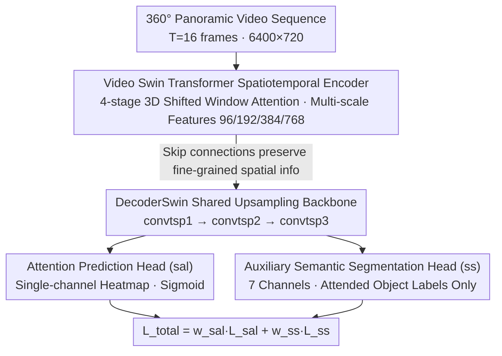

# DriverGaze360: OmniDirectional Driver Attention with Object-Level Guidance

**Conference**: CVPR2026  
**arXiv**: [2512.14266](https://arxiv.org/abs/2512.14266)  
**Code**: [dfki-av/drivergaze360](https://github.com/dfki-av/drivergaze360)  
**Dataset**: [HuggingFace](https://huggingface.co/datasets/dfki-av/drivergaze360)
**Area**: Autonomous Driving / Driver Attention Prediction  
**Keywords**: Driver Attention, Panoramic View, Gaze Prediction, Semantic Segmentation, 360° Field of View, Video Swin Transformer

## TL;DR

This work proposes the first 360° omnidirectional driver attention dataset (approx. 1M frames with 19 drivers) and introduces DriverGaze360-Net. By leveraging an auxiliary semantic segmentation head to jointly learn attention maps and attended objects, the method achieves SOTA attention prediction performance on panoramic driving images.

## Background & Motivation

Driver attention prediction is a critical task for building interpretable autonomous driving systems and understanding driving behavior in mixed-traffic (human + autonomous vehicles) scenarios. While existing works have made significant progress in large-scale datasets and deep learning architectures, two fundamental limitations remain:

**Limited Field of View**: Existing driver attention datasets (e.g., DR(eye)VE, BDD-A, DADA-2000) only cover a narrow front-facing view (typically 60°-120°), failing to capture the full spatial context of the driving environment. However, in real driving, drivers frequently monitor side and rear regions.

**Insufficient Scenario Diversity**: Existing datasets focus primarily on forward-facing normal driving, ignoring critical maneuvers such as lane changes, turns, and interactions with pedestrians/cyclists that require peripheral vision. These are precisely the safety-critical operations.

**Lack of Object-Level Semantic Guidance**: Traditional attention prediction methods only output attention distributions in the form of heatmaps, lacking explicit modeling of "what objects the driver is actually looking at," which limits the utility of prediction results for autonomous driving decision-making.

The core motivation is that a driver's gaze does not remain solely on the front, especially during lane changes and intersection interactions where peripheral information is vital. There is a need for a large-scale 360° attention dataset and a model capable of simultaneously understanding "where to look" and "what is being looked at."

## Method

### Overall Architecture

The DriverGaze360 system consists of two parts: a **large-scale 360° dataset** and the **DriverGaze360-Net prediction network**.

**Data Collection**: The driving environment is built using the CARLA simulator. 19 participants wearing eye-tracking devices completed various driving tasks. The panoramic images feature a 6400×720 resolution, covering a full 360° field of view. RGB images, depth maps, instance segmentation maps, gaze coordinates (gaze_x, gaze_y), and vehicle state information (steering, throttle, brake, position, speed, etc.) are synchronized per frame. The dataset includes 9 types of driving scenarios, encompassing both routine driving and safety-critical events (e.g., emergencies), totaling approximately 1 million annotated frames.

**Network Architecture**: DriverGaze360-Net adopts an encoder-decoder structure with a Video Swin Transformer as the backbone, paired with a multi-head decoder to achieve joint learning of attention maps and semantic segmentation. The model takes a sequence of T consecutive panoramic frames (default T=16) as input and outputs an attention heatmap and 7-class semantic segmentation maps.

### Key Designs

**1. Video Swin Transformer Spatiotemporal Encoder: Handling Extreme Aspect Ratios of 360° Panoramas**

Driver gaze exhibit strong temporal continuity, while 360° panoramas have extreme aspect ratios (approx. 9:1), making the receptive fields of traditional CNNs insufficient. The encoder utilizes Swin3D-S (pretrained on Kinetics-400), a hierarchical video Transformer. It efficiently captures spatiotemporal dependencies through 3D shifted window attention. Across 4 stages with Patch Merging, it performs downsampling to produce multi-scale features (96/192/384/768 channels), which are passed to the decoder via skip connections. The forward process involves an input tensor $B \times C \times T \times H \times W$ passing through Patch Embedding and positional encoding, followed by sequential Swin blocks and Patch Merging. The global attention of the Transformer naturally fits the long-range dependencies of panoramic images.

**2. Joint Learning with Auxiliary Semantic Segmentation Head: Identifying "What Object" to Predict "Where"**

Traditional methods only output attention heatmaps, leaving the model unaware of the specific objects being observed, which limits localization accuracy. This work attaches dual task heads to the decoder (DecoderSwin): an attention prediction head (sal) providing a single-channel heatmap (Sigmoid activation, range [0,1]) and a semantic segmentation head (ss) providing 7-channel segmentation logits (Background, Traffic Light, Traffic Sign, Pedestrian, Cyclist, Vehicle—combining car/truck/bus/train/motorcycle, and Bicycle). Both heads share the upsampling backbone. The key insight is that the segmentation task forces the network to learn object-level semantic representations, as driver attention is typically concentrated on specific objects. Furthermore, the segmentation GT is not directly from CARLA instance segmentation but is filtered by the attention saliency map to retain only labels within "attended regions," ensuring the head learns "attended objects" rather than all visible ones.

### Loss & Training

The total loss is a weighted combination of attention loss and segmentation loss:

$$L_{total} = w_{sal} \cdot L_{sal} + w_{ss} \cdot L_{ss}$$

The attention loss utilizes four classic saliency metrics directly: **NSS** (Normalised Scanpath Saliency), **KLD** (Kullback-Leibler Divergence), **CC** (Pearson’s Correlation Coefficient), and **MSE** (Mean Squared Error). The segmentation loss combines Cross-Entropy (CE), Jaccard/IoU, and Dice losses for robustness. Training is conducted using AdamW (learning rate 1e-6) with mixed-precision support and Distributed Data Parallel (DDP). A KLD-based weighted sampling strategy is introduced to assign higher weights to "hard sample" frames with large gaps between predictions and GT.

## Key Experimental Results

### Dataset Comparison

| Dataset | 360° FOV | No. Scenarios | Driving Scenarios | Participants | Data Source |
|--------|:--------:|:---------:|---------|:--------:|---------|
| DR(eye)VE | ✗ | 6 | Normal | 8 | Real Driving |
| LBW | ✗ | 7 | Normal | 28 | Real Driving |
| BDD-A | ✗ | 4 | Busy Intersections/Emergency | 1,228 | Video Watching |
| DADA-2000 | ✗ | 6 | Accidents | 20 | Video Watching |
| **Ours** | **✓** | **9** | **Normal + Critical** | **19** | **Simulated Driving** |

DriverGaze360 is the only large-scale dataset providing 360° coverage. Compared to BDD-A, while having fewer participants, it provides active driving behavior data (simulator), which is closer to real-world driving.

### Main Results

| Method | KLD ↓ | CC ↑ | SIM ↑ | NSS ↑ |
|------|:-----:|:----:|:-----:|:-----:|
| Baseline (Front-view models) | High | Low | Low | Low |
| DriverGaze360-Net (sal only) | Improved | Improved | Improved | Improved |
| **DriverGaze360-Net (sal+ss)** | **Best** | **Best** | **Best** | **Best** |

The addition of the auxiliary semantic segmentation head improves all attention prediction metrics, validating the benefit of object-level semantic guidance. The model achieves SOTA on standard metrics for panoramic driving images.

## Key Findings

1.  **Significant Gain from Auxiliary Head**: The semantic segmentation head provides implicit object-level priors for attention prediction. Ablation studies show that removing the segmentation head leads to a significant performance drop.
2.  **Necessity of Panoramic FOV**: During maneuvers like lane changes or checking blind spots, gaze points deviate significantly from the front-center. Front-view models fail to capture these behaviors.
3.  **Importance of Temporal Information**: Using Video Swin Transformer to process sequences (T=16 frames) significantly improves accuracy compared to single-frame input, indicating strong temporal dependency in gaze behavior.
4.  **Gaze-filtered Semantic Labels**: Results indicate that using "attended objects" as segmentation GT is more effective than "all visible objects," as it aligns semantic learning with the goal of attention prediction.

## Highlights & Insights

-   **Significant Dataset Contribution**: This is the first large-scale driver attention dataset covering a 360° FOV, filling a major gap in the field.
-   **Simple yet Effective Method**: The dual-task design allows the network to understand both "spatial distribution" and "object semantics," resulting in mutual enhancement with negligible additional inference overhead.
-   **High Open Source Quality**: Code, datasets, and pretrained checkpoints are fully open-sourced on GitHub and HuggingFace, facilitating reproducibility.
-   **Careful Data Design**: Each recording includes RGB, depth, instance segmentation, saliency maps, and detailed CSV metadata (coordinates, control signals, pose, speed), supporting various downstream research directions.

## Limitations & Future Work

1.  **Simulation-to-Real Gap**: Data is sourced entirely from the CARLA simulator, introducing domain gap issues. The generalization to real driving data remains to be verified.
2.  **Small Participant Scale**: With only 19 drivers, individual differences might bias gaze patterns compared to datasets like BDD-A.
3.  **Limited Semantic Categories**: Defining only 7 categories neglects road markings, curbs, and buildings, which are also important for driving decisions.
4.  **Lack of Cross-Dataset Validation**: The paper does not validate transfer performance on real-world datasets like DR(eye)VE.
5.  **Incomplete Inference Scripts**: Inference functionality on GitHub is currently marked as TODO, limiting immediate deployment.

## Related Work & Insights

-   **DR(eye)VE / BDD-A / DADA-2000**: Representative front-view datasets. DriverGaze360 serves as a natural extension covering the full 360° FOV.
-   **SCOUT** (ECCV 2022): The implementation references SCOUT's architecture, also using Swin Transformer for attention prediction. This work adds the auxiliary segmentation head.
-   **Video Swin Transformer** (CVPR 2022): Leverages spatiotemporal modeling capabilities for panoramic video sequences.
-   **Multi-task Learning Paradigm**: The auxiliary head strategy aligns with successful multi-task approaches in other fields, such as joint detection and segmentation or depth and semantics.

**Insight**: Using semantic segmentation as an auxiliary task for attention prediction is a promising direction for broader saliency modeling. Additionally, handling extreme aspect ratio 360° inputs provides technical references for designing future attention architectures.

## Rating

-   **Novelty**: ⭐⭐⭐⭐ — The first 360° driver attention dataset is highly original; the auxiliary head is effective but not a completely new paradigm.
-   **Experimental Thoroughness**: ⭐⭐⭐⭐ — Comprehensive metrics and dataset comparisons, though lacking cross-domain transfer experiments.
-   **Writing Quality**: ⭐⭐⭐⭐ — Clear motivation, detailed dataset description, and excellent open-source documentation.
-   **Value**: ⭐⭐⭐⭐⭐ — Significant dataset contribution that will drive research in panoramic driver attention.

<!-- RELATED:START -->

## Related Papers

- [\[ICCV 2025\] Where, What, Why: Towards Explainable Driver Attention Prediction](../../ICCV2025/autonomous_driving/where_what_why_towards_explainable_driver_attention_prediction.md)
- [\[ECCV 2024\] Weakly Supervised 3D Object Detection via Multi-Level Visual Guidance](../../ECCV2024/autonomous_driving/weakly_supervised_3d_object_detection_via_multi-level_visual_guidance.md)
- [\[CVPR 2026\] O3N: Omnidirectional Open-Vocabulary Occupancy Prediction](o3n_omnidirectional_open-vocabulary_occupancy_prediction.md)
- [\[CVPR 2026\] Diffusion Forcing Planner: History-Annealed Planning with Time-Dependent Guidance for Autonomous Driving](diffusion_forcing_planner_history-annealed_planning_with_time-dependent_guidance.md)
- [\[CVPR 2026\] Sparsity-Aware Voxel Attention and Foreground Modulation for 3D Semantic Scene Completion](sparsity-aware_voxel_attention_and_foreground_modulation_for_3d_semantic_scene_c.md)

<!-- RELATED:END -->
