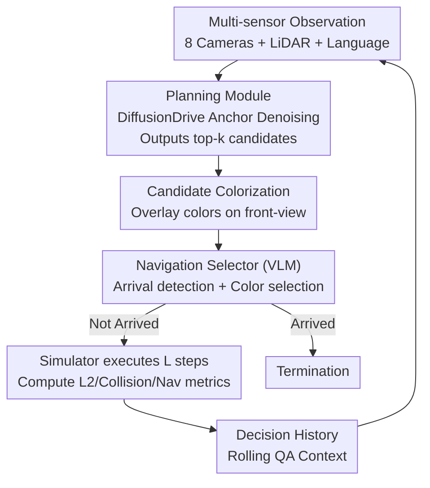

# DriveVLN: Towards Mapless Vision-and-Language Navigation in Autonomous Driving

**Conference**: CVPR 2026  
**Paper**: [CVF Open Access](https://openaccess.thecvf.com/content/CVPR2026/html/Guo_DriveVLN_Towards_Mapless_Vision-and-Language_Navigation_in_Autonomous_Driving_CVPR_2026_paper.html)  
**Code**: None (Not publicly available)  
**Area**: Autonomous Driving / Vision-and-Language Navigation (VLN)  
**Keywords**: Mapless Driving, Vision-and-Language Navigation, Closed-loop Simulation, Candidate Trajectory Selection, GRPO Reinforcement Learning  

## TL;DR
DriveVLN migrates "Vision-and-Language Navigation" to autonomous driving: in scenarios without high-definition maps and given only destination-level instructions (e.g., "go to the exit/charging pile"), it enables vehicles to find their way using visual cues and historical decisions. The authors reconstructed 200 real-world scenes in CARLA to create a closed-loop benchmark and established a baseline using a "Planning Module for candidates + VLM for trajectory selection + Two-stage training (SFT→GRPO RL)" approach. The resulting Driving Score of 0.67 outperforms Seed-1.6 and GPT-5.

## Background & Motivation
**Background**: Current autonomous driving is highly reliable in road networks with HD maps, where end-to-end planning and integrated perception-prediction perform well. Language-guided driving (e.g., DriveLM, LMDrive, DriveVLM) has also begun integrating language into driving policies, but most are open-loop VQA-style explanations or still rely on navigation map priors.

**Limitations of Prior Work**: Systems fail when maps are missing—a typical scenario being indoor parking lots. Without precise geographic and routing information, the system does not know where to turn at intersections. While VLN in robotics could bridge this gap, it assumes **step-by-step detailed** instructions (e.g., "walk through the hall, turn slightly right, enter the second bedroom"). In reality, drivers face the opposite: **they know where to go, but not how to get there**, as no one provides turn-by-turn descriptions for every fork in a parking lot beforehand.

**Key Challenge**: Traditional VLN relies on "step-by-step instructions + indoor static observations," whereas mapless driving only provides "coarse destination-level instructions + implicit visual cues (signs, landmarks, text labels)" along the route, while requiring actual vehicle control to ensure safety. The granularity of instructions, environment morphology, and task execution are misaligned, preventing direct application of VLN.

**Goal**: To define a new task—navigating safely to a destination under mapless conditions using only a destination description and onboard vision—and providing a benchmark for closed-loop evaluation of "navigation accuracy + driving safety" along with a functional baseline.

**Key Insight**: Experienced human drivers can interpret "Exit" signs in parking lots and follow arrows to infer the correct lane. The authors hypothesize that models can learn this ability to "read visual cues + combine history to infer turns." Thus, decision-making is decomposed into two tasks: determining arrival and selecting branches at intersections.

**Core Idea**: Decouple "continuous vehicle control" into "a planning module enumerating feasible candidate trajectories → a VLM selector reading language instructions and vision to pick a trajectory toward the destination." Reinforcement learning is used to help the selector utilize its decision history to compensate for the lack of navigation priors in the current frame.

## Method

### Overall Architecture
DriveVLN consists of two components: a **new task/benchmark** (formalizing mapless VLN, data generation, and evaluation) and a **baseline model** (planning module + navigation selector + two-stage training).

The task is formalized as an option-based Partially Observable Markov Decision Process (POMDP). At each timestep $t$, the ego state is $s_t=(x_t, c_t, g_t)$, where $x_t$ is the pose, $c_t$ is the driving command, and $g_t\in\{0,1\}$ is the arrival flag (termination condition). The agent makes decisions based on history $h_t=(T, o_{0:t}, a_{0:t-1})$ (where $T$ is the text instruction, $o$ the rendered observation, and $a$ the action). Crucially, the **action space is not continuous control variables, but a set of candidate trajectories** $\mathcal{A}_t=\{\omega_t^k\}_{k=1}^K\sim\mathcal{P}(o_t)$ generated by the planner. The selector uses policy $\pi_\theta(\omega\mid h_t,\mathcal{A}_t)$ to pick one, which the simulator executes for $L$ steps. When candidates degenerate into a single external fine route, this collapses back to traditional VLN, making it a strict generalization.

The runtime data flow is a chain with historical loops: multi-sensor observations → planning module outputs top-k candidates → candidates are colorized on the front-view image → navigation selector (VLM) determines arrival or chooses a color → the corresponding trajectory is executed by the simulator to calculate metrics → decisions enter a rolling history for the next round.

### Key Designs

**1. Task Formalization: Mapping Mapless VLN to Option-based POMDP + Road Topology Graph**

To address the lack of prior and continuous control in mapless driving, the authors avoid direct regression of steering angles. Instead, they discretize the decision space into "choosing one of the candidates provided by the planner." On straight roads, the task simplifies to "determining arrival"; at intersections, it requires "selecting the correct branch based on language and vision." To support the latter, they fuse lane centerlines and intersection geometry into a road topology decision graph $G=(v,e)$. **Decision nodes** are defined as ego poses before entering an intersection; each node connects to several candidate branches, instantiated by lane centerline segments. Choosing a fork becomes selecting an edge on the graph, which is easier to learn and allows ground-truth paths using shortest-path algorithms.

**2. Topo2Sim Data Pipeline: Automated Digital Twin Generation from Real Road Scans**

Since no dataset existed for mapless VLN, the authors built a three-stage pipeline in CARLA. ① **Scene Asset Generation**: Starting from real-vehicle topology (centerlines, connectivity, stalls, obstacles, POIs in WGS84), they perform coordinate normalization (metric conversion → simulator frame → outlier removal + resampling). Using the Frenet frame along centerline $C_e:s\mapsto(x(s),y(s))$, they calculate lane boundaries $B^{\pm}(s)=C_e(s)\pm\frac{1}{2}w(s)\mathbf{N}(s)$ and maintain intersection connectivity to create a routable directed multigraph. ② **Automated Augmentation**: GPT-4 generates diverse paraphrases of instructions based on intent keywords. Obstacles, markings, and signs are placed via rule-based stochastic processes. ③ **Collection & Annotation**: Aligning with NAVSIM protocols, they use 8 RGB cameras and 1 LiDAR. Optimal paths are computed as shortest paths on $G$. Straight roads are recorded at 2 Hz, while intersections capture keyframes with all feasible paths projected onto the front view for supervision.

**3. Planning Module + Navigation Selector: Decoupling Feasibility from Intent**

These baseline components decouple "vehicle control" from "pathfinding." The **Planning Module** (DiffusionDrive) samples noisy trajectories from anchored Gaussian distributions and denoises them given egocentric RGB + LiDAR. The top-k candidates form the action space $\mathcal{A}_t$. These candidates **encode traversability only and are destination-agnostic** (8 waypoints per 4s, NAVSIM-aligned). This separates planning from language understanding. The **Navigation Selector** (fine-tuned Qwen2.5-VL-3B) overlays colorized trajectories on the front view. Given the instruction, it determines if the destination is reached; otherwise, it **outputs the color of the selected path**. A rolling context of vision and history ensures decision consistency.

**4. Two-stage Training: Trajectory Foundry (SFT) + Policy Tempering (GRPO RL)**

SFT models often fail to utilize history or eliminate ambiguity in mapless scenarios (SFT-only DS 0.49). The two-stage solution: ① **Trajectory Foundry**: The planner is trained on augmented scenes with random start-end points to learn "feasible but destination-agnostic" trajectories. The selector undergoes LoRA fine-tuning on discrete single-frame data with a fixed output format "(Arrived/Not); (Color i)". ② **Policy Tempering**: Reinforcement learning (GRPO) enables the selector to bridge current frame information gaps using its decision history.

Reward components: **Local reward** for step-wise comfort and safety ($S_t^{match}$ via normalized $L2$ distance to GT and $S_t^{safe}$ via collision gating). **Global reward** calculated after $M$ interactions, measuring route consistency with the shortest path via prefix matching ($S_{prefix}$) and edge overlap ($S_{overlap}$):
$$\mathcal{R}_{global}=\alpha_1 S_{prefix}+\alpha_2 S_{overlap}+\alpha_3\mathbf{1}[arrived]$$
Total reward $\mathcal{R}_t=\lambda\mathcal{R}_{local}+(1-\lambda)\mathcal{R}_{global}$. The goal is to maximize discounted returns with KL regularization to the SFT policy $\pi_0$:
$$\max_\theta J(\theta)=\mathbb{E}\Big[\textstyle\sum_{t}\gamma^t R_t\Big]-\beta\,\mathbb{E}\big[\mathrm{KL}(\pi_\theta\,\|\,\pi_0)\big]$$

## Key Experimental Results

### Main Results
Evaluation combines VLN metrics (Success Rate SR, Navigation Error NE) and driving metrics (Collision, L2) into a Driving Score: $D=RC\cdot IP$, where $RC$ is completion and $IP$ is infraction penalty.

| Model (Selector) | Driving Score ↑ | SR ↑ | NE ↓ | Avg L2 (m) ↓ | Avg Collision (%) ↓ |
|--------|------|------|------|------|------|
| Seed-1.6 | 0.60 | 0.38 | 0.56 | 0.316 | 0.101 |
| GPT-5 | 0.48 | 0.23 | 0.56 | 1.550 | 0.170 |
| Qwen2.5-VL-72B | 0.45 | 0.21 | 0.59 | 1.868 | 0.240 |
| **DriveVLN (Ours, Qwen2.5-VL-3B)** | **0.67** | **0.44** | **0.49** | **0.283** | **0.096** |

The 3B fine-tuned model outperforms large models like GPT-5 and Qwen2.5-VL-72B. However, SR remains below 0.5, indicating significant room for improvement.

### Ablation Study

| Training Stage | Planner | DS ↑ | SR ↑ | NE ↓ | L2 ↓ | Collision ↓ |
|------|------|------|------|------|------|------|
| SFT | DiffusionDrive | 0.49 | 0.21 | 0.53 | 0.457 | 0.107 |
| **SFT+RL** | DiffusionDrive | **0.67** | **0.44** | **0.49** | **0.283** | **0.096** |

### Key Findings
- **Policy Tempering (RL) is the primary driver**: RL improved DS from 0.49 to 0.67, proving that global consistency rewards help the model utilize history.
- **Small Task-Specific Models > Large General Models**: The 3B specialized version beats 72B/GPT-5 models, suggesting mapless VLN is a domain-specific skill.
- **Parking Lot Long-tails are difficult**: Arrival detection remains unstable for complex parking scenarios (e.g., Qwen72B's 1.34% accuracy for specific stalls).

## Highlights & Insights
- **Control as a "Color Selection Problem"**: Turning continuous control into a discrete choice among feasible candidates stabilizes the VLM and decouples reasoning from dynamics.
- **Mathematical Unification**: The option-based POMDP provides a strict generalization of traditional VLN, allowing for more rigorous theoretical analysis.
- **Dual-Reward Mechanism**: Combining local safety with global route consistency is a portable strategy for closed-loop navigation RL.

## Limitations & Future Work
- **Overall Arrival Rate is Low (<0.5)**: The task remains challenging and far from deployment-ready.
- **Scenario Diversity**: Data is primarily from indoor/parking mapless environments; generalization to open-road urban networks is unverified.
- **Hyperparameter Sensitivity**: The paper lacks a detailed sensitivity analysis for reward weights ($\alpha, \lambda, \omega$).
- **Future Work**: Expansion to larger real-world datasets and larger LLMs for better reasoning.

## Related Work & Insights
- **vs. Traditional VLN**: DriveVLN moves from static indoor scenes and fine instructions to dynamic AD with coarse instructions.
- **vs. Language-Guided Driving**: Most prior works are open-loop VQA; DriveVLN focuses on mapless grounding and full closed-loop rollout.
- **vs. Driving Benchmarks**: While benchmarks like Bench2Drive exist, they do not specifically evaluate VLN in mapless contexts.

## Rating
- Novelty: ⭐⭐⭐⭐⭐ (First to bring mapless destination-level VLN to AD with a closed-loop benchmark)
- Experimental Thoroughness: ⭐⭐⭐⭐ (Comprehensive baselines and ablation, though arrival rates are low)
- Writing Quality: ⭐⭐⭐⭐ (Clear motivation and rigorous formalization)
- Value: ⭐⭐⭐⭐⭐ (Establishes a solid framework for language-driven mapless navigation)

<!-- RELATED:START -->

## Related Papers

- [\[CVPR 2026\] VGGDrive: Empowering Vision-Language Models with Cross-View Geometric Grounding for Autonomous Driving](vggdrive_empowering_vision-language_models_with_cross-view_geometric_grounding_f.md)
- [\[CVPR 2026\] DriveMoE: Mixture-of-Experts for Vision-Language-Action Model in End-to-End Autonomous Driving](drivemoe_mixture-of-experts_for_vision-language-action_model_in_end-to-end_auton.md)
- [\[CVPR 2026\] EventDrive: Event Cameras for Vision-Language Driving Intelligence](eventdrive_event_cameras_for_vision-language_driving_intelligence.md)
- [\[CVPR 2026\] WalkGPT: Grounded Vision-Language Conversation with Depth-Aware Segmentation for Pedestrian Navigation](walkgpt_grounded_vision-language_conversation_with_depth-aware_segmentation_for_.md)
- [\[CVPR 2026\] HybridDriveVLA: Vision-Language-Action Model with Visual CoT reasoning and ToT Evaluation for Autonomous Driving](hybriddrivevla_vision-language-action_model_with_visual_cot_reasoning.md)

<!-- RELATED:END -->
