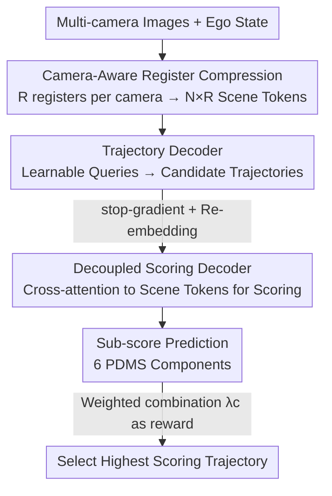

# Driving on Registers (DrivoR)

**Conference**: CVPR 2026  
**Paper**: [CVF Open Access](https://openaccess.thecvf.com/content/CVPR2026/html/Kirby_Driving_on_Registers_CVPR_2026_paper.html)  
**Code**: Yes (Code and checkpoints released on project page)  
**Area**: Autonomous Driving  
**Keywords**: End-to-End Driving, Register Token Compression, Trajectory Scoring, ViT Backbone, Tunable Behavior  

## TL;DR
DrivoR utilizes a pure transformer end-to-end driving architecture. It adds a set of learnable register tokens to each camera to compress thousands of ViT visual tokens into dozens of "scene tokens." Two decoupled decoders are then used for generating and scoring candidate trajectories. With only approximately 40M parameters, DrivoR matches or exceeds heavier baselines on NAVSIM-v1/v2 and closed-loop HUGSIM.

## Background & Motivation
**Background**: End-to-end (E2E) driving maps sensors and ego-vehicle states directly to driving decisions, eliminating intermediate annotations like 3D boxes or maps. "Trajectory proposal + scoring" methods are among the strongest—the network outputs multiple candidate trajectories, and a scorer selects the best one, explicitly modeling the multi-modality and uncertainty of driving.

**Limitations of Prior Work**: The computational load of these methods is almost entirely concentrated in the perception backbone. Whether using CNNs like VoV-Net or large ViTs like EVA and DINO, these models output **thousands of tokens** per frame. The scoring stage requires repeated cross-attention between these thousands of tokens and **hundreds** of candidate trajectories. The token count scales linearly with resolution and the number of cameras, creating the primary computational bottleneck in E2E pipelines.

**Key Challenge**: Common efficiency strategies involve spatial pooling of feature maps. However, pooling has two major flaws: it imposes rigid requirements on input resolution and **treats all tokens equally**. Applying the same averaging operation to front-view and rear-view cameras discards the driving prior that "forward information is significantly more important than rear/side information." Thus, a trade-off exists between "reducing tokens for efficiency" and "preserving planning-relevant information."

**Goal**: Without introducing BEV, relying on large trajectory dictionaries, or requiring 3D supervision, this work answers the question: "How many tokens are truly needed to represent a driving scene?" and aims to compress the perception backbone for real-time performance.

**Key Insight**: ViT architectures already include register tokens (originally introduced to fix attention sinks). Works like TiTok have demonstrated their utility as compact scene descriptors. The authors "re-purpose" this structure for driving: since registers can learn compressed representations, they can serve as the compression interface for the scene.

**Core Idea**: Replace uniform pooling with a **per-camera set of learnable register tokens** to compress visual features into a few "camera-aware" scene tokens. This is paired with a **scorer decoupled from generation**, allowing the same model to select trajectories according to different behavioral preferences during inference.

## Method

### Overall Architecture
DrivoR follows a classic transformer encoder-decoder structure consisting of three modules: a **perception encoder** that compresses multi-camera images into scene tokens, a **trajectory decoder** that generates multiple candidate trajectories from learnable queries, and a **scoring decoder** that scores each candidate. The highest-scoring trajectory is used as the final output. The pipeline does not involve BEV projections, deformable attention, or LiDAR supervision.

The critical step occurs in the encoder: for each camera, the ViT concatenates $R$ **camera-specific** learnable registers in addition to patch tokens, CLS tokens, and original registers. After passing through the ViT, only these $R$ register tokens are extracted. Registers from $N$ cameras are concatenated to form $N \times R$ **scene tokens**—the only visual information visible to the subsequent decoders. Since registers are initialized per camera, scene tokens inherently possess identity regarding their source camera, allowing the model to distinguish front/left/right/rear views.

The two decoders share the same structure (standard transformer decoder: self-attention → cross-attention to scene tokens → FFN) but are intentionally decoupled. Candidates generated by the trajectory decoder are **re-embedded and detached from the computation graph** before being fed into the scoring decoder, ensuring spatial separation between generation and scoring information.

### Key Designs

**1. Camera-Aware Register Compression: Using few register tokens as descriptors to replace uniform pooling**

This is the core innovation targeting the "thousands of tokens × hundreds of trajectories" bottleneck and the failure of pooling to differentiate cameras. For each camera, $R$ randomly initialized registers ($R=16$ by default) are concatenated to the ViT input. After the final layer, only these $R$ registers are extracted. $N$ cameras provide $N \times R$ tokens (default $4 \times 16 = 64$). Unlike Perceiver-style compression using cross-attention, register compression does not modify the ViT structure, allowing the use of **pre-trained ViTs as initialization** with LoRA fine-tuning (rank 32) to learn the "visual → register" mapping. This adds only ~0.6M parameters. The 64-token version nearly matches models using 16k full feature maps (250× more tokens) and significantly outperforms pooling or "decoder query compression." Interestingly, "camera-awareness" yields interpretability: front-view registers decorrelate and focus on specific regions like traffic lights or lead vehicles, while side/rear registers largely collapse into a single representation. This aligns with the intuition that driving focus is primarily forward.

**2. Decoupled Scoring Decoder: Using stop-gradient + re-embedding to separate "Generation" and "Scoring"**

A challenge in trajectory scoring is that if generation and scoring share the same features, the scorer may see residual generation details in the trajectory tokens, causing interference. The authors re-embed each decoded trajectory using an MLP into a $D_\text{score}$-dimensional query **instead of reusing the trajectory decoder's output tokens**. This forces the scorer to observe only the "trajectory itself." Gradient control is also implemented: cross-attention to scene tokens **allows** gradients to flow back to the perception encoder (making scene tokens useful for both tasks) but **blocks** scoring gradients from flowing back to the trajectory decoder (preventing generation from being biased by the current scorer's performance). Ablations show this "disentanglement" is beneficial, improving PDMS from 86.8 to 90.0. Visualizations confirm that the generation head consistently focuses on the front camera, while the scoring head shifts focus to side/rear cameras depending on turn intensity or collision risks.

**3. Sub-score Prediction and Tunable Inference: Using the scorer as a reward function**

The scoring head does not directly regress a single total score. Instead, it predicts 6 sub-components of the PDMS (e.g., safety, comfort, efficiency, progress) using independent MLPs. During training, each sub-component $c$ uses binary cross-entropy to fit the oracle scorer $\mathcal{G}_c$ provided by the dataset:

$$\mathcal{L}_\text{score} = \sum_{c} \lambda_c \sum_i \operatorname{BCE}\!\left(\mathcal{G}_{\theta_c}(\tau_i),\, \mathcal{G}_c(\tau_i)\right)$$

During inference, the pipeline is re-interpreted as a "behavior-profile-conditioned policy." By adjusting sub-score weights $\lambda_c$, the scoring output acts as a reward function to select trajectories maximizing that reward. One can switch to an aggressive style by increasing the progress weight or a conservative style by increasing safety/comfort weights **without retraining**. Ablations also find that predicting multiple sub-components is more accurate than direct regression of the total score (90.0 vs 88.2 PDMS).

### Loss & Training
Trajectories are regressed using Winner-Takes-All (min-over-n), supervising only the candidate closest to the human reference $\hat\tau$ to encourage diversity: $\mathcal{L}_\text{traj} = \min_i \lVert \tau_i - \hat\tau \rVert_1$. Optionally, a "more aggressive" target $\hat\tau'$ (resampled via cubic spline from a longer duration $T'>T$) is added: $\mathcal{L}_\text{traj} = \min_i (\lVert \tau_i - \hat\tau \rVert_1 + \lVert \tau_i - \hat\tau' \rVert_1)$. Total loss $\mathcal{L} = \mathcal{L}_\text{traj} + \lambda_s \mathcal{L}_\text{score}$, where all weights are set to 1. The backbone is DINOv2 ViT-S + LoRA, with a 4-layer decoder (dim 256) and 64 trajectory queries.

## Key Experimental Results

### Main Results
On NAVSIM-v1 (navtest, camera-only), DrivoR achieves top performance with ~40M parameters, approaching human levels:

| Method | NC | DAC | TTC | EP | PDMS |
|------|------|------|------|------|------|
| Human driver | 100 | 100 | 100 | 87.5 | 94.8 |
| Hydra-MDP++ | 98.6 | 98.6 | 95.1 | 85.7 | 91.0 |
| iPad | 98.6 | 98.3 | 94.9 | 88.0 | 91.7 |
| DriveSuprim | 98.6 | 98.6 | 95.5 | 91.3 | 93.5 |
| **Ours (DrivoR)** | 99.0 | 98.9 | 96.7 | 90.0 | **93.7** |

Performance on NAVSIM-v2 (navhard-two-stage) and closed-loop HUGSIM (zero-shot transfer) also leads:

| Benchmark | Metric | Representative baseline | Ours (DrivoR) |
|------|------|------|------|
| NAVSIM-v2 | EPDMS | ZTRS 48.1 / GTRS-A 45.4 | **48.3** |
| HUGSIM | RC (Avg) | UniAD 45.9 | **49.8** |
| HUGSIM | HD-Score (Avg) | UniAD 32.7 | **35.7** |

Regarding efficiency, compared to the ViT-L based GTRS, single-sample forward latency drops from 400ms to 110ms (>3× throughput), with GFLOPS and peak VRAM also decreasing by ~3×.

### Ablation Study

| Configuration | PDMS | Description |
|------|------|------|
| Random init backbone | 70.1 | Pre-training is critical |
| ImageNet-21k pre-train | 87.5 | Initialization provides +15 gain |
| DINOv2 pre-train | 90.0 | Superior to ImageNet |
| Pooling compression (LoRA) | 89.7 | Uniform pooling baseline |
| Decoder query compression | 89.3 | Worse performance at same param count |
| **Register compression (LoRA)** | 90.0 | 64 tokens match 16k full features |
| No register full feat 16k | 90.2 | 250× tokens, only +0.2 gain |
| Single-branch gen+score | 84.7 | No decoupling |
| Dual-branch non-disentangled | 86.8 | Branching without gradient block |
| Dual-branch + disentangled + 6 sub-scores | 90.0 | Full model |
| Dual-branch + disentangled + 1 total score | 88.2 | No sub-scores, no behavior tuning |

### Key Findings
- **Compression is virtually free**: Registers compress scene tokens from 16k to 64 (250× reduction) with only a 0.2 PDMS drop, outperforming pooling and decoder-query methods.
- **Decoupling provides monotonic gains**: Moving from single-branch (84.7) to dual-branch (86.8) to adding stop-gradients (90.0) proves that preventing the scorer from seeing generation artifacts is highly effective.
- **Register count plateaus**: Performance saturates at 16–32 registers per camera. Using DINOv2's native registers is inferior to random initialization, as pre-specialized registers are poor starting points for driving.
- **Dual-target trade-off**: Adding a "more aggressive" regression target improves progress in NAVSIM-v1 (+0.6) but hurts performance in NAVSIM-v2's perturbed scenarios requiring cautious avoidance (39.4 → 37.8).
- **Behavioral tuning works**: Increasing safety/comfort weights in NAVSIM-v2 results in a safety-oriented agent with better safety metrics and reduced progress.

## Highlights & Insights
- **Re-purposing ViT registers for driving**: Originally a byproduct for fixing attention sinks, registers serve as a compression interface that utilizes pre-trained weights via LoRA. This approach is transferable to any task requiring compression of large backbone outputs.
- **Camera-awareness + Spontaneous collapse**: Per-camera registers allow the model to learn sparse attention (front-specialization, rear-collapse), which is more efficient and interpretable than uniform pooling. It suggests that letting the model decide token allocation per view is superior to manual partitioning.
- **Visual evidence for decoupling**: Cross-attention visualizations show that generation focuses on the front while scoring looks at side/rear views, providing empirical justification for dual-branch architectures.
- **Scorer as Reward**: Interpreting supervised sub-scores as weight-adjustable rewards provides a behavior-controllable policy family for free, which is highly attractive for real-world deployment.

## Limitations & Future Work
- **LoRA vs. Full Fine-tuning gap**: LoRA (90.0) still slightly lags behind theoretical full fine-tuning performance, attributed to a lack of refined learning rate scheduling for the backbone.
- **Benchmark inconsistencies**: The authors identified bugs in HUGSIM's acceleration boundaries and heading calculations, suggesting that cross-baseline comparisons in closed-loop settings remain challenging.
- **Reliance on Oracle**: The scoring head fits the PDMS oracle provided by the dataset; its performance ceiling is constrained by oracle quality.
- **Quantifying rear-collapse costs**: While collapsing rear tokens is efficient for forward driving, its impact on scenarios heavily dependent on rear information (e.g., lane changes or being tailgated) remains untested.

## Related Work & Insights
- **vs. GTRS**: GTRS uses large ViT backbones, large dictionaries, and pooling. DrivoR replaces pooling with learned register compression and decouples scoring. Applying DrivoR's compression to GTRS results in >3× throughput with better performance.
- **vs. Hydra-MDP/DiffusionDrive**: These share the "propose-then-score" paradigm but concentrate compute on heavy backbones and coupled heads. DrivoR achieves higher PDMS with fewer parameters through minimal transformer design and token compression.
- **vs. UniAD**: Unlike modular E2E models, DrivoR lacks BEV and intermediate representations, representing a more streamlined E2E approach focused on real-time backbone performance.

## Rating
- Novelty: ⭐⭐⭐⭐ (Novel application of registers for E2E token compression and decoupling)
- Experimental Thoroughness: ⭐⭐⭐⭐⭐ (Tested across three benchmarks with extensive ablations and efficiency analysis)
- Writing Quality: ⭐⭐⭐⭐ (Clear structure and well-supported visualizations)
- Value: ⭐⭐⭐⭐⭐ (Strong reference for real-time E2E driving deployments)

<!-- RELATED:START -->

## Related Papers

- [\[CVPR 2026\] SGDrive: Scene-to-Goal Hierarchical World Cognition for Autonomous Driving](sgdrive_scene-to-goal_hierarchical_world_cognition_for_autonomous_driving.md)
- [\[CVPR 2026\] DVGT: Driving Visual Geometry Transformer](dvgt_driving_visual_geometry_transformer.md)
- [\[CVPR 2026\] Efficient Equivariant Transformer for Self-Driving Agent Modeling](efficient_equivariant_transformer_for_self-driving_agent_modeling.md)
- [\[CVPR 2026\] Reliable Policy Transfer for Safety-Aware End-to-End Driving with Deep Reinforcement Learning](reliable_policy_transfer_for_safety-aware_end-to-end_driving_with_deep_reinforce.md)
- [\[CVPR 2026\] MindDriver: Introducing Progressive Multimodal Reasoning for Autonomous Driving](minddriver_introducing_progressive_multimodal_reasoning_for_autonomous_driving.md)

<!-- RELATED:END -->
