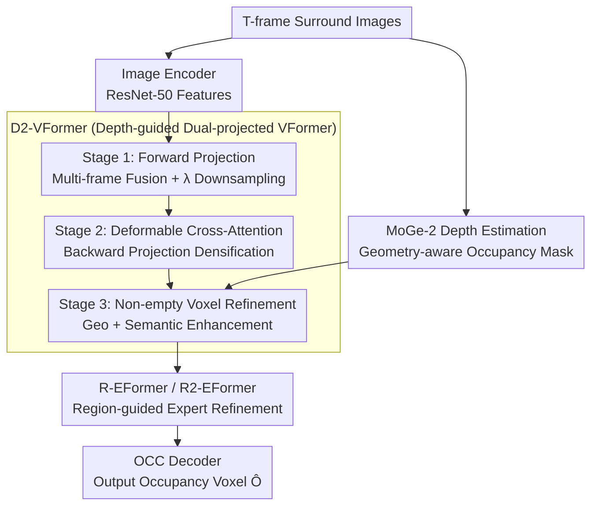

# Dr.Occ: Depth- and Region-Guided 3D Occupancy from Surround-View Cameras for Autonomous Driving

**Conference**: CVPR 2026  
**arXiv**: [2603.01007](https://arxiv.org/abs/2603.01007)  
**Code**: None  
**Area**: Autonomous Driving / 3D Occupancy Prediction  
**Keywords**: occupancy prediction, depth guidance, MoGe-2, Mixture-of-Experts, region-guided, view transformation

## TL;DR

Dr.Occ is proposed as a unified vision-only 3D occupancy prediction framework. It leverages high-quality depth priors from MoGe-2 for precise geometric alignment via a Depth-guided Dual-projected View Transformer (D2-VFormer). Furthermore, it introduces region-guided MoE/MoR expert Transformers (R-EFormer / R2-EFormer) to adaptively assign experts to specific spatial regions, addressing spatial-semantic imbalance. It improves the BEVDet4D baseline by 7.43% mIoU on Occ3D-nuScenes.

## Background & Motivation

**Background**: 3D semantic occupancy prediction is a core perception task in autonomous driving, aiming to generate dense voxel-level representations of scenes to provide geometric and semantic information for motion planning and obstacle avoidance. Vision-only solutions are the mainstream direction (LSS, BEVFormer, COTR, etc.), achieved through 2D-to-3D view transformation.

**Limitations of Prior Work**:
1. **Inaccurate Geometric Alignment**: Existing forward projection methods (LSS, BEVDepth) rely on low-resolution, noisy depth estimation for 2D→3D feature transformation, resulting in limited projection accuracy.
2. **Spatial-Semantic Imbalance**: Different semantic categories exhibit strong spatial preferences in 3D space (e.g., pedestrians are concentrated on road edges, vehicles in the center, and buildings at higher altitudes), yet existing methods model all regions uniformly.
3. Approximately 90% of voxels are empty, making direct fitting of all voxels inefficient.
4. Simply concatenating MoGe depth maps with images or converting them to pseudo-point clouds for forward projection can actually degrade performance.

**Key Challenge**: How to utilize high-quality geometric priors provided by advanced depth estimation models to improve occupancy prediction while addressing the severe spatial distribution imbalance of semantic categories.

**Goal**: Simultaneously address the two major challenges of inaccurate geometric reconstruction and imbalanced semantic learning in vision-only occupancy prediction.

**Key Insight**: Using depth guidance to ensure geometric alignment and region experts to enhance semantic learning, with the two components being complementary.

**Core Idea**: Generate occupancy masks from MoGe-2 depth to guide the refinement of non-empty voxels, and utilize MoE concepts to assign experts by spatial regions to handle semantic heterogeneity.

## Method

### Overall Architecture

Dr.Occ introduces two improvements to the existing occupancy prediction pipeline:
1. Replaces the original view transformer with **D2-VFormer**, utilizing MoGe-2 depth priors to implement depth-guided dual-projection feature construction.
2. Inserts a **Region-guided Expert Transformer (R-EFormer / recursive variant R2-EFormer)** during the 3D feature refinement stage to assign experts by physical space for semantic enhancement.

The input consists of $T$ frames of surround-view images → Image Encoder → D2-VFormer for 3D voxel feature construction → R-EFormer / R2-EFormer for semantic refinement → OCC Decoder outputting $\hat{\mathbf{O}} \in \mathbb{R}^{X \times Y \times Z \times C}$.

### Key Designs

**1. Depth-guided Dual-projected View Transformer (D2-VFormer): Depth as an "Attention Map" instead of "Hard Projection"**

Existing forward projections (LSS, BEVDepth) rely on low-resolution, noisy depth for 2D→3D transformation, leading to poor alignment. The authors found that directly concatenating MoGe depth or converting it to point clouds for forward projection performed worse because image features lost their implicit depth constraints. D2-VFormer uses depth to generate a geometry-aware occupancy mask to guide attention: first, MoGe-2 depth maps $\mathbf{D}_i$ generate pseudo-point clouds $\mathcal{P}$ via camera projection $\mathbf{x}_{\text{cam}}^T = d \cdot \mathbf{K}_i^{-1}[u, v, 1]^T$, $\mathbf{p}_i = \mathbf{R}_i^\top(\mathbf{x}_{\text{cam}} - \mathbf{t}_i)$, and voxelization gives a binary mask $M(\mathbf{v}) = \mathbf{1}[\mathbf{v} \in \text{Voxelize}(\mathcal{P}, r)]$ marking non-empty voxels. Refinement proceeds in three stages: Stage 1 fuses multi-frame features and downsamples by $\lambda$ for efficiency; Stage 2 uses Deformable Cross-Attention (DCA) for backward densification $\mathbf{F}_{\text{dense}} = \text{DCA}(\mathbf{F}_{\text{down}}, \mathbf{F}^{(I)})$; Stage 3 performs geometric refinement (fusing depth features $\mathbf{F}^{(D)}$) and semantic enhancement (fusing image features $\mathbf{F}^{(I)}$) only for masked non-empty voxels. Empty voxels are filled with a learnable embedding $\mathbf{e}_{\text{empty}}$. Since ~90% of voxels are empty, focusing attention on the ~10% meaningful voxels improves both efficiency and accuracy.

**2. Region-guided Expert Transformer (R-EFormer): Spatial Experts for Semantic Imbalance**

Semantic categories are highly anisotropic in 3D space—roads are at low altitudes nearby, vegetation/buildings are at higher altitudes mid-range, and dynamic objects are crowded in narrow bands. R-EFormer moves MoE from token space to physical space: the space is sliced into $3 \times 3 = 9$ regions based on distance (Near 0-10m / Mid 10-30m / Far 30m+) and height (Low -1.0-0.2m / Mid 0.2-2.2m / High 2.2-5.4m). A router network calculates region importance $s_m = \text{Router}(\mathbf{F}_{\text{out}})$ and selects top-$K$ experts. Each expert $E_m$ uses DCA but only within its region mask $\mathcal{M}_m$, calculated as $E_m(\mathbf{F}_{\text{out}}, \mathbf{F}^{(I)}; \mathcal{M}_m) = \text{DCA}(\mathbf{F}_{\text{out}}, \mathbf{F}^{(I)}; \mathcal{M}_m)$. The final feature is a weighted fusion $\mathbf{F}_{\text{final}} = \sum_{m \in \mathcal{S}} w_m \cdot E_m(\mathbf{F}_{\text{out}}, \mathbf{F}^{(I)}; \mathcal{M}_m)$. Aligning experts with spatial semantic distribution is the key to performance gains.

**3. Recursive Variant R2-EFormer: Iterative Contraction with a Shared Expert**

The 9-region grid of R-EFormer is manually set and may not fit all scenes. Inspired by Mixture-of-Recursions (MoR), R2-EFormer uses a single shared expert that iteratively refines the volume $n$ times. Each iteration, the router generates a progressively shrinking spatial mask where $\mathcal{M}^{(t)} \subset \mathcal{M}^{(t-1)}$ (coverage decreasing from 100% → 75% → 50%). Each round is $\mathbf{F}^{(t)} = \text{DCA}(\mathbf{F}^{(t-1)}, \mathbf{F}^{(I)}; \mathcal{M}^{(t)})$. This design uses fewer parameters, requires no manual partitioning, and progressively focuses on hard-to-classify voxels. In experiments, it yielded the highest mIoU (43.43%) as recursive refinement benefits rare classes.

### Loss & Training

- Optimizer: AdamW, learning rate $1 \times 10^{-4}$, weight decay $1 \times 10^{-2}$.
- Training: 24 epochs, batch size = 2/GPU × 8 GPUs (NVIDIA L20).
- Backbone: ResNet-50; Depth estimation: moge-2-vits-normal.
- Forward projection voxel dimensions: $C=32$, resolution $200 \times 200 \times 16$, covering $80 \times 80 \times 6.4$ m.
- Attention: 8 heads, $N_{\text{ref}} = 4$ reference points.

## Key Experimental Results

### Main Results

Occ3D-nuScenes benchmark (mIoU / IoU %):

| Method | Backbone | mIoU | IoU |
|------|----------|---:|---:|
| BEVFormer | R101 | 26.9 | — |
| TPVFormer | R101 | 27.8 | — |
| SparseOcc | R50 | 30.9 | — |
| BEVDet4D | R50 | 36.0 | — |
| FlashOcc | R50 | 37.8 | — |
| FB-Occ | R50 | 39.1 | — |
| ViewFormer | R50 | 41.9 | — |
| COTR | R50 | 43.1 | — |
| **BEVDet4D + Dr.Occ** | R50 | **43.4** (+7.43) | (+3.09) |
| **COTR + Dr.Occ** | R50 | **44.1** (+1.0) | — |

Dr.Occ significantly improves foreground class IoU (e.g., bicycle +20.4, pedestrian +13.4, motorcycle +6.9) compared to BEVDet4D, with stable growth in background classes.

### Ablation Study

Contribution of each module:

| D2-VFormer | R-EFormer | R2-EFormer | IoU (%) | mIoU (%) |
|:---:|:---:|:---:|---:|---:|
| | | | 70.36 | 36.01 |
| ✔ | | | 71.29 (+0.93) | 41.45 (+5.44) |
| ✔ | ✔ | | **73.45** (+2.16) | 43.03 (+1.58) |
| ✔ | | ✔ | 72.87 | **43.43** (+1.98) |

Key Observations:
- D2-VFormer alone contributes +5.44% mIoU, validating depth guidance for geometric integrity and semantics.
- R-EFormer further adds +1.58% mIoU over D2-VFormer, achieving the highest IoU.
- R2-EFormer achieves the highest mIoU (43.43%), as recursive refinement is more beneficial for rare and difficult classes.

### Key Findings

1. Directly using MoGe depth for forward projection decreases performance because image features lose implicit depth constraints; using depth to generate masks is a superior strategy.
2. Approximately 90% of voxels are empty. Geometry-aware masks allow the model to focus on the meaningful ~10% of voxels, significantly improving both efficiency and accuracy.
3. Spatial anisotropy of semantic categories is inherent (roads at the bottom, buildings at the top); MoE-style region experts effectively exploit this prior.
4. The recursive mask contraction strategy of R2-EFormer (100% → 75% → 50%) automatically focuses on difficult voxels without manual region boundary definitions.
5. As a plug-and-play module, Dr.Occ further improves COTR (current SOTA) by 1.0% mIoU, proving its generalizability.

## Highlights & Insights

1. **Clever Utilization of Depth Priors**: Instead of direct projection (prone to domain bias), depth is used to generate occupancy masks for attention guidance, offering a novel perspective.
2. **Localization of MoE in 3D Space**: Migrates the MoE expert routing concept from token space to physical region partitioning, highly matching the spatial-semantic distribution in autonomous driving.
3. **Recursive MoR Variant**: Reduces parameters while adaptively discovering important regions, avoiding sensitivity to manual region boundaries.
4. **Decoupled Design**: Geometric and semantic modules are decoupled and can be independently integrated into different baselines.

## Limitations & Future Work

1. Dependence on external depth models (MoGe-2) increases inference latency and deployment complexity.
2. The region partitioning of R-EFormer (3x3 grid) is a manual hyperparameter; different scenarios might require different partitions.
3. Evaluation is limited to Occ3D-nuScenes; other datasets (e.g., OpenOccupancy, SurroundOcc) were not tested.
4. Use of ResNet-50 backbone; stronger backbones (e.g., InternImage, ViT) have not been explored.
5. In-depth optimization of temporal fusion was not discussed (basic multi-frame fusion from BEVDet4D was used).

## Related Work & Insights

- **LSS / BEVDepth / BEVStereo**: Classic forward projection methods; Dr.Occ’s D2-VFormer introduces external depth guidance to this framework.
- **BEVFormer**: Classic backward projection sampling features from images via transformer queries.
- **COTR**: Dual-projection design; D2-VFormer further introduces depth mask guidance.
- **MoGe-2**: High-quality monocular depth estimation model providing geometric priors for Dr.Occ.
- **Mixture-of-Recursions (MoR)**: Efficient design using a single recursive expert instead of multiple experts.
- **Insight**: With the advancement of foundation models (e.g., MoGe, Depth Anything), exploring how to leverage these tools as strong priors for downstream tasks is a promising direction.

## Rating

| Dimension | Rating |
|------|------|
| Novelty | ⭐⭐⭐⭐ |
| Value | ⭐⭐⭐⭐ |
| Experimental Thoroughness | ⭐⭐⭐⭐ |
| Writing Quality | ⭐⭐⭐⭐ |
| Overall | ⭐⭐⭐⭐ |

<!-- RELATED:START -->

## Related Papers

- [\[CVPR 2026\] ParkGaussian: Surround-view 3D Gaussian Splatting for Autonomous Parking](parkgaussian_surround-view_3d_gaussian_splatting_for_autonomous_parking.md)
- [\[CVPR 2026\] Gau-Occ: Geometry-Completed Gaussians for Multi-Modal 3D Occupancy Prediction](gau-occ_geometry-completed_gaussians_for_multi-modal_3d_occupancy_prediction.md)
- [\[CVPR 2026\] TT-Occ: Test-Time 3D Occupancy Prediction](test-time_3d_occupancy_prediction.md)
- [\[CVPR 2026\] ProOOD: Prototype-Guided Out-of-Distribution 3D Occupancy Prediction](proood_prototype-guided_out-of-distribution_3d_occupancy_prediction.md)
- [\[ICLR 2026\] OccDriver: Future Occupancy Guided Dual-branch Trajectory Planner in Autonomous Driving](../../ICLR2026/autonomous_driving/occdriver_future_occupancy_guided_dual-branch_trajectory_planner_in_autonomous_d.md)

<!-- RELATED:END -->
