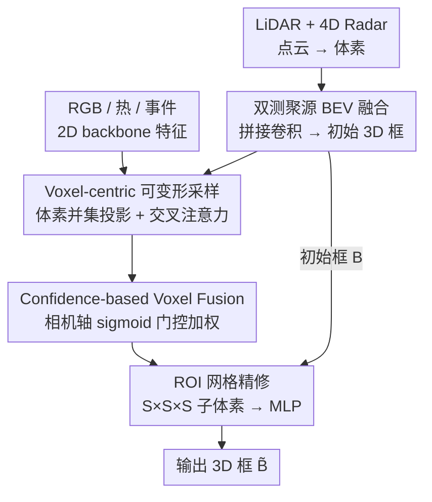

# DSERT-RoLL: Robust Multi-Modal Perception for Diverse Driving Conditions with Stereo Event-RGB-Thermal Cameras, 4D Radar, and Dual-LiDAR

**Conference**: CVPR 2026  
**Paper**: [CVF Open Access](https://openaccess.thecvf.com/content/CVPR2026/html/Cho_DSERT-RoLL_Robust_Multi-Modal_Perception_for_Diverse_Driving_Conditions_with_Stereo_CVPR_2026_paper.html)  
**Code**: Project Page https://jeongyh98.github.io/dsert-roll (Public repository not yet available)  
**Area**: Autonomous Driving Perception / 3D Object Detection  
**Keywords**: Multi-modal Fusion, 3D Object Detection, 4D Radar, Event Camera, Robust Perception

## TL;DR
This paper introduces DSERT-RoLL, a driving dataset that simultaneously collects stereo Event-RGB-Thermal cameras, 4D Radar, and dual LiDAR, covering extreme conditions such as rain, snow, fog, nighttime, and HDR. It proposes a multi-modal 3D detection framework that first generates initial boxes from ranging sensors, supplements semantics using voxel-centric deformable sampling with three-way camera features, and finally fuses them via camera-confidence gating, achieving the highest AP across all weather and lighting conditions.

## Background & Motivation

**Background**: Autonomous driving 3D perception has long evolved from single-modal to multi-modal. "RGB camera + LiDAR" is the de facto standard—cameras provide semantics while LiDAR provides geometry, complementing each other to improve robustness.

**Limitations of Prior Work**: RGB is sensitive to lighting, degrading in low-light or HDR conditions. LiDAR is unaffected by lighting but experiences shortened ranges and noisy point clouds in rain, snow, or fog. To address these weaknesses, several emerging sensors have appeared: thermal imaging (infrared for nighttime), event cameras (high dynamic range, high-speed motion, low latency), and 4D Radar (stable ranging in adverse weather via Doppler). However, **existing benchmarks are almost entirely comparisons of a "single new sensor + traditional RGB/LiDAR"**, lacking a dataset where these new and old sensors are captured simultaneously in the same scene with unified annotations for direct horizontal comparison and systematic fusion research.

**Key Challenge**: Without fair multi-sensor data from the same environment, it is impossible to determine which sensor or fusion combination is most trustworthy under specific conditions. Consequently, fusion research for new sensors has long remained fragmented.

**Goal**: ① Construct a unified dataset containing stereo Event-RGB-Thermal + 4D Radar + dual LiDAR across various extreme weather and lighting conditions, including 2D/3D boxes, track IDs, and ego-motion. ② Provide a 3rd detection baseline capable of adaptive fusion of these heterogeneous sensors that remains stable in adverse conditions.

**Key Insight**: Use **ranging sensors (LiDAR + 4D Radar) to first generate initial boxes** as a geometric skeleton, then refine them by re-injecting RGB/Thermal/Event camera semantics **centered on voxels**, and use **per-camera confidence gating** to determine the weight of each camera branch—allowing the framework to automatically favor the most reliable modality under different weather and lighting.

## Method

### Overall Architecture

The inputs are two types of sensors: 3D ranging sensors (LiDAR $P^L$, 4D Radar $P^{4R}$, with each point carrying features $f\in\mathbb{R}^{C_p}$ such as intensity or Doppler velocity) and three-way single-view camera images (RGB $I^R$, Thermal $I^T$, Event Voxel $I^E$). Point clouds pass through a 3D voxel backbone to obtain voxel features $F_V\in\mathbb{R}^{X\times Y\times Z\times C_V}$, and images pass through a 2D backbone to obtain $F_I\in\mathbb{R}^{H/4\times W/4\times C_I}$.

The pipeline follows "geometry first, semantics second, confidence adjudication": first, LiDAR and 4D Radar voxels are compressed into BEV, fused via concatenation and convolution to **generate initial 3D boxes**; then, centered on non-empty voxels, features from the three camera paths are projected back to their respective image planes for **deformable cross-attention sampling** to supplement each voxel with image semantics; next, weighted fusion of the three camera branches is performed via **camera-axis gating** to obtain final fused voxel features; finally, these features are used for ROI-grid refinement of the initial boxes to output the 3D boxes.

### Key Designs

**1. BEV Fusion of Dual 3D Ranging Sources and Initial Box Generation: Defining a Light-Agnostic Geometric Skeleton**

A major pain point is that cameras are unreliable under extreme lighting, so the framework does not let the camera lead initial localization. Instead, two ranging sources, **naturally robust to lighting**, are used as the geometric foundation. Specifically, LiDAR and 4D Radar voxel features $F^L_V, F^{4R}_V$ are collapsed along the vertical axis and projected to the ground plane using 2D convolutions to obtain BEV features $F^L_{BEV}, F^{4R}_{BEV}\in\mathbb{R}^{\frac{X}{s}\times\frac{Y}{s}\times C_B}$. These are concatenated along the channel dimension and fused via a convolution layer to obtain cross-modality enhanced BEV representations. A detection head then produces a fixed number $n$ of initial boxes $B=\{b_1,\dots,b_n\}$. This step is intentionally "simple but effective"—LiDAR provides long-range precision, while 4D Radar compensates with stability in snow/fog via Doppler. The concatenation-convolution approach preserves geometric cues while saving computation, providing reliable candidates for subsequent semantic refinement.

**2. Voxel-centric Deformable Sampling: Injecting Three-Way Camera Semantics into 3D Space via Voxel Queries**

To fuse image semantics into 3D, common practices project pixels into 3D based on view frustums, which causes blurring in depth. This paper takes the opposite approach—**using non-empty voxels as centers** to actively sample from images. First, the union of non-empty voxel indices from LiDAR and 4D Radar is taken as $\Omega=\Omega^L\cup\Omega^{4R}$. For each voxel $V_j$, the fused feature is defined according to Eq. (2): if only one modality hits, that feature is preserved; if both hit, $[f^L_{V_j}\,|\,f^{4R}_{V_j}]$ are channel-concatenated and projected back to $C_V$ dimensions using a per-scale linear projection $P$, achieving cross-modal fusion while maintaining dimensionality. Subsequently, voxel $V_j$ is projected onto the RGB/Thermal/Event image planes usingprojection matrices $M^R,M^T,M^E$ (product of intrinsics/extrinsics) to get $u^m_j=M^m\cdot V_j$. **Deformable sampling with learnable offsets** is performed in the neighborhood of the projected point:

$$\hat f^m_j=\sum_{q=1}^{Q} w_q\cdot F^m_I(u^m_j+\Delta u^{m,q}_j)$$

where the offset $\Delta u^{m,q}_j$ and weight $w_q$ are predicted from voxel feature $f_{V_j}$. Finally, with voxel features as queries and aggregated image features as keys/values, deformable cross-attention is applied: $\hat f^m_{V_j}=\mathrm{Attn}(Q=f_{V_j},K=\hat f^m_j,V=\hat f^m_j)$. Thus, each 3D voxel "samples" semantics from the three cameras based on its own geometric position, avoiding the depth ambiguity inherent in passive pixel lifting.

**3. Confidence-based Voxel Fusion: Determining Modality Reliability via Camera-Axis Gating**

The three camera types have different failure scenarios (RGB struggles in darkness, Thermal in weak daytime textures, Event with static objects). Simple equal-weight concatenation would be degraded by failed modalities. The paper concatenates the three image-enhanced voxel features into $\hat F^{cam}_V=[\hat F^R_V\,|\,\hat F^T_V\,|\,\hat F^E_V]\in\mathbb{R}^{N_V\times(KC_V)}$ ($K=3$), treats this as an $\mathbb{R}^{N_V\times K\times C_V}$ tensor, and calculates a **per-camera scalar gate** via global summarization:

$$w=\sigma\!\left(\frac{1}{N_VC_V}\sum_{i=1}^{N_V}\sum_{c=1}^{C_V}\hat F^{cam}_V(i,:,c)\right)\in[0,1]^{1\times K\times 1}$$

Each camera branch is then weighted by the gate $\bar F^{cam}_V=w\odot\hat F^{cam}_V$. Finally, the weighted image-enhanced voxel features are concatenated with the original voxel features and passed through an FFN for dimensionality reduction to obtain the final fused feature $\tilde F_V\in\mathbb{R}^{N_V\times C_V}$. Since the gate is derived from the global mean of the entire camera feature path via sigmoid, it allows the network to **adaptively increase the contribution of currently reliable cameras and decrease failed ones** for each batch/scene—this is the source of the "all-modality stability" shown in the ablation studies.

> The **ROI Grid Refinement** within the framework is a standard post-processing step (following [27,44]): each initial box $b_i$ is partitioned into $S\times S\times S$ sub-voxels. ROI pooling is applied to fused features $\tilde F_V$ and original voxel features to get $\tilde F^i_V\in\mathbb{R}^{S^3\times C_V}$, which then passes through an MLP to regress refined boxes $\tilde B$ (with $S=6$). This is not the core innovation and is not listed as a primary design point.

### Loss & Training
The model is trained end-to-end. The total loss is the sum of RPN loss, confidence prediction loss, and box regression loss: $L=L_{RPN}+\lambda_1 L_{conf}+\lambda_2 L_{reg}$, where $\lambda_1=\lambda_2=1$. The camera-3D fusion module uses $K=4$ sampling points and an $S=6$ refinement grid. Evaluation restricts the point cloud to the forward camera field of view $[0,70]$ m along the X-axis, reporting AP with an IoU threshold of 0.5 using official Waymo metrics, focusing on the vehicle category. Training was performed on 4×NVIDIA Quadro RTX 8000.

## Key Experimental Results

> Results use Waymo-style **AP@IoU0.5 (Vehicle)**, reported across 10 weather/lighting conditions. nuScenes NDS metrics are not used. The table below excerpts representative conditions.

### Main Results: Cross-Method 3D Detection Comparison (Table 4, AP@0.5, Selected Conditions)

| Method (Modalities) | Clear | Fog | Heavy Rain | Heavy Snow | Low Light | HDR |
|---|---|---|---|---|---|---|
| DSGN (Stereo R) | 31.08 | 43.66 | 25.94 | 0.01 | 25.68 | 40.69 |
| VoxelNeXt (L) | 86.06 | 59.51 | 82.86 | 54.75 | 88.76 | 80.93 |
| VoxelNeXt (4R) | 25.03 | 44.03 | 37.42 | 32.79 | 24.02 | 35.03 |
| LoGoNet (R+L) | 87.18 | 64.96 | 79.74 | 66.20 | 90.56 | 82.78 |
| InterFusion (4R+L) | 84.52 | 66.94 | 74.13 | 64.82 | 87.49 | 79.95 |
| SAMFusion (R+T+4R+L) | 87.03 | 65.13 | 79.81 | 70.59 | 89.93 | 82.50 |
| **Ours (R+E+T+4R+L)** | **90.30** | **71.42** | **85.59** | **72.94** | **92.65** | **86.33** |

Ours achieves the highest AP across all listed conditions. Pure stereo (without explicit depth) and pure 4D Radar are generally weak due to low information density. LiDAR is strong due to geometric precision but drops significantly in fog/snow. Multi-modal methods compensate by adding camera semantics and 4D Radar weather robustness; Ours adaptively fuses all sensors and remains stable across all conditions.

### Ablation Study: Incremental Modality Contribution (Table 3, AP@0.5, Selected Conditions)

| Modal Combination | Clear | Fog | Heavy Snow | Low Light | HDR |
|---|---|---|---|---|---|
| L | 82.90 | 65.67 | 54.14 | 86.10 | 74.51 |
| R+L | 84.67 | 66.14 | 59.43 | 87.41 | 79.31 |
| 4R+L | 88.26 | 67.41 | 69.96 | 88.73 | 82.98 |
| R+4R+L | 88.35 | 67.38 | 70.26 | 91.04 | 83.93 |
| R+E+4R+L | 88.70 | 71.45 | 71.64 | 91.43 | 86.55 |
| R+T+4R+L | 89.48 | 71.00 | 71.32 | 92.20 | 85.66 |
| **R+E+T+4R+L (All Mods)** | **90.30** | 71.42 | **72.94** | **92.65** | 86.33 |

### Key Findings
- **4D Radar is the missing piece for adverse weather**: Adding 4D Radar to LiDAR (L→4R+L) boosts Heavy Snow AP from 54.14 to 69.96 (+15.8), confirming Doppler ranging's stability compared to LiDAR in snow.
- **RGB gains are limited in extreme conditions**: R+L compared to L in Heavy Snow only improves from 54.14 to 59.43; the authors state RGB gains are mainly in moderate conditions and minimal in extreme lighting.
- **Event/Thermal cameras compensate for lighting and dynamics**: Adding E and T further improves Fog (67→71+), Low Light, and HDR. The full modality set achieves the highest results in Clear/Heavy Snow/Low Light, validating that confidence gating allows the framework to adaptively favor reliable modalities.
- ⚠️ In specific columns (e.g., Fog 71.45 vs All 71.42, HDR 86.55 vs All 86.33), subsets slightly outperform the full set, suggesting gating is not strictly optimal for every single condition, yet the full-modal version offers the best overall equilibrium.

## Highlights & Insights
- **"Geometry first, semantics later" partition is clean**: Using light-agnostic ranging sources for initial boxes and allowing cameras to provide semantics via voxel-centric sampling avoids depth ambiguity from pixel lifting. This voxel-as-query deformable sampling approach is transferable to any "sparse 3D + multi-view image" fusion task.
- **Per-camera confidence gating via global mean + sigmoid provides modality adaptation** with near-zero extra cost, directly supporting robust performance in adverse conditions.
- **The dataset itself is the largest contribution**: For the first time, event/thermal/RGB stereo + 4D Radar + dual LiDAR are unified with annotations in the same scene at the same time, allowing the question of "which sensor to trust in which environment" to be fairly quantified.

## Limitations & Future Work
- Evaluation restricts point clouds to front-view $[0,70]$ m and only uses the left stereo image, **ignoring stereo depth** and thus not fully exploiting geometric potential from stereo.
- The main table only reports Vehicle AP; other categories are in the supplementary material, limiting conclusions on cross-category robustness.
- ⚠️ The confidence gate uses a **global scalar** per camera channel, making it spatially invariant. In scenarios where parts of the image are overexposed while others are normal, per-voxel or per-region gating might be more appropriate.
- The fusion method is positioned as a "modality-adaptive fusion baseline" intended as a strong baseline for the dataset rather than a methodological contribution where every module is refined to the limit.

## Related Work & Insights
- **vs BEVFusion / DeepFusion (Mainstream R+L Fusion)**: These lift cameras to BEV for unified fusion with LiDAR; Ours conversely samples from images with voxels as queries and incorporates 4D Radar/Event/Thermal, showing significant advantages in adverse conditions like Heavy Snow (57.61/57.26 → 72.94).
- **vs SAMFusion (R+T+4R+L, Closest Multi-sensor Fusion)**: Also uses multiple sensors, but Ours adds event cameras and introduces per-camera confidence gating, consistently outperforming SAMFusion across all conditions (e.g., Fog 65.13→71.42, Clear 87.03→90.30).
- **vs InterFusion / HGSFusion (Fusion with 4D Radar)**: These focus on pair-wise fusion (Radar+LiDAR or Radar+RGB); Ours unifies ranging and three-way camera paths into the same sparse voxel space, covering a more complete set of modalities.

## Rating
- Novelty: ⭐⭐⭐⭐⭐ First unified dataset for Event-RGB-Thermal+4D Radar+dual LiDAR with voxel-centric sampling + confidence-gated fusion.
- Experimental Thoroughness: ⭐⭐⭐⭐⭐ Broad coverage of 10 weather/light conditions, three categories of methods, and per-modality ablations.
- Writing Quality: ⭐⭐⭐⭐ Clear methodology and formulas, though discussion on design trade-offs like spatial-invariance of gating is brief.
- Value: ⭐⭐⭐⭐⭐ Provides a scarce fair benchmark and strong baseline for emerging sensor fusion research.

<!-- RELATED:START -->

## Related Papers

- [\[CVPR 2026\] Hybrid Robust Collaborative Perception with LiDAR-4D Radar Fusion under Adverse Weather Conditions](hybrid_robust_collaborative_perception_with_lidar-4d_radar_fusion_under_adverse_.md)
- [\[CVPR 2026\] RPGFusion: 4D Radar Prior-Guided Multi-Modal Fusion for 3D Detection](rpgfusion_4d_radar_prior-guided_multi-modal_fusion_for_3d_detection.md)
- [\[CVPR 2026\] EventDrive: Event Cameras for Vision-Language Driving Intelligence](eventdrive_event_cameras_for_vision-language_driving_intelligence.md)
- [\[CVPR 2026\] LiREC-Net: A Target-Free and Learning-Based Network for LiDAR, RGB, and Event Calibration](lirec-net_a_target-free_and_learning-based_network_for_lidar_rgb_and_event_calib.md)
- [\[ICCV 2025\] Unleashing the Temporal Potential of Stereo Event Cameras for Continuous-Time 3D Perception](../../ICCV2025/autonomous_driving/unleashing_the_temporal_potential_of_stereo_event_cameras_for_continuous-time_3d.md)

<!-- RELATED:END -->
