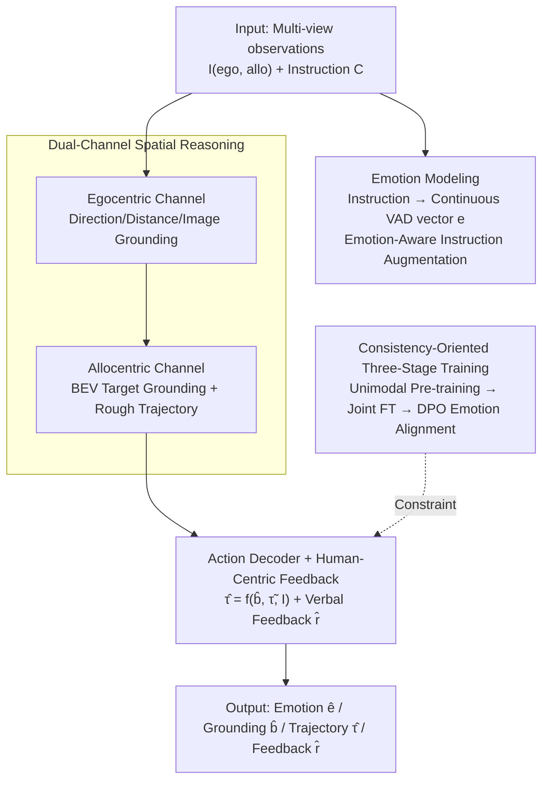

# E3AD: An Emotion-Aware Vision-Language-Action Model for Human-Centric End-to-End Autonomous Driving

**Conference**: CVPR 2026  
**Paper**: [CVF Open Access](https://openaccess.thecvf.com/content/CVPR2026/html/Tang_E3AD_An_Emotion-Aware_Vision-Language-Action_Model_for_Human-Centric_End-to-End_Autonomous_Driving_CVPR_2026_paper.html)  
**Code**: None  
**Area**: Autonomous Driving / Vision-Language-Action  
**Keywords**: Emotion Awareness, VLA, End-to-End Autonomous Driving, VAD Emotion Space, DPO Preference Alignment  

## TL;DR
E3AD integrates "passenger emotion" into the VLA framework for end-to-end autonomous driving. It extracts tone and urgency from natural language instructions using a continuous Valence-Arousal-Dominance (VAD) emotion space, incorporates dual-channel (egocentric + allocentric) spatial reasoning, and utilizes consistency-oriented three-stage training (including DPO emotion-action alignment). This enables the planned trajectory to comprehend both "what is said" and "how it is said", comprehensively outperforming SOTA models in visual grounding, emotion estimation, and trajectory planning.

## Background & Motivation
**Background**: End-to-end autonomous driving (E2E AD) is shifting from modular pipelines to the Vision-Language-Action (VLA) paradigm, which unifies perception, prediction, and planning into a single multimodal foundation model to map sensor inputs directly to vehicle control. This paradigm offers high efficiency and strong generalization.

**Limitations of Prior Work**: However, existing VLA autonomous driving models are largely "emotion-agnostic": they perform purely rational, closed-loop control, treating instructions as semantic-only inputs while completely ignoring the passenger's emotional state. Crucially, "stop here" and "stop here now!" are semantically identical, but the urgency in the latter should prompt a different vehicle response. Passengers naturally feel uneasy handing over decisions to a black-box algorithm that ignores human intent and emotion, whereas extensive behavioral research highlights emotional interaction as a key determinant of user comfort and trust. The authors refer to this decoupling between "computational reasoning" and "affective understanding" as the **emotion gap** in autonomous driving.

**Key Challenge**: Existing Category-3 VLA methods (which achieve the strongest performance by combining VLM perception with a dedicated planning module to directly output trajectories) suffer from two fundamental flaws: first, **weak spatial understanding**, primarily reasoning in 2D without explicit 3D or map-level (allocentric) spatial cognition; second, a **purely rational sequential prediction perspective** that completely discards emotion.

**Goal**: Define and solve the Open-Domain End-to-End AD (OD-E2E) task, where the vehicle must parse free-form natural language instructions, infer the underlying emotion, and plan a physically feasible trajectory consistent with the passenger's emotional intent, while jointly performing semantic, emotional, and spatial reasoning.

**Key Insight**: The authors borrow two tools from cognitive science. First is the continuous VAD model (Valence-Arousal-Dominance 3D vector) from emotion psychology, which replaces coarse-grained discrete labels like "happy/angry/sad" to capture subtle but behavior-modifying changes in tone. Second is the dual-system model of human spatial perception, which combines first-person observation (egocentric) with cognitive maps in the brain (allocentric) for navigation.

**Core Idea**: Utilize a single VAD emotion vector to guide both "instruction disambiguation" and "trajectory planning generation," and align emotions with driving behaviors through consistency-guided fine-tuning—moving autonomous driving from "emotion recognition" to "emotion-driven human-centric planning."

## Method

### Overall Architecture
E3AD is built on Qwen2.5-VL-7B-Instruct. The input consists of multi-view observations $I=\{I_{\text{ego}}, I_{\text{allo}}\}$ (egocentric view + allocentric BEV view) and a natural language instruction $C$. The output is a unified autoregressive chain $(\hat{e}, \hat{b}, \hat{\tau})$ comprising the predicted emotional state $\hat{e}$, the grounded target $\hat{b}$, and future trajectory points $\hat{\tau}$, alongside a passenger-facing verbal feedback $\hat{r}$. The overall system consists of three major modules: **Emotion Modeling** (encoding instructions into a continuous VAD space), **Dual-Channel Spatial Reasoning** (fusing egocentric and allocentric cues), and **Consistency-Oriented Action Planning** (action decoder + emotion-aware feedback). These modules are tied together via a three-stage training strategy: unimodal pre-training, joint fine-tuning for unified single-forward pass inference, and finally DPO for emotion-action alignment. The key lies in elevating language grounding from an "auxiliary perception task" to a core component of the end-to-end decision-making target, where the emotion $\hat{e}$ and grounding box $\hat{b}$ are fed directly into downstream trajectory generation, forming an "emotion-aware chain of thought."

### Key Designs

**1. Continuous VAD Emotion Modeling + Emotion-Aware Instruction Augmentation: Enabling the model to understand "how it is said" rather than just "what is said"**

Existing systems either ignore emotion entirely or rely on discrete category labels like "happy/angry/sad," which fail to capture subtle but behaviorally meaningful variations in tone. E3AD adopts a continuous Valence-Arousal-Dominance model, representing emotion as $e\in\mathbb{R}^3$: valence measures positive/negative attitude (calm vs. anxious), arousal measures activation/alertness (exhausted vs. alert), and dominance measures control (confident vs. overwhelmed). VAD labels are fused from two sources: first, a GoEmotions classifier predicts the distribution over discrete emotions, which is mapped to sentence-level VAD using a label-VAD dictionary; second, stop words are removed, and the word-level VAD scores of the remaining tokens are averaged to obtain a word-level vector. Combining both allows the system to reflect both global semantics and "emotion-laden key phrases."

However, a critical pitfall is that most driving instructions are emotionally neutral; standard training would lead the model to ignore emotion altogether. The authors address this via **Emotion-Aware Instruction Augmentation**: for each instruction $C^{(i)}$, Qwen2.5-VL is used to generate $K$ paraphrases $C^{(i)}_{aug}=\{C^{(i)}_1,\dots,C^{(i)}_K\}$ that **keep the driving goal unchanged while altering only the attitude or intensity**. Each paraphrase is then VAD-labeled using the same pipeline. This constructs a neighborhood of "semantically equivalent but emotionally distinct" variants, forcing the model to attribute changes in $e$ to tone rather than intent. During training, emotion prediction is treated as conditional generation (rather than an auxiliary regression head), with the loss defined as:

$$\mathcal{L}_{\text{emo}} = -\mathbb{E}_{(C^{(i)}_k, e^{(i)}_k)\sim \mathcal{C}^*}\big[\log p_\theta(e^{(i)}_k \mid C^{(i)}_k)\big]$$

This embeds the emotion $e$ into the same autoregressive generation chain as other outputs, allowing it to represent fine-grained emotional drift while keeping the underlying intent fixed, and directly using the inferred emotion to modulate planning behavior.

**2. Dual-Channel Spatial Reasoning: Mending the spatial blind spot of VLAs using the human-like "egocentric + allocentric" dual systems**

To address the limitation where existing VLAs mostly reason in 2D and lack 3D/map-level cognition, E3AD mimics the dual-system model of human spatial perception by reasoning across two complementary spatial channels. The **Egocentric Channel** captures the first-person perception field: it predicts the relative 3D direction, distance, and image-coordinate grounding of targets from $(I_{\text{ego}}, C)$, providing fine-grained, short-range spatial cues that directly support immediate control (trained on ~30K samples). The **Allocentric Channel** encodes a cognitive-map-like world representation: given BEV input $I_{\text{allo}}$, it predicts target positions in BEV coordinates and generates a coarse trajectory $\tilde{\tau}=\{y_t\}_{t=1}^T$ from the ego-vehicle pose to the target, providing map-consistent priors such as long-range structure, road topology, occlusions, and multi-agent layouts (trained on ~17K samples). The two channels—one handling "local, action-oriented" cues and the other handling "global, map-structured" contexts—jointly provide complementary local and global cues for downstream planning in cluttered, semi-observable scenes.

**3. Action Decoder + Human-Centric Verbal Feedback: Grounding high-level semantics into precise, executable trajectories and mitigating passenger "black-box anxiety"**

The VLA backbone outputs high-level tokens, which must be converted into precise, executable trajectories. E3AD attaches a lightweight action decoder $f_{act}$ after the backbone to predict the final trajectory $\hat{\tau}=f_{act}(\hat{b}, \tilde{\tau}, I)$ conditioned on the grounded target $\hat{b}$, coarse trajectory $\tilde{\tau}$, and visual observations $I$, where $\hat{\tau}\in\mathbb{R}^{T\times2}$ represents the spatial coordinates of the waypoints. More distinctively, it generates **Human-Centric Verbal Feedback** $\hat{r}$: after waypoint planning, the trained Qwen2.5-VL backbone, guided by a structured prompt, generates a verbal response conditioned on the complete pipeline output (emotion $\hat{e}$, target $\hat{b}$, waypoints $\hat{\tau}$). The feedback strategy adjusts tone, length, and specificity based on emotion and urgency—giving brief confirmations for calm states and direct, time-sensitive instructions for high-arousal states. This emotion-aware feedback loop transforms the autonomous vehicle from an opaque tool into an empathetic, human-centric agent.

**4. Consistency-Oriented Three-Stage Training (including DPO Emotion-Action Alignment): Crafting pseudo-preference pairs from a single ground-truth trajectory to enforce behavior-emotion consistency**

Training infuses capabilities incrementally in three steps. **Stage-1: Unimodal Pre-training**: Equips the model with emotional and spatial awareness via supervised fine-tuning. Emotion modeling is trained on the augmented dataset $\mathcal{C}^*$ using $\mathcal{L}_{\text{emo}}$, while spatial reasoning is trained on synthetic egocentric/allocentric data using the next-token prediction negative log-likelihood $\mathcal{L}_{\text{spatial}}$. **Stage-2: Joint Fine-Tuning**: Unifies these capabilities into a single-forward coherent reasoning chain. The model autoregressively predicts the full sequence $T=(\hat{e},\hat{b},\hat{\tau})$ with the joint loss:

$$\mathcal{L}_{\text{Joint}} = -\mathbb{E}_{(I,C,T)}\sum_{t=1}^{|T|}\log p_\theta(T_t\mid T_{<t}, I, C)$$

This establishes an emotion-aware chain of thought: "emotion first, then grounding, finally waypoints." **Stage-3: Emotion-Action Alignment (DPO)**: The joint loss aligns tasks but does not explicitly force behaviors to remain consistent across different emotional intents. The challenge is that autonomous driving datasets typically only provide a single ground-truth trajectory $\tau^{(i)}$ per instruction, lacking natural preference pairs. The authors solve this by using emotion augmentation to generate pseudo-preference pairs: for each instruction, they find the augmented variant whose VAD embedding differs most from the original instruction to serve as the "negative instruction."

$$C^{(i)}_{k^-} = \arg\max_k \|e^{(i)}_k - e^{(i)}\|_2, \quad \tilde{\tau}^{(i)}_{k^-} \sim p_\theta(\tau\mid C^{(i)}_{k^-}, I^{(i)})$$

This "negative instruction" generates a dispreferred, emotionally drifted trajectory $\tilde{\tau}^{(i)}_{k^-}$, yielding the preference pair $(\tau^{(i)}\succ\tilde{\tau}^{(i)}_{k^-})$, which is optimized using DPO:

$$\mathcal{L}_{\text{dpo}} = -\mathbb{E}_i\Big[\log\sigma\Big(\beta\big(\log p_\theta(\tau^{(i)}\mid C^{(i)}) - \log p_\theta(\tilde{\tau}^{(i)}_{k^-}\mid C^{(i)})\big)\Big)\Big]$$

This encourages the model to assign higher likelihood to trajectories aligned with the original emotional intent and suppress alternative trajectories perturbed by irrelevant emotions, leading to stable yet emotion-aware driving behavior.

### An Illustrative Example
Given the neutral instruction "Tom is right ahead. Let's get there!", E3AD estimates VAD $\approx$ (0.59, 0.36, 0.51) in the `<EmoThink>` block, identifying the passenger as "moderately positive, motivated, and slightly excited." It then drafts a standard forward trajectory and outputs a brief confirmation in the `<Feedback>` block: "Got it! Tom's just ahead, let's move steadily forward. All under control!". In a case study, when "Be more cautious" is appended to the same-intent instruction, the VAD shifts from (0.60, 0.39, 0.45) to (0.60, 0.49, 0.51) (increased arousal and dominance). The DPO-aligned policy **directly abandons the lane-change action** in favor of a more conservative path, and the feedback changes to a reassuring explanation. This demonstrates that emotional supervision does not just alter language; it concretely changes the motion geometry. For a fixed intent, high arousal promotes straighter, less laterally oscillating, and earlier safety maneuvers, whereas low arousal yields a slower approach with wider safety margins.

## Key Experimental Results

### Main Results
Evaluated on real-world datasets including Talk2Car, DrivePilot, MoCAD, and Talk2Car-Trajectory, and evaluated on two challenging subsets (Long-Text and Corner-Case) following the ThinkDeeper protocol. The backbone is a frozen Qwen2.5-VL-7B, fine-tuned only using LoRA (rank 16, scale 32) so that the trainable parameter budget is no larger than the baselines—meaning performance gains stem from the method itself rather than model scale.

End-to-End Trajectory Planning (vs. the strongest baseline PTPC):

| Metric | E3AD | Prev. SOTA (PTPC) | Gain |
|--------|------|-------------------|------|
| ADE ↓ | 3.88 | 4.54 | 17.01% |
| Fréchet ↓ | 7.23 | 8.55 | 18.26% |
| SSPD ↓ | 1.86 | 2.18 | 17.20% |
| DTW ↓ | 60.07 | 72.09 | 16.67% |
| FDE ↓ | 6.64 | 7.75 | 20.00% |
| PA2 ↑ | 36.21 | 24.46 | 16.71% |
| PA4 ↑ | 55.62 | 45.55 | 18.10% |

Notably, general foundation VLMs (like Qwen2.5-VL-72B and Qwen3-VL-8B) perform poorly on this task (ADE 12–14, PA2 only 1–2%), confirming that "task-aligned structures and objectives are more important than raw compute."

Visual Grounding (vs. the strongest baseline CAVG, IoU): Talk2Car +6.86%, MoCAD test/val +10.50%/+8.72%, DrivePilot +6.79%/+7.36%; on corner cases (occlusion/multi-agent/ambiguity) it achieves +8.26%/+6.95%/+7.48%, and on Long-text, $+11.63\%$—gains are particularly prominent in challenging scenarios.

Emotion Recognition (Spearman $\rho$ / Kendall $\tau$, correlation with ground-truth VAD): E3AD achieves 0.95/0.84 on valence, 0.94/0.82 on arousal, and 0.94/0.81 on dominance, vastly outperforming the best alternative Qwen3-Emb-4B+Ridge (at 0.83/0.64); direct inference with Qwen2.5-7B yields nearly random correlation (0.11/0.08). For spatial reasoning, E3AD's target localization MAE is just 0.47 (compared to 10.1 for Qwen2.5-VL-72B) and depth MAE is 4.25 (compared to 22.68 for the 72B model), achieving 97.7% PA2 (localization) and 53.1% PA2 (depth).

### Ablation Study
Visual Grounding (IoU on Talk2Car / various challenge sets):

| Configuration | T2C | Constr. | Ambg. | Long | Description |
|--------------|-----|---------|-------|------|-------------|
| Full model | 80.12 | 76.62 | 77.05 | 77.86 | Full Model |
| w/o Egocentric | 74.48 | 71.60 | 72.24 | 72.47 | Largest drop (↓7.0% T2C); first-person localization is most critical |
| w/o Allocentric | 76.48 | 73.92 | 74.65 | 74.76 | Removed global spatial semantics/topology |
| w/o Emotion Modeling | 78.78 | 74.41 | 73.57 | 74.12 | Drops most on ambiguous/long texts |
| w/o DPO | 79.55 | 75.58 | 77.09 | 76.44 | Mild improvement |

In trajectory planning ablation (ADE/FDE), findings show that **the allocentric channel is most critical**: removing it increases ADE/FDE by 10.0%/10.1%, demonstrating the value of global priors for spatial perception and route consistency.

### Key Findings
- **Different sub-tasks have different "critical points"**: Visual grounding relies heavily on the egocentric channel (dropping it reduces IoU by 7%), whereas trajectory planning is highly dependent on the allocentric channel (removing it increases ADE/FDE by 10%). This proves the dual channels perform complementary indeed, rather than being redundant.
- **Gains of emotion modeling are concentrated on "hard" instructions**: It contributes the most to ambiguous and long-text instructions (↑4.5%/↑4.8%), validation that it primarily helps the model interpret subtle, emotion-rich linguistic cues.
- **The numerical gain of DPO is moderate but shifts motion geometry**: High arousal corresponds to straighter, smoother trajectories, whereas low arousal corresponds to more cautious, winding paths. Even if numerical metrics improve subtly, DPO substantially strengthens the "emotion-trajectory consistency."
- **Task-aligned architecture > Raw scale**: The 7B E3AD comprehensively outperforms the 72B general VLM.

## Highlights & Insights
- **Engineering the psychological continuous VAD space into a VLA**: Representing emotion as a 3D continuous vector nested within the autoregressive generation chain (rather than an external regression head) allows it to capture subtle tones and couple naturally with planning—this is the key to making emotion actively steer actions rather than acting as a passive side label.
- **Using "emotion-augmented pseudo-preference pairs" to bypass DPO data scarcity**: Autonomous driving datasets typically only provide a single ground-truth trajectory per instruction, preventing direct preference learning. The authors construct pseudo-preference pairs by generating "negative trajectories" from the most VAD-deviant augmented instructions. This trick is highly transferable to any regression/generation task that only has positive samples but aims to perform preference alignment.
- **A direct mapping from cognitive science dual-systems to modular design**: The egocentric/allocentric dual channels are not just a gimmick; the ablation shows that both make irreplaceable contributions to grounding and planning, providing a clear and reusable architectural paradigm for bridging 3D/map spatial cognition in VLAs.
- **Human-centric verbal feedback loop**: Adjusting the tone and length of verbal feedback based on emotion addresses the "non-technical but human-centric" issue of black-box anxiety in system design. This is a rare design that explicitly factors user trust and acceptance into the system outside of mathematical loss functions.

## Limitations & Future Work
- **VAD labels heavily rely on off-the-shelf classifiers and dictionary mapping**: Sentence-level VAD depends on GoEmotions + label-VAD dictionaries, and word-level VAD relies on averaging active tokens. Noise/bias in these labels propagates throughout the emotional supervision, and the paper does not extensively study the upper bound of label quality.
- **Emotion augmentation relies on Qwen2.5-VL self-paraphrasing**: The assumption that paraphrasing "retains the driving goal while modifying tone" is guaranteed only by the generator. If the paraphrase drifts in semantic intent, the pseudo-preference pairs could introduce erroneous supervision.
- **Hard-to-define ground-truth emotion**: Since VAD ground truth is mapped rather than human-annotated, the "SOTA VAD correlation" is relative to this pseudo-ground-truth. Whether it genuinely aligns with passenger psychology still requires human-in-the-loop validation.
- **Moderate numerical gains from DPO**: The authors admit DPO improvements are numerically modest, mostly manifesting in trajectory geometric consistency. Thus, the actual driving experience gains still need to be verified by user studies.
- **Future Directions**: Incorporate physiology-based or subjective passenger annotations for closed-loop calibration; turn verbal feedback into an interactive multi-turn dialogue rather than one-way feedback.

## Related Work & Insights
- **vs. Category-1 "Explainer" VLAs (DriveGPT-4 / OpenEMMA / CoT-Drive)**: These work on QA-style prompts to output scene-level explanations, providing good interpretability but lacking precise spatial localization and direct high-fidelity control. E3AD elevates grounding to a core decision target to output direct executable trajectories.
- **vs. Category-2 "Meta-Action" VLAs (Senna / VLP / LMDrive)**: These run a VLM to generate discrete "meta-actions" to guide a controller. They only offer sparse guidance and suffer from constrained continuous spatial reasoning. E3AD directly reasons continuous trajectories in a unified network.
- **vs. Category-3 "VLM Perception + Planning Module" VLAs (Simlingo / AutoVLA / FSDrive)**: While E3AD belongs to this top-performing category, prior works possess weak spatial understanding (mostly 2D) and are purely rational (ignoring emotion). E3AD adds dual-channel 3D/map spatial reasoning + emotion modeling; on benchmarks, FSDrive-Finetuned's FDE (10.45) is significantly behind E3AD (6.64).
- **vs. Affective Computing in Autonomous Driving**: Earlier works primarily focus on driver status monitoring (fatigue/distraction/stress) via physiological signals or facial/gaze cues. Moreover, most are "passive detection + discrete labels decoupled from downstream control." E3AD is (to the authors' knowledge) the first framework to use VAD vectors to jointly guide both grounding and trajectory generation, aligning emotion with driving behavior through consistency fine-tuning.

## Rating
- **Novelty**: ⭐⭐⭐⭐⭐ First to deeply couple continuous VAD emotion modeling with end-to-end VLA autonomous driving, establishing the new OD-E2E task. The use of DPO with emotion-augmented pseudo-preference pairs is highly clever.
- **Experimental Thoroughness**: ⭐⭐⭐⭐ Covers multiple datasets + challenge sets, spanning grounding, emotion, spatial, and trajectory tasks with clear ablations; however, emotion ground truth relies heavily on pseudo-labels and lacks subjective human studies.
- **Writing Quality**: ⭐⭐⭐⭐⭐ Well-argued motivation ("emotion gap"), clear mapping from cognitive science foundations to modules, and comprehensive diagram-to-text correspondences.
- **Value**: ⭐⭐⭐⭐ Engenders trust and passenger acceptance (key human-centric pain points) directly into VLA system design; highly transferable to human-robot co-driving and affective agents.

<!-- RELATED:START -->

## Related Papers

- [\[CVPR 2026\] DriveMoE: Mixture-of-Experts for Vision-Language-Action Model in End-to-End Autonomous Driving](drivemoe_mixture-of-experts_for_vision-language-action_model_in_end-to-end_auton.md)
- [\[CVPR 2026\] Percept-WAM: Perception-Enhanced World-Awareness-Action Model for Robust End-to-End Autonomous Driving](percept-wam_perception-enhanced_world-awareness-action_model_for_robust_end-to-e.md)
- [\[CVPR 2026\] EE-RL: Vision Language Guided Reinforcement Learning with Explorer and Expert model for End-to-End Autonomous Driving](ee-rl_vision_language_guided_reinforcement_learning_with_explorer_and_expert_mod.md)
- [\[CVPR 2026\] Scaling-Aware Data Selection for End-to-End Autonomous Driving Systems](scaling-aware_data_selection_for_end-to-end_autonomous_driving_systems.md)
- [\[CVPR 2026\] Counterfactual VLA: Self-Reflective Vision-Language-Action Model with Adaptive Reasoning](counterfactual_vla_self-reflective_vision-language-action_model_with_adaptive_re.md)

<!-- RELATED:END -->
