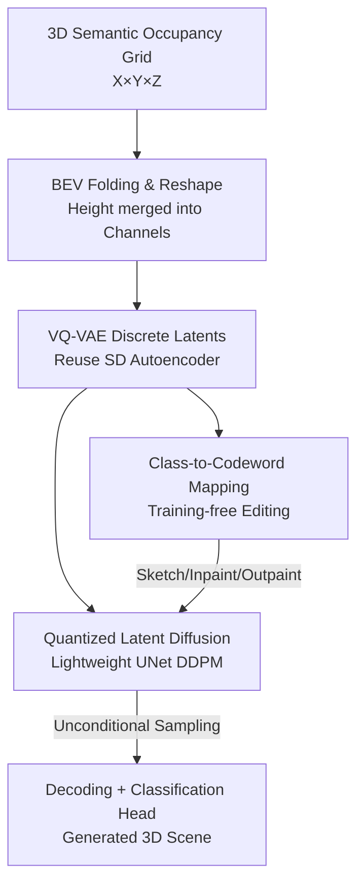

# EditSSC: Toward Editable Semantic Occupancy Scenes with Unconditional Diffusion Models

**Conference**: CVPR 2026  
**arXiv**: [2606.09273](https://arxiv.org/abs/2606.09273)  
**Code**: https://astra-vision.github.io/EditSSC (Project Page)  
**Area**: Autonomous Driving / 3D Semantic Occupancy Generation / Diffusion Models  
**Keywords**: Semantic Occupancy Generation, BEV Representation, VQ-VAE, Latent Diffusion, Training-free Editing

## TL;DR
3D semantic occupancy grids are "flattened" into multi-channel BEV images to reuse off-the-shelf Stable Diffusion VQ-VAE and UNet modules for unconditional scene generation. By leveraging the inherent "class-to-codeword" correspondence in the vector-quantized codebook, the method achieves training-free sketch-guided editing, inpainting, and outpainting. It outperforms 3D-specific baselines in unconditional generation on SemanticKITTI.

## Background & Motivation
**Background**: 3D semantic scene generation is critical for data augmentation and simulation in autonomous driving. Current large-scale outdoor generation methods (e.g., SemCity, SSD) predominantly rely on **3D-specific architectures**—encoding scenes into triplane latent representations paired with complex UNets designed for cross-plane feature sharing.

**Limitations of Prior Work**: These 3D-specific designs introduce two issues. First is **complexity**: triplane encoders and adapted diffusion networks require custom engineering and high tuning costs. Second is **editability**: editing scenes on triplanes (e.g., SSEditor) requires users to provide class outlines across three orthogonal directions, which is unintuitive. Furthermore, triplane representations are difficult to integrate with conditional signals like LiDAR.

**Key Challenge**: There exists a common assumption in the community that **better autoencoder reconstruction leads to higher generation quality**, leading to architecture choices driven solely by reconstruction scores. However, a pilot study reveals this proxy metric is unreliable: an MLP-based autoencoder achieves near-perfect reconstruction (IoU 98.9 / mIoU 98.5) but the worst diffusion generation (FID 156.9) due to its sparse and irregular latent space. Conversely, VQ-VAE, despite lower reconstruction scores, yields the best diffusion results. **The structure of the latent space (smoothness, regularity), rather than reconstruction fidelity, determines diffusion quality.**

**Goal**: Design a 3D semantic occupancy generation pipeline that is both simple and "editable by design," achieving generation and editing capabilities without 3D-specific modules.

**Key Insight**: In driving scenes, objects are typically distributed on the ground with minimal vertical stacking. Thus, a **BEV (Bird's Eye View) representation expanded along two horizontal axes is naturally suited for editing** with 2D conditions. Additionally, **discrete codebooks** from Vector Quantization (VQ) provide the regularized latent space required for diffusion and allow for class prototype retrieval.

**Core Idea**: Fold 3D occupancy grids into multi-channel BEV images and **directly reuse existing 2D diffusion pipelines designed for images (Stable Diffusion's VQ-VAE + lightweight UNet)**. Performing diffusion on quantized discrete latent codes grants training-free editing capabilities via "class-to-codeword" mapping.

## Method

### Overall Architecture
EditSSC follows a classic two-stage latent diffusion pipeline, with every design choice centered on "editability." It takes an $X\times Y\times Z$ 3D semantic occupancy voxel grid (one class label per voxel) as input and outputs a newly generated or edited scene of the same dimensions.

In the first stage, a **VQ-VAE** is trained: each class label is mapped to a $D$-dimensional embedding, and the height dimension $Z$ is collapsed into the channel axis with the embedding dimension $D$, resulting in an $X\times Y\times(Z\cdot D)$ multi-channel BEV image. This allows the use of a standard 2D image autoencoder. The encoder compresses the image into discrete latent codes, and the decoder reconstructs it via a classification head. In the second stage, a lightweight UNet is trained for DDPM diffusion on the **quantized** BEV latent codes. During inference, since each codeword in the codebook corresponds almost exclusively to a single semantic class, a "class-to-codeword" mapping is constructed. Combined with RePaint-style constrained denoising, this enables sketch-guided editing, inpainting, and outpainting **without any retraining**.

### Key Designs

**1. BEV Folding & Reshape: Treating 3D Occupancy as Multi-channel Images**
The pain point of 3D generation is the requirement for triplane encoders and specialized UNets. The authors adopt a minimalist approach: observing that driving scenes expand horizontally with limited vertical information, they fold the $X\times Y\times Z\times D$ voxel embedding tensor along the height dimension into channels, creating a "BEV image" of size $X\times Y\times(Z\cdot D)$. By adjusting the input channels of a VQ-VAE from 3 (RGB) to $Z\cdot D$, **existing 2D image autoencoders can directly process 3D occupancy data**. The decoder reshapes the output back to a 3D volume. This effectively transforms the "difficult-to-edit 3D volume" into an "easy-to-edit 2D image domain."

**2. Diffusion on Quantized Latents: Leveraging VQ Regularization for Better Quality**
This design addresses the "reconstruction $\neq$ generation" contradiction. Instead of diffusing on continuous latents, the DDPM is trained on **quantized discrete latent codes**. The forward process involves 1000 steps of Gaussian noise: $q(\mathbf{z}_t|\mathbf{z}_0)=\mathcal{N}(\sqrt{\bar\alpha_t}\,\mathbf{z}_0,(1-\bar\alpha_t)\mathbf{I})$. The denoising network uses $x_0$-parameterization to predict clean latents directly, with loss $\mathcal{L}_D=\mathbb{E}_{t}\|\mathbf{z}_0-D_\phi(\mathbf{z}_t,t)\|_2^2$. The UNet retains attention layers only at the lowest resolution before the bottleneck to stay lightweight. Quantized latents are preferred because the compact VQ space is superior to sparse, irregular MLP spaces for diffusion (FID 84.9 vs 156.9) and enables discrete codeword-based editing.

**3. Class-to-Codeword Mapping: Zero-cost Training-free Editing**
Existing editing methods like SSEditor require specialized mechanisms and unintuitive triplane manipulation. The authors discovered that VQ codewords have a strong correspondence with semantic classes. By measuring **purity**—the proportion of voxels assigned to a codeword that belong to its most frequent class—they found most codewords are highly pure. By selecting codewords most frequently used by a class with high purity, a **class-to-codeword mapping** is established. User BEV sketches can then be translated directly into latent codes. Using RePaint, the first $K$ steps of denoising enforce the sketch codewords in specified regions, while the remaining $T-K$ steps allow the model to refine boundaries and ensure consistency. This provides editing as a "free byproduct" of the architecture.

### Loss & Training
The VQ-VAE stage jointly trains the embedding layer and classification head with $\mathcal{L}_{\text{VQ-VAE}}=\mathcal{L}_{\text{CE}}+\mathcal{L}_{\text{Lov\'asz}}+\lambda\mathcal{L}_{\text{quant}}$. Lovász-Softmax is used to optimize IoU directly and improve under-represented classes. The quantization loss is $\mathcal{L}_{\text{quant}}=\|\text{sg}[\mathbf{z}_e(\mathbf{x})]-\mathbf{e}\|_2^2+\beta\|\mathbf{z}_e(\mathbf{x})-\text{sg}[\mathbf{e}]\|_2^2$ (where $\text{sg}$ is stop-gradient). The diffusion stage uses standard DDPM loss. The final configuration uses **512 codewords with dimension 8** to ensure 100% codebook utilization.

## Key Experimental Results

### Pilot Study: Reconstruction $\neq$ Generation
Comparing different autoencoders on the SemCity architecture:

| Autoencoder | Representation | IoU↑ | mIoU↑ | FID↓ |
| :--- | :--- | :--- | :--- | :--- |
| SemCity AE | Triplane | 84.84 | 84.65 | 104.1 |
| SemCity AE | BEV | 80.30 | 77.84 | 120.1 |
| SemCity VQ-VAE | BEV | 80.10 | 68.35 | 97.5 |
| MLP | BEV | **98.90** | **98.50** | 156.9 (Worst) |

**Key Finding**: MLP reconstruction is near-perfect, yet its generation is the worst. VQ-VAE has the lowest reconstruction scores but the best generation. This confirms that **latent space structure is more critical for diffusion quality than reconstruction fidelity.**

### Main Results: Unconditional Generation (vs. SemCity Variants)
| Method | IoU↑ | mIoU↑ | KID↓ | CKL↓ | Prec↑ |
| :--- | :--- | :--- | :--- | :--- | :--- |
| SemCity (triplane) | 84.84 | 84.65 | 104.1 | 0.0936 | 0.0329 |
| SemCity (BEV) | 80.30 | 77.84 | 120.1 | 0.1310 | 0.0453 |
| SemCity (BEV VQ-VAE) | 80.10 | 68.35 | 97.5 | 0.0968 | 0.0249 |
| **Ours** | 81.90 | 72.20 | **84.9** | **0.0818** | 0.0362 |

Ours leads significantly in KID (-6.6) and CKL (-0.015), indicating more realistic generated scenes that faithfully reproduce the training set class distribution.

### Key Experimental Results (LiDAR Conditioned vs. SSC)
| Class | Method | IoU↑ | mIoU↑ |
| :--- | :--- | :--- | :--- |
| SSC | JS3C-Net | 57.0 | 24.0 |
| SSC | DiffSSC | 60.3 | 26.7 |
| **Editable SSC** | **Ours** | 42.1 | 12.5 |

Ours lags behind specialized SSC methods in conditional generation, but it is the **only method that supports LiDAR-conditional generation while remaining editable** (SSEditor does not support LiDAR due to architecture complexity).

### Ablation Study
| Dimension | Config | Key Metric | Note |
| :--- | :--- | :--- | :--- |
| VQ Codebook | 512 codes / dim 8 | FID 84.9, 100% Util. | Final choice; competitive performance. |
| VQ Codebook | 2048 codes / dim 8 | FID 93.77, 43.7% Util. | Better reconstruction but wasted capacity. |
| Diffusion Target | Pre-quantization | FID 81.6, CKL 0.0435 | Better quality, but not editable. |
| Diffusion Target | Post-quantization | FID 84.9, CKL 0.0362 | **Editable**, better class distribution (CKL). |

### Key Findings
- **Larger codebooks are not always better**: Increasing codewords from 512 to 2048 caused utilization to drop from 100% to 43.7%. Wasted capacity degraded FID performance.
- **Pre- vs. Post-quantization diffusion**: Continuous (pre-quantization) diffusion yields slightly better FID, but discrete (post-quantization) diffusion yields better CKL and Recall. The addition of editability makes the minor FID trade-off worthwhile.

## Highlights & Insights
- **The folding trick is elegant**: Collapsing the height dimension into channels allows the use of mature image diffusion pipelines (Stable Diffusion components) without modifying the architecture for 3D data.
- **Editing is "free"**: No specialized modules were designed for editing. By discovering high-purity class-to-codeword mappings, editing becomes a zero-cost inference-time process.
- **Challenging the "reconstruction bias"**: The contrast between MLP and VQ-VAE results proves that latent space regularity is the bottleneck for diffusion, an insight applicable to any latent diffusion task.

## Limitations & Future Work
- **Conditional Performance Gap**: LiDAR-conditional IoU (42.1) is significantly lower than specialized SSC methods (60.3+). Editability currently comes at the cost of precision.
- **Data Diversity**: Only validated on SemanticKITTI, which features homogeneous scenes. Low codebook utilization in larger models suggests the data diversity is insufficient to fill the capacity.
- **Qualitative Editing Evaluation**: Editing results are demonstrated qualitatively but lack quantitative metrics like editing fidelity or user studies.
- **Future Work**: Improving conditional performance while maintaining simplicity, expanding to larger datasets, and introducing multi-modal conditions like text-to-3D.

## Related Work & Insights
- **vs. SemCity/SSD (Triplane route)**: These use 3D-specific triplane representations. Ours uses BEV + 2D VQ-VAE, achieving better unconditional generation (KID 84.9 vs 104.1) and superior editability.
- **vs. SSEditor (Editable route)**: SSEditor requires unintuitive 3D sketching and lacks LiDAR support. Ours utilizes 2D BEV sketching and supports LiDAR.
- **vs. DiffSSC**: Specialized SSC methods excel at reconstruction (IoU 60+) but lack unconditional generation and editing capabilities.

## Rating
- Novelty: ⭐⭐⭐⭐ (Clever combination of BEV folding and VQ-based training-free editing)
- Experimental Thoroughness: ⭐⭐⭐ (Solid pilot/ablation studies; limited by single-dataset evaluation and qualitative editing metrics)
- Writing Quality: ⭐⭐⭐⭐ (Strong motivation and clear deduction)
- Value: ⭐⭐⭐⭐ (Provides a low-cost, editable pathway for autonomous driving scene generation)

<!-- RELATED:START -->

## Related Papers

- [\[CVPR 2026\] Monocular Open Vocabulary Occupancy Prediction for Indoor Scenes (LegoOcc)](monocular_open_vocabulary_occupancy_prediction_for_indoor_scenes.md)
- [\[CVPR 2026\] ReScene4D: Temporally Consistent Semantic Instance Segmentation of Evolving Indoor 3D Scenes](rescene4d_temporally_consistent_semantic_instance_segmentation_of_evolving_indoo.md)
- [\[CVPR 2026\] Panoramic Multimodal Semantic Occupancy Prediction for Quadruped Robots](panoramic_multimodal_semantic_occupancy_prediction.md)
- [\[CVPR 2026\] OneOcc: Semantic Occupancy Prediction for Legged Robots with a Single Panoramic Camera](oneocc_semantic_occupancy_prediction_for_legged_robots_with_a_single_panoramic_c.md)
- [\[CVPR 2025\] OccMamba: Semantic Occupancy Prediction with State Space Models](../../CVPR2025/autonomous_driving/occmamba_semantic_occupancy_prediction_with_state_space_models.md)

<!-- RELATED:END -->
