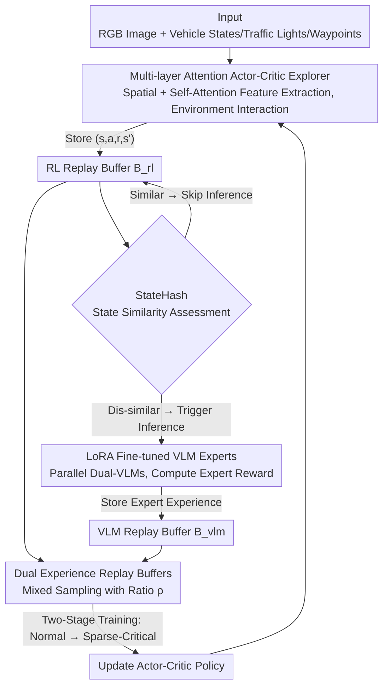

# EE-RL: Vision Language Guided Reinforcement Learning with Explorer and Expert model for End-to-End Autonomous Driving

**Conference**: CVPR 2026  
**Paper**: [CVF Open Access](https://openaccess.thecvf.com/content/CVPR2026/html/Li_EE-RL_Vision_Language_Guided_Reinforcement_Learning_with_Explorer_and_Expert_CVPR_2026_paper.html)  
**Code**: https://github.com/CAVTestLab/EE-RL  
**Area**: Autonomous Driving / End-to-End Driving  
**Keywords**: End-to-End Autonomous Driving, Reinforcement Learning, Vision-Language Models, Sparse Critical Scenarios, Experience Replay  

## TL;DR
EE-RL establishes an end-to-end driving framework composed of an RL "explorer", two LoRA-fine-tuned VLM "experts", and dual experience replay buffers. In this framework, the VLMs are dedicated to generating rewards and experiences for "sparse but critical" scenarios (such as red lights and pedestrian crossings). Coupled with StateHash to bypass redundant VLM inference, the method increases both the driving score and infraction score on CARLA Town03 by approximately 20%, while achieving a 0% accident rate in red-light violation scenarios.

## Background & Motivation
**Background**: End-to-end autonomous driving directly maps raw sensor data to control commands such as throttle and steering. There are two mainstream pathways: Imitation Learning (IL, e.g., Transfuser, InterFuser, UniAD) and Reinforcement Learning (RL, e.g., Roach, WOR). Recently, with the rise of Vision-Language Models (VLMs), "VLM-assisted RL" has become a research hotspot, utilizing the semantic reasoning capabilities of VLMs to provide reward annotations or high-level planning for RL, thus alleviating the sparse reward issue in RL.

**Limitations of Prior Work**: Regardless of whether IL or RL is used, performance degrades significantly in **sparse-critical scenarios**—such as obstacle avoidance, pedestrian crossings, and traffic light recognition—which occur with low frequency but are safety-critical when errors happen. IL is limited by demonstration data quality and exhibits poor generalization; RL struggles because these scenarios are too rare and rewards are too sparse, making them extremely difficult to learn via trial-and-error.

**Key Challenge**: The fundamental conflict in sparse-critical scenarios is the juxtaposition of "extremely sparse samples" and the "need for precise decision-making". In the experience space covered by RL exploration, the proportion of such scenarios is extremely low, leading to policies that perform well under normal driving conditions but fail at critical moments. Meanwhile, involving VLMs directly across the entire operational timeline is bottlenecked by inference latency—performing VLM inference for every frame cannot match the training speed of RL.

**Goal**: This objective is decomposed into two sub-problems: (1) how to densify experience in sparse-critical scenarios to make RL trainable, and (2) how to continuously generate high-quality expert experiences without being bottlenecked by VLM inference latency.

**Key Insight**: Borrowing the RL concept where the behavior policy explores and the target policy optimizes, the authors upgrade this into an "explorer-expert" division of labor: the RL explorer handles trial-and-error in normal scenarios, while the VLM experts focus specifically on semantic reasoning and reward generation in sparse-critical scenarios. The experiences from these two paths are stored in **two independent replay buffers**, which are hybrid-sampled to update the policy.

**Core Idea**: The core idea is a collaborative paradigm where the "RL explorer handles broad exploration" and the "VLM expert handles semantic reasoning and rewards for sparse-critical scenarios". This is coupled with StateHash to skip duplicate VLM inference on highly identical states, thus "densifying" expensive expert experience to specifically prevent policy collapse in safety-critical autonomous driving scenarios.

## Method

### Overall Architecture
The input of EE-RL consists of a monocular RGB image and the ego-vehicle states (speed, throttle, steering, traffic lights, waypoints), while the output is continuous throttle and steering commands. This system operates via the synergy of three modules: an actor-critic-based **RL explorer** that interacts with the CARLA environment in real-time, saving $(s,a,r,s')$ into the RL replay buffer $B_{rl}$; **two VLM experts** that retrieve the latest states from $B_{rl}$ to perform semantic reasoning and compute expert rewards, storing them in the VLM replay buffer $B_{vlm}$. Before each VLM inference, **StateHash** determines if the current state is highly similar to historical states, skipping inference on high similarity; and finally, **dual experience replay buffers** that sample experiences from both buffers according to a mixed ratio to update the Actor-Critic network. Training is conducted in two stages: first learning basic driving in normal scenarios, and then introducing sparse-critical events with mixed batches from dual buffers to focus on safety-critical situations.

### Key Designs

**1. Explorer-Expert Collaborative Paradigm + Dual Experience Replay Buffers: Densifying Sparse-Critical Experience**

Directly employing RL for trial-and-error in sparse-critical scenarios is like looking for a needle in a haystack—these experiences make up such a small portion of the overall data that the policy cannot learn effectively. EE-RL splits learning into two roles: the **RL explorer** (acting as the behavior policy) interacts with the environment and broadly explores normal driving, while the **VLM experts** (using two VLMs) specialize in performing semantic reasoning for sparse-critical scenarios, producing additional "expert rewards" and experiences. Crucially, **two independent replay buffers**, $B_{rl}$ and $B_{vlm}$, are used to store these two types of experience separately. When updating the policy, a mixed batch is sampled from both buffers, where the sample allocations are controlled by a ratio parameter $\rho$:

$$n_{rl}=\left\lceil\frac{\rho}{\rho+1}n\right\rceil,\quad n_{vlm}=n-n_{rl}$$

where $n$ represents the total batch size. This guarantees that each training batch maintains a balance, containing both trial-and-error exploration experiences and high-quality expert experiences tailored to critical scenarios. The agent's total reward is the sum of a rule-based reward and the expert reward: $r_t=r_t^r+r_t^e$, which is subsequently normalized to align their magnitudes. The elegance of this design lies in the fact that it does not mandate the VLMs to manage the entire driving task (which would fail due to latency and hallucination), but rather leverages the VLMs to "augment experience" only for data-parched sparse-critical scenarios, focusing expensive semantic reasoning where it is needed most.

**2. Multi-layer Attention Actor-Critic Backbone: Extracting Key Local Features and Cross-Modal Information Correctly**

Because the explorer must make precise control decisions from monocular RGB images and various vehicle states, standard convolutional encoders are prone to losing key but highly localized objects like traffic lights. To address this, the authors incorporate a **two-level attention mechanism** into the actor-critic visual encoder. The first is **spatial attention pooling**: the image embedding $z_{img}$ computed from a 5-layer CNN is first processed via a $1\times1$ convolution and a Sigmoid activation to generate a spatial attention map, followed by weighted adaptive pooling:

$$A_{spatial}=\mathrm{Sigmoid}(\mathrm{Conv}_{1\times1}(z_{img})),\quad f_{img}=\mathrm{AdaptiveAvgPool}(A_{spatial}\odot z_{img})$$

This step enforces perception over crucial local regions (like traffic lights). The second level is **self-attention**, which concatenates multi-modal embeddings of the image, vehicle states, traffic light states, and waypoint sequences into a unified feature vector $h_0$, which then undergoes standard scaled dot-product attention $h'=\mathrm{Softmax}(QK^\top/\sqrt{d_k})V$ to fuse cross-modal information. Ablation studies indicate that this is the most critical module: removing the multi-layer attention causes the CoR to spike from 3.72 to 9.36 (deteriorating by ~60%), demonstrating that since images contain far richer information than vehicle kinematics or waypoints, the attention mechanism is core to extracting these vital features.

**3. StateHash: Avoiding Redundant VLM Inference with Joint Image and State Similarity**

VLM inference is sluggish; calling the VLM on every frame would stall the RL training process since the generation rate of expert experience cannot match the training requirements. StateHash circumvents this by skipping VLM inference if the current state is highly similar to a historical state that has already been inferred. It **separately** measures the RGB image similarity and vehicle state similarity and fuses them using a weighted sum:

$$S_{total}=0.7\,S_{image}+0.3\,S_{state}$$

On the image side, an adapted perceptual hashing is utilized: after scaling and smoothing the image, a 2D Discrete Cosine Transform (DCT) is performed **separately** on each of the RGB channels. The top-left $16\times16$ low-frequency coefficients are extracted and binarized using channel-specific mean thresholds to generate a 256-bit hash. The similarity between two images' channels is measured via normalized Hamming distance and then weighted as $S_{image}=0.4S_R+0.4S_G+0.2S_B$ (the differentiated weights of green/blue channels make the hash more sensitive to scenes featuring traffic lights). On the state side, continuous variables such as speed, throttle, and steering are matched through normalized similarity with defined tolerances $\tau_i$, while discrete variables like gear and traffic light colors are matched via indicator functions, with the sum of weights equaling 1 (giving higher priority to speed and throttle). Empirically, after $10^6$ steps, a single VLM accumulated only about 8,126 expert experiences; adding StateHash boosted this to approximately 53,783. For dual VLMs, the experiences surged from 17,733 to around 90,566. StateHash effectively redirects saved inference compute toward "densifying" the expert experience buffer.

**4. LoRA-Fine-Tuned VLM Experts + Parallel Dual-VLMs + Two-Stage Curriculum Training: Constructing Reliable and Stable Expert Guidance**

Off-the-shelf general-purpose VLMs suffer from hallucinations and inconsistent reasoning, which disqualifies them from serving as direct, reliable reward models. The authors apply LoRA fine-tuning on **Qwen2.5-VL-32B-Instruct** using a custom CARLA dataset annotated via DeepSeek-R1. The fine-tuning only updates the low-rank adapters $W\leftarrow W+BA$ ($B\in\mathbb{R}^{m\times r},A\in\mathbb{R}^{r\times n}$) with rank $r=64$ (amounting to ~120M trainable parameters). Post fine-tuning, weights are merged and quantized to INT4 to accelerate inference, and the Chain-of-Thought (CoT) reasoning structure is fixed to ensure high-quality, consistent expert instructions. The expert setup utilizes **parallel dual-VLMs**: in the normal driving stage, both VLMs collaborate to generate expert experiences and populate $B_{vlm}$; once transitioning to the sparse-critical stage, one VLM shifts its focus exclusively to reasoning and reward construction in sparse-critical scenes. The training process follows a **two-stage curriculum**: the agent initially trains exclusively on normal driving scenarios, then introduces sparse-critical events and leverages the mixed batches from both buffers to master safety-critical scenes. Ablation studies indicate that LoRA fine-tuning and quantization primarily improve IS and DS (infraction and driving scores) while having a marginal effect on CoR (collision rate).

### Loss & Training
The total reward for the agent is defined as $r_t=r_t^r+r_t^e$ (rule reward + expert reward), followed by min-max normalization $\hat r_t=(r_t-r_{min})/(r_{max}-r_{min})$ to align distinct scales. The framework is not coupled with a single RL algorithm; it operates successfully across three off-policy actor-critic architectures: DDPG, TD3, and SAC. Among these, SAC (where maximum entropy enhances stability) and TD3 (where double Q-networks and delayed updates mitigate Q-value overestimation) perform consistently better than DDPG.

## Key Experimental Results

All experiments are conducted in CARLA 0.9.11, using Town01–04 for training and Town05–06 for testing, on only two RTX 4090D GPUs. Evaluation metrics are defined as: CoR (Collision Rate, ↓), IS (Infraction Score, ↑), DS (Driving Score, ↑), and CS (Composite Score based on the average DS of Town05/06, ↑).

### Main Results

| Benchmark / Scenario | Metric | EE-RL(SAC) | Strongest Baseline VLM-RL | Gain |
|------|------|------|------|------|
| Town03 (Training, Hardest) | DS ↑ | 69.81 | 58.92 | +19.82% (Paper Metric) |
| Town03 (Training, Hardest) | IS ↑ | 72.33 | 60.02 | +20.98% (Paper Metric) |
| Town05/06 Generalization CS ↑ | CS | 80.09 | 65.50 | +22.27% |
| Town05 Test | IS ↑ | 86.27 | 71.52 | +20.62% |
| Red Light Violation Accident Rate ↓ | Probability | 0.00 (TD3 Variant) | 0.10 | Reduced to 0 |

EE-RL achieves the best DS across all Towns. In generalization testing, the SAC variant records a CS of 80.09, outperforming VLM-RL by 22.27%, with the TD3 variant closely behind (78.66). In the sparse-critical scenario evaluation (tracking accident rates across 50 routes), the TD3 variant registers a **0% accident rate** in static obstacle and red light scenarios, claiming the lowest rates in three out of four scenario types. In the long/short route tests, the TD3 variant scores IS 71.09 and DS 69.57 on Town05 long routes, surpassing the strong imitation learning baseline InterFuser (which achieves high short-route IS/DS but exhibits higher CoR).

### Ablation Study

| Configuration | CoR ↓ | IS ↑ | DS ↑ | Explanation |
|------|------|------|------|------|
| Full (Attention + LoRA + Quantization) | 3.72 | 83.43 | 81.94 | Full model |
| w/o Multi-layer Attention | 9.36 | 58.18 | 51.80 | CoR deteriorates by ~60%, most significant performance drop |
| w/o LoRA + w/o Quantization | 4.45 | 66.42 | 64.93 | Retains only attention |
| w/o Quantization | 4.26 | 77.04 | 75.82 | Quantization mainly affects IS/DS |

### Key Findings
- **Multi-layer attention provides the most significant contribution**: Removing it degrades the CoR from 3.72 to 9.36 (~60%). Since images convey much richer information than kinematics and waypoints, attention acts as the core extractor for critical localized features (especially traffic lights).
- **An optimal "sweet spot" exists for the expert sampling ratio in dual replay buffers**: When the expert experience ratio is under 10%, the agent struggles to stop (failing to handle red lights and obstacles); traffic light recognition converges fastest when set to 19%, while obstacle avoidance converges fastest at 24%. Exceeding these thresholds worsens performance due to "over-reliance on expert guidance and insufficient exploration", suggesting that this ratio should be dynamically adjusted depending on the scenario.
- **StateHash + Parallel multi-VLMs dramatically boost expert experience production**: Experience count rises from 8,126 to 53,783 for a single VLM, and from 17,733 to 90,566 for dual VLMs, directly resolving the inference latency bottleneck.
- **SAC/TD3 outperform DDPG**: Double Q-networks with delayed updates (TD3) and maximum entropy formulation (SAC) exhibit superior stability in continuous control tasks.

## Highlights & Insights
- **The strategy of utilizing VLMs as a "data augmenter for sparse-critical scenarios" is highly clever**: Instead of forcing the VLM into the main decision loop (where latency and hallucinations would disrupt execution), they use it as a side-channel expert dedicated to gathering critical-scenario experiences. This retains the semantic reasoning advantage of the VLM without slowing down training execution. This division-of-labor paradigm ("focusing expensive resources exclusively on bottlenecks") can be generalized to other collaborative setups where the main model is fast and the auxiliary model is slow but precise.
- **StateHash offers a novel application of perceptual hashing**: By leveraging multi-channel DCT perceptual hashing and state similarity for "inference duplication", it effectively applies a low-cost cache-hit validation layer over highly expensive inference processes. Increasing the sensitivity to color variations for traffic light scenarios showcases outstanding technical execution. This "skip-if-similar" gating mechanism is directly applicable to cost reduction in any codebase calling large models at high frequency.
- **The sweet-spot phenomenon of the dual-buffer sampling ratio yields deep insights**: Increasing expert experiences indefinitely is counterproductive, as excessive expert guidance suppresses exploration, resulting in sub-optimal policies. This represents a classic manifestation of the "imitation vs. exploration" tension operating at the replay buffer level.

## Limitations & Future Work
- **Sim-to-real gap remains the primary shortcoming**: All experiments are restricted to the CARLA simulation. The authors acknowledge that sim-to-real transfer is still the dominant challenge for end-to-end RL and leave it as future work. Elements such as traffic light colors and obstacle distributions remain highly idealized in simulation.
- **Heavy reliance on VLM annotation and compute budget**: The expert VLM is a 32B model, requiring LoRA fine-tuning on a custom dataset annotated via DeepSeek-R1, which poses a non-trivial replication barrier. The paper also mentions VLM inference API bottlenecks, showing that the accumulation rate of expert experiences declines over training steps.
- **The sampling ratio requires manual tuning for sweet spots**: The optimal expert sampling ratio varies across different sparse-critical scenarios (e.g., 19% vs. 24%). This currently necessitates trial-and-error scanning, indicating the need for an automated self-adaptive adaptation mechanism.
- **Collision rate is not optimal under all circumstances**: On Town01–03, the CoR is slightly higher than that of VLM-RL (which is explicitly optimized for obstacle avoidance). The authors attribute this to EE-RL adopting more aggressive exploration strategies, implying that the "exploration-safety" trade-off demands further refinement.

## Related Work & Insights
- **vs. VLM-RL / VLM-RM**: These methods mainly leverage VLMs to construct semantic rewards via vision-text alignment, with VLM-RL being custom-built for obstacle avoidance. EE-RL, in contrast, goes beyond merely providing rewards; it allows VLM experts to yield complete trajectories stored in a dedicated replay buffer, addressing inference latency with StateHash, which translates to broader coverage of multiple sparse-critical scenarios like traffic lights (on Town03, DS increases by +19.82% compared to VLM-RL).
- **vs. Revolve / RL-VLM-F**: These approaches directly use LLMs/VLMs to design reward functions or preferences for training RL. EE-RL differs by implementing a "dual experience replay buffer + two-stage curriculum" framework, which explicitly splits the learning of normal and sparse-critical scenarios instead of focusing solely on reward shaping.
- **vs. InterFuser / Transfuser (Strong IL baselines)**: These baselines rely on multi-modal, multi-view feature fusion coupled with large-scale imitation learning. EE-RL, despite using only a monocular camera, beats InterFuser's CoR and DS on long routes. This demonstrates that RL exploration combined with VLM experts delivers superior generalization in unseen scenarios compared to pure imitation.
- **vs. Roach / WOR (RL baselines)**: These systems employ BEV representations or HD maps to craft expert policies. EE-RL relies instead on VLMs as semantic experts, yielding significantly stronger capabilities in navigating sparse-critical scenarios.

## Rating
- Novelty: ⭐⭐⭐⭐ The combination of "explorer-expert + dual replay buffers + StateHash inference deduplication" has a clear scope and addresses precise limitations in VLM-assisted RL for autonomous driving. While individual components borrow from existing work, the system integration is highly logical.
- Experimental Thoroughness: ⭐⭐⭐⭐ Evaluated against 10 baselines, 3 RL backbones, and tested on training/generalization, long/short routes, sparse-critical scenarios, sampling ratios, acceleration, and ablation. Quantitative performance on CARLA is very solid; however, all experiments are simulator-bound, and validation on real-world test vehicles is absent.
- Writing Quality: ⭐⭐⭐⭐ The mathematical formulations and flowcharts are clearly articulated, easing replicability. Some tables are slightly dense, and a few improvement claims require close cross-referencing with the source text.
- Value: ⭐⭐⭐⭐ Offers a highly practical engineering solution to address end-to-end RL policy collapse in safety-critical scenarios. The StateHash inference deduplication idea holds prominent transferability.

<!-- RELATED:START -->

## Related Papers

- [\[CVPR 2026\] DriveMoE: Mixture-of-Experts for Vision-Language-Action Model in End-to-End Autonomous Driving](drivemoe_mixture-of-experts_for_vision-language-action_model_in_end-to-end_auton.md)
- [\[CVPR 2026\] E3AD: An Emotion-Aware Vision-Language-Action Model for Human-Centric End-to-End Autonomous Driving](e3ad_an_emotion-aware_vision-language-action_model_for_human-centric_end-to-end_.md)
- [\[CVPR 2026\] ActiveAD: Planning-Oriented Active Learning for End-to-End Autonomous Driving](activead_planning-oriented_active_learning_for_end-to-end_autonomous_driving.md)
- [\[CVPR 2026\] W2W: Language-Model-Based Trajectory Prediction with Reinforcement Learning](w2w_language-model-based_trajectory_prediction_with_reinforcement_learning.md)
- [\[CVPR 2026\] LEAD: Minimizing Learner-Expert Asymmetry in End-to-End Driving](lead_minimizing_learner-expert_asymmetry_in_end-to-end_driving.md)

<!-- RELATED:END -->
