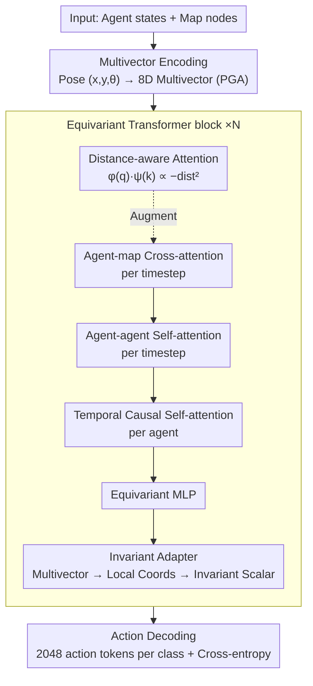

# Efficient Equivariant Transformer for Self-Driving Agent Modeling

**Conference**: CVPR 2026  
**arXiv**: [2604.01466](https://arxiv.org/abs/2604.01466)  
**Code**: None  
**Area**: Autonomous Driving  
**Keywords**: SE(2)-Equivariance, Geometric Algebra, Transformer, Traffic Simulation, Autonomous Driving

## TL;DR

DriveGATr is proposed, an equivariant Transformer architecture based on 2D Projective Geometric Algebra (PGA). It achieves SE(2)-equivariance without explicit pairwise relative position encoding, reaching SOTA performance in traffic simulation tasks while significantly reducing computational costs.

## Background & Motivation

Agent behavior modeling in traffic scenarios is a critical task for autonomous driving. This task possesses inherent SE(2) symmetry: after performing any arbitrary 2D rotation and translation on the entire scene, the outputs of each agent should transform accordingly.

The current mainstream method for achieving SE(2) equivariance is **explicit pairwise relative position encoding (RPE)**: calculating relative poses for every pair of agent/map elements and embedding them into the attention mechanism. This introduces an additional $O(N^2)$ computational overhead, limiting model scalability to larger scenes and batch sizes, and prevents the use of efficient attention kernels like FlashAttention.

Another approach, DRoPE (2D Rotary PE), avoids scalability issues but lacks expressivity (it does not encode geometric information) and only provides translation equivariance rather than rotation equivariance.

## Method

### Overall Architecture

In traffic scenarios, the outputs of each agent should transform synchronously with any arbitrary 2D rotation and translation of the entire scene—DriveGATr aims to make this SE(2) symmetry an "inherent" property of the architecture rather than an approximation learned from data. It encodes each element in the scene (agents and map nodes) as an 8-dimensional **multivector** in the 2D Projective Geometric Algebra $\mathbb{R}^*_{2,0,1}$, processed layer-by-layer by $N$ equivariant Transformer blocks. The key lies in the fact that the invariant inner product between multivectors can be directly used as attention scores, eliminating the need for explicit pairwise relative position encoding (RPE) and allowing the use of standard dot-product attention (including FlashAttention). Each block updates features via agent-map cross-attention, agent-agent self-attention, and temporal causal self-attention (the first two per timestep, the latter per agent), followed by an equivariant MLP and an invariant adapter.

### Key Designs

**1. Multivector Encoding: Embedding poses into geometric algebra for constructive SE(2) symmetry**

Previous methods relied on hand-crafted relative position features to express symmetry, which is memory-intensive and approximate. This approach encodes the entire 2D pose $(x, y, \theta)$ as a single multivector in $\mathbb{R}^*_{2,0,1}$ using bivector components for the point $(x,y)$ and vector components for the directional line passing through that point. Invariant features like velocity and bounding boxes are placed in auxiliary scalars. Consequently, SE(2) transformations (rotations/translations) are realized through the "sandwich product" of the geometric product. Symmetry is guaranteed by the mathematical structure rather than training.

**2. Equivariant Network Primitives: Maintaining equivariance across every operator**

Equivariant encoding alone is insufficient; every layer must be equivariant to prevent breaking symmetry. The paper replaces standard Transformer components with multivector versions:
- **Linear Layer**: Learns weights across k-blade projection components to ensure equivariance.
- **Geometric Bilinear Layer**: Uses geometric products and Join operators to enhance expressivity.
- **Activation Function**: GatedRELU, using scalar components to gate the entire multivector.
- **Normalization**: LayerNorm based on invariant inner products.
- **Scaled Dot-Product Attention**: Uses invariant inner products of multivectors augmented with distance-aware features for standard dot-product attention.

**3. Distance-Aware Attention: Enabling "proximity sensing" in orientation-based inner products**

Using only the invariant inner product of multivectors reflects orientation similarity but is insensitive to spatial distance. Therefore, additional invariant features $\phi(q)$ and $\psi(k)$ are computed for query/key multivectors. When bivector components represent points, $\phi(q) \cdot \psi(k)$ is proportional to the negative squared distance between two points. Concatenating these features to standard Q/K allows the attention mechanism to gain distance sensitivity while maintaining equivariance.

**4. Invariant Adapter: Bridging equivariant features and invariant actions**

The final actions output by an agent are invariants, but the intermediate multivector features carry essential geometric information. The adapter transforms global multivector features into each agent's local coordinate system (an invariant operation) and maps them to auxiliary scalars via MLP. Thus, equivariant geometric information is cleanly converted into invariant representations for downstream action decoding.

### Loss & Training

- Discrete action space using clustering (2048 tokens per agent category).
- Cross-entropy loss for next-step action prediction.
- 3M model uses 128-dimensional auxiliary features; 30M model uses 512-dimensional.
- Trained for 250K steps, learning rate $10^{-3}$, cosine annealing.

## Key Experimental Results

### Main Results

| Method | Params | RMM ↑ | Kinematic ↑ | Interactive ↑ | Map-based ↑ | minADE ↓ |
|------|--------|-------|-------------|---------------|-------------|----------|
| DriveGATr-30M | 30M | **0.7636** | 0.4890 | 0.7272 | 0.8120 | 1.3682 |
| SMART-7M | 7M | 0.7678 | 0.4894 | 0.7306 | 0.8163 | 1.3532 |
| BehaviorGPT | 3M | 0.7438 | 0.4254 | 0.7233 | 0.7976 | 1.3804 |
| Transformer+RPE | 3M | 0.7251 | 0.4708 | 0.6953 | 0.7808 | 1.7486 |
| DriveGATr-3M | 3M | 0.7620 | 0.4859 | 0.7264 | 0.8103 | 1.4192 |

### Ablation Study

| Config | RMM ↑ | minADE ↓ | Description |
|------|-------|----------|------|
| IA + DA | 0.7478 | 1.5798 | Base configuration |
| Map Attn k=4 | 0.7478 | 1.5798 | Attend to nearest 4 map tokens |
| Map Attn k=8 | 0.7528 | 1.5293 | Attend to nearest 8 |
| Map Attn All | **0.7617** | **1.4174** | Attend to all map tokens (Best) |

### Key Findings

1. **DriveGATr-3M is optimal among models with similar parameters**: RMM is 2% higher than BehaviorGPT and significantly leads all non-equivariant baselines. The 30M version matches the realism metrics of SMART-7M.
2. **Full map attention is crucial**: Expanding an agent's map context from k=4 to all tokens improves RMM by 1.4 percentage points and reduces minADE by 1.6. This is a core advantage of DriveGATr over RPE methods, which are often limited to small neighborhoods due to memory constraints.
3. **Significant computational efficiency**: As the number of agents grows, DriveGATr's FLOPs increase much slower than Transformer+RPE, as the latter's RPE computation introduces $O(N^2)$ overhead.
4. **Sample efficiency**: Benefiting from SE(2) equivariance as an inductive bias, DriveGATr outperforms non-equivariant methods across different training set sizes (1%/10%/50%/100%).
5. **True rotation and translation invariance**: In experiments with 90° rotation and 100m translation, DriveGATr produces consistent trajectory predictions, whereas predictions from non-equivariant Transformers and DRoPE (translation-only) change significantly.

## Highlights & Insights

- The core contribution is adapting GATr (E(3)-equivariant) to a 2D SE(2)-equivariant version for driving scenes, reducing dimensionality from 16 to 8 for higher efficiency.
- Design Philosophy: Naturally encoding symmetry via mathematical structures (geometric algebra) rather than hand-crafted relative position features. This makes equivariance a constructive guarantee rather than an approximation.
- The Invariant Adapter is a clever design: a bridge from equivariant features to invariant outputs achieved by transforming to local coordinates.
- Supports direct use of efficient attention kernels like FlashAttention, a major advantage for practical deployment.

## Limitations & Future Work

- Currently only implements SE(2) equivariance on a 2D plane; real driving is a 3D problem (could be extended to 2.5D via auxiliary scalars for height).
- Evaluated only on traffic simulation; performance on motion prediction and planning remains unverified.
- Closed-loop fine-tuning and top-k sampling techniques were not explored.
- Discretization of the action space might limit trajectory precision.

## Related Work & Insights

- GATr (NeurIPS'23) introduced the E(3) equivariant geometric algebra Transformer; this work adapts it for 2D.
- SMART uses RPE for equivariance and leads WOSAC leaderboards but has high computational costs.
- DRoPE extends RoPE to 2D but provides only translation equivariance.
- VN-Transformer uses Vector Neurons for SO(3) equivariance but sacrifices true equivariance for numerical stability.

## Rating

- Novelty: ⭐⭐⭐⭐⭐ (Innovative combination of 2D PGA encoding and equivariant Transformers)
- Experimental Thoroughness: ⭐⭐⭐⭐ (Extensive evaluation on WOSAC, scalability analysis, and ablations)
- Writing Quality: ⭐⭐⭐⭐⭐ (Clear mathematical derivation and detailed architecture description)
- Value: ⭐⭐⭐⭐⭐ (Addresses efficiency bottlenecks in equivariant agent modeling with strong application potential)

<!-- RELATED:START -->

## Related Papers

- [\[CVPR 2026\] Unsupervised Multi-agent and Single-agent Perception from Cooperative Views](unsupervised_multi-agent_and_single-agent_perception_from_cooperative_views.md)
- [\[ECCV 2024\] Equivariant Spatio-Temporal Self-Supervision for LiDAR Object Detection](../../ECCV2024/autonomous_driving/equivariant_spatio-temporal_self-supervision_for_lidar_object_detection.md)
- [\[CVPR 2026\] MAD: Motion Appearance Decoupling for Efficient Driving World Models](mad_motion_appearance_decoupling_for_efficient_driving_world_models.md)
- [\[AAAI 2026\] CaTFormer: Causal Temporal Transformer with Dynamic Contextual Fusion for Driving Intention Prediction](../../AAAI2026/autonomous_driving/catformer_causal_temporal_transformer_with_dynamic_contextual_fusion_for_driving.md)
- [\[CVPR 2026\] ResAD: Normalized Residual Trajectory Modeling for End-to-End Autonomous Driving](resad_normalized_residual_trajectory_modeling_for_end-to-end_autonomous_driving.md)

<!-- RELATED:END -->
