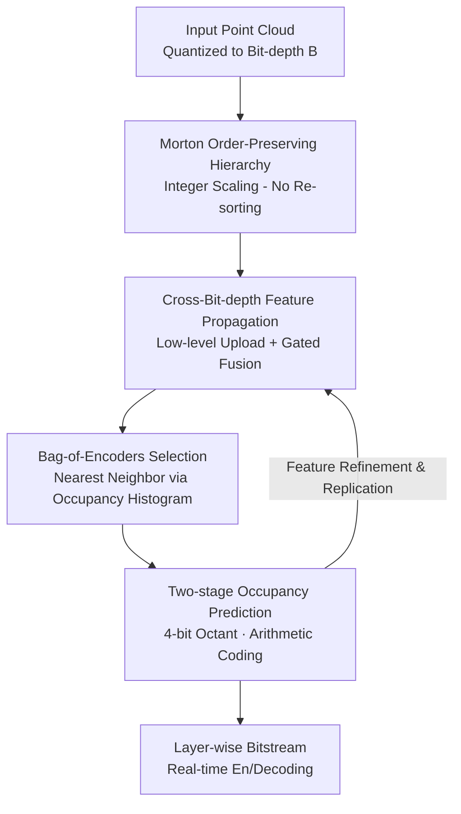

# ELiC: Efficient LiDAR Geometry Compression via Cross-Bit-depth Feature Propagation and Bag-of-Encoders

**Conference**: CVPR 2026  
**arXiv**: [2511.14070](https://arxiv.org/abs/2511.14070)  
**Code**: https://github.com/moolgom/ELiCv1 (Available)  
**Area**: Autonomous Driving / Point Cloud Compression  
**Keywords**: LiDAR Geometry Compression, Octree, Sparse Convolution, Cross-Bit-depth Feature Propagation, Real-time Encoding/Decoding

## TL;DR
Based on the lightweight real-time LiDAR geometry compressor RENO, ELiC introduces a "triad" of Cross-Bit-depth Feature Propagation, Bag-of-Encoders selection, and Morton order-preserving hierarchy. By allowing sparse high bit-depth layers to reuse contextual features from dense low bit-depth layers, ELiC achieves state-of-the-art compression rates with a real-time throughput of 10 FPS on Ford and SemanticKITTI datasets.

## Background & Motivation
**Background**: Current mainstream sparse tensor-based point cloud geometry compressors (SparsePCGC, Unicorn, UniPCGC, RENO, etc.) adopt a "layer-independent bit-depth" design. This involves coarsening the point cloud into an octree structure from the original bit-depth. At each layer, voxel coordinates of the current bit-depth are used as input to independently predict the occupancy probabilities of 8 sub-voxels in the next layer, followed by encoding the 8-bit occupancy symbols into the bitstream using arithmetic coding.

**Limitations of Prior Work**: This "layer independence" is a core weakness. Each layer relies solely on current bit-depth coordinates, re-deriving spatial context that the previous (denser) layers already possessed. This is particularly fatal for LiDAR: Fig. 2 in the paper shows that at high bit-depths (13–15 bits) in the Ford-01 sequence, the average number of neighbors within a $2{\times}2{\times}2$ or $3{\times}3{\times}3$ cubic neighborhood is at most 1. Since sparse convolution kernels are $2{\times}2{\times}2$ or $3{\times}3{\times}3$, the neighborhood is almost empty, leaving the model to "blindly guess" spatial context with minimal evidence.

**Key Challenge**: LiDAR point density varies drastically with bit-depth—dense at lower levels and extremely sparse at higher levels. This density shift changes neighbor statistics, activation rates, and effective receptive fields. Consequently, using a **single shared network** for all layers makes it difficult to achieve optimal compression at every level.

**Goal**: To address two issues without sacrificing the real-time performance of RENO (lightweight sparse networks and variable input bit-depths): (1) Insufficient context in sparse high-level layers; and (2) The inability of a single model to adapt to cross-layer density distribution differences.

**Key Insight**: The authors observe that dense low bit-depth layers contain **reusable geometric context**. By propagating and accumulating features extracted from low levels up the hierarchy, higher levels can "borrow" context even when neighbors are scarce.

**Core Idea**: Replace "layer independence + single shared network" with "cross-layer feature propagation + layer-wise network selection." Combined with a Morton order-preserving hierarchy to eliminate per-layer sorting overhead, ELiC simultaneously optimizes compression rate and real-time performance.

## Method

### Overall Architecture
ELiC follows the progressive octree encoding framework of RENO: given a point cloud quantized to bit-depth $B$, it encodes layer by layer from $b{=}2$ to $b{=}B{-}1$. For each occupied parent voxel in each layer, the model predicts its 8-bit occupancy pattern (octant label $\mathbf{O}^{(b)}\in\{0,\dots,255\}$) for arithmetic coding. It inherits RENO's two-stage strategy: splitting the 8-bit symbol into two 4-bit quadrant labels $\mathbf{Q}_s^{(b)}\in\{0,\dots,15\}$ ($s{=}1$ is $\mathbf{O}\bmod 16$, $s{=}2$ is $\lfloor\mathbf{O}/16\rfloor$). This reduces the symbol space from $2^8$ to $2^4$, simplifying probability modeling.

ELiC adds three contributory components to this skeleton: first, a **Morton Order-Preserving Hierarchy** ensures no sorting is needed throughout the process; then, **Cross-Bit-depth Feature Propagation** passes low-level features to higher levels for gated fusion with current features; finally, a **Bag-of-Encoders** selects the most suitable encoding network from a pool based on the current layer's occupancy distribution. The overall input consists of the coordinate matrix $\mathbf{C}^{(b)}$ and propagated features $\mathbf{F}_{\text{prop}}^{(b)}$, while the output is the bitstream for each stage.

### Key Designs

**1. Morton Order-Preserving Hierarchy: Sort Once, Never Again**

Layer-independent methods often repeatedly sort coordinates and rearrange features during hierarchy traversal to maintain consistency between encoder and decoder, incurring significant overhead. ELiC uses 3D Morton (Z-order) codes to keep coordinate-feature order naturally consistent across levels. The highest-layer coordinates $\mathbf{C}^{(B)}$ are sorted once by Morton code. Downsampling via integer division $\mathbf{C}^{(b-1)}=\lfloor\mathbf{C}^{(b)}/2\rfloor$ then preserves the Morton order for all coarser levels. Consequently, points under the same parent voxel are always in continuous intervals, and parent order inherently contains child order. During upsampling, candidate child coordinates $\widetilde{\mathbf{C}}^{(b+1)}$ are expanded using parent coordinates multiplied by 2 and an offset set $\{\boldsymbol{\delta}_u\}_{u=0}^{7}$ (Eq.3). Actual occupied child coordinates are retrieved via the occupancy mask $\mathbf{M}^{(b)}(n,u)=\lfloor\mathbf{O}^{(b)}(n)/2^u\rfloor\bmod 2$. Since both parent and octant enumerations follow Morton rules, $\mathbf{C}^{(b+1)}$ maintains global Morton order automatically. This single initial sort eliminates all subsequent sorting, reducing encoding and decoding latency by 14.8% and 13.3% respectively.

**2. Cross-Bit-depth Feature Propagation: Borrowing Dense Context for Sparse Levels**

This design directly addresses the "insufficient context" problem at high levels. Unlike RENO, which only extracts context from one layer below, ELiC accumulates and propagates features from multiple lower bit-depth layers. Specifically, each layer starts with an Octant Positional Embedding $\mathbf{f}_{\text{oct}}$ as the initial feature. This is fused with propagated features $\mathbf{F}_{\text{prop}}^{(b)}$ via **channel-wise gated fusion**: $[\mathbf{w}_c,\mathbf{w}_p]=\text{softmax}(\mathbf{W})$, $\mathbf{F}_{\text{fuse}}^{(b)}=\mathbf{w}_c\odot\mathbf{F}_{\text{oct}}^{(b)}+\mathbf{w}_p\odot\mathbf{F}_{\text{prop}}^{(b)}$, where $\mathbf{W}\in\mathbb{R}^{2\times D}$ are learnable channel-wise mixing ratios. After residual refinement and two-stage occupancy encoding, quadrant context $E_s[\mathbf{Q}_s^{(b)}]$ is added back. Finally, refined features $\mathbf{F}^{(b)}$ are copied to occupied sub-voxels via Direct Feature Replication to obtain $\mathbf{F}_{\text{prop}}^{(b+1)}$ (Eq.7). This continuous transport of geometric context ensures stable occupancy prediction even at extremely sparse high levels. Fig. 5 shows that at the 15-bit layer, ELiC effectively lowers bits-per-point in sparse peripheral regions where RENO fails.

**3. Bag-of-Encoders (BoE): Tailoring Networks to Occupancy Distributions**

To resolve the conflict between a single shared network and layer-specific density differences (without the massive size of per-layer unique networks), ELiC uses a pool of compact networks with a shared architecture but distinct parameters. For each layer, two-stage quadrant labels $\mathbf{Q}_s^{(b)}$ are converted into a 16-bin histogram and normalized into a 32-dimensional descriptor $\mathbf{h}$ (Eq.8). Prior to training, $K$-means clustering on descriptors from $b{=}7$ to $15$ identifies $K$ centers $\{\boldsymbol{\mu}_k\}$. The pool consists of $K{+1}$ models (including a base network for $b{=}2$ to $6$). During inference, shallow layers ($b\le6$) use the base network, while deep layers ($b>6$) select the nearest center $k^{(b)}=\arg\min_k\|\mathbf{h}^{(b)}-\boldsymbol{\mu}_k\|_2$ (Eq.9). The index is written into the bitstream. Each pool member also has its own gating parameters $\mathbf{W}_k$, adapting the fusion ratio to the occupancy distribution. With $K{=}5$, ELiC gets within 0.66% of the BD-Rate performance of 14 layer-specific networks while using only 6/14 of the model capacity.

### Loss & Training
Training is progressive from $b{=}2$ to $b{=}15$. In each layer, the BoE-selected network outputs occupancy probabilities, and the loss minimizes estimated bitrate (cross-entropy) across all layers and stages:

$$\mathcal{L}=\sum_{b=2}^{15}\sum_{s=1}^{2}\sum_{n=1}^{N_b}-\log_2 \mathbf{P}_{s,k}^{(b)}\big(n,\mathbf{Q}_s^{(b)}(n)\big)$$

Gradients flow directly through the selected network and **indirectly** through cross-layer propagation to lower levels, encouraging consistent feature interfaces across the pool. Implementation details: PyTorch + torchac + TorchSparse, 300K iterations, batch=1, Adam optimizer, learning rate $5{\times}10^{-4}$ with 0.1 decay at 150K/250K. Two variants differ by channel dimension $D$: ELiC ($D{=}32$) and ELiC-Large ($D{=}64$), with $K{=}5$ (6 networks total). All sparse convolutions use $3{\times}3{\times}3$ kernels.

## Key Experimental Results

Datasets: Ford (MPEG CTC, seq 01 for training, 02/03 for test) and SemanticKITTI (seq 00–10 training, 11–21 test), quantized to 18-bit. Evaluation bit-depths: {16,15,14,13,12}. Distortion measured by D1 (point-to-point) and D2 (point-to-plane); rate by BPP. Since all methods perform lossless coordinate encoding, D1/D2 is identical for a given input bit-depth; the comparison is based on lossless coding efficiency (BD-Rate). Latency measured on RTX 3090 + i9-9900K.

### Main Results

Compression efficiency (BD-Rate relative to G-PCCv30, lower is better):

| Dataset | Metric | ELiC | ELiC-Large | RENO | RENO-Large | Unicorn | TopNet |
|:---:|:---:|:---:|:---:|:---:|:---:|:---:|:---:|
| Ford | D1 (%) | -22.97 | **-26.54** | -14.02 | -14.70 | -25.41 | -26.26 |
| KITTI | D1 (%) | -29.23 | -33.26 | -20.90 | -31.52 | -29.28 | **-34.10** |

ELiC-Large achieves the best compression on Ford (-26.54%) and ranks second to TopNet on KITTI (-33.26% vs -34.10%). Compared to RENO (which has similar runtime), ELiC saves ~8.9% more on Ford and ~8.3% on KITTI.

Runtime (Average per frame Ford+KITTI, in seconds, ratio relative to ELiC):

| Method | enc (s) | dec (s) | vs. ELiC (enc/dec) |
|:---:|:---:|:---:|:---:|
| ELiC | **0.121** | **0.111** | 1.00× / 1.00× |
| ELiC-Large | 0.138 | 0.121 | 1.14× / 1.10× |
| RENO | 0.124 | 1.120 | 1.02× / 1.08× |
| RENO-Large | 0.459 | 0.459 | 3.78× / 4.15× |
| Unicorn | 3.298 | 2.970 | 27.16× / 26.86× |
| TopNet | 1.060 | 1306.4 | 8.73× / **11,811×** |
| G-PCCv30 | 0.515 | 0.576 | 4.24× / 5.20× |

ELiC is the fastest model. At 12-bit input, only RENO, ELiC, and ELiC-Large achieve 10 FPS real-time performance. While TopNet encodes reasonably fast, its serial node-wise decoding takes over 5 minutes per frame—nearly 12,000 times slower than ELiC.

### Ablation Study

| Configuration | Key Metric | Description |
|:---:|:---:|:---:|
| ELiC w/o BoE vs RENO | Ford -8.60% / KITTI -6.61% D1 | Only cross-layer prop; enc/dec ~10%/15% faster. |
| BoE $K{=}3$ | Ford -1.31% / KITTI -2.89% | Compared to w/o BoE, even a small pool is effective. |
| BoE $K{=}5$ (Default) | Ford -1.98% / KITTI -3.54% | Peak performance; increasing $K$ further slightly degrades results. |
| BoE 14 layer-specific (Limit) | Ford -2.52% / KITTI -4.32% | $K{=}5$ is only 0.66% behind with 6/14 the capacity. |
| No Morton (Explicit sorting) | enc +14.8% / dec +13.3% latency | Validates the benefit of once-for-all sorting. |

### Key Findings
- **Feature Propagation is the main driver**: Cross-layer propagation alone (w/o BoE) saves 6.6–8.6% over RENO and is **faster than RENO** (0.90× enc, 0.85× dec) due to a cleaner architecture, showing gains come from information flow, not parameter stacking.
- **BoE has a "Sweet Spot"**: Benefit peaks at $K=5$. $K{=}5$ effectively approximates the "per-layer network" upper bound with high cost-efficiency.
- **Model size is not the determinant**: ELiC-Large (30.7 MB) is smaller than RENO-Large (78.4 MB) but faster and more efficient, dominating the size-speed-performance triangle.

## Highlights & Insights
- **Context Borrowing vs. Receptive Field Stacking**: Standard logic suggests larger kernels (e.g., RENO-Large's $5{\times}5{\times}5$) to handle sparsity, but this causes memory bottlenecks and marginal gains (+0.7%). ELiC's approach of carrying the context upward with $3{\times}3{\times}3$ kernels yields a +3.5% gain while being faster—intelligent information flow is more valuable than raw capacity.
- **Decoupling Adaptation from Overhead**: Morton order-preserving hierarchy turns "consistency" into a zero-cost property of integer scaling, a clever engineering trick that saves 13–15% latency and is transferable to any octree/voxel framework.
- **Lightweight Conditional Routing**: Using occupancy histograms as descriptors for BoE is essentially a sparse Mixture-of-Experts (MoE) approach. It provides data-adaptive capacity with negligible overhead, a strategy useful for any task requiring distribution-based network selection.

## Limitations & Future Work
- **Hard Routing**: BoE selection is based on hard nearest-neighbors of histograms, which might be suboptimal at distribution boundaries. Soft-mixing or learnable routing could marginally improve performance.
- **Generalization**: Results are validated on 64-line LiDAR datasets. Optimal BoE centers for different beam counts or solid-state LiDARs might require retraining.
- **Framework Dependency**: ELiC is an extension of RENO. Whether cross-layer propagation yields similar gains in other frameworks like SparsePCGC or Unicorn remains to be verified.

## Related Work & Insights
- **vs RENO**: Both are two-stage lightweight encoders, but RENO is layer-independent. ELiC's accumulated propagation and BoE save ~8% bitrate at similar speeds.
- **vs RENO-Large**: RENO-Large depends on large kernels and high channel counts ($D{=}128$) but only improves by ~0.7% while being 3x slower. ELiC-Large is superior in every way.
- **vs Unicorn**: Unicorn uses complex Inception ResNets and kNN attention, taking >1s per frame. ELiC achieves comparable or better compression with >20x lower complexity.
- **vs TopNet**: TopNet's Transformer-based tree prediction is the BD-Rate SOTA on KITTI but fails real-time requirements due to its serial decoder. ELiC provides a ~10,000x speedup with similar compression.

## Rating
- Novelty: ⭐⭐⭐⭐ The components represent a precise "information flow overhaul" of real-time compressors. The combination of propagation and BoE suggests a solid innovation.
- Experimental Thoroughness: ⭐⭐⭐⭐ covers two datasets, multiple bit-depths, and comprehensive ablations including size-speed-performance analysis.
- Writing Quality: ⭐⭐⭐⭐ Motivation is clearly driven by the neighbor statistics in Fig. 2; the logic and formulas are sound.
- Value: ⭐⭐⭐⭐ High practical value for autonomous driving and edge computing.

<!-- RELATED:START -->

## Related Papers

- [\[CVPR 2026\] CoLC: Communication-Efficient Collaborative Perception with LiDAR Completion](colc_communication-efficient_collaborative_perception_with_lidar_completion.md)
- [\[CVPR 2026\] DVGT: Driving Visual Geometry Transformer](dvgt_driving_visual_geometry_transformer.md)
- [\[CVPR 2026\] PTC-Depth: Pose-Refined Monocular Depth Estimation with Temporal Consistency](ptc-depth_pose-refined_monocular_depth_estimation_with_temporal_consistency.md)
- [\[ICLR 2026\] MARC: Memory-Augmented RL Token Compression for Efficient Video Understanding](../../ICLR2026/autonomous_driving/marc_memory-augmented_rl_token_compression_for_efficient_video_un.md)
- [\[CVPR 2026\] LiDAR-to-4DRadar Diffusion Bridge via Cross-Modal Alignment and Translation in Latent Space](lidar-to-4dradar_diffusion_bridge_via_cross-modal_alignment_and_translation_in_l.md)

<!-- RELATED:END -->
