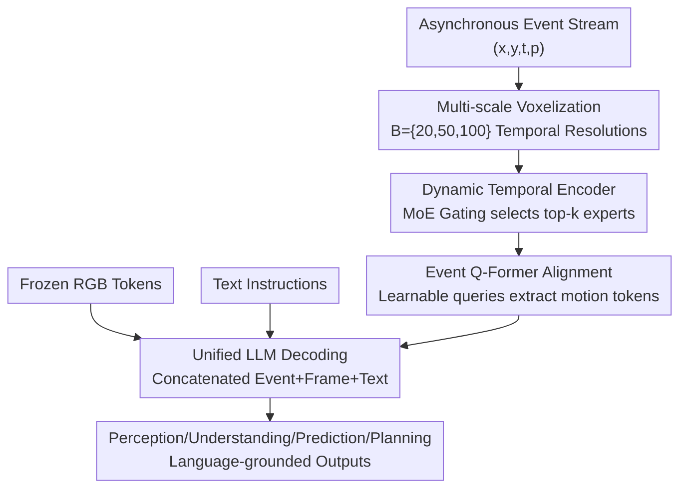

# EventDrive: Event Cameras for Vision-Language Driving Intelligence

**Conference**: CVPR 2026  
**Paper**: [CVF Open Access](https://openaccess.thecvf.com/content/CVPR2026/html/Lu_EventDrive_Event_Cameras_for_Vision-Language_Driving_Intelligence_CVPR_2026_paper.html)  
**Code**: TBD  
**Area**: Autonomous Driving  
**Keywords**: Event Cameras, Vision-Language Driving, Multimodal Benchmark, Multi-scale Temporal Encoding, Q-Former Alignment

## TL;DR
EventDrive establishes the first benchmark that integrates event streams, RGB frames, and language supervision across the entire driving chain (Perception → Understanding → Prediction → Planning, featuring 4 levels, 17 sub-tasks, and 470,000 samples). It introduces EventDrive-VLM—utilizing "multi-scale voxelization + MoE-gated dynamic temporal encoders" and an "Event Q-Former" to align asynchronous events into the LLM semantic space. Event-frame fusion consistently outperforms frame-only and event-only models across all task families, reducing L2 planning error from 4.54m to 3.66m.

## Background & Motivation

**Background**: Event cameras record pixel-level brightness changes with microsecond latency, high dynamic range, and inherent robustness to motion blur. These characteristics are particularly valuable in safety-critical driving scenarios such as rapid ego-motion, abrupt lighting changes, and motion blur, where standard frame-based cameras often fail. However, current event-based research in driving mostly focuses on upstream supervised tasks like detection, segmentation, and optical flow estimation. Meanwhile, the RGB community has shifted toward unified Vision-Language-Action (VLA) frameworks that integrate perception, reasoning, and control into a single network.

**Limitations of Prior Work**: A few attempts to integrate events into vision-language systems (e.g., grounding or caption-based event LMs like EventGPT, EventVL, or LLaFEA) are limited to general scene descriptions or short QA. **They fail to reveal how event-based perception contributes to reasoning and decision-making throughout the full driving loop.** In other words, events are treated as isolated temporal cues rather than part of end-to-end driving intelligence.

**Key Challenge**: There is a lack of a unified interface to systematically evaluate the value of events across the "entire autonomy stack"—one that covers the full chain from environmental perception to ego-vehicle planning while embedding asynchronous events into the language reasoning space. Existing event-language datasets are either simulated, lack real-world coverage (less than 100k samples), or feature fragmented tasks.

**Goal**: (1) Construct a large-scale benchmark that unifies events, frames, and language across perception, understanding, prediction, and planning; (2) Develop a general VLM training framework capable of interpreting, aligning, and reasoning with asynchronous event representations.

**Key Insight**: Decompose the driving loop into four sequential reasoning stages, where each stage is expressed as a "language-grounded" task. This unified protocol quantifies how temporal cues from events enhance various levels of reasoning. On the model side, multi-temporal-scale adaptive encoding and cross-attention query alignment are used to cleanly integrate asynchronous sparse events into the LLM.

## Method

This work presents both a **benchmark and a corresponding model**. The method is divided into two parts: the construction and evaluation protocol of the EventDrive dataset, followed by the EventDrive-VLM architecture for integrating events into LLMs.

### Overall Architecture
EventDrive organizes the driving loop into four sequential phases: **Perception (Environment Sensing) → Understanding (Object-level Reasoning) → Prediction (Short-term Forecasting) → Planning (Ego-vehicle Decision)**. It comprises 17 sub-tasks, each formulated as a language-grounded structural query (e.g., captioning, QA, grounding, trajectory prediction), allowing event-frame models to be evaluated under a unified protocol. Data is constructed using a semi-automated pipeline across three real-world event datasets (DSEC, M3ED, PKU-DAVIS-SOD), with language supervision generated by Qwen3-VL. This results in 471,543 "event-frame-language" samples. Additionally, a **hard split** containing only low-light and motion-blur sequences is extracted to specifically evaluate the advantages of events.

The EventDrive-VLM model follows a clear serial pipeline: asynchronous events are first converted into **multi-scale voxel tensors** to capture motion at different time scales; a **dynamic temporal encoder** uses MoE gating to adaptively aggregate these multi-scale features; the **Event Q-Former** performs cross-attention to extract language-aligned, motion-related tokens from event features. These event tokens are concatenated with frozen frame tokens and text embeddings, then fed into the LLM for unified driving reasoning. Finally, a two-stage curriculum training process aligns the three pathways (event, vision, and language).

### Key Designs

**1. Hierarchical Language-Grounded Task System: Quantifying the Autonomy Stack**

This forms the backbone of the benchmark, addressing the limitation that event research typically stops at isolated perception. The driving process is split into 4 levels and 17 sub-tasks: **Perception** (6 tasks: scene type, visibility, traffic flow, weather, signal lights, road conditions) tests global scene understanding where events provide stable edges and temporal gradients under poor lighting; **Understanding** (6 tasks: object presence, appearance, motion state, ego-relationship, environmental relationship, grounding) tests semantic and spatial relationships where asynchronous events resolve interaction ambiguities; **Prediction** (2 tasks: velocity changes, orientation changes) evaluates short-term behavior where high temporal density directly reveals velocity and acceleration; **Planning** (3 tasks: speed intent, direction intent, future waypoints) assesses ego-decision making where continuous temporal structure stabilizes decisions under low visibility.

**2. Semi-automated Language Supervision Pipeline + Hard Split**

To address the scarcity of real-world event-language data, the authors use Qwen3-VL to generate structured language supervision from synchronized RGB frames, event streams, bounding boxes, LiDAR, and ego-pose. Scene-level perception is derived from global captions split into balanced QA pairs; object-level understanding uses DSEC GT bounding boxes to generate attribute descriptions; prediction uses ego-pose to project 3D boxes and extract trajectories; planning uses M3ED trajectory supervision. The resulting 470k samples significantly exceed existing datasets (<100k). The **hard split** isolates "frame-degraded" scenarios to measure event advantages without dilution by easy cases.

**3. Dynamic Temporal Event Encoder: Adaptive Time Resolution via MoE Gating**

Event stream density varies significantly across datasets and tasks. Traditional voxelization uses a **fixed** number of bins $B$, where long exposure windows may be compressed and fast motion blurred, losing high-frequency details. Given an event stream $E=\{e_k\}_{k=1}^K$ where $e_k=(x_k, y_k, t_k, p_k)$, standard voxelization maps events to a 4D tensor:

$$E(p,\tau,x,y)=\sum_{e_k\in E}\delta(p-p_k)\,\delta(x-x_k,y-y_k)\,\delta(\tau-\tau_k),\quad \tau_k=\left\lfloor\frac{t_k-t_a}{t_b-t_a}B\right\rfloor.$$

Instead of a single $B$, Ours uses a set of temporal resolutions $\mathcal{B}=\{b_n\}_{n=1}^N$ to construct multiple voxel tensors $E_n$. Each expert network $\sigma(\cdot)$ processes its respective tensor to produce $F_n=\sigma(E_n)$. An **MoE gating** mechanism adaptively weights these: expert features are concatenated and globally average pooled into a descriptor $f_c$, with gating logits defined as:

$$z=W_g f_c+\text{Softplus}\big(\epsilon\odot(W_{noise}f_c)\big),\quad \epsilon\sim\mathcal{N}(0,1),$$

where the noise term encourages expert diversity. Only top-$k$ logits are kept, and weight $\alpha_n$ is obtained via softmax normalization. The aggregated representation is $F_e=\sum_{n=1}^N\alpha_n F_n$. This allows the model to emphasize high-resolution temporal features during fast motion while using coarser aggregation during slow motion.

**4. Event Q-Former Alignment: Extracting Motion Tokens**

To align event features with the LLM semantic space, simply concatenating them with frame tokens ignores modal asymmetry and increases computational overhead. The authors employ a Q-Former style cross-attention: a set of learnable event queries $q_e \in \mathbb{R}^{N_q \times d}$ attends to flattened event feature maps $f_e \in \mathbb{R}^{(HW) \times d}$:

$$z_e=\text{softmax}\!\left(\frac{(q_e W_Q)(f_e W_K)^\top}{\sqrt{d}}\right)(f_e W_V).$$

Each query selectively focuses on temporally informative regions of the event stream, producing compact motion-aware embeddings. These are projected into the LLM embedding space as tokens $h_e$, concatenated with $h_f$ (frames) and $h_t$ (text). This query-centric alignment extracts only the most salient motion patterns, maintaining temporal uniqueness while being computationally efficient.

### Loss & Training
A two-stage curriculum training strategy is used:

- **Stage 1: Event-Language Pre-alignment**: The LLM and frame vision encoder are frozen. Only the event encoder, Q-Former, and projection layers are trained using a language modeling objective on caption data. This allows the event encoder to organize temporal/motion structures into LLM-compatible embeddings without affecting pre-trained frame semantics.
- **Stage 2: Instruction Fine-tuning**: The LLM transformer blocks and the entire event pathway are fine-tuned on all caption + QA data, while the frame vision encoder remains frozen. This tightly couples temporal and semantic signals for unified "perception-to-action" reasoning.

Implementation uses Qwen2.5-VL-7B-Instruct, an RVT backbone for the event encoder, and dynamic temporal bins $B=20,50,100$. Training was conducted on 16 H20 GPUs with AdamW, cosine annealing, and FlashAttention 2.

## Key Experimental Results

### Main Results
Comparison across the four task families on the EventDrive benchmark (percentages %, L2 in meters; bold denotes best):

| Model | Perception Acc@P | Understanding Acc | Understanding Acc@60 | Prediction Speed | Planning Path | Planning L2↓ |
|-------|------------------|-------------------|----------------------|------------------|---------------|--------------|
| EventGPT-7B (Event-only) | 52.25 | 38.78 | 5.49 | 27.84 | 76.08 | 11.42 |
| Qwen2.5-VL-7B (Frame-only FT*) | 75.88 | 58.44 | 69.94 | 36.84 | 89.44 | 4.54 |
| InternVL3-8B (Frame-only) | 74.37 | 60.60 | 0.24 | 4.41 | 84.34 | 9.84 |
| **EventDrive-VLM (Event+Frame)** | **78.89** | **65.46** | **72.86** | **42.44** | **92.35** | **3.66** |

In zero-shot transfer on Event-Chat, EventDrive-VLM achieved a Complex Reasoning score of 4.15, surpassing EventGPT-7B (4.09), demonstrating generalized event-language alignment.

### Ablation Study
Decomposition of the three core modules (values are task averages):

| Configuration | Perception Acc | Understanding mIoU | Planning L2↓ | Description |
|---------------|----------------|--------------------|--------------|-------------|
| Voxelization $N=1$ | 82.40 | 69.52 | 4.11 | Single temporal resolution |
| Voxelization $N=5$ | 83.95 | 72.25 | 3.88 | Saturated gains at 5 horizons |
| Aggregation Add | 76.76 | 67.64 | 4.57 | Naive sum (weakest) |
| Aggregation Wt.sum | 83.84 | 70.56 | 3.75 | Weighted sum < top-k expert |
| Alignment Concat | 79.35 | 71.93 | 4.01 | Modal imbalance + long sequence |
| **Ours (N=3 + MoE + Q-Former)** | **83.66** | **72.56** | **3.66** | Full architecture |

### Key Findings
- **Prediction shows the largest modality gap**: Inferring velocity/orientation from static frames is ill-posed (InternVL3 Speed score is only 4.41). Events directly encode motion, providing the most intuitive evidence of their value.
- **Top-k selection outperforms mixing**: MoE gating performing better than weighted sums suggests that suppressing irrelevant temporal resolutions is more effective than indiscriminate fusion.
- **Frame models fail on the hard split**: Multiple frame-only VLMs show near-zero grounding accuracy (Acc@60) under low light and motion blur, confirming that some motion cues simply cannot be inferred from RGB alone.

## Highlights & Insights
- **Quantifying event value at task granularity**: Instead of vague claims of superiority, the sub-task structure and hard split pinpoint exactly where events are indispensable (e.g., prediction, movement grounding) and under what conditions (e.g., low light).
- **MoE for representation selection, not capacity expansion**: MoE here acts as an adaptive switch for time scales rather than just adding parameters. The efficacy of top-k selection is a clean example of MoE used for feature selection.
- **Q-Former for asynchronous modalities**: Directly concatenating sparse events into LLMs is inefficient. Using learnable queries to extract motion tokens saves computation while preserving temporal specificity—a strategy applicable to Radar or Audio.

## Limitations & Future Work
- **Reliance on Qwen3-VL supervision**: 470k samples were semi-automatically labeled by a VLM, which may inherit biases or attribute errors. Reliability should be cross-referenced with human check ratios.
- **Coverage boundaries**: Data is limited to specific regions and sensor configurations (DSEC/M3ED/PKU). Generalization across geolocations or diverse event camera models requires further validation.
- **Weak event-only baselines**: Comparison with EventGPT (zero-shot) might not be entirely fair compared to the fully fine-tuned proposed model.
- **Future Directions**: Exploring true closed-loop control and end-to-end latency advantages inherent to event asynchronous processing.

## Related Work & Insights
- **vs. EventGPT / LLaFEA**: While these connect event encoders to LLMs, they focus on general captioning or QA. This work pushes event VLMs toward comprehensive reasoning across the autonomy chain, explicitly quantifying contributions at each stage.
- **vs. Fixed-window Fusion**: Most prior fusion methods use fixed temporal windows, failing to capture motion unfolding across scales. Ours introduces frequency-adaptive fusion via multiple horizons and MoE gating.

## Rating
- Novelty: ⭐⭐⭐⭐ First benchmark to cover the full driving chain for events; architecture uses a clever combination of MoE and Q-Former.
- Experimental Thoroughness: ⭐⭐⭐⭐ Extensive tasks and ablations, though event-only baselines are slightly limited.
- Writing Quality: ⭐⭐⭐⭐ Clear hierarchy and motivation; well-structured equations and figures.
- Value: ⭐⭐⭐⭐⭐ Provides a large-scale real-world benchmark and framework, serving as reusable infrastructure for event-driven driving intelligence.

<!-- RELATED:START -->

## Related Papers

- [\[CVPR 2026\] DriveVLN: Towards Mapless Vision-and-Language Navigation in Autonomous Driving](drivevln_towards_mapless_vision-and-language_navigation_in_autonomous_driving.md)
- [\[CVPR 2026\] Learning Vision-Language-Action World Models for Autonomous Driving](vla_world_learning_vision_language_action_world_models_for_autonomous_driving.md)
- [\[CVPR 2026\] FlashCap: Millisecond-Accurate Human Motion Capture via Flashing LEDs and Event-Based Vision](flashcap_millisecond-accurate_human_motion_capture_via_flashing_leds_and_event-b.md)
- [\[CVPR 2026\] DSERT-RoLL: Robust Multi-Modal Perception for Diverse Driving Conditions with Stereo Event-RGB-Thermal Cameras, 4D Radar, and Dual-LiDAR](dsert-roll_robust_multi-modal_perception_for_diverse_driving_conditions_with_ste.md)
- [\[CVPR 2026\] VGGDrive: Empowering Vision-Language Models with Cross-View Geometric Grounding for Autonomous Driving](vggdrive_empowering_vision-language_models_with_cross-view_geometric_grounding_f.md)

<!-- RELATED:END -->
