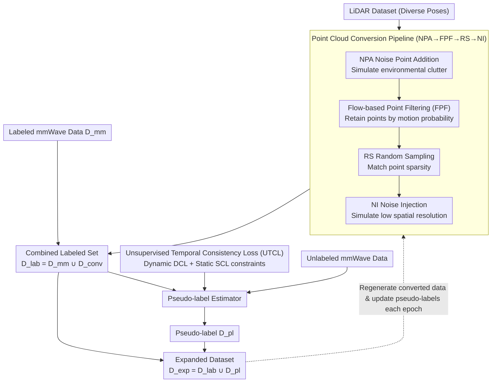

# EMDUL: Expanding mmWave Datasets for Human Pose Estimation with Unlabeled Data and LiDAR Datasets

**Conference**: CVPR 2026  
**arXiv**: [2603.14507](https://arxiv.org/abs/2603.14507)  
**Code**: [GitHub](https://github.com/Shimmer93/EMDUL)  
**Area**: Autonomous Driving  
**Keywords**: mmWave Radar, Human Pose Estimation, Data Expansion, LiDAR Point Cloud Conversion, Semi-supervised Learning

## TL;DR

The EMDUL pipeline is proposed to significantly expand the scale and diversity of mmWave HPE datasets. It achieves this by annotating unlabeled mmWave data with pseudo-labels (using a novel Unsupervised Temporal Consistency Loss, UTCL) and employing a closed-form LiDAR→mmWave point cloud converter (featuring Flow-based Point Filtering, FPF). This approach reduces in-domain error by 15.1% and cross-domain error by 18.9%.

## Background & Motivation

Millimeter-wave (mmWave) radar has gained continuous attention in Human Pose Estimation (HPE) due to its advantages in 3D perception, privacy protection, and robustness to lighting. While mainstream methods use processed 3D point clouds as input, current mmWave HPE datasets suffer from two major bottlenecks:

**Data Scarcity**: Labeled mmWave HPE datasets are extremely scarce, with high costs for collection and annotation.

**Insufficient Diversity**:
   - **Uniform Point Cloud Attributes**: Limited device models and environments lead to narrow distributions of detection noise, point density, and motion sensitivity.
   - **Monotonous Poses**: Subjects are mostly in standing positions facing the radar, lacking complex actions like squatting or swimming.

Simultaneously, **unlabeled mmWave data** is easy to collect, and **LiDAR HPE datasets** (e.g., LiDARHuman26M, HmPEAR) offer abundant and diverse poses. However, fundamental differences exist between LiDAR and mmWave point cloud attributes due to distinct physical sensing principles (LiDAR perceives static objects, while mmWave relies on the Doppler effect and excels at detecting moving targets). Directly mixing them yields poor results. Previous expansion methods either only expanded skeletons without improving point cloud attribute distributions or required paired mmWave-LiDAR data, which is difficult to acquire.

## Method

### Overall Architecture

EMDUL consists of two independent modules:

1. **Pseudo-label Estimator**: Trained using labeled mmWave data and the UTCL loss to generate pseudo-labels $D^{\text{pl}}$ for unlabeled mmWave data.
2. **Closed-form Point Cloud Converter**: Converts LiDAR datasets into mmWave point clouds $D^{\text{conv}}$.

The workflow is as follows: first, LiDAR data is passed through the converter to generate $D^{\text{conv}}$, which is merged with the original $D^{\text{mm}}$ to form $D^{\text{lab}}$. Then, $D^{\text{lab}}$ is used to train the pseudo-label estimator, which annotates unlabeled data to obtain $D^{\text{pl}}$. Finally, the dataset is expanded as $D^{\text{exp}} = D^{\text{lab}} \cup D^{\text{pl}}$. During training, $D^{\text{conv}}$ is regenerated (with new random seeds) and $D^{\text{pl}}$ is updated every epoch to achieve iterative refinement.

### Key Designs

**1. Full Point Cloud Conversion Pipeline (NPA→FPF→RS→NI): Step-by-step transformation of LiDAR to mmWave**

Differences between LiDAR and mmWave in terms of clutter, density, spatial resolution, and motion sensitivity cannot be bridged by a single operation. Thus, the converter chains four steps into a pipeline, each addressing a specific attribute difference: NPA (Noise Point Addition) first adds a fixed amount of noise points to simulate mmWave environmental clutter; FPF (Flow-based Point Filtering, the most significant contributor) filters points based on a motion detection mechanism; RS (Random Sampling) downsamples to match mmWave point sparsity; and NI (Noise Injection) adds random noise to coordinates to simulate lower spatial resolution. By following the NPA→FPF→RS→NI sequence, a LiDAR frame is aligned with mmWave distributions in terms of clutter, sparsity, noise, and motion sensitivity without requiring any paired cross-modal data.

**2. Flow-based Point Filtering (FPF): Replicating mmWave's "Moving Objects Only" characteristic**

LiDAR point clouds cannot be used directly as mmWave data because LiDAR scans static objects, whereas mmWave primarily captures moving targets via the Doppler effect. FPF simulates this mechanism at the point cloud level: it calculates a 3D flow vector for each point via inverse distance weighted interpolation based on skeleton optical flow, then performs probabilistic retention based on flow magnitude—points with smaller flow (more static) are more likely to be discarded:

$$\mathcal{P}(P_t[i] \in P_t^{\text{conv}}) = \min\left(\frac{\|F_t^P[i]\|_2}{\upsilon_t}, 1\right)$$

The resulting point clouds match real mmWave in terms of "dense at motion, sparse at static" distributions. In ablation studies, this is the most effective module: with FPF, a binary classifier misclassifies 60.46% of converted point clouds as real mmWave (compared to only 43.06% without FPF), indicating a significantly narrowed modality gap.

**3. Unsupervised Temporal Consistency Loss (UTCL): Supervised signals for unlabeled data without manual labels**

While the conversion pipeline handles LiDAR data, unlabeled mmWave data lacks ground truth poses for constraints, risking biased training for pseudo-labels. UTCL translates the physical prior of mmWave radar—that moving parts are more easily detected—into temporal constraints: joints near detected point clouds are likely moving, while joints far from the cloud are likely static. It decomposes into two complementary components. The Dynamic Consistency Loss (DCL) encourages joints near the point cloud to have non-zero optical flow, applying a hinge penalty to flow magnitudes smaller than a threshold $\eta$:

$$L^{\text{dyn}} = \frac{1}{|F_t^{\text{dyn}}|} \sum_{k} \max(0, \eta - \|F_t^{\text{dyn}}[k]\|_2)$$

Conversely, the Static Consistency Loss (SCL) suppresses the optical flow magnitude of joints far from the point cloud, forcing them toward a static state:

$$L^{\text{sta}} = \frac{1}{|F_t^{\text{sta}}|} \sum_{k} \|F_t^{\text{sta}}[k]\|_2$$

Using only DCL pushes predictions toward excessive motion, while using only SCL freezes the posture. They must be combined (ablation shows improvement only when joined) and used alongside the supervised loss $L^{\text{lab}}$ on labeled data to turn unlabeled data into effective supervision.

### Loss & Training

The total loss for the pseudo-label estimator is:

$$L = L^{\text{lab}} + \lambda^{\text{con}} L^{\text{con}}$$

- $L^{\text{lab}}$: MSE loss on labeled data.
- $L^{\text{con}} = L^{\text{dyn}} + L^{\text{sta}}$: UTCL.
- $\lambda^{\text{con}} = 0.01$.

Training lasts 100 epochs using the AdamW optimizer with a learning rate of $10^{-4}$, employing cosine annealing and linear warmup. The inference model $\theta^{\text{infer}}$ is trained alongside the estimator; $\theta^{\text{pl}}$ is updated at the start of each epoch, followed by $\theta^{\text{infer}}$.

## Key Experimental Results

### Main Results

Using 10% labeled MM-Fi (F) or mmBody (B) data in the full setting (+unlabeled+HmPEAR), MPJPE (cm):

| Setting | Method | Backbone | MPJPE | PA-MPJPE |
|------|------|------|-------|----------|
| F→F (In-domain) | P4T baseline | P4T | 12.23 | 7.95 |
| F→F | EMDUL | P4T | **10.06** | 7.01 |
| F→F | EMDUL | SPiKE | 10.40 | 7.23 |
| B→F (Cross-domain) | P4T baseline | P4T | 33.62 | 15.85 |
| B→F | EMDUL | SPiKE | **22.80** | 14.09 |
| B→F | Mean Teacher | SPiKE | 32.71 | 15.74 |

- In-domain (F→F) MPJPE decreased by **15.1%** (12.23→10.06; using SPiKE reaches 17.5% outperforming Mean Teacher).
- Cross-domain (B→F) MPJPE decreased by **18.9%**, with SPiKE outperforming Mean Teacher by **30.3%**.

### Ablation Study

| Configuration | F→B MPJPE | PA-MPJPE | Description |
|------|-----------|----------|------|
| No Pseudo-labels (PCC only) | 15.22 | 11.51 | Converted LiDAR already provides significant gains |
| +$L^{\text{lab}}$ only | 15.12 | 11.44 | Supervised by labeled data |
| +$L^{\text{lab}}$+DCL+SCL (Full UTCL) | **14.89** | **11.11** | Components are complementary |
| PCC w/o FPF | 15.85 | 12.23 | FPF is the largest contributor |
| PCC Full | 14.89 | 11.11 | All components are complementary |

**Authenticity Verification of LiDAR Point Cloud Conversion**: A binary classifier was trained to distinguish between mmWave and LiDAR point clouds. With FPF, 60.46% of converted point clouds were classified as mmWave (compared to 43.06% without FPF).

### Key Findings

- FPF is the single most impactful module in the point cloud conversion pipeline, directly simulating the physical motion detection mechanism of mmWave.
- DCL and SCL in UTCL do not improve cross-domain performance when used individually, but combined they show significant efficacy—individually, they bias predictions toward over-activity or over-stasis.
- The advantage of EMDUL is most pronounced with 1% labeled data (MPJPE reduced from 18.40 to 14.77).
- Cross-domain performance improvements are larger than in-domain gains, indicating that EMDUL effectively improves data diversity rather than just overfitting.

## Highlights & Insights

- **Clever Use of Physical Priors**: UTCL translates the mmWave Doppler motion detection mechanism into an unsupervised loss constraint, serving as a model for physics-driven semi-supervised design.
- **Closed-form Conversion Without Paired Data**: LiDAR→mmWave conversion does not rely on any paired cross-modal data; it only requires independent LiDAR datasets.
- **Dynamic Data Regeneration**: Re-randomizing converted data every epoch effectively increases training data diversity, acting as a form of online data augmentation.

## Limitations & Future Work

- The point cloud conversion pipeline relies on empirical parameters (thresholds $\gamma$, $\delta$, etc.), which may not be optimal for all scenes—future work could explore adaptive or learnable conversions.
- UTCL modeling of complex motion patterns is still insufficient; more refined temporal models could be introduced.
- Currently supports only single-person HPE; extending to multi-person scenarios (occlusion, interaction) is a critical direction.

## Related Work & Insights

- Unlike Video2mmPoint and other video-to-point-cloud methods, EMDUL operates directly in the 3D point cloud domain and improves attribute distributions.
- The motion detection simulation strategy of FPF can be extended to other Doppler-based sensors (e.g., FMCW radar).
- The temporal consistency philosophy of UTCL could inspire other self-supervised 3D estimation tasks.

## Rating

- Novelty: ⭐⭐⭐⭐ First systematic study of cross-modal point cloud conversion from LiDAR to mmWave for HPE data expansion.
- Experimental Thoroughness: ⭐⭐⭐⭐⭐ Covers two mmWave and two LiDAR datasets with comprehensive ablations and multi-backbone validation.
- Writing Quality: ⭐⭐⭐⭐ Clear structure with well-articulated physical intuitions.
- Value: ⭐⭐⭐⭐ Addresses the data bottleneck in mmWave HPE with a highly versatile method.

<!-- RELATED:START -->

## Related Papers

- [\[CVPR 2026\] Towards Balanced Multi-Modal Learning in 3D Human Pose Estimation](towards_balanced_multi-modal_learning_in_3d_human_pose_estimation.md)
- [\[CVPR 2026\] LA-Pose: Latent Action Pretraining Meets Pose Estimation](la-pose_latent_action_pretraining_meets_pose_estimation.md)
- [\[CVPR 2026\] PTC-Depth: Pose-Refined Monocular Depth Estimation with Temporal Consistency](ptc-depth_pose-refined_monocular_depth_estimation_with_temporal_consistency.md)
- [\[CVPR 2026\] Bezier Degradation Modeling for LiDAR-based Human Motion Capture](bezier_degradation_modeling_for_lidar-based_human_motion_capture.md)
- [\[CVPR 2026\] ShelfOcc: Native 3D Supervision beyond LiDAR for Vision-Based Occupancy Estimation](shelfocc_native_3d_supervision_beyond_lidar_for_vision-based_occupancy_estimatio.md)

<!-- RELATED:END -->
