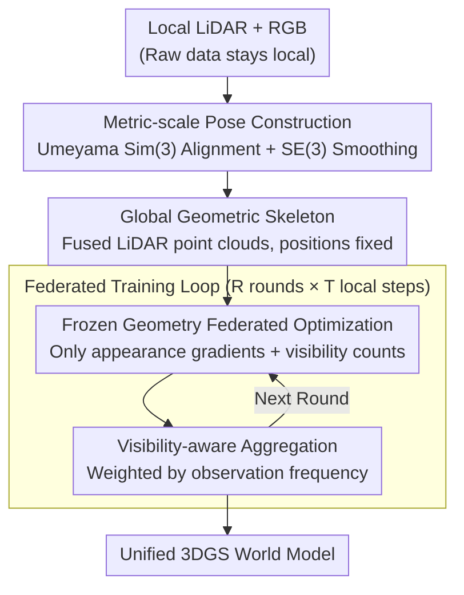

# F3DGS: Federated 3D Gaussian Splatting for Decentralized Multi-Agent World Modeling

**Conference**: CVPR 2026  
**arXiv**: [2604.01605](https://arxiv.org/abs/2604.01605)  
**Code**: Coming soon (includes dataset and development kit)  
**Area**: Autonomous Driving / Multi-agent 3D Reconstruction  
**Keywords**: Federated Learning, 3D Gaussian Splatting, Multi-agent, Distributed Reconstruction, Visibility-weighted Aggregation

## TL;DR

F3DGS is proposed as the first method to apply the federated learning framework to 3DGS, achieving multi-agent distributed 3D reconstruction through frozen geometry and visibility-aware aggregation without raw data sharing.

## Background & Motivation

**Background**: 3DGS has achieved SOTA in novel view synthesis and is widely used in robotics, autonomous driving, and embodied AI.

**Limitations of Prior Work**: All existing 3DGS methods assume centralized data access—all observations must be jointly optimized on a single machine. This faces three constraints in multi-agent distributed scenarios:
   - **Communication Overhead**: Bandwidth and storage for aggregating high-resolution images scale linearly with the number of agents.
   - **Data Privacy**: In multi-operator/multi-organization settings, raw sensor data is private and cannot be shared directly.
   - **Scalability**: Computational demands for joint optimization are tied to the total inference size, creating a centralized bottleneck.

**Key Challenge**: Federated Learning (FL) can solve these issues by sharing only model updates, but applying FedAvg directly to 3DGS leads to two domain-specific problems: **geometric drift** (inconsistent position parameters optimized independently) and **partial observability** (each client observes only a subset of Gaussians).

**Goal**: Achieve unified 3DGS reconstruction through multi-agent collaboration under federated constraints (zero raw image exchange).

**Key Insight**: Utilize the explicit separability of 3DGS parameters (position, covariance, and color are independent tensors) to decouple geometry and appearance.

**Core Idea**: Freeze a shared geometric skeleton (fixed positions) and perform federated optimization only on appearance attributes, using visibility-weighted aggregation to handle partial observability.

## Method

### Overall Architecture

F3DGS addresses the challenge of collaborative reconstruction into a unified 3DGS world model when multiple agents observe only parts of a scene and cannot exchange raw images. The breakthrough lies in leveraging the naturally separable parameters of 3DGS. By aligning client trajectories to a unified coordinate system and fusing LiDAR point clouds from all clients into a **shared global geometric skeleton** which remains fixed, clients then perform federated optimization only on appearance attributes. Updates are weighted back to the global model based on visibility frequency ("more observations equals higher weight"). The federated training iterates for multiple rounds with zero raw image exchange.

### Key Designs

**1. Metric-scale Pose Construction: Aligning multi-agent trajectories to a global anchor**

Individual pose estimations in multi-agent systems often use different methods, leading to inconsistent scales and coordinate systems. Using a global LiDAR anchor as a reference, the scale $s_k$, rotation $R_k$, and translation $\mathbf{t}_k$ for each client are estimated via Umeyama $\mathcal{S}im(3)$:

$$s_k, R_k, \mathbf{t}_k = \arg\min_{s,R,\mathbf{t}} \sum_j \|\mathbf{p}_j^{\text{anchor}} - (sR\mathbf{p}_j^{\text{client}} + \mathbf{t})\|^2$$

To prevent jumps at alignment boundaries, an exponentially decaying SE(3) smoothing correction is applied: $T_t^{\text{smooth}} = \text{Exp}(\beta(t) \cdot \text{Log}(\Delta T)) \cdot T_t^{\text{aligned}}$, ensuring continuous transitions.

**2. Frozen Geometry Federated Optimization: Fixing positions while updating appearance**

Directly applying FedAvg to 3DGS causes issues: Gaussian positions encode explicit 3D coordinates in a smooth parameter space; independent optimization followed by averaging leads to **geometric drift** and incoherent reconstruction. F3DGS freezes positions entirely, $\mu_i^{(k)} = \mu_i \;\; \forall k, \forall \text{steps}$, allowing only appearance parameters $\theta_{\text{app}} = \{s_i, q_i, \alpha_i, \mathbf{c_i}\}$ (scale, rotation, opacity, spherical harmonics) to receive gradients. A visibility counter $v_{k,i}$ tracks how many times Gaussian $i$ was rasterized during client $k$'s training for later aggregation weighting. Freezing positions eliminates the root cause of drift.

**3. Visibility-aware Aggregation: Weighting by observation frequency to prevent dilution**

Since clients observe partial scenes, uniform averaging would dilute well-observed appearance estimates with unobserved parameters (still at random initialization). F3DGS sets aggregation weights proportional to visibility:

$$\alpha_{k,i} = \frac{v_{k,i}}{\sum_{j=1}^K v_{j,i} + \epsilon}, \qquad a_i = \sum_{k=1}^K \alpha_{k,i} a_{k,i}$$

Quaternions are handled separately (averaged after sign alignment and then normalized). Gaussians with zero total visibility retain their global values from the previous round. This ensures that the global appearance is determined by the agents that observed those specific regions.

### Loss & Training

Federated training consists of $R=7$ rounds, with each round involving $T=1000$ local optimization steps. The rendering loss combines L1 and SSIM:

$$\mathcal{L}_k = \sum_{t \in \mathcal{I}_k} [(1-\lambda)\|I_t - \hat{I}_t\|_1 + \lambda(1 - \text{SSIM}(I_t, \hat{I}_t))]$$

where $\lambda = 0.2$. Adaptive density control and any post-aggregation alignment are disabled.

## Key Experimental Results

### Main Results (MeanGreen Indoor Dataset)

| Sequence | Frames | Clients | Local PSNR↑ | Global PSNR↑ | Local SSIM↑ | Global SSIM↑ |
|----------|--------|---------|-------------|--------------|-------------|--------------|
| 05 | 543 | 2 | 23.71 | 22.65 | 0.818 | 0.808 |
| 06 | 1042 | 3 | 25.66 | 22.66 | 0.831 | 0.803 |
| 08 | 718 | 2 | 24.52 | 23.94 | 0.853 | 0.832 |
| 11 | 552 | 2 | 24.01 | 22.77 | 0.827 | 0.808 |

### Ablation Study (Communication Rounds vs. Quality Trade-off)

| Sequence | Rounds R | Local Steps T | Local PSNR | Global PSNR | Trend |
|----------|----------|---------------|------------|-------------|-------|
| 07 | 1 | 7000 | 23.90 | 21.95 | Highest local, lowest global |
| 07 | 7 | 1000 | 23.64 | 22.74 | Balanced point |
| 07 | 14 | 500 | 23.57 | **22.84** | Highest global |
| 08 | 7 | 1000 | 24.52 | 23.94 | Good balance |

### Key Findings

- The PSNR gap between global and local models remains within 2 dB for most sequences.
- Increasing communication rounds slightly reduces local performance but improves global consistency.
- Sequence 03 showed the largest drop in global performance (18.82 dB), indicating sensitivity to inconsistencies introduced by temporal partitioning during aggregation.
- More federated aggregation rounds help improve cross-client consistency.

## Highlights & Insights

- **Well-defined Problem**: First to explicitly define the 3DGS training problem under federated constraints, filling an important gap.
- **Clever Use of Decoupling**: The explicit representation of 3DGS (separable positions, colors, etc.) enables the "frozen geometry, federated appearance" strategy, which is not feasible in implicit NeRFs.
- **Application Oriented**: Zero raw data exchange meets privacy requirements; communication involves only model parameter updates.
- **New Dataset**: The MeanGreen multimodal dataset (RGB+LiDAR+IMU) serves as an evaluation platform.

## Limitations & Future Work

- Significant performance drop in the global model for complex sequences (e.g., 03), showing sensitivity to data distribution in aggregation.
- Currently assumes a fixed number of Gaussian primitives ($6 \times 10^5$) and lacks support for adaptive density control.
- Validated only in indoor corridor environments; lacks testing in outdoor or large-scale scenes.
- Pose construction relies on LiDAR, limiting scenarios where not all agents are LiDAR-equipped.
- Overall PSNR is relatively low (18-25 dB), possibly due to limited viewpoint diversity in forward-facing cameras.

## Related Work & Insights

- **FedNeRF**: Applies federated learning to NeRF, but the implicit representation entangles geometry and appearance in shared MLP parameters, preventing selective freezing.
- **Fed3DGS**: Uses distillation to update the server model but does not prevent cross-client geometric drift.
- **CoSurfGS**: Distributed Gaussian reconstruction with a device-edge-cloud hierarchy, but assumes collaborative model sharing.
- **Insight**: The "separability" of the explicit 3DGS representation is a unique advantage in distributed scenarios.

## Rating

- Novelty: ⭐⭐⭐⭐ Federated 3DGS is a new direction; the geometry freezing strategy is simple yet effective.
- Experimental Thoroughness: ⭐⭐⭐ Validated only on a custom dataset; lacks comparative baselines against centralized training.
- Writing Quality: ⭐⭐⭐⭐ Problem definition and methodology are clearly described.
- Value: ⭐⭐⭐⭐ Addresses real-world multi-agent collaboration needs with broad application prospects.

<!-- RELATED:START -->

## Related Papers

- [\[CVPR 2026\] GaussianDWM: 3D Gaussian Driving World Model for Unified Scene Understanding and Multi-Modal Generation](gaussiandwm_3d_gaussian_driving_world_model_for_unified_scene_understanding_and_.md)
- [\[CVPR 2026\] Efficient Equivariant Transformer for Self-Driving Agent Modeling](efficient_equivariant_transformer_for_self-driving_agent_modeling.md)
- [\[CVPR 2026\] ParkGaussian: Surround-view 3D Gaussian Splatting for Autonomous Parking](parkgaussian_surround-view_3d_gaussian_splatting_for_autonomous_parking.md)
- [\[CVPR 2026\] Unsupervised Multi-agent and Single-agent Perception from Cooperative Views](unsupervised_multi-agent_and_single-agent_perception_from_cooperative_views.md)
- [\[CVPR 2026\] RaGS: Unleashing 3D Gaussian Splatting from 4D Radar and Monocular Cue for 3D Object Detection](rags_unleashing_3d_gaussian_splatting_from_4d_radar_and_monocular_cue_for_3d_obj.md)

<!-- RELATED:END -->
