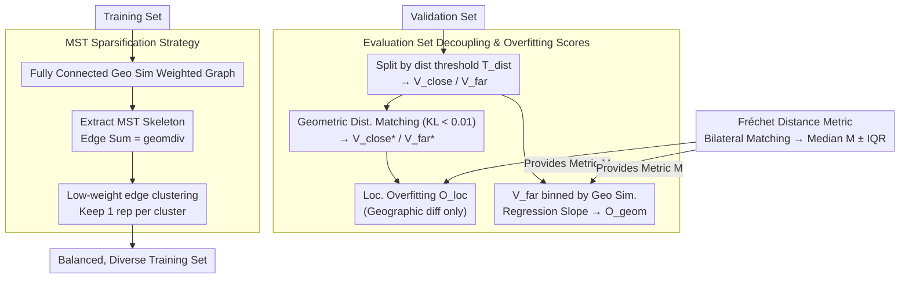

# Failure Modes for Deep Learning-Based Online Mapping: How to Measure and Address Them

**Conference**: CVPR 2026  
**arXiv**: [2603.19852](https://arxiv.org/abs/2603.19852)  
**Code**: Available (GitHub Page)  
**Area**: Autonomous Driving  
**Keywords**: Online Mapping, Overfitting Analysis, Generalization Evaluation, Dataset Bias, Map Geometric Diversity

## TL;DR

This paper systematically defines and quantifies two failure modes of deep learning-based online mapping models—localization overfitting and geometric overfitting. It proposes a performance metric based on Fréchet distance and a training set sparsification strategy based on Minimum Spanning Tree (MST). Validation on nuScenes and Argoverse 2 demonstrates that geometrically diverse and balanced training sets improve model generalization.

## Background & Motivation

1. **Background**: Deep learning-based online mapping (e.g., MapTR, MapTRv2) has become a core perception task for autonomous driving, where models directly generate vectorized HD map elements from sensor data (Camera, LiDAR).
2. **Limitations of Prior Work**:
    - Performance inflates on geographically overlapping training/validation sets, while performance drops sharply when switching to geographically disjoint splits (e.g., mAP on nuScenes drops from 60.95 to approximately 25-29).
    - Models memorize location-specific input features rather than learning generalizable representations.
    - Dataset geometric bias (repetitive map geometric structures) exists but remains understudied.
3. **Key Challenge**: Existing evaluations do not distinguish between the "memorizing location features" and "overfitting map geometry" failure modes, making targeted improvements difficult.
4. **Goal**: (1) How to decouple and quantify the two overfitting modes? (2) How to evaluate the geometric diversity of datasets? (3) How to design better training sets to enhance generalization?
5. **Key Insight**: Introduce geographic distance and geometric similarity as two orthogonal dimensions to evaluate the validation set hierarchically; replace Chamfer distance with Fréchet distance as a more robust performance metric.
6. **Core Idea**: Decouple the two types of overfitting by controlling geographic distance and geometric similarity, and use MST sparsification to eliminate redundant geometric structures in the training set to improve generalization.

## Method

### Overall Architecture

The specific question this paper addresses is: when online mapping models suffer performance degradation on geographically disjoint splits, is it because the model "remembers the appearance of a specific street" or because it "can only draw the few intersection shapes seen in the training set"? These are distinct issues, but prior evaluations conflated them. The overall approach treats "geographic distance" and "geometric similarity" as two orthogonal knobs. First, the former is used to isolate localization overfitting, and then the latter isolates geometric overfitting, each yielding a quantifiable score. After diagnosis, the method returns to the training set side, using Minimum Spanning Tree (MST) to prune geometrically redundant samples to verify if "more balanced and diverse training sets can improve generalization." The entire pipeline follows a "measure then intervene" logic: Evaluation set stratification $\rightarrow$ Two overfitting scores + a robust distance metric $\rightarrow$ MST sparsification of the training set.

### Key Designs

**1. Evaluation Set Decoupling and Overfitting Scores: Separating "Location Memory" from "Geometric Overfitting"**

Directly splitting the validation set by geographic distance presents a trap: samples farther from the training area often have different geometric structures, leading to a strong correlation between geographic distance and geometric similarity (Pearson $r=0.724$). If only geographic proximity is considered, it remains unclear how much of the performance drop is due to "unseen locations" versus "unseen shapes." This work first splits the validation set into $V_{\text{close}}$ and $V_{\text{far}}$ based on a geographic distance threshold $T_{\text{dist}}$, then performs **geometric similarity distribution matching sampling**. After bilateral matching, samples with inconsistent distributions are filtered (KL divergence $<0.01$), resulting in aligned $V_{\text{close*}}$ and $V_{\text{far*}}$ sets. Since their only significant difference is geographic proximity, the localization overfitting score is defined as:

$$\mathcal{O}_{\text{loc}} = \frac{M_{\text{far*}} - M_{\text{close*}}}{M_{\text{close*}}}$$

This measures the performance decline purely caused by "location unfamiliarity" (where $M$ is the performance metric defined later). Conversely, geometric overfitting is measured by binning $V_{\text{far}}$ by geometric similarity and observing the performance trend. The slope of a linear regression fit yields $\mathcal{O}_{\text{geom}}$—a steeper slope indicates higher dependence on "having seen similar shapes." Thus, the two causes of overfitting are measured separately for the first time.

**2. Fréchet Distance-Based Performance Metric: Replacing Permutation-Invariant Chamfer with Order-Preserving Distance**

The $M$ in the scores requires a reliable measure of map accuracy. Common Chamfer distance has a weakness: it is permutation-invariant and only looks at nearest-neighbor point matching. Consequently, even if a prediction renders a polyline as crossed or twisted, Chamfer might yield a low error and exhibits high variance on small datasets. This work adopts the **Discrete Fréchet Distance**, which requires points to be aligned in their sequence order when comparing polylines. It is sensitive to point order errors and captures shape fidelity; for polygons, it optimizes over all cyclic shifts and directions. After bilateral matching for each prediction/ground truth pair, the matching cost distribution $D$ is collected, using the median $M$ and interquartile range $IQR$ as performance metrics—the median is more robust to outliers, while $IQR$ characterizes stability.

**3. MST Sparsification Strategy: Removing Geometric Redundancy to Balance Training Sets**

Diagnosis reveals that the correlation between performance and geometric similarity ($r=0.568$) is stronger than with geographic distance ($r=0.379$), suggesting geometric overfitting is the primary issue rooted in the data. Training sets contain numerous samples with highly redundant geometric structures, biasing the model. This work constructs a fully connected weighted graph of the training set where edge weights represent geometric similarity $\text{sim}(s_i, s_j)$, then extracts the **Minimum Spanning Tree (MST)**. By setting a similarity threshold, nodes on the MST with edge weights below the threshold are clustered (grouping highly similar samples). Only one representative sample with the lowest average neighbor weight is kept per cluster. Geometric diversity is defined as the sum of MST edge weights:

$$\text{geomdiv}(D) = \sum_{(i,j) \in \mathcal{E}(\mathcal{T}_{\text{sim}})} \text{sim}(s_i, s_j)$$

A key experimental observation is that setting the threshold between 0.1–1 removes a significant portion of samples, yet $\text{geomdiv}$ remains nearly constant while performance improves—proving that the removed samples were redundant and contributed only to training imbalance.

### Loss & Training

This paper does not propose new training losses. The analysis utilizes public code and configurations of MapTR, MapTRv2, MapQR, and MGMap for training.

## Key Experimental Results

### Main Results (Comparison of MapTRv2 on Different Splits)

| Dataset/Split | geomdiv(T) | geomsim(T,V) | Geo overlap <5m | mAP↑ | M±IQR↓ | $\mathcal{O}_{\text{loc}}$↓ | $\mathcal{O}_{\text{geom}}$↓ |
|------------|------------|--------------|------------|------|--------|------|------|
| nuScenes original | 96.8km | 8.32m | 79.47% | 60.95 | 1.94±3.05 | 24.73 | 21.22 |
| nuScenes geo.[24] | 80.6km | 14.66m | 0.95% | 24.96 | 4.07±6.14 | n.a. | 9.75 |
| nuScenes geo.[42] | 90.2km | 13.85m | 0% | 28.53 | 3.24±5.50 | n.a. | 13.84 |
| nuScenes geometric | 91.3km | 21.08m | 8.53% | 28.37 | 4.17±6.08 | 4.40 | 10.49 |
| Argoverse2 original | 91.0km | 8.98m | 44.89% | 63.97 | 1.77±2.99 | 7.29 | 11.17 |

### Multi-Model Overfitting Comparison (nuScenes original)

| Model | $\mathcal{O}_{\text{loc}}$↓ | $\mathcal{O}_{\text{geom}}$ (original)↓ |
|------|------|------|
| MapTR | 24.42 | 18.66 |
| MapTRv2 | 24.73 | 21.22 |
| MapQR | 57.07 | 21.03 |
| MGMap | 33.19 | 24.12 |

### Key Findings

- All models exhibit positive overfitting scores across all splits, indicating that overfitting is a systemic issue.
- MapQR shows the most severe localization overfitting (57.07), likely related to its query design.
- Performance correlates more strongly with geometric similarity $s(v)$ ($r=0.568$) than with geographic distance $d(v)$ ($r=0.379$), suggesting geometric overfitting is more critical.
- MST sparsification at thresholds 0.1-1: performance improves despite sample reduction, outperforming random sampling.
- Geo.[42] performs better than geo.[24] due to higher geometric diversity in the training set (90.2km vs 80.6km).

## Highlights & Insights

- **Fine-grained Overfitting Decoupling**: For the first time, online mapping generalization failure is decomposed into "memorizing input features" and "overfitting map geometry." This framework is extensible to generalization analysis for any spatial perception task.
- **MST Geometric Diversity Metric**: Quantifying dataset geometric diversity using the sum of MST edge weights is both intuitive and actionable. The finding that "removing redundant samples improves performance" provides direct guidance for dataset curation.
- **Fréchet Distance Replacement**: Retaining point order information ensures more accurate evaluation of map element shape fidelity, which is particularly sensitive to crossed or twisted predictions.

## Limitations & Future Work

- Geometric similarity computation (pairwise Fréchet distance + matching) is computationally expensive, making it difficult to scale directly to larger datasets.
- Current analysis only considers map geometry in the BEV perspective, ignoring 3D geometric structures (e.g., altitude).
- MST sparsification is a post-processing strategy; dynamic sampling weight adjustment during training was not explored.
- Validated only on nuScenes and Argoverse 2; requires support from more datasets like Waymo.
- No direct training methods (e.g., geometry-aware data augmentation or loss functions) were proposed to mitigate overfitting.

## Related Work & Insights

- **vs. Lilja et al.**: They first revealed geographic memorization effects; this work further decouples them into two independent overfitting modes.
- **vs. Geographically Disjoint Splits [24,42]**: These works only address geographic overlap; this paper further analyzes geometric bias and proposes geometric splits.
- **vs. MapTR/MapTRv2**: As the subjects of analysis, this paper finds they all suffer from severe overfitting, providing diagnostic tools for future model design.

## Rating

- Novelty: ⭐⭐⭐⭐ The overfitting decoupling framework and MST sparsification are insightful contributions.
- Experimental Thoroughness: ⭐⭐⭐⭐⭐ Comprehensive analysis across four models and multiple splits with thorough ablation.
- Writing Quality: ⭐⭐⭐⭐⭐ Clear problem definitions, rigorous mathematical formalism, and intuitive visualizations.
- Value: ⭐⭐⭐⭐ Provides the online mapping community with critical diagnostic tools and dataset design guidelines.

<!-- RELATED:START -->

## Related Papers

- [\[CVPR 2026\] Reliable Policy Transfer for Safety-Aware End-to-End Driving with Deep Reinforcement Learning](reliable_policy_transfer_for_safety-aware_end-to-end_driving_with_deep_reinforce.md)
- [\[ECCV 2024\] Accelerating Online Mapping and Behavior Prediction via Direct BEV Feature Attention](../../ECCV2024/autonomous_driving/accelerating_online_mapping_and_behavior_prediction_via_dire.md)
- [\[CVPR 2026\] AMap: Distilling Future Priors for Ahead-Aware Online HD Map Construction](amap_distilling_future_priors_for_ahead-aware_online_hd_map_construction.md)
- [\[NeurIPS 2025\] How Different from the Past? Spatio-Temporal Time Series Forecasting with Self-Supervised Deviation Learning](../../NeurIPS2025/autonomous_driving/how_different_from_the_past_spatio-temporal_time_series_forecasting_with_self-su.md)
- [\[CVPR 2026\] ReMoT: Reinforcement Learning with Motion Contrast Triplets](remot_reinforcement_learning_with_motion_contrast_triplets.md)

<!-- RELATED:END -->
