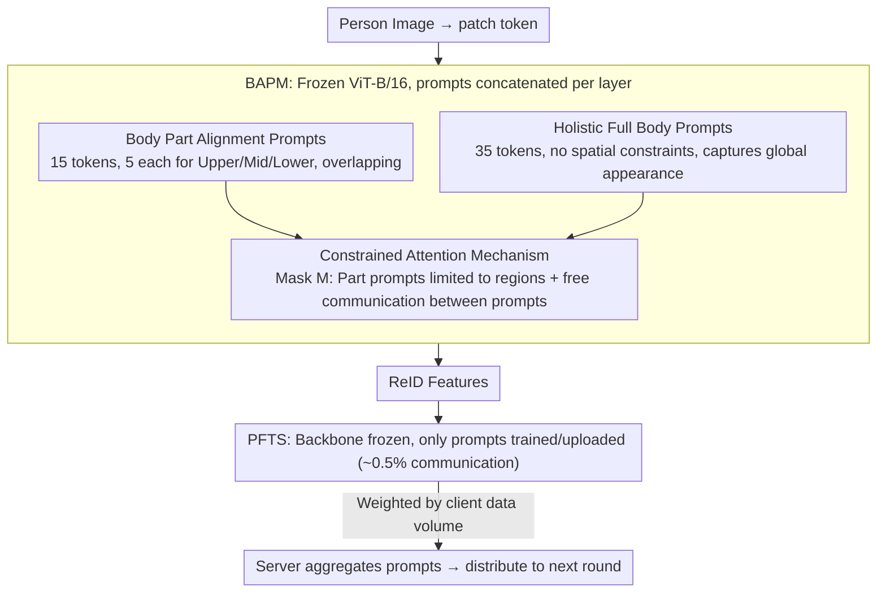

# FedBPrompt: Federated Domain Generalization Person Re-Identification via Body Distribution Aware Visual Prompts

**Conference**: CVPR 2026  
**arXiv**: [2603.12912](https://arxiv.org/abs/2603.12912)  
**Code**: [leavlong/FedBPrompt](https://github.com/leavlong/FedBPrompt)  
**Area**: Autonomous Driving  
**Keywords**: FedDG-ReID, Visual Prompts, Body Part Alignment, Parameter-Efficient Fine-Tuning, ViT, Federated Aggregation

## TL;DR

The FedBPrompt framework is proposed, which splits prompts into Body Part Alignment Prompts and Holistic Full Body Prompts via the Body Distribution Aware Visual Prompts Mechanism (BAPM). Coupled with the Prompt-based Fine-Tuning Strategy (PFTS), the ViT backbone is frozen while only lightweight prompts are trained (reducing communication overhead to ~1%). It achieves average gains of 3.3% mAP and 4.9% Rank-1 in FedDG-ReID tasks.

## Background & Motivation

Federated Domain Generalization Person Re-Identification (FedDG-ReID) requires learning domain-invariant representations from multiple decentralized camera domains under a privacy-preserving federated learning framework to generalize to unseen target domains. While ViT has become the mainstream backbone due to its strong representation capabilities, its **global attention mechanism** reveals two core defects in FedDG-ReID:

**Background Interference Defocus**: The global self-attention of ViT processes all patch tokens indiscriminately, including both person regions and background regions. When background distributions differ significantly across clients (e.g., indoor/outdoor, mall/street), the model easily scatters attention onto highly similar backgrounds, causing false matches of different identities due to background similarity.

**Viewpoint Variation Causing Body Part Misalignment**: Different camera angles across clients (top-down/eye-level, front/side) cause the spatial positions of the same person's body parts to vary significantly in images. ViT's global attention cannot perceive these spatial structural differences, leading to a sharp decline in cross-viewpoint feature similarity for the same person.

These issues are further amplified in federated scenarios by **inter-client data heterogeneity**—each client only sees data from its own scene and cannot learn cross-domain invariance through centralized training.

Existing FedDG-ReID methods (e.g., data augmentation in DACS, feature alignment in FedReID) primarily increase diversity at the data level but do not directly address background defocus and part misalignment from the perspective of the model's attention mechanism.

## Method

### Overall Architecture

FedBPrompt aims to address the issues where ViT's global attention is easily biased by backgrounds and fails to align cross-viewpoint body parts in federated learning, all while being constrained by privacy. The core idea is to handle "attention refinement" and "communication efficiency" simultaneously: inserting a set of structured visual prompts into a frozen ViT-B/16 and using attention masks to dictate which regions each prompt should attend to, thereby injecting spatial priors of the human body. During training, only these lightweight prompts are updated, and the backbone does not participate in communication.

Specifically, a person image is divided into patch tokens and fed into the ViT, where a set of learnable prompt tokens is appended at each layer. These prompts are split into "Body Part Alignment" and "Holistic Full Body" categories, coordinated by an attention mask to control their visibility to patches. After the forward pass, prompts and patches updated representations together to output ReID features; the backward pass computes gradients only for the prompts. Clients then upload the prompts (rather than the entire model) to the server for weighted aggregation. This defines the division of labor between the Body Distribution Aware Visual Prompts Mechanism (BAPM) and the Prompt-based Fine-Tuning Strategy (PFTS).

### Key Designs

**1. Body Part Alignment Prompts: Aligning cross-view parts by assigning prompts to body regions**

Viewpoint changes cause the head, torso, and legs of the same person to drift to different image positions, which global attention fails to perceive. BAPM's countermeasure is to allocate 15 out of 50 prompts, dividing them into three segments: $\mathbf{P}^{\text{upper}}$ attends only to the upper part (head/shoulders), $\mathbf{P}^{\text{mid}}$ to the middle (torso), and $\mathbf{P}^{\text{lower}}$ to the lower part (legs/feet). Each part prompt is thus bound to a fixed body semantic. Regardless of how the person shifts in the frame, the corresponding prompt only seeks evidence in its assigned segment, enabling stable cross-viewpoint alignment.

The regions are intentionally defined using **overlapping partitions** rather than a rigid three-way split. Given $n$ total patches, the three segments are defined as:

$$I_{\text{upper}} = \{j \mid 1 \leq j \leq n/2\}, \quad I_{\text{mid}} = \{j \mid n/4+1 \leq j \leq 3n/4\}, \quad I_{\text{lower}} = \{j \mid n/2+1 \leq j \leq n\}$$

An overlap of approximately 25% is maintained between adjacent segments, covering transition zones like the neck and waist that are easily cut by rigid partitioning, thereby avoiding boundary information loss.

**2. Holistic Full Body Prompts: Capturing global appearance and suppressing background noise**

Part prompts alone are insufficient—the root of background defocus is attention being scattered by high-similarity backgrounds, and part prompts only focus on individual segments. The remaining 35 prompts form $\mathbf{P}^{\text{Full}}$, which have no spatial constraints and can interact freely with all patches to capture the person's overall appearance. They shoulder the responsibility of determining "what to look at," pulling attention back from cluttered backgrounds to the person, complementing the "where to look" duty of the part prompts.

**3. Constrained Attention Mechanism: Implementing "part constraints" and "free prompt communication" via a mask**

The "where to look" rules for the two prompt groups are implemented via a structured attention mask $M$, applied directly to the attention logits before the softmax:

$$\text{Attention}(Q, K, V) = \text{Softmax}\left(\frac{QK^T}{\sqrt{d_k}} + M\right)V$$

$$M_{ij} = \begin{cases} -\infty & \text{if } (q_i, k_j) \in \mathcal{C}_{\text{mismatch}} \\ 0 & \text{otherwise} \end{cases}$$

Where $\mathcal{C}_{\text{mismatch}}$ refers to mismatched pairs, such as a part prompt paired with a patch from a region it is not supposed to attend to. By setting these to $-\infty$, they are zeroed out after softmax. Crucially, the mask for all prompt tokens relative to each other is always 0 ($M_{ij}=0,\ \forall q_i,k_j\in\mathbf{P}$), allowing unrestricted communication between part prompts and global prompts. Part prompts provide structured local clues, which global prompts then integrate into a coherent full-body representation. Each layer has independent parameters $\mathbf{P}_{i-1}$, updated layer-by-layer:

$$[ \mathbf{x}_i, \_, \mathbf{E}_i ] = L_i([ \mathbf{x}_{i-1}, \mathbf{P}_{i-1}, \mathbf{E}_{i-1} ])$$

**4. PFTS: Compressing federated communication to ~0.5% by training and uploading only prompts**

The ViT-B/16 model has approximately 86M parameters. Synchronizing the entire backbone in every federated round is too costly for resource-constrained edge devices. PFTS freezes the backbone entirely and lets prompts carry all learnable information. The server first pre-trains a standard ReID model (without prompts) on centralized data, distributes it to clients, and freezes the backbone parameters $\Theta_b$. Each client then inserts randomly initialized BAPM prompts $\Theta_p$ (~0.46M) and optimizes only these:

$$\mathcal{L}_k(\Theta_p) = \sum_{(x,y) \in D_k} \mathcal{L}_{\text{ReID}}(g(x; \Theta_b, \Theta_p), y)$$

After training, only the prompt parameters are uploaded and aggregated by the server based on the data volume of each client:

$$\Theta_p^{t+1} = \sum_{k=1}^{K} \frac{|D_k|}{\sum_{j=1}^{K}|D_j|} \Theta_{p,k}^{t+1}$$

Consequently, communication per round drops from 86M to 0.46M (roughly **0.5%**). Since the backbone retains universal representations from centralized pre-training, prompts only need to capture cross-domain invariant features, leading to significant gains within a few aggregation rounds.

### Loss & Training

Training utilizes standard ReID objectives (Cross-Entropy + Triplet Loss). The framework supports two modes: Full-Parameter (training the whole model with BAPM) and PFTS (training prompts only). BAPM is a plug-and-play module that can be integrated into any ViT-based FedDG-ReID framework.

## Key Experimental Results

### Background

- **Datasets**: CUHK02 (C2), CUHK03 (C3), Market1501 (M), MSMT17 (MS)
- **Protocol-1**: Leave-One-Out (train on 3 domains, test on 1)
- **Protocol-2**: Source domain performance evaluation

### Main Results (Protocol-1) (Table 1)

Using the state-of-the-art baseline SSCU (MM 2025) as an example:

| Setting | →M mAP | →M Rank-1 | →C3 mAP | →C3 Rank-1 | →MS mAP | →MS Rank-1 | Avg mAP | Avg Rank-1 |
|---------|--------|-----------|---------|------------|---------|------------|---------|------------|
| Original SSCU | 46.3 | 69.6 | 33.7 | 33.4 | 20.0 | 43.7 | 33.3 | 48.9 |
| +PFTS | 48.9(+2.6) | 72.4(+2.8) | 35.5(+1.8) | 35.8(+2.4) | 21.3(+1.3) | 46.0(+2.3) | 35.2(+1.9) | 51.4(+2.5) |
| +BAPM | **49.1**(+2.8) | **73.4**(+3.8) | **37.4**(+3.7) | **38.4**(+5.0) | **23.4**(+3.4) | **49.5**(+5.8) | **36.6**(+3.3) | **53.8**(+4.9) |

The improvement is even more significant on weaker baselines—on FedProx, BAPM brings an average mAP gain of +10.0% and Rank-1 gain of +13.5%.

### Ablation Study (Table 3)

Using SSCU as the baseline under the "C2+C3+M→MS" setting:

| Configuration | Holistic | Part Align | mAP | Rank-1 |
|---------------|----------|------------|-----|--------|
| Baseline | — | — | 20.0 | 43.7 |
| +Holistic Only | ✓ | — | 22.9 | 48.2 |
| +Part Align Only | — | ✓ | 22.7 | 48.5 |
| +BAPM (Full) | ✓ | ✓ | **23.4** | **49.5** |

Both prompt groups are effective individually, and their combination yields further improvements. Part Alignment Prompts contribute more significantly in scenarios with large viewpoint variations (→MS).

### Attention Quality (Table 4)

| Method | Class Token Ins. AUC | RISE Ins. AUC |
|--------|---------------------|---------------|
| SSCU | 0.6160 | 0.6516 |
| +VPs (Standard prompts) | 0.7103 | 0.7494 |
| +BAPM | **0.7559** | **0.7737** |

Insertion AUC measures the faithfulness of attention maps—BAPM significantly outperforms standard (unstructured) visual prompts, proving its attention focuses more precisely on the person region.

### Source Domain Performance (Protocol-2)

BAPM enhances cross-domain generalization without sacrificing source domain performance; it even shows noticeable improvements in source domain testing (e.g., FedPav +BAPM increases C2 mAP from 66.5 to 74.3).

## Highlights & Insights

- **Sophisticated Structured Prompt Design**: Unlike methods like VPT that treat all prompts homogeneously, BAPM assigns clear spatial semantics—part prompts handle "where to look" and global prompts handle "what to look at." The functional division combined with free communication is more flexible than rigid partitioning.
- **Overlapping Partitions to Avoid Information Fragmentation**: The 25% overlap between upper/mid/lower regions solves the issue of information loss at boundaries found in rigid three-way splits.
- **High Practical Value of PFTS**: With 0.5% communication overhead and convergence in a few rounds, this is crucial for the feasibility of real-word federated deployment. Moreover, PFTS provides consistent positive gains.
- **Plug-and-play Generality**: Effective across 6 different baseline methods with stable average improvements, indicating that BAPM addresses a common bottleneck across methodologies.
- **Compelling Attention Visualization**: In Figure 3, part prompts accurately lock onto corresponding body regions while global prompts cover the full body, whereas the baseline shows scattered attention—providing strong visual evidence.

## Limitations & Future Work

1. **Spatial Partitioning Assumption Depends on Upright Posture**: The fixed ratio for upper/mid/lower segments assumes the person is roughly upright and centered. This may fail for non-standard poses like bending over, sitting, or severe occlusion. Dynamic partitioning based on pose estimation could be considered.
2. **Evaluation Limited to Four ReID Datasets**: CUHK02/03, Market1501, and MSMT17 are classic but relatively "clean." Performance in more complex real-world scenarios (low light, extreme weather, ultra-high density) requires further verification.
3. **Sensitivity to Prompt Count**: The paper uses 50 prompts (15+35 split). Although sensitivity analysis is provided, the optimal ratio may relate to the number of datasets/domains, and an adaptive adjustment mechanism is lacking.
4. **Dependence on Pre-trained Model Quality**: PFTS mode relies on a high-quality pre-trained model as a starting point. It remains unclear if prompt tuning can compensate if the initial model quality is poor.
5. **Expansion to Cross-Modal/More Domains**: Only validated on RGB images. Exploring whether body distribution features are equally effective in cross-modal ReID (Infrared-Visible) is worthwhile.

## Related Work & Insights

- **VPT (Visual Prompt Tuning)**: Pioneering visual prompt method → The key innovation of FedBPrompt is giving prompts spatial structural semantics.
- **PromptFL**: Prompt communication in federated learning → FedBPrompt adapts this from NLP to visual ReID with task-customized structures.
- **Component Models (PCB/MGN)**: Traditional person part alignment → BAPM implements soft partitioning via prompts and attention masks, which is more flexible than physical cropping.
- **SSCU (MM 2025)**: Current FedDG-ReID SOTA → BAPM still yields a significant 3-5% improvement on top of it.
- **DACS (AAAI 2024)**: Data augmentation route → BAPM complements it from the perspective of the model's attention mechanism.
- **Insight**: Structured prompts can be generalized to other visual tasks requiring spatial alignment (e.g., fine-grained recognition, medical imaging). The ultra-low communication cost of PFTS makes it widely applicable to edge device federated learning.

## Rating

| Dimension | Score (1-5) | Explanation |
|-----------|-------------|-------------|
| Novelty | 3.5 | Combining visual prompts with body part spatial semantics is an innovative design, though the framework is an extension of VPT. |
| Value | 4.5 | Reducing communication by 99% with plug-and-play features provides extremely high deployment value. |
| Experimental Thoroughness | 4.0 | Tested on 6 baselines with 2 protocols and full ablation/visualization; detailed computational overhead comparison is missing. |
| Writing Quality | 4.0 | Clear problem definition, structured method description, and complete formulas; conclusion section is slightly brief. |

<!-- RELATED:START -->

## Related Papers

- [\[AAAI 2026\] When Person Re-Identification Meets Event Camera: A Benchmark Dataset and An Attribute-guided Re-Identification Framework](../../AAAI2026/autonomous_driving/when_person_re-identification_meets_event_camera_a_benchmark_dataset_and_an_attr.md)
- [\[AAAI 2026\] Hierarchical Prompt Learning for Image- and Text-Based Person Re-Identification](../../AAAI2026/autonomous_driving/hierarchical_prompt_learning_for_image-_and_text-based_person_re-identification.md)
- [\[CVPR 2026\] Open-Vocabulary Domain Generalization in Urban-Scene Segmentation](open-vocabulary_domain_generalization_in_urban-scene_segmentation.md)
- [\[AAAI 2026\] Debiased Dual-Invariant Defense for Adversarially Robust Person Re-Identification](../../AAAI2026/autonomous_driving/debiased_dual-invariant_defense_for_adversarially_robust_person_re-identificatio.md)
- [\[NeurIPS 2025\] GSAlign: Geometric and Semantic Alignment Network for Aerial-Ground Person Re-Identification](../../NeurIPS2025/autonomous_driving/gsalign_geometric_and_semantic_alignment_network_for_aerial-ground_person_re-ide.md)

<!-- RELATED:END -->
