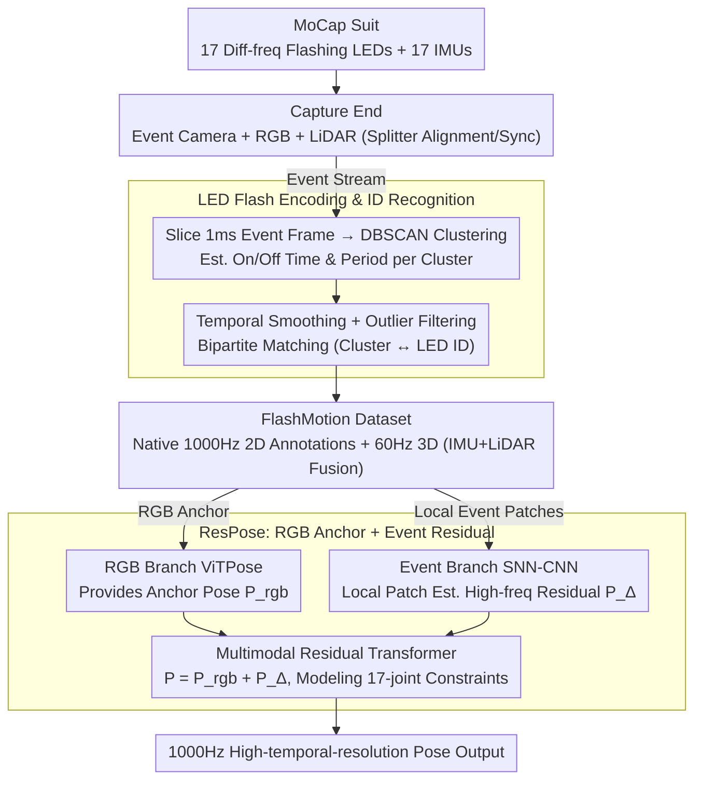

# FlashCap: Millisecond-Accurate Human Motion Capture via Flashing LEDs and Event-Based Vision

**Conference**: CVPR 2026  
**arXiv**: [2603.19770](https://arxiv.org/abs/2603.19770)  
**Code**: Coming Soon  
**Area**: Autonomous Driving / Human Pose Estimation  
**Keywords**: Event camera, Human motion capture, LED markers, High temporal resolution, Spiking neural networks

## TL;DR

FlashCap is proposed as the first motion capture system based on flashing LEDs and event cameras. By assigning different flashing frequencies to each LED for identity recognition, the authors constructed FlashMotion, the first human motion dataset with 1000Hz annotation accuracy (7.15 million frames). Furthermore, the ResPose baseline method was introduced, reducing motion timing error from ~50ms to ~5ms and improving MPJPE in pose estimation by approximately 40%.

## Background & Motivation

1. **Background**: Precise Motion Timing (PMT) is critical in scenarios like competitive sports—a 2ms difference in a bobsleigh race can determine a medal. Current human pose estimation (HPE) focuses primarily on spatial accuracy with insufficient attention to temporal precision. Temporal resolutions of existing motion capture systems such as Vicon (optical markers, ~330Hz), Xsens (IMU, 60-240Hz), and standard RGB cameras (30-60Hz) fail to meet millisecond-level requirements.
2. **Limitations of Prior Work**: (a) High-speed RGB cameras (≥1000Hz) can achieve high frame rates but are extremely costly (NAC HX-7s exceeds $45,000, 9x the cost of an event camera), require intense lighting, and demand bandwidth/storage two orders of magnitude higher than event cameras; (b) The highest annotation frame rate for public human motion datasets is only 120Hz (BEAHM), an order of magnitude away from millisecond precision; (c) Existing temporal annotation methods are limited by the sampling caps of auxiliary modalities or interpolation errors, failing to exceed 120Hz.
3. **Key Challenge**: How to achieve 1000Hz high-temporal-resolution human motion capture and annotation with low cost and low bandwidth?
4. **Goal**: (a) Build a novel low-cost motion capture system to bypass the high-speed camera bottleneck; (b) Collect the first multimodal human motion dataset with 1000Hz annotation accuracy; (c) Propose and evaluate a baseline HPE method for high temporal resolution.
5. **Key Insight**: Event cameras possess microsecond-level temporal resolution and extremely low bandwidth. The key challenge is obtaining high-frequency ground truth annotations from the event stream. The authors creatively use LEDs with different flashing frequencies as body markers—event cameras precisely capture the flashing patterns, and frequency analysis automatically matches LED identity and position, generating 1000Hz 2D joint annotations directly from the event stream.
6. **Core Idea**: Encode joint identity with different flashing frequencies. Event cameras capture flashing patterns with naturally high temporal resolution, and a frequency matching algorithm automatically generates 1000Hz pose annotations—achieving low cost and low bandwidth without high-speed cameras.

## Method

### Overall Architecture

FlashCap addresses a challenge that appears to be a hardware problem but is actually constrained by annotation: training a model to output 1000Hz poses requires 1000Hz ground truth, yet traditional optical MoCap only reaches 120Hz. The overall strategy offloads "high-frequency annotation" to the hardware itself—by having each joint LED on a wearable suit flash at a **unique frequency**, an event camera with microsecond resolution captures these flashes, making the frequency the "ID" of the joint. The system consists of three layers: the wearable end is a motion capture suit with 17 LEDs and 17 IMUs; the capture end uses a beam splitter to achieve pixel alignment and time synchronization between an event camera (Prophesee 1280×720) and an RGB camera (Hikrobot 1920×1200, 20fps), plus a LiDAR (Ouster OS-1 128-beam, 20fps); the software end is an annotation pipeline that identifies flashing patterns from the event stream, matches identities, and outputs 1000Hz 2D joint positions. With this system, the authors collected the FlashMotion dataset and proposed ResPose as a baseline for high-temporal-resolution HPE.

### Key Designs

**1. LED Flash Encoding and Identity Recognition: Making "Frequency" the Joint Identity**

Traditional optical markers rely on high camera frame rates for frame-by-frame tracking, while RFID lacks precision. FlashCap assigns each LED $i$ a configurable flashing frequency (~4000Hz), where different LEDs have distinct On-times $t_i^p$ and Off-times $t_i^n$ (within the 100–300μs range). Consequently, each joint naturally carries a unique "flashing signature." As long as the brightness of a pixel changes beyond a threshold, the event camera asynchronously triggers an event $e=(h,w,t,p)$. High-density events are continuously generated at LED locations. The annotation pipeline slices the event stream into 1ms frames and clusters high-density regions using DBSCAN. For each cluster, statistics of positive/negative polarity event sequences are used to estimate mean On/Off times $\bar{t_j^p}$, $\bar{t_j^n}$ and the flashing period $\bar{T_j}$. After temporal smoothing and outlier filtering, the total distance is calculated as:

$$d_{ji} = \alpha \cdot d_{ji}^t + \beta \cdot d_{ji}^p$$

where $d_{ji}^t$ is the On/Off time distance and $d_{ji}^p$ is the period distance between cluster $j$ and LED $i$. Global optimal correspondence is solved via bipartite matching. This design succeeds by translating the identification problem into flashing frequencies—a signal that event cameras are natively optimized to express. Since timestamp precision is at the microsecond level, annotation is no longer constrained by camera frame rates.

**2. FlashMotion Dataset: Increasing Annotation Frame Rate from 120Hz to 1000Hz**

Existing HPE datasets are capped at 120Hz (BEAHM) due to the sampling limits of traditional optical systems. FlashMotion uses the aforementioned LED pipeline to generate native 1000Hz annotations directly from the event stream: 20 volunteers (10 male, 10 female), 4 indoor/outdoor scenes, 11 major and 19 sub-categories of actions, 240 sequences, including 144,350 RGB frames, 144,350 LiDAR point cloud frames, and 2 hours of event and IMU data. 2D annotations are provided at 1000Hz (auto-generated then manually refined), and 3D annotations at 60Hz (solved via IMU + LiDAR fusion for SMPL parameters). With 7.15 million annotated frames, it represents an order of magnitude leap over existing datasets and serves as the foundation for training 1000Hz models.

**3. ResPose: RGB as Structural Anchor, Events for Residuals**

Regressing the full pose directly from pure event streams is ineffective because high-frequency events convey fine-grained motion changes rather than complete spatial structures. The key insight of ResPose is to decompose the pose as:

$$P_i = P_{rgb} + P_i^{\Delta}$$

A low-frame-rate RGB branch (e.g., ViTPose) provides a stable anchor pose $P_{rgb}$, while the event branch estimates the high-frequency residual $P_i^{\Delta}$. The event branch utilizes an SNN-CNN hybrid encoder: $32 \times 32$ local event patches are dynamically cropped around RGB anchors and processed by Leaky Integrate-and-Fire (LIF) spiking neurons for temporal integration, followed by $1 \times 1$ convolutions to suppress background noise. Spiking neurons naturally accumulate inputs over time steps, fitting asynchronous event data. A Multimodal Residual Transformer then concatenates RGB anchor features with event features, using global self-attention to model kinematic constraints between the 17 joints, trained end-to-end with L2 loss. This "Anchor + Residual" decomposition is efficient because it allows each modality to perform its specialized task: RGB handles low-frequency structure, and events handle high-frequency increments.

### Loss & Training

ResPose utilizes an end-to-end L2 distance loss to minimize the error between predicted poses and 1000Hz ground truth. The RGB branch uses a pre-trained ViTPose, while the event branch is trained from scratch.

## Key Experimental Results

### Main Results

Precise Motion Timing (PMT) — Temporal error (ms) in estimating joint crossing times:

| Method | Kicking | Punching | Jumping |
|------|---------|----------|---------|
| ViTPose (RGB) | 48.5 | 62.3 | 31.4 |
| Hybrid ANN-SNN (Event) | 85.2 | 54.1 | 66.7 |
| LEIR (RGB+Event) | 112.4 | 135.8 | 78.2 |
| **ResPose (Ours)** | **7.2** | **4.8** | **6.5** |

High Temporal Resolution HPE (1000Hz):

| Method | MPJPE↓ | PCK0.3↑ | PCK0.5↑ |
|------|--------|---------|---------|
| ViTPose (linear interp.) | 10.06 | 0.96 | 0.98 |
| Hybrid ANN-SNN | 22.48 | 0.82 | 0.91 |
| EventPointPose | 51.61 | 0.48 | 0.74 |
| EvSharp2Blur | 8.78 | 0.95 | 0.96 |
| ResPose (ANN Variant) | 8.12 | 0.95 | 0.96 |
| **ResPose (Ours, SNN)** | **5.66** | **0.97** | **0.99** |

### Ablation Study

Ablation of the annotation pipeline (Precision / Recall):

| Configuration | Kicking Precision | Kicking Recall | Description |
|------|-------------------|----------------|------|
| w/o $d_{ji}^t$ | 43.34% | 97.80% | Removing On/Off time distance → massive mismatching |
| w/o $d_{ji}^p$ | 69.70% | 97.56% | Removing period distance → matching quality drops |
| w/o Outlier Filter | 96.52% | 95.69% | Noise interference causing missed detections |
| w/o Tracking | 98.38% | 98.16% | Unable to recover during occlusion |
| **Full Pipeline** | **99.99%** | **98.99%** | Near-perfect precision |

### Key Findings

- **ResPose achieves an order-of-magnitude improvement in PMT tasks**: Temporal error dropped from ~50ms (pure RGB) and ~55-86ms (pure event) to ~5-7ms. This validates the effectiveness of combining RGB structural anchors with event residual corrections.
- **Existing pure event methods fail at PMT** (LEIR error 78-136ms), indicating that high-temporal-resolution input does not automatically equal high-temporal-resolution output—training with 1000Hz ground truth is required.
- **SNN encoder outperforms the ANN variant**: MPJPE decreased from 8.12 to 5.66, proving the inherent advantage of Spiking Neural Networks in processing asynchronous event data.
- The annotation pipeline achieves 99.99% precision and 98.82% recall, highly consistent with manual annotation, verifying the robustness of the LED frequency encoding scheme.
- Spline interpolation of 100Hz high-speed cameras still shows significant error (28.5px jump) in fast movements, validating the necessity of native 1000Hz annotation.

## Highlights & Insights

- The combination of **LED frequency encoding + event cameras** is ingenious: it bypasses software algorithm limitations through hardware design. Unlike assigning different colors to LEDs (for RGB cameras), encoding identity with flashing frequencies natively fits the operational principle of event cameras at a very low cost. This "hardware-in-the-loop" annotation concept can be migrated to any scenario requiring high-frequency labels.
- **Residual Decomposition (RGB Anchor + Event Residual)** is an elegant framework for cross-temporal resolution fusion: RGB provides low-frequency structural priors, while events provide high-frequency motion increments. This decomposition is applicable not only to HPE but also to high-speed object tracking and high-frequency surface deformation estimation.
- The completeness of the system design is impressive—bridging hardware (LED suits + multimodal equipment), software (annotation pipeline + baseline method), and datasets into a closed loop.

## Limitations & Future Work

- LED markers still require wearing a specialized suit, limiting use in natural settings. Future work could explore markerless solutions (estimating high-frequency pose directly using the high dynamic range of event cameras).
- 17 LEDs correspond to coarse-grained joints and cannot capture fine-grained movements like fingers. Increasing the number of LEDs may lead to frequency collisions—the unique space for flashing patterns is finite.
- Current 3D labels are only 60Hz (limited by IMU+LiDAR), while 1000Hz labels are restricted to 2D. Future work could use multi-view event cameras for 1000Hz 3D annotation.
- FlashMotion dataset scale and scene diversity remain limited (20 people, 4 scenes). Expansion to more subjects and diverse sports (e.g., gymnastics, combat) is necessary.
- The SNN-CNN hybrid encoder is relatively simple; more sophisticated event representation learning methods (e.g., Transformers with fine-grained temporal resolution) might further improve performance.

## Related Work & Insights

- **vs BEAHM**: BEAHM was previously the highest frame-rate event HPE dataset (120Hz, based on multi-view reconstruction from 4 calibrated RGB cameras). FlashMotion increases the annotation rate by 8x to 1000Hz and uses a more native annotation method that does not depend on RGB frame rate bottlenecks.
- **vs DHP19**: DHP19 uses 100Hz Vicon for ground truth, limited by Vicon's sampling rate. FlashCap's LED solution is independent of external MoCap systems and improves temporal resolution by 10x.
- **vs EventCap**: EventCap performs HPE with event cameras, but ground truth comes from 100Hz markerless MoCap. FlashCap's innovation lies in event-native annotation, where temporal resolution is not limited by other systems.
- High-speed RGB cameras (e.g., Basler, used for validation) are high-cost and high-bandwidth. FlashCap achieves comparable or superior temporal precision at approximately 1/9 the cost.

## Rating

- Novelty: ⭐⭐⭐⭐⭐ The creative combination of LED frequency encoding and event cameras is a pioneering paradigm for high-frequency motion capture.
- Experimental Thoroughness: ⭐⭐⭐⭐⭐ System validation, dataset quality verification, two new tasks, and complete ablations make it extremely thorough.
- Writing Quality: ⭐⭐⭐⭐ Logical progression from system to dataset to method.
- Value: ⭐⭐⭐⭐⭐ Opens a new direction for millisecond-level motion capture; both the dataset and system are of significant value to the HPE community.

## Related Papers

- [\[CVPR 2026\] EventDrive: Event Cameras for Vision-Language Driving Intelligence](eventdrive_event_cameras_for_vision-language_driving_intelligence.md)
- [\[CVPR 2026\] SHARP: Short-Window Streaming for Accurate and Robust Prediction in Motion Forecasting](sharp_short-window_streaming_for_accurate_and_robust_prediction_in_motion_foreca.md)
- [\[AAAI 2026\] MambaSeg: Harnessing Mamba for Accurate and Efficient Image-Event Semantic Segmentation](../../AAAI2026/autonomous_driving/mambaseg_harnessing_mamba_for_accurate_and_efficient_image-e.md)
- [\[CVPR 2026\] LiREC-Net: A Target-Free and Learning-Based Network for LiDAR, RGB, and Event Calibration](lirec-net_a_target-free_and_learning-based_network_for_lidar_rgb_and_event_calib.md)
- [\[ECCV 2024\] LiveHPS++: Robust and Coherent Motion Capture in Dynamic Free Environment](../../ECCV2024/autonomous_driving/livehps_robust_and_coherent_motion_capture_in_dynamic_free_environment.md)

<!-- RELATED:END -->

<!-- RELATED:START -->

## Related Papers

- [\[CVPR 2026\] Bezier Degradation Modeling for LiDAR-based Human Motion Capture](bezier_degradation_modeling_for_lidar-based_human_motion_capture.md)
- [\[CVPR 2026\] SHARP: Short-Window Streaming for Accurate and Robust Prediction in Motion Forecasting](sharp_short-window_streaming_for_accurate_and_robust_prediction_in_motion_foreca.md)
- [\[CVPR 2026\] EventDrive: Event Cameras for Vision-Language Driving Intelligence](eventdrive_event_cameras_for_vision-language_driving_intelligence.md)
- [\[AAAI 2026\] MambaSeg: Harnessing Mamba for Accurate and Efficient Image-Event Semantic Segmentation](../../AAAI2026/autonomous_driving/mambaseg_harnessing_mamba_for_accurate_and_efficient_image-e.md)
- [\[CVPR 2026\] LiREC-Net: A Target-Free and Learning-Based Network for LiDAR, RGB, and Event Calibration](lirec-net_a_target-free_and_learning-based_network_for_lidar_rgb_and_event_calib.md)

<!-- RELATED:END -->
