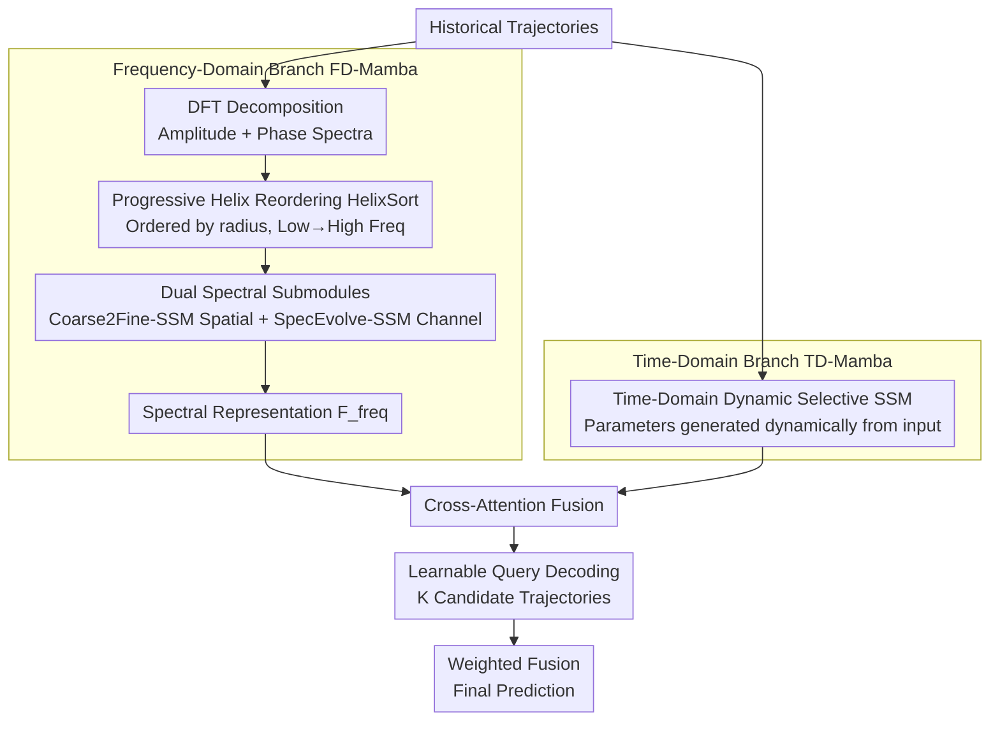

# FoSS: Modeling Long-Range Dependencies and Multimodal Uncertainty in Trajectory Prediction via Fourier–State Space Integration

**Conference**: CVPR 2026  
**arXiv**: [2603.01284](https://arxiv.org/abs/2603.01284)  
**Code**: None  
**Area**: Autonomous Driving  
**Keywords**: Trajectory Prediction, Fourier Transform, State Space Model, Dual-branch Architecture, Multimodal Prediction

## TL;DR
FoSS introduces a frequency-time dual-branch framework that organizes Fourier spectra via Progressive Helix Reordering (HelixSort) for processing by a Selective State Space Model (SSM). Combined with a time-domain dynamic SSM and cross-attention fusion, it achieves SOTA trajectory prediction accuracy on Argoverse 1/2 while reducing parameters by over 40% and inference latency by 22%.

## Background & Motivation
Precise trajectory prediction is vital for safety in autonomous driving, especially in dense multi-agent environments. Existing methods face an inherent tradeoff between three requirements: modeling long-range dependencies across agents, representing multimodal futures to capture uncertainty, and meeting strict real-time constraints.

Transformer architectures achieve high precision through self-attention but suffer from $\mathcal{O}(N^2)$ computational complexity, limiting deployment on resource-constrained systems. Recurrent models are efficient but struggle to capture long-range dependencies and fine-grained local dynamics. Methods modeling only in the time domain often conflate global motion patterns with local dynamics, while standard Fourier representations lack ordered frequency semantics, making it difficult for sequence models to process spectral information effectively.

Key Observation: Trajectory signals exhibit complementary structures in the spectral and time domains—**amplitude spectra encode global motion trends, while phase spectra capture fine-grained temporal changes**. However, DFT outputs do not maintain a continuous arrangement from low to high frequencies (since $\omega$ and $T-\omega$ correspond to the same physical frequency). Feeding this directly to an SSM causes the model to oscillate between global and local reasoning, disrupting state evolution.

**Core Idea**: A Progressive Helix Reordering module (HelixSort) is designed to sort DFT coefficients by spectral radius, enabling the SSM to process spectral information in a coarse-to-fine manner. Combined with time-domain SSMs for long-range dependency modeling, this achieves high-precision multimodal trajectory prediction with linear complexity.

## Method

### Overall Architecture
FoSS employs a dual-branch architecture: (1) **Frequency-Domain Branch (FD-Mamba)**—decomposes historical trajectories into amplitude and phase via DFT, reorders them using HelixSort, and passes them to two parallel SSM submodules (Coarse2Fine-SSM for spatial interaction and SpecEvolve-SSM for channel evolution); (2) **Time-Domain Branch (TD-Mamba)**—models long-range dependencies directly on temporal sequences via an input-dependent dynamic SSM. The two branches are fused through cross-attention layers, and $K$ candidate trajectories are decoded by learnable query vectors and output via weighted fusion.

### Key Designs

**1. Progressive Helix Reordering (HelixSort): Ordering the spectrum for coarse-to-fine SSM reading**

The difficulty in the frequency branch is that DFT outputs are "unordered"—since $\omega$ and $T-\omega$ map to the same physical frequency, low and high-frequency coefficients are interleaved in the sequence. Feeding such sequences to an SSM forces the model to jump between "global trends" and "local details," breaking state evolution and preventing the learning of coherent spectral semantics. HelixSort reshapes 1D DFT coefficients $F^{(k)} \in \mathbb{C}^T$ into a 2D grid $\mathcal{F}^{(k)} \in \mathbb{C}^{\sqrt{T} \times \sqrt{T}}$, then traverses outward from the spectral center $(u_0, v_0)$ in a spiral, sorting by spectral radius $r = \sqrt{(u-u_0)^2 + (v-v_0)^2}$ to generate reordered indices $\pi^{(k)}$. This results in a monotonically ordered sequence $\widehat{F}^{(k)}$ where $\forall i < j,\, r_i \leq r_j$.

With low frequencies at the start and high frequencies at the end, the SSM accumulates global motion trends before refining local details, naturally aligning with coarse-to-fine reasoning—inspired by JPEG zigzag encoding. The overhead is negligible: increasing FLOPs by 0.08% and memory by <0.25MB.

**2. Dual Spectral Submodules (Coarse2Fine-SSM + SpecEvolve-SSM): Modeling spectra in spatial and channel dimensions**

Two submodules process spectral information from different dimensions. Coarse2Fine-SSM handles spatial interaction: it applies FFT to input features, reorders amplitude and phase via HelixSort, processes them through depthwise separable convolution, SiLU, selective SSM, and LayerNorm, then applies iFFT back to the time domain. The output is element-wise multiplied with original features for gating: $F_f = \text{iFFT}(A'(F_l), P'(F_l)) \odot \text{SiLU}(F_l)$. SpecEvolve-SSM targets the channel dimension: global average pooling yields a channel descriptor $F_g \in \mathbb{R}^{1 \times 1 \times C}$, which undergoes FFT along the channel dimension, amplitude-based sorting, and iFFT to produce $F_a = \text{iFFT}(A(F_g)', P(F_g)') \odot \text{SiLU}(F_g)$. This is multiplied back for enhanced representation $F_{\text{enhance}} = F_a \odot F_{in}$.

$$F_{\text{freq}} = \text{Linear}\big(\text{Concat}(F_f,\, F_{\text{enhance}})\big)$$

The complementary modeling of spatial interaction and channel evolution allows the capture of both global patterns and local variations within the spectrum.

**3. Time-Domain Dynamic Selective SSM (TD-Mamba): Approximating attention with input-dependent state machines**

While the frequency branch captures global structures, TD-Mamba models long-range dependencies on temporal sequences with linear complexity. State transition parameters are generated dynamically: $A_t, B_t, C_t, D_t$ are computed from the current input $X(t)$ and its local features $\tilde{X}(t) = \text{Conv1D}(X(t))$ via lightweight MLPs (e.g., $A_t = f_A(X(t), \tilde{X}(t))$). States are updated as $h(t+1) = A_t h(t) + B_t X(t)$, with output $Y_{\text{time}}(t) = C_t h(t) + D_t X(t)$.

Input-dependency allows the state machine to emphasize useful patterns at critical motion moments while suppressing noise during stable segments. Conv1D preprocessing enhances sensitivity to sudden local dynamics, approximating the capability of self-attention at a much lower cost than $\mathcal{O}(N^2)$.

### Loss & Training
- Joint constraints in time and frequency: $\mathcal{L}_{\text{total}} = \mathcal{L}_{\text{time}} + \lambda \mathcal{L}_{\text{freq}}$
- Time-domain loss: $\mathcal{L}_{\text{time}} = \|\hat{Y}_{\text{final}} - Y\|_1$ (L1 distance)
- Frequency-domain loss: $\mathcal{L}_{\text{freq}} = \|F(\hat{Y}_{\text{final}}) - F(Y)\|_1$ (L1 distance after Fourier Transform)
- Candidate trajectories are generated via cross-attention between learnable queries $Q \in \mathbb{R}^{K \times d}$ and fused features $Z$.
- Training: Adam optimizer, learning rate 0.001, batch size 128, 50 epochs, learning rate reduced to 10% after 5 rounds without validation improvement.

## Key Experimental Results

### Main Results

| Dataset | Metric | Ours | Prev. SOTA | Gain |
|--------|------|------|----------|------|
| Argoverse 2 | b-minFDE6↓ | **1.69** | 1.74 (Wayformer) | 2.9% |
| Argoverse 2 | minADE6↓ | **0.61** | 0.63 (DeMo) | 3.2% |
| Argoverse 2 | minFDE6↓ | **1.07** | 1.17 (HiVT/DeMo) | 8.5% |
| Argoverse 2 | MR6↓ | **0.11** | 0.12 (Wayformer) | 8.3% |
| Argoverse 2 | Parameters | **4.18M** | 5.92M (DeMo) | -29.4% |
| Argoverse 1 | minADE1↓ | **1.67** | 1.65 (DeMo) | Parity |
| Argoverse 1 | minFDE1↓ | 2.05 | **2.02** (Wayformer) | Parity |
| Argoverse 1 | MR1↓ | **0.11** | 0.11 (Multiple) | Parity |

### Ablation Study (Argoverse 2)

| Configuration | minADE6↓ | minFDE6↓ | MR6↓ | Notes |
|------|---------|---------|------|------|
| w/o Frequency Branch | 0.71 | 1.36 | 0.17 | Spectral cues are vital for global trends |
| w/o HelixSort | 0.69 | 1.32 | 0.16 | Ordered traversal improves structural coherence |
| w/o Fourier SSM | 0.70 | 1.35 | 0.17 | Selective SSM is essential for spectral integration |
| Concat+MLP instead of Cross-Attn | 0.69 | 1.33 | 0.16 | Token-level interaction outperforms concatenation |
| **Full model** | **0.65** | **1.29** | **0.15** | All components provide optimal complementarity |

### Key Findings
- The frequency branch can be integrated as a plug-and-play module: FD-Mamba + Transformer (b-minFDE 1.77), FD-Mamba + LSTM (1.91), verifying generalization.
- Inference latency is only 64ms (10% faster than QCNet's 71ms, 22% faster than HiVT's 82ms), with FLOPs at 22.1G (51% of QCNet).
- Parameters (4.18M) are the smallest among all compared methods, proving efficiency.
- Slight jittering occurs in high-frequency motion scenarios like frequent lane changes, as spectral decomposition may underestimate rapid lateral maneuvers.

## Highlights & Insights
- HelixSort is an elegant yet effective module design: migrating JPEG zigzag encoding to spectral reordering provides ordered input for the SSM at near-zero cost (0.08% FLOPs).
- Interpreting the spectral radius of DFT coefficients as an "artificial timeline" for the SSM ingeniously transforms frequency analysis into a sequence modeling problem.
- The dual-branch architecture is well-rationalized: the frequency branch captures decoupled representations of global patterns and local variations, while the time branch preserves raw temporal context.
- Frequency-domain loss ensures predicted trajectories are accurate not just in position, but also in frequency structure compared to ground truth.

## Limitations & Future Work
- Performance drops slightly in scenarios involving sudden high-frequency movements (e.g., erratic lane changes) due to the low-frequency bias of spectral decomposition.
- Gains on Argoverse 1 are less significant than on Argoverse 2 (frequency domain benefits are limited in shorter-range predictions).
- Map encoding is not considered (only trajectory data is used), making comparisons with HD-map-based methods somewhat asymmetric.
- HelixSort requires padding sequences to perfect squares; optimal handling for non-standard lengths is not fully discussed.

## Related Work & Insights
- Compared to prior spectral methods like Spectral TGN (ICRA 2021), the novelty of FoSS lies in the HelixSort + SSM combination, addressing spectral disorder.
- Successes of selective SSMs like Mamba/S4 in video and audio provided the foundation for their introduction to trajectory prediction.
- Cross-attention fusion resolves scale mismatches between time/frequency features via normalization and residual connections, serving as a general multi-domain fusion strategy.
- The plug-and-play nature of the frequency branch suggests potential extension to other time-series tasks like behavior or traffic flow prediction.

## Rating
- Novelty: ⭐⭐⭐⭐ HelixSort + SSM is an original combination, though the dual-branch framework is relatively standard.
- Experimental Thoroughness: ⭐⭐⭐⭐ Comprehensive comparison on Argoverse 1/2, including ablation, efficiency analysis, and plug-and-play validation; lacked nuScenes testing.
- Writing Quality: ⭐⭐⭐⭐ Complete derivations, clear intuition for HelixSort, and helpful frequency decomposition visualizations in Figure 1.
- Value: ⭐⭐⭐⭐ Significant reductions in parameters and latency provide direct value for deployment; the frequency + SSM paradigm is a reference for the community.

<!-- RELATED:START -->

## Related Papers

- [\[CVPR 2026\] TruckDrive: Long-Range Autonomous Highway Driving Dataset](truckdrive_long-range_autonomous_highway_driving_dataset.md)
- [\[CVPR 2026\] U4D: Uncertainty-Aware 4D World Modeling from LiDAR Sequences](u4d_uncertainty-aware_4d_world_modeling_from_lidar_sequences.md)
- [\[CVPR 2026\] Perceiving the Near, Reasoning the Distant: Coherent Long-Horizon Trajectory Prediction for Autonomous Driving](perceiving_the_near_reasoning_the_distant_coherent_long-horizon_trajectory_predi.md)
- [\[CVPR 2026\] W2W: Language-Model-Based Trajectory Prediction with Reinforcement Learning](w2w_language-model-based_trajectory_prediction_with_reinforcement_learning.md)
- [\[CVPR 2025\] OccMamba: Semantic Occupancy Prediction with State Space Models](../../CVPR2025/autonomous_driving/occmamba_semantic_occupancy_prediction_with_state_space_models.md)

<!-- RELATED:END -->
