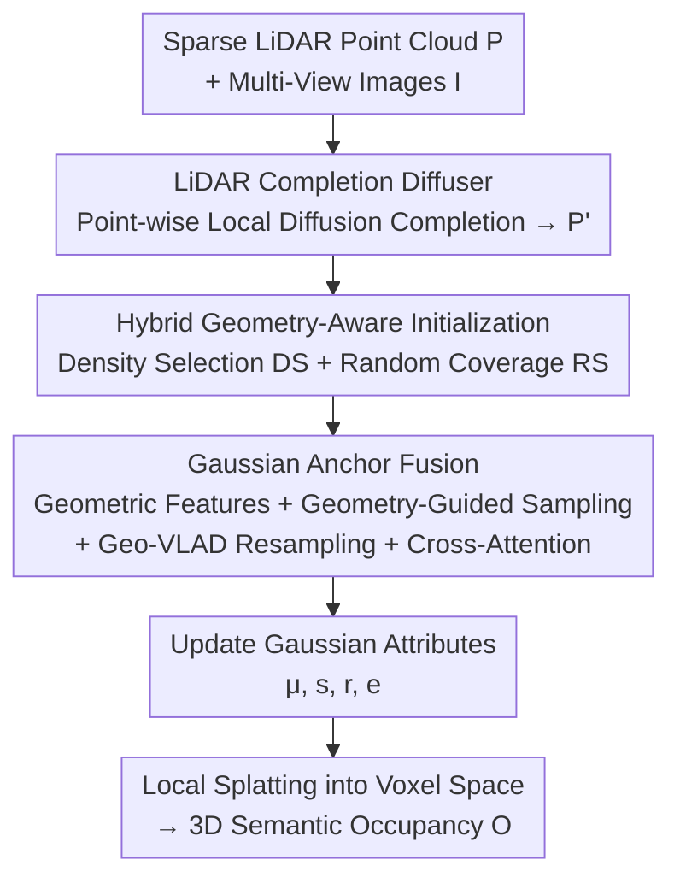

# Gau-Occ: Geometry-Completed Gaussians for Multi-Modal 3D Occupancy Prediction

**Conference**: CVPR 2026  
**Paper**: [CVF Open Access](https://openaccess.thecvf.com/content/CVPR2026/html/Lv_Gau-Occ_Geometry-Completed_Gaussians_for_Multi-Modal_3D_Occupancy_Prediction_CVPR_2026_paper.html)  
**Code**: None  
**Area**: Autonomous Driving / 3D Semantic Occupancy Prediction  
**Keywords**: 3D Occupancy Prediction, Multi-Modal Fusion, Semantic Gaussians, LiDAR Completion, Diffusion Models

## TL;DR
Gau-Occ models autonomous driving scenes as a set of compact semantic 3D Gaussian anchors. It uses a "point-wise local diffusion" LiDAR completion module to complete sparse point clouds into geometrically complete structures, and then uses Gaussian Anchor Fusion to efficiently inject multi-view image semantics into each anchor. This avoids expensive dense voxel/BEV tensors, achieving state-of-the-art results with high computational efficiency on three benchmarks: SurroundOcc, Occ3D, and KITTI-360.

## Background & Motivation
**Background**: 3D semantic occupancy prediction is a fundamental capability for autonomous driving perception, requiring the assignment of "occupancy + semantic class" labels to every voxel in the surrounding 3D space. Camera-only solutions operate on BEV planes or 3D voxel grids, while multi-modal methods introduce LiDAR/radar to provide geometric cues, yielding higher accuracy.

**Limitations of Prior Work**: The authors highlight two co-existing drawbacks. First, raw LiDAR point clouds are **sparse and suffer from occlusion bias**—lasers only hit visible surfaces, leaving a large number of "occupied but unobserved" regions empty, which leads to incomplete occupancy estimation in distant and occluded areas, and coarse free space prediction. Second, mainstream fusion pipelines are **computationally heavy**: early fusion either projects points onto multiple image views or lifts dense image features into voxel grids; transformer-based voxel/BEV space fusion incurs massive memory and computational overhead, making it difficult to scale to higher resolutions or longer temporal sequences.

**Key Challenge**: Retaining LiDAR's geometric fidelity while performing effective cross-modal fusion is highly desirable, yet traditional methods are bound to **dense voxel tensors**—where expressiveness and computational efficiency inherently conflict. 3D Gaussian primitives model only non-empty regions, making them compact and highly expressive, which represents a promising compromise. However, existing Gaussian methods are almost exclusively vision-only, and remain largely unexplored under multi-modal occupancy prediction, especially under real-world constraints of sparse LiDAR and limited computing power.

**Goal**: To encode both LiDAR geometry and multi-view image semantics using a single compact and unified 3D representation, decomposed into two sub-problems: (1) how to reconstruct geometrically complete, metric-aligned structures from sparse LiDAR to initialize reliable anchors; (2) how to efficiently and accurately fuse multi-view image semantics into these anchors without introducing dense voxel overhead.

**Core Idea**: Represent the scene as learnable semantic Gaussian anchors, initialize them with completed LiDAR, selectively fuse multi-view image features in a feed-forward manner, and finally splat the refined Gaussians into voxel space to generate occupancy—completely avoiding dense voxel tensors throughout the process.

## Method

### Overall Architecture
The inputs to Gau-Occ are sparse LiDAR point clouds $P=\{P_i\in\mathbb{R}^3\}$ and multi-view images $I$, and the output is a voxelized semantic occupancy grid $O\in\mathbb{R}^{|C|\times X\times Y\times Z}$. The entire pipeline follows a sequential workflow: "complete geometry first, inject semantics, and finally splat". The sparse LiDAR is first completed into a geometrically complete dense point cloud $P'$ by the **LiDAR Completion Diffuser (LCD)**. Then, $P'$ is voxelized into sparse features and generates a set of density-aware semantic 3D Gaussian anchors via **hybrid geometry-aware initialization**. Each anchor acts as a 3D query, sampling, aggregating, and fusing multi-view image semantics into itself through **Gaussian Anchor Fusion (GAF)**. The refined Gaussian attributes are locally splatted into the voxel space, accumulating the semantic contributions of all Gaussians to obtain the final dense occupancy.

The semantic Gaussians of the scene are defined as $G=\{G_i\}$, where each $G_i$ is parameterized by a center $\mu\in\mathbb{R}^3$, a rotation quaternion $r$, a scale $s$, and a semantic vector $c\in\mathbb{R}^{|C|}$. The semantic contribution of a single Gaussian at any query location $x$ is:

$$g(x;G_i)=\exp\left(-\tfrac{1}{2}(x-\mu)^\top\Sigma^{-1}(x-\mu)\right)\cdot c,\quad \Sigma=RSS^\top R^\top,$$

and the final occupancy is $\hat{o}(x)=\sum_{G_i\in G} g(x;G_i)$. For efficiency, **local Gaussian splatting** is adopted: each voxel only aggregates Gaussians within its local spatial neighborhood, which preserves accuracy while avoiding full-scene accumulation.

### Key Designs

**1. LiDAR Completion Diffuser (LCD): Point-wise local diffusion for completing sparse LiDAR without corrupting absolute scale**

To address the limitation of "sparse raw point clouds with occlusion bias", LCD acts as a **local diffusion model** that reconstructs dense, geometrically consistent point clouds from sparse scans. Its key difference from standard DDPM lies in the fact that DDPM applies global noise and scaling, which distorts metric geometry (a disaster for autonomous driving tasks requiring precise dimensions). LCD instead employs **point-wise local diffusion**, adding noise independently to each 3D point within its local neighborhood, strictly preserving absolute scale and details. The forward process adds noise to each supervised target point $T_j$ via $T^{(t)}_j=T_j+\sqrt{1-\bar\alpha_t}\,\epsilon$ (linear noise scheduling, **without global scaling factors**). The reverse process trains a denoising network $\hat\epsilon_\theta$ to predict the injected noise conditioned on the sparse input $P$: $L_{diff}=\|\epsilon-\hat\epsilon_\theta(T^{(t)},P,t)\|_2^2$. The dense supervision target $T$ is obtained by aggregating $K$ temporally adjacent, ego-motion-aligned LiDAR scans from the same scene, acting as free dense ground truth. Through iterative denoising, LCD learns spatial priors like surface continuity and structural regularity, reasonably filling in metric-aligned geometry in occluded or unobserved regions, thereby providing geometrically faithful anchors for subsequent Gaussian reasoning. Ablation studies show that this global geometric prior not only assists distant/occluded zones but also boosts accuracy in visible areas.

**2. Hybrid Geometry-Aware Gaussian Initialization: Density Selection + Random Coverage, balancing structural concentration and full coverage**

Initializing a compact set of Gaussian anchors from the completed point cloud $P'$ requires careful anchor placement. While GaussianFormer uses purely random sampling, the authors argue that this misses high-density structural zones or low-texture sparse regions. Gau-Occ instead uses a **hybrid strategy**: **Density Selection (DS)**, which estimates the local density within a radius $R_d$ for each point, iteratively selects the highest-density points as Gaussian centers, and suppresses neighbors within $R_d$ to avoid redundancy until $N_d$ centers $P_d$ are selected (targeting detail-rich, frequently observed surfaces); and **Random Coverage Sampling (RS)**, which uniformly samples $N_r$ centers $P_r$ from the remaining points to cover sparse or low-texture regions. The union $P_{init}=P_d\cup P_r$ forms the initial set of Gaussians, with each center assigned an axis-aligned initial scale. The resulting Gaussians are spatially balanced and geometrically aligned, enabling better reconstruction of distant and easily missed targets (e.g., drivable surfaces, vehicles) compared to pure RS—as evidenced in ablation studies where RS-only degrades both IoU and mIoU.

**3. Gaussian Anchor Fusion (GAF): Treating each Gaussian anchor as a 3D query to geometrically guide the injection of multi-view image semantics**

This core module bridges precise LiDAR geometry and dense image semantics, operating exclusively on anchors to ensure spatial accuracy while drastically reducing computation. It consists of three steps:

*Geometric Feature Extraction*: The completed point cloud $P'$ is voxelized into a sparse grid (keeping at most $T_p=10$ points per voxel) and passed through a 3D sparse CNN to obtain voxel features $F_v$. For a Gaussian with center $\mu_i$ and scale $s_i$, an adaptive neighborhood radius $R_{geo}=k\sqrt[3]{(s_x+s_y+s_z)}$ is defined, and neighborhood voxel features are aggregated using an exponential distance kernel $w_v=\exp(-\gamma\|p_v-\mu_i\|^2)$ to produce the geometry-aware anchor descriptor $f_{pc,i}$.

*Geometry-Guided Image Sampling*: Multi-scale image features are extracted using ResNet-50+FPN. The Gaussian center $\mu_i$ is projected onto each camera via differentiable projection $\Pi_v$ to obtain reference pixels $\text{pix}_{i,v}$. Then, a two-layer MLP conditioned on $f_{pc,i}$ predicts $N_{off}$ normalized 2D offsets $\Delta_{i,r}$, sampling a local region around the reference pixel $x^{(r)}_{i,v,l}=\frac{\text{pix}_{i,v}}{s_l}+\Delta_{i,r}R_l$. **Conditioning the offsets on LiDAR geometric features** aligns the sampling with the scene geometry, improving cross-view spatial consistency and long-range correspondences. This is referred to as GGS (Geometry-Guided Sampling); replacing it with geometry-independent sampling significantly degrades long-range feature association.

*Geo-VLAD Resampling and Fusion*: Instead of directly applying attention to the sampled tokens $X_i\in\mathbb{R}^{N\times d}$ ($N=216$) from all views and pyramid levels, a **geometry-aware VLAD-style resampler** compresses them into $Z_i\in\mathbb{R}^{M\times d}$ ($M=32$ learnable semantic codewords). The soft assignment $\alpha_{i,n,m}=\text{softmax}_m([W_a x_{i,n}]_m+[U_a f_{pc,i}]_m+b_m)$ is **conditioned on LiDAR features** to make the aggregation process geometry-aware, with residuals computed as $Z_i=\text{stack}_m W_z\,\text{normalize}(\sum_n\alpha_{i,n,m}(x_{i,n}-C_m))$. This is followed by FiLM modulation $\tilde Z_i=\gamma_i\odot Z_i+\beta_i$ for adaptive fusion. Finally, the LiDAR anchors act as queries, and the modulated visual tokens act as keys/values in a single-layer cross-attention mechanism. The attention computation incorporates spatial weights $\log w^{(l)}_i$ ($w^{(l)}_i=\exp(-\|\text{pix}_{i,v}-\Pi_v(\mu_i)\|^2/2\sigma_l^2)$) encoding reprojection consistency. Multi-scale results are weighted by learnable parameters $\lambda_l$ to obtain $f_{img,i}$. The fused features $[f_{pc,i};f_{img,i}]$ pass through a two-layer FFN to output Gaussian attribute increments $[\hat\mu_i,\hat s_i,\hat r_i,\hat c_i]$ for updating the anchors. The value of GVR (Geo-VLAD Resampling) is highly evident: removing it and directly feeding $N$ raw tokens into cross-attention substantially increases latency and memory footprint (due to computing attention maps over $N$ keys), while slightly decreasing accuracy due to token redundancy.

### Loss & Training
The occupancy prediction phase adopts the joint objective $L_{CE}+L_{Lov}$ (Cross-Entropy + Lovász-Softmax loss) from [14] to enhance segmentation accuracy and class balancing. LCD is trained separately as a pre-trained module using the diffusion denoising loss $L_{diff}$ (Eq. 5), where its dense supervision targets are aggregated from $K$ temporal scans aligned via ego-motion. This sparse, fully-differentiable representation preserves fine-grained geometric details while maintaining highly efficient aggregation and gradient backpropagation.

## Key Experimental Results

### Main Results
Evaluated on three benchmarks (SurroundOcc-nuScenes, Occ3D-nuScenes, KITTI-360) using IoU and mIoU.

| Dataset | Metric | Gau-Occ | Prev. SOTA | Gain |
|--------|------|---------|----------|------|
| SurroundOcc-nuScenes | IoU / mIoU | 44.3 / 32.7 | DAOcc 42.8 / 32.1 | +1.5 / +0.6 |
| Occ3D-nuScenes | mIoU | 55.1 | DAOcc 54.3 | +0.8 |
| Occ3D-nuScenes | mIoU vs SDGOcc | 55.1 | 51.7 | +3.4 |
| Occ3D-nuScenes | mIoU vs OccFusion(+radar) | 55.1 | 48.7 | +6.4 |
| KITTI-360 | IoU / mIoU | — | L2COcc (LiDAR-only) | +1.3 / +0.6 |

On SurroundOcc, multi-modal Gau-Occ outperforms DAOcc without relying on the detection-level supervision that the latter requires. On Occ3D, significant gains are observed on safety-critical categories such as bus, car, bicycle, and motorcycle, which the authors attribute to the Geo-VLAD resampling and geometry-aware FiLM modulation that robustly align multi-view image evidence to LiDAR anchors.

### Ablation Study
**(a) Point Cloud Origin + Gaussian Initialization (SurroundOcc-nuScenes)**

| Configuration | IoU↑ | mIoU↑ | Description / Details |
|------|------|-------|------|
| Raw P + DS+RS | 41.5 | 29.6 | No completion, largest drop |
| LiDPM completion + DS+RS | 43.1 | 31.9 | Replacing with diffusion completion baseline |
| P′ + RS-only | 43.9 | 32.4 | Completed but purely random initialization |
| P′ + DS+RS (Full) | 44.3 | 32.7 | Full model |

**(b) GAF Components (nuScenes)**

| Configuration | IoU↑ | mIoU↑ | Description / Details |
|------|------|-------|------|
| Without GAF | 35.2 | 24.9 | Image used only for initialization, ~9 IoU drop |
| GAF, without GGS | 40.6 | 31.2 | Geometry-independent sampling, impairs long-range correlation |
| GAF, without GVR | 43.9 | 32.4 | Raw tokens directly fed to attention, huge latency/VRAM spike, minor drop |
| Full GAF (GGS+GVR) | 44.3 | 32.7 | Optimal |

### Key Findings
- **Completion contributes major gains**: Replacing completed $P'$ with raw $P$ (Table 3a Row 1 vs Row 4) leads to a drop of 2.8 IoU / 3.1 mIoU. Furthermore, LCD outperforms the LiDPM diffusion completion baseline, showing that LCD's geometric prior is highly effective for distant/occluded zones, as well as visible regions.
- **GAF is another major contributor**: Completely removing GAF (where images are solely used for initialization) causes the performance to plunge from 44.3 to 35.2 IoU, demonstrating the absolute necessity of deep cross-modal fusion.
- **GVR primarily benefits efficiency**: Removing it results in only a minor degradation in accuracy, but dramatically increases latency and VRAM footprint—it compresses $N=216$ tokens into $M=32$ codewords, avoiding the overhead of computing attention over a huge list of keys.

## Highlights & Insights
- **Clean decoupling of "geometry completion first, semantic injection second"**: Splitting completion (LCD) and fusion (GAF) into two independent, pre-trainable modules tackles geometric incompleteness and compute limits separately, rather than blending them indiscriminately inside a bloated voxel transformer.
- **The key trick of point-wise local diffusion for preserving scale**: Global noise and scaling in standard DDPM are harmful to metric geometry in autonomous driving. Transitioning to independent diffusion within each point's local neighborhood allows the model to leverage the expressive capacity of diffusion models without distorting absolute dimensions—an insight transferrable to any point cloud generation/completion task requiring metric fidelity.
- **Gaussian anchors as a 3D query paradigm**: Using learnable 3D Gaussians as both scene representations and fusion queries restricts cross-modal sampling and attention only to sparse anchors. This naturally bypasses dense voxels, serving as a prime example of "compact representation driving efficient fusion."
- **Geometric conditioning throughout**: Conditioning everything—from sampling offsets (GGS) and VLAD soft assignments (GVR) to spatial attention weights—on LiDAR geometric features. The consistent design philosophy of "guiding image sampling with geometry" is highly instructive.

## Limitations & Future Work
- **Reliance on dense supervision from temporal aggregation**: LCD's training targets $T$ depend on aggregating $K$ temporal scans aligned via ego-motion, which requires precise ego-poses and static scene assumptions. Dynamic objects may introduce ghosting/streaking effects under multi-frame aggregation—an aspect whose impact on dynamic object completion is not thoroughly discussed.
- **Lack of concrete metrics for "high efficiency"**: Although computational efficiency is frequently emphasized, the main tables omit quantitative comparisons of latency, VRAM, or FLOPs, with only qualitative mentions of "huge latency and memory spikes" in the GVR ablation text. This makes it hard for readers to quantify exactly how much it saves compared to DAOcc or voxel transformers.
- **No open-source code**: As of writing, code is unavailable, preventing replication and verification of hyperparameter sensitivities (e.g., the number of VLAD codewords, sampling offsets, and neighborhood radius constants $k$, $\gamma$, and $\kappa$).
- **Future Directions**: Upgrading LCD to a temporal- or motion-aware completion module to handle dynamic objects; providing end-to-end latency-accuracy Pareto curves; and exploring mechanisms to adapt the number of Gaussian anchors based on scene complexity.

## Related Work & Insights
- **vs. GaussianFormer / GaussianFormer-2**: These are vision-only Gaussian occupancy methods initialized with random sampling. Gau-Occ introduces the LiDAR modality, initializing with completed point clouds via a hybrid geometry-aware method, and uses GAF for cross-modal fusion. On SurroundOcc, Gau-Occ (44.3/32.7) significantly outperforms GaussianFormer-2 (31.7/20.8).
- **vs. DAOcc**: DAOcc is the prior multi-modal SOTA but relies on detection-level supervision priors. Gau-Occ outperforms it on SurroundOcc (+1.5 IoU) and Occ3D (+0.8 mIoU) without extra priors, leveraging geometrically complete Gaussian anchors and structure-aware fusion.
- **vs. Co-Occ / OccMamba / SDGOcc, etc. (Multi-modal Voxel/BEV Fusion)**: These methods fuse features in dense 3D space, suffering from high memory and runtime overhead. Gau-Occ fuses only on sparse Gaussian anchors, preserving spatial precision while greatly reducing overhead.
- **vs. Traditional DDPM Point Cloud Completion (e.g., LiDPM)**: Global diffusion distorts metric geometry. LCD's point-wise local diffusion strictly preserves scale, outperforming LiDPM completion in ablation studies.

## Rating
- Novelty: ⭐⭐⭐⭐ Combining "point-wise local diffusion completion + Gaussian anchors + geometry-conditioned VLAD fusion" into a unified multi-modal occupancy framework is highly novel and self-consistent.
- Experimental Thoroughness: ⭐⭐⭐⭐ SOTA across three benchmarks plus two detailed ablation studies; however, it lacks a quantitative efficiency comparison table, and the main KITTI-360 table is relegated to the supplementary material.
- Writing Quality: ⭐⭐⭐⭐ Clear motivation, complete equations, and well-defined modules, though the efficiency arguments remain somewhat qualitative.
- Value: ⭐⭐⭐⭐ Highly valuable for occupancy prediction work seeking an accuracy-compute balance; the design philosophy of "permeating geometric priors throughout fusion" is highly transferable.

<!-- RELATED:START -->

## Related Papers

- [\[CVPR 2026\] TT-Occ: Test-Time 3D Occupancy Prediction](test-time_3d_occupancy_prediction.md)
- [\[ECCV 2024\] OccGen: Generative Multi-modal 3D Occupancy Prediction for Autonomous Driving](../../ECCV2024/autonomous_driving/occgen_generative_multi-modal_3d_occupancy_prediction_for_autonomous_driving.md)
- [\[CVPR 2026\] Generalizing Visual Geometry Priors to Sparse Gaussian Occupancy Prediction](generalizing_visual_geometry_priors_to_sparse_gaussian_occupancy_prediction.md)
- [\[CVPR 2026\] ProOOD: Prototype-Guided Out-of-Distribution 3D Occupancy Prediction](proood_prototype-guided_out-of-distribution_3d_occupancy_prediction.md)
- [\[ICCV 2025\] SA-Occ: Satellite-Assisted 3D Occupancy Prediction in Real World](../../ICCV2025/autonomous_driving/sa-occ_satellite-assisted_3d_occupancy_prediction_in_real_world.md)

<!-- RELATED:END -->
