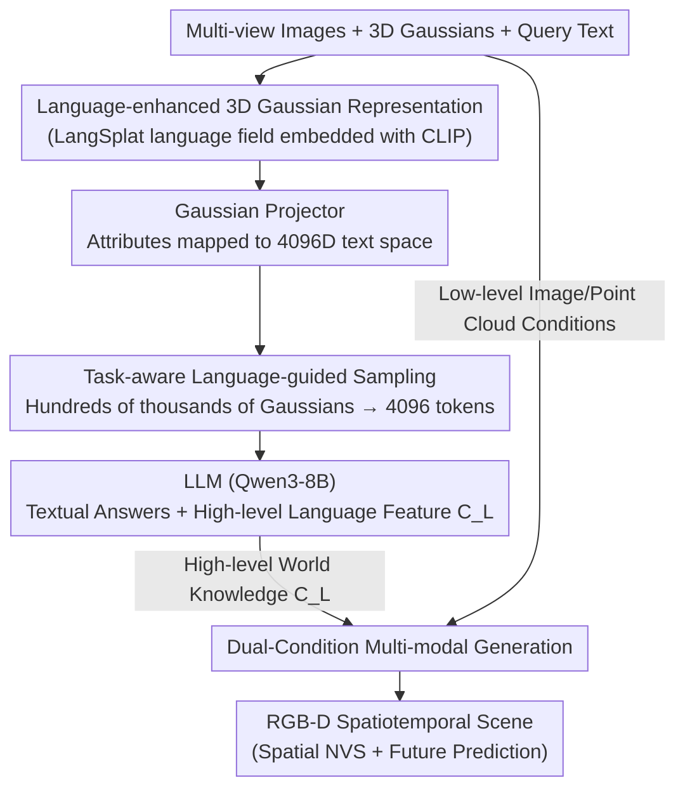

# GaussianDWM: 3D Gaussian Driving World Model for Unified Scene Understanding and Multi-Modal Generation

**Conference**: CVPR 2026  
**arXiv**: [2512.23180](https://arxiv.org/abs/2512.23180)  
**Code**: https://github.com/dtc111111/GaussianDWM (Available)  
**Area**: Autonomous Driving / World Model / 3D Vision  
**Keywords**: Driving World Model, 3D Gaussian, Scene Understanding, Multi-modal Generation, Visual Question Answering  

## TL;DR
GaussianDWM utilizes "Language-enhanced 3D Gaussians" as a unified scene representation. By embedding CLIP language features into each Gaussian ellipsoid, it achieves explicit alignment between text and 3D geometry. Through task-aware sampling, compact 3D tokens are fed into an LLM for scene understanding (description/2D-3D grounding/planning), while dual-condition diffusion performs RGB-D spatiotemporal generation. On the NuInteract understanding task, the average score improved from 52.12 to 59.23; on nuScenes spatial generation, the FID for $\pm 2m$ offset was reduced to 11.27.

## Background & Motivation

**Background**: Driving World Models (DWMs) have developed rapidly with the help of generative models. The mainstream approach is to predict future images, point clouds, or BEV maps for risk prediction, route optimization, and corner-case simulation.

**Limitations of Prior Work**: These DWMs are only capable of "generating content based on input conditions" and cannot explain, describe, or answer questions about the driving environment—one cannot perform VQA, request scene descriptions, or reason about spatial relationships. In other words, they possess "generative" capabilities but lack "understanding." Recent works like HERMES and UniFuture attempt to unify understanding and generation, but they represent spatial information using BEV or depth features. Text is only aligned with space at the **feature-level**, which is imprecise—BEV flattens 3D scenes into top-down views where language corresponds to blurred grid features rather than specific 3D objects.

**Key Challenge**: Understanding tasks require **precise alignment** between text and 3D scenes, but the spatial representations of generative DWMs (point clouds/BEV) naturally lose fine-grained geometric and texture correspondences. Simultaneously, while 3D Gaussians provide detailed geometry, a single scene contains hundreds of thousands of ellipsoids, far exceeding the context limit of LLMs for direct input.

**Goal**: (1) Identify a scene representation that enables explicit alignment between language and 3D geometry; (2) Compress it into compact tokens suitable for LLMs; (3) Use the derived "world knowledge" to guide generation in a feedback loop.

**Key Insight**: 3D Gaussian Splatting simultaneously carries geometry (position/scale/rotation), texture (opacity/appearance), and attachable semantics. If language features are directly embedded into **each** Gaussian ellipsoid, text can correspond to specific 3D primitives rather than a cluster of BEV features—representing an early, explicit modal alignment that BEV cannot achieve.

**Core Idea**: Use "Language-enhanced 3D Gaussians" as a unified representation, solve the token explosion via task-aware sampling, and inject understood world knowledge into generation using "high-level language + low-level image" dual conditions.

## Method

### Overall Architecture
GaussianDWM takes multi-view images $\{I_i\}$, pre-reconstructed 3D Gaussian ellipsoids $\{G_i\}$, and query text $\{t_i\}$ as inputs. It outputs both textual answers (understanding) and RGB-D spatiotemporal scenes (generation). The pipeline is divided into three modules: the **World Tokenizer** encodes the scene into language-enhanced compact 3D tokens; **Scene Understanding** uses an LLM to parse tokens and instructions, producing textual answers and a high-level language feature $C_L$; **Multi-modal Generation** uses $C_L$ (high-level world knowledge) plus image/point cloud conditions (low-level geometry) via a dual-guidance diffusion network to generate RGB and depth. The three components form a closed loop of "encoding → understanding → generation," where understood world knowledge is explicitly fed back into the generative end.

### Key Designs

**1. Language-enhanced 3D Gaussian Representation: Embedding language into each Gaussian ellipsoid for early explicit alignment**

To address the issue where BEV/point clouds only permit feature-level alignment, this work builds a 3DGS language field based on LangSplat. Each Gaussian $G_i$ is assigned an additional language embedding $f_i$ derived from CLIP features, inheriting hierarchical semantics extracted via SAM. Language features are alpha-blended according to the standard 3DGS rendering formula:

$$\boldsymbol{F}(v)=\sum_{i\in\mathcal{N}}f_{i}\alpha_{i}\prod_{j=1}^{i-1}\left(1-\alpha_{j}\right)$$

where $\alpha_i = o_i G_i^{2D}(v)$, $o_i$ is the opacity of the $i$-th Gaussian, and $G_i^{2D}$ is its projection function. Since raw CLIP features are 512-dimensional, storing them for hundreds of thousands of Gaussians would exceed VRAM limits. The authors train a scene-wise language autoencoder $E$ to compress $\boldsymbol{F}(v)\in\mathbb{R}^{512}$ to $\boldsymbol{H}(v)=E(\boldsymbol{F}(v))\in\mathbb{R}^{3}$, using a decoder $\Psi$ to recover CLIP features. This maintains semantic fidelity while significantly saving memory. The key to its effectiveness is that language is tied to **specific 3D primitives**, allowing textual queries to naturally locate corresponding geometry.

**2. Gaussian Projector: Heterogeneous mapping of Gaussian attributes into the LLM text space**

Gaussian attributes are heterogeneous—position $x_i\in\mathbb{R}^3$, opacity $o_i$, scale $s_i$, rotation $r_i$, and CLIP feature $f_i$ have different scales and distributions. The projector processes each category separately: positions pass through a learnable Fourier embedding $\gamma(x_i)=[\sin(2^k\pi x_i),\cos(2^k\pi x_i)]_{k=0}^{L-1}$ ($L=10$) to preserve high-frequency spatial information; opacity is constrained to $[0,1]$ via sigmoid; CLIP features are restored to 512 dimensions using the pretrained decoder $\Psi$. Each category then passes through an MLP $\phi_\cdot$ to be mapped into a shared 4096-dimensional space, and finally fusion is performed via learnable scalars $\alpha_p$ normalized by softmax to produce the final Gaussian scene token:

$$\mathcal{G}_i=\sum_{p\in\{x,o,s,r,f\}}\alpha_p\cdot h_i^p$$

This per-attribute projection allows the model to determine the weight of "position / semantics / shape" rather than hard-concatenating raw attributes.

**3. Task-aware Language-guided Hybrid Sampling: Selecting the 4096 most relevant tokens based on the task**

Even with compression, hundreds of thousands of Gaussians exceed the LLM context limit and cause redundancy. Different sampling is used based on the task: for **scene description / planning**, uniform + top-k global sampling selects $N=4096$ representative Gaussians to preserve global information; for **2D / 3D visual grounding**, **language-guided sampling** is added—calculating the similarity between the query and Gaussian features to retain only the most relevant Gaussians. This re-tokenizes dense representations into a sparse, compact form, which is effective because grounding focuses on specific objects. This strategy is the source of performance gains in 2D/3D VG (Table 2).

**4. Dual-Condition Multi-modal Generation: Guiding diffusion with high-level world knowledge and low-level image conditions**

The understanding module outputs not just text but also a high-level language feature $C_L$ encoding world knowledge. The generation end consists of a denoising UNet + frozen VAE: RGB images $I_i$ and depth maps $D_i$ (disguised as RGB via channel duplication) are encoded into the same latent space, $z_I=\mathcal{E}(I_i), z_D=\mathcal{E}(D_i)$. At each timestep, noisy latents are concatenated with two sets of conditions: low-level conditions $\{C_I,C_D\}$ from sparse maps projected from point clouds at time $t$ to $t+n$, constraining texture and geometry; and high-level condition $C_L$ from the LLM. The network is trained using the v-prediction objective $\mathbf{v}_t=\alpha_t\boldsymbol{\epsilon}_t-\sigma_t d_t$. Dual conditions ensure generation adheres to pixel-level geometry and semantic/temporal logic.

### Loss & Training
The understanding end uses two stages: first, freezing the VLM and training the aligner for 5k warm-up steps; then, fine-tuning the LLM with LoRA for 30k steps using a prefix language modeling objective $\mathcal{L}(\theta,\mathcal{B})=-\sum\sum_i\log p_\theta(t_{gt}^{(i)}\mid t_{gt}^{(<i)},t_{prefix})$. The generation end uses the v-prediction loss $\mathcal{L}=\mathbb{E}\|\mathcal{F}_\theta(d_t,d_{ref},C_I,C_D,C_L,s)-\mathbf{v}_t\|_2^2$. Training proceeds from low-res RGB to low-res RGB-D to high-res RGB-D, followed by joint optimization.

## Key Experimental Results

### Main Results (NuInteract Scene Understanding, Table 1)
Evaluated across four sub-tasks: Regional Description & Perception (RDP), 2D Visual Grounding, 3D Visual Grounding, and Planning.

| Model | LLM | 2D VG mAP | 3D VG mAP | Plan Acc | Avg Score ↑ |
|-------|-----|-----------|-----------|----------|-------------|
| InternVL2-8B | InternLM2.5-7B | 20.61 | 31.47 | 46.93 | 45.42 |
| DriveMonkey | InternLM2.5-7B | 19.47 | 51.90 | 82.64 | 52.12 |
| **GaussianDWM** | Qwen3-8B | **34.95** | **52.78** | 80.95 | **59.23** |

Ours achieves a gain of ~13.6% over the previous SOTA. 2D VG mAP nearly doubled compared to DriveMonkey (34.95 vs 19.47), and 3D VG mAP reached 52.78, validating the value of explicit 3D geometric alignment.

### Main Results (nuScenes Spatial NVS, Table 3)

| Method | $\pm 1m$ FID↓ | $\pm 1m$ FVD↓ | $\pm 2m$ FID↓ | $\pm 2m$ FVD↓ | $\pm 4m$ FID↓ |
|--------|---------------|---------------|---------------|---------------|---------------|
| StreetGaussian | 32.12 | 153.45 | 43.24 | 256.91 | 67.44 |
| DiST-S | 10.12 | 45.14 | 12.97 | 68.80 | 17.57 |
| **Ours** | **8.36** | **44.50** | **11.27** | **68.17** | 18.81 |

Ours leads across $\pm 1m / \pm 2m$ offsets. Reconstruction-based methods (StreetGaussian) suffer from artifacts at large offsets. At $\pm 4m$, ours is slightly behind DiST-S, attributed to the inherent difficulty of diffusion extrapolation.

### Ablation Study

| Configuration | Avg Score | Description |
|---------------|-----------|-------------|
| zero-shot | 15.39 | Without fine-tuning or Gaussians |
| finetuned, w/o Gaussian | 53.32 | Removing 3D GS representation |
| finetuned, w/ Gaussian + Random | 55.21 | Random sampling |
| + Top-k + Uniform | 58.93 | Global hybrid sampling |
| + similarity (Full) | **59.23** | Adding language-guided similarity sampling |

### Key Findings
- **3D Gaussian representation is the foundation**: Removing it drops the average score by 5.91, making it the most significant component; this confirms that explicit 3D geometry helps the LLM understand space.
- **Similarity sampling targets grounding**: Adding similarity increases the average score only by 0.3, but 2D VG mAP rises significantly from 33.89 to 34.95 because it selectively injects spatial information relevant to the query.
- **Dual conditions are essential**: Generation fails without low-level conditions (lack of geometric basis), while high-level world knowledge further reduces FID during large offsets/future prediction.

## Highlights & Insights
- **Embedding language into 3D primitives**: Unlike BEV which aligns text with flattened grids, embedding CLIP features into Gaussians allows queries to locate specific 3D objects. This is the root cause for the doubled grounding mAP.
- **Task-aware sampling**: By switching between global coverage for descriptions and sparse similarity-based focus for grounding, the model avoids "one-size-fits-all" downsampling that might lose critical objects.
- **Closed loop of understanding and generation**: Re-injecting world knowledge from the LLM as a high-level condition ensures generation is not just pixel-consistent but also semantically and temporally logical.

## Limitations & Future Work
- **Dependency on pre-reconstruction**: The method assumes high-quality 3D Gaussians are already available; instantaneous end-to-end reconstruction from images remains a gap.
- **Degradation under extreme extrapolation**: The FID lag at $\pm 4m$ suggests geometric consistency in diffusion models is still unstable for large view/time extrapolations.
- **Fixed sampling hyperparams**: Performance in hyper-dense vs. sparse scenes using a fixed 4096 token budget has not been fully analyzed.

## Related Work & Insights
- **vs HERMES / UniFuture**: These use BEV/depth for feature-level alignment; ours uses language-enhanced 3DGS for explicit spatial alignment, achieving higher grounding accuracy.
- **vs DriveMonkey**: DriveMonkey uses learnable queries with a spatial processor; our 3D Gaussian tokens significantly lead in 2D/3D VG tasks.
- **vs DiST-4D / MagicDrive**: These focus on generation without understanding; ours uses world knowledge as high-level conditions to improve consistency in future prediction.

## Rating
- Novelty: ⭐⭐⭐⭐⭐ First 3D Gaussian-based unified DWM with explicit alignment and task-aware sampling.
- Experimental Thoroughness: ⭐⭐⭐⭐ Solid comparison on NuInteract and nuScenes, though cross-dataset generalization is limited.
- Writing Quality: ⭐⭐⭐⭐ Clear structure and complete formulas.
- Value: ⭐⭐⭐⭐⭐ Points toward a viable 3DGS route for unified DWMs; code is open-source.

<!-- RELATED:START -->

## Related Papers

- [\[ICCV 2025\] Hermes: A Unified Self-Driving World Model for Simultaneous 3D Scene Understanding and Generation](../../ICCV2025/autonomous_driving/hermes_a_unified_self-driving_world_model_for_simultaneous_3d_scene_understandin.md)
- [\[CVPR 2026\] Unifying Language-Action Understanding and Generation for Autonomous Driving](unifying_language-action_understanding_and_generation_for_autonomous_driving.md)
- [\[CVPR 2026\] F3DGS: Federated 3D Gaussian Splatting for Decentralized Multi-Agent World Modeling](f3dgs_federated_3d_gaussian_splatting_for_decentralized_multi-agent_world_modeli.md)
- [\[CVPR 2026\] WorldLens: Full-Spectrum Evaluations of Driving World Models in Real World](worldlens_full-spectrum_evaluations_of_driving_world_models_in_real_world.md)
- [\[CVPR 2026\] MeanFuser: Fast One-Step Multi-Modal Trajectory Generation and Adaptive Reconstruction via MeanFlow for End-to-End Autonomous Driving](meanfuser_fast_one-step_multi-modal_trajectory_generation_and_adaptive_reconstru.md)

<!-- RELATED:END -->
