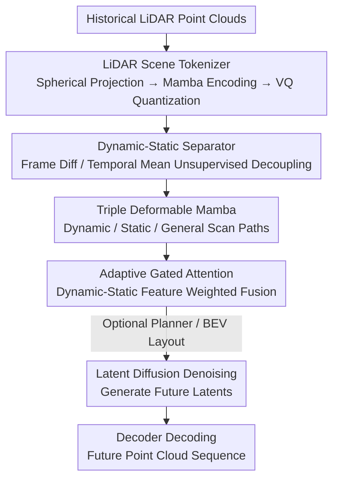

# GEM: Generating LiDAR World Model via Deformable Mamba

**Conference**: CVPR 2026  
**Paper**: [CVF Open Access](https://openaccess.thecvf.com/content/CVPR2026/html/Wu_GEM_Generating_LiDAR_World_Model_via_Deformable_Mamba_CVPR_2026_paper.html)  
**Code**: https://github.com/wuyang98/GEM  
**Area**: Autonomous Driving / LiDAR World Model / Diffusion Models  
**Keywords**: LiDAR World Model, Deformable Mamba, Dynamic-Static Decoupling, Latent Diffusion, Autonomous Driving  

## TL;DR
GEM aligns LiDAR scan sequences with Mamba's step-by-step scanning mechanism. It utilizes a Mamba scene tokenizer to compress unordered point clouds into ordered latents, followed by unsupervised decoupling of dynamic objects and static environments modeled by a triple-path deformable Mamba. Ultimately, it establishes a new SOTA for 1s/3s future prediction on nuScenes/KITTI (reducing Chamfer Distance by 81% compared to the runner-up at 1s), while supporting autonomous rollout and BEV-controllable "what-if" generation.

## Background & Motivation
**Background**: Autonomous driving world models, which predict future sensor data given historical observations, have matured in camera video and occupancy tracks. However, the LiDAR track lags significantly, despite LiDAR providing precise geometric information and better scalability.

**Limitations of Prior Work**: Existing LiDAR world models follow two main approaches, neither of which fully exploits LiDAR characteristics. One category (4D-Occ, Copilot4D) projects point clouds into dense voxels or BEV features, where quantization and projection lose fine-grained geometric details, reducing prediction fidelity. The other converts point clouds into range images for feature extraction via CNN/Transformer, but these mechanisms do not match the sequential nature of LiDAR's line-by-line scanning. Crucially, these methods entangle dynamic object and static background features, leading to poor geometric accuracy and temporal inconsistency. Furthermore, they rely on ground-truth future ego status as input, preventing autonomous rollout and controllable generation.

**Key Challenge**: Two inherent difficulties of point clouds—**disorder** (precluding direct application of techniques for structured data) and **weak semantics** (lacking camera texture or occupancy labels, making it hard to distinguish moving from stationary elements)—are bypassed rather than solved by existing structured intermediate representations and entangled modeling.

**Key Insight**: The authors observe that the physical "line-by-line sequential scanning" of LiDAR is naturally isomorphic to the State Space Model (SSM) mechanism of Mamba, which aggregates features step-by-step along a sequence. Therefore, instead of forcing point clouds into architectures designed for images, modeling should follow LiDAR’s own scanning structure.

**Core Idea**: Replace CNN/Transformer with Mamba to match LiDAR scanning, and explicitly decouple dynamic/static features for multi-path modeling. This "Deformable Mamba aligned with scan structure + Unsupervised dynamic-static decoupling" simultaneously addresses disorder and weak semantics.

## Method

### Overall Architecture
GEM is built on the **latent diffusion** paradigm. The pipeline consists of three stages: ① A LiDAR scene tokenizer compresses unordered point clouds into an ordered latent sequence; ② Unsupervised dynamic-static decoupling and triple-path deformable Mamba feature extraction are performed on the latents; ③ A diffusion process denoises future frame latents from noise, which are then decoded back to point clouds. Formally, given $\tau_p$ frames of historical point clouds $P_p$ and ego status at time $u$, the goal is to predict $\tau_f$ frames of future point clouds $P_f$. The tokenizer encoder $E$ encodes historical data into $Z_p\in\mathbb{R}^{\tau_p\times h\times w\times C}$. Control signals (ego status, optional BEV layout) are encoded as condition features. The Mamba world model outputs $\hat Z_f\in\mathbb{R}^{\tau_f\times h\times w\times C}$, which decoder $D$ restores. Optionally, a planner predicts future ego status for autonomous rollout, or a BEV layout is provided for controllable generation.

### Key Designs

**1. LiDAR Scene Tokenizer: Compressing point clouds into structured latents via Mamba**

This addresses "disordered point clouds." Authors use spherical projection to convert point cloud $P$ into a range map $R\in\mathbb{R}^{H\times W}$, where $H$ is the number of laser lines and $W$ is horizontal resolution. Each pixel stores the range of a specific laser at a specific azimuth, organizing the "line-by-line scan" into a 2.5D map. The encoder uses a **Mamba scan** (aligning scan order with physical LiDAR scanning), followed by 6 blocks for downsampling into latent $z\in\mathbb{R}^{h\times w\times C}$. During reconstruction, $z$ is quantized into $\hat z$ via a codebook. The VQ reconstruction loss is:

$$L_{VQ}=\mathbb{E}_R\lVert R-\hat R\rVert+\beta\cdot\lVert \mathrm{sg}(z)-\hat z\rVert+\lVert z-\mathrm{sg}(\hat z)\rVert$$

Where $\mathrm{sg}(\cdot)$ is the stop-gradient. Since pure MSE oversmooths edges, a discriminator $S$ is introduced for adversarial training $L_{ADV}=\mathbb{E}_R[\log S(R)+\log(1-S(\hat R))]$. Total loss is $L_{LST}=L_{VQ}+L_{ADV}$. Ablations show the Mamba tokenizer outperforms CNN/Transformer versions even without the discriminator.

**2. Unsupervised Dynamic-Static Separator: Splitting moving and stationary elements without labels**

This addresses "weak semantics." Instead of expensive labeling, the authors leverage the observation that **dynamic objects change between frames while static environments remain constant**. Two complementary cues are extracted from latent $Z\in\mathbb{R}^{\tau\times h\times w\times C}$. The dynamic cue uses frame differencing: $Z_d[i]=Z[:,i]-Z[:,i-1]$. The static cue uses a temporal sliding window average $Z_s[i]=\frac{1}{\text{end}-\text{start}}\sum Z[i]$. Three 3D convolutional extractors convert $Z, Z_d, Z_s$ into $F, F_d, F_s$, followed by adaptive gated attention fusion:

$$F'=(1-G(C[F_d,F_s]))\cdot F_d+G(C[F_d,F_s])\cdot F_s,\quad F_g=(1-G(F'))\cdot F+G(F')\cdot F'$$

Where $G(\cdot)$ is a gating function and $C[\cdot,\cdot]$ denotes concatenation. This results in dynamic $F_d$, static $F_s$, and fused general features $F_g$.

**3. Triple Deformable Mamba: Actively biasing scan paths toward dynamic or static regions**

The model uses dynamic/static features to guide the scan. Three branches (general, dynamic, static) are assigned scan paths $p_\gamma\in\mathbb{R}^{(\tau\times h\times w)\times 3}$ ($\gamma\in\{g,d,s\}$). The general branch uses a standard grid path $p_g$. The dynamic and static branches learn offsets based on $p_g$:

$$p_d=p_g+\mathrm{Tanh}(\mathrm{Linear}(\mathrm{ReLu}(\.Linear(F_d)))),\quad p_s=p_g+\mathrm{Tanh}(\mathrm{Linear}(\mathrm{ReLu}(\mathrm{Linear}(F_s))))$$

Using $F_d, F_s$ as indicators, scan points are shifted towards corresponding regions. Each branch samples features via bilinear interpolation $\bar F_\gamma=\mathrm{BI}(F_g,p_\gamma)$ and processes them via Mamba $F'_\gamma=\mathrm{DM}(\bar F_\gamma)$. This allows the dynamic branch to capture object evolution while the static branch captures global structure.

**4. Latent Diffusion + Optional Planner: Autonomous推演 and "what-if" generation**

GEM use the diffusion paradigm. During training, noise $\epsilon_t$ is added to $Z_f$ to get $Z_f^t$, and the world model predicts the noise: $L_{LD}=\mathbb{E}[\lVert\epsilon_t-\mathrm{WM}(Z_f^t,Z_p^t,t,c;\theta)\rVert^2]$. To address unknown future ego status, a joint planner predicts future actions $a_f$: $L_{Planner}=\lVert a_f-\mathrm{Planner}(a_p;\eta\mid\theta_{WM})\rVert^2$. Control signals $c$ are injected via adaptive group normalization, supporting BEV layout-based controllable generation. Total objective: $L=L_{LD}+L_{Planner}$.

### Loss & Training
Two-stage training: ① Train LiDAR tokenizer for 80 epochs (Adam, lr 4e-4) with $L_{LST}$. ② Train world model for 1.2M steps (AdamW, lr 2e-4) with $L=L_{LD}+L_{Planner}$. 8×H20 GPUs. nuScenes uses 2/6 history frames for 1s/3s prediction.

## Key Experimental Results

### Main Results
World modeling accuracy on nuScenes (1s prediction, lower is better):

| Method | CDinner ↓ | L1 ↓ | AbsRel ↓ | CD ↓ |
|------|-----------|------|----------|------|
| 4D-Occ | 1.41 | 1.40 | 10.37 | 2.81 |
| Copilot4D (Prev. SOTA) | 0.36 | 1.30 | 8.58 | 2.01 |
| **Ours (GEM)** | **0.30** | **0.98** | **6.67** | **0.38** |

On 1s prediction, CD dropped from 2.01 to 0.38 (**81.1% Gain**). On 3s, GEM wins on all metrics except AbsRel (slightly behind Copilot4D). Stability metrics ($L1_{sr}$, $AbsRel_{sr}$) are the lowest, indicating more consistent temporal predictions. Speed on 4090 GPU: nuScenes 9.23 FPS, KITTI 4.67 FPS (faster than 4D-Occ).

### Ablation Study
Architecture comparison (nuScenes 3s):

| Configuration | CD ↓ | L1 ↓ | Description |
|------|------|------|------|
| UNet | 1.07 | 1.85 | Standard CNN backbone |
| DiT | 0.90 | 1.69 | Transformer-based diffusion |
| Vision Mamba | 0.89 | 1.64 | Standard Mamba |
| Triple Mamba | 0.72 | 1.49 | Triple path with standard Mamba |
| **Ours (GEM)** | **0.67** | **1.43** | Triple Deformable Mamba |

Comparing Triple Mamba to GEM shows that the gain comes from the "deformable" design rather than just increasing parameter count.

Component contributions (nuScenes 3s, degradation when removed):
- Removing DE+DDM (Dynamic extractor + Dynamic Mamba): L1 ↓9.1%, CD ↓50.7% (Temporal consistency drops).
- No guide for Deformable Mamba (using static paths): CD ↓74.6% (Most significant degradation).
- Removing AGA (Adaptive Gated Attention): CD ↓23.9%.

### Key Findings
- **Guidance is key**: Using dynamic/static features to guide scan paths is the most critical design; without it, CD drops by 74.6%.
- **Stability**: Decoupling leads to lower $L1_{sr}/AbsRel_{sr}$, meaning the model is less likely to collapse during long-term extrapolation.
- **Planner Efficiency**: Using the self-predicted ego status (rollout) only leads to a slight performance drop compared to using ground truth, outperforming other methods that rely on ground truth.

## Highlights & Insights
- **Architecture-Physics Isomorphism**: Aligning LiDAR's line-by-line scanning with Mamba's sequential update provides a theoretical foundation for the Mamba tokenizer.
- **Lightweight Decoupling**: The "frame diff for dynamic, temporal mean for static" trick requires no labels and is easily transferable to other LiDAR tasks.
- **Deformable Scan as "Attention"**: Learning $p_d$ and $p_s$ allows Mamba to focus on regions of interest, gaining spatial selectivity similar to deformable attention while maintaining linear complexity.
- **Autonomous推演**: By treating future ego status as an unknown and using a joint planner, GEM transforms the world model from a mere predictor into a closed-loop simulator.

## Limitations & Future Work
- **Optionality of Planner**: The cumulative error and stability of the planner for long-horizon rollouts were not extensively discussed.
- **Range Map Dependency**: Spherical projection may lose information for ultra-sparse/far points or multi-echo returns. Fixed resolution limits details for distant targets.
- **3s Metric Deficit**: AbsRel is slightly worse than Copilot4D at 3s, suggesting room for improvement in long-term relative depth accuracy.
- **Semantic Evaluation**: Metrics focus on geometry (CD/L1); evaluating "semantic behavior" (e.g., traffic rule compliance) is a future direction.

## Related Work & Insights
- **vs 4D-Occ / Ray Tracing**: These use voxelization, which loses detail. GEM models on range maps using Mamba, achieving vastly better CD (0.38 vs 2.81) and faster inference.
- **vs Copilot4D**: While Copilot4D uses compressed BEV features, GEM's explicit scan alignment and dynamic-static decoupling provide superior geometric fidelity.
- **vs Vision Mamba**: GEM's triple-path deformable design outperforms standard Mamba variants with similar parameter counts.

## Rating
- Novelty: ⭐⭐⭐⭐⭐ 
- Experimental Thoroughness: ⭐⭐⭐⭐⭐ 
- Writing Quality: ⭐⭐⭐⭐ 
- Value: ⭐⭐⭐⭐⭐ 

<!-- RELATED:START -->

## Related Papers

- [\[CVPR 2026\] Deformable Gaussian Occupancy: Decoupling Rigid and Nonrigid Motion with Factorized Distillation](deformable_gaussian_occupancy_decoupling_rigid_and_nonrigid_motion_with_factoriz.md)
- [\[CVPR 2026\] SparseWorld-TC: Trajectory-Conditioned Sparse Occupancy World Model](sparseworld_tc_trajectory_conditioned_sparse_occupancy_world_model.md)
- [\[CVPR 2026\] Think Before You Drive: World Model-Inspired Multimodal Grounding](think_before_you_drive_world_model-inspired_multimodal_grounding.md)
- [\[CVPR 2025\] Trajectory Mamba: Efficient Attention-Mamba Forecasting Model Based on Selective SSM](../../CVPR2025/autonomous_driving/trajectory_mamba_efficient_attention-mamba_forecasting_model_based_on_selective_.md)
- [\[CVPR 2026\] U4D: Uncertainty-Aware 4D World Modeling from LiDAR Sequences](u4d_uncertainty-aware_4d_world_modeling_from_lidar_sequences.md)

<!-- RELATED:END -->
