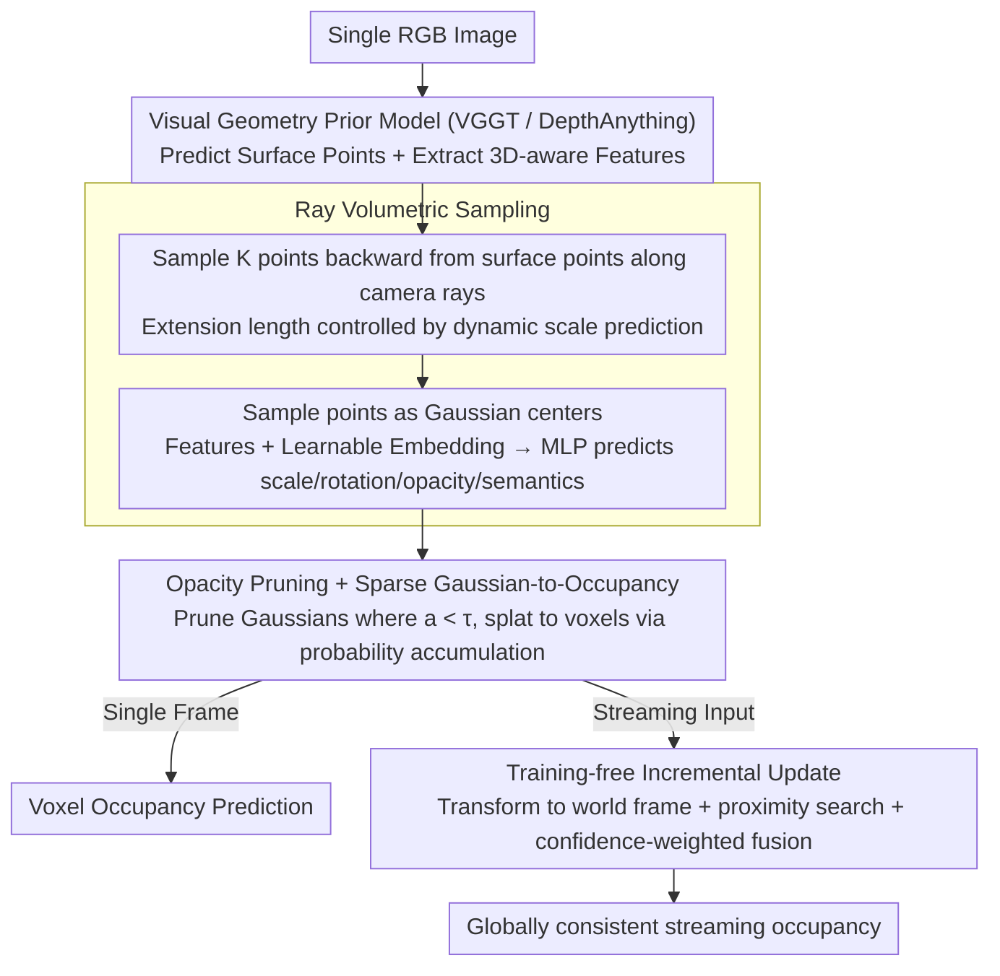

# Generalizing Visual Geometry Priors to Sparse Gaussian Occupancy Prediction

**Conference**: CVPR 2026  
**arXiv**: [2602.21552](https://arxiv.org/abs/2602.21552)  
**Code**: [https://github.com/JuIvyy/GPOcc](https://github.com/JuIvyy/GPOcc)  
**Area**: Autonomous Driving  
**Keywords**: Occupancy Prediction, Visual Geometry Priors, Gaussian Representation, Ray Sampling, Streaming Update

## TL;DR
GPOcc proposes utilizing generalizable visual geometry priors (e.g., VGGT, DepthAnything) for monocular 3D occupancy prediction. By extending surface points inward along camera rays to generate volumetric samples, the method performs probabilistic occupancy inference using sparse Gaussian primitives. It introduces a training-free incremental update strategy for streaming inputs, achieving a +9.99 mIoU gain in monocular settings and +11.79 in streaming settings over the previous SOTA on Occ-ScanNet, while running 2.65x faster under the same depth prior.

## Background & Motivation
3D scene understanding is a core capability for embodied intelligence. Occupancy prediction provides a unified voxelized representation of foreground objects and background structures, serving as a critical foundation for downstream tasks like navigation, manipulation, and autonomous driving.

Fine-grained occupancy prediction in indoor scenes is more challenging than in outdoor autonomous driving due to cluttered layouts and diverse object categories. Existing methods like ISO use depth distributions to lift 2D features to dense 3D volumes processed by 3D U-Nets, but dense representations result in significant computational waste in empty regions. EmbodiedOcc randomly initializes Gaussian primitives and refines them via iterative cross-attention, yet many Gaussians fall into empty space, leading to low representation efficiency.

Meanwhile, Visual Geometry Models (VGMs) such as DepthAnything and VGGT are developing rapidly, providing rich 3D priors like depth, point maps, and camera parameters. **However, the outputs of these models are inherently surface-oriented**—depth maps and point maps are restricted to visible surfaces, leaving the interior of volumes unrepresented. Converting "surface priors" into "volumetric priors" is a core unsolved problem.

**Core Idea**: Extend predicted surface points inward along camera rays to generate volumetric sample points as Gaussian primitive centers, infer occupancy through sparse Gaussian probability formulas, and maintain efficiency via opacity pruning.

## Method

### Overall Architecture
Given a single RGB image, a visual geometry prior model (VGGT or DepthAnything) predicts surface points and extracts 3D-aware features. A ray volumetric sampling module extends surface points inward along camera rays, using the generated sample points as Gaussian centers. Extracted features are combined with learnable embeddings and processed by an MLP to predict Gaussian attributes (scale, rotation, opacity, semantic features). After opacity pruning, sparse Gaussians are splatted into voxel occupancy via probability formulas. In streaming scenarios, a training-free incremental update strategy integrates single-frame Gaussians into a global memory bank.

### Key Designs

**1. Ray Volumetric Sampling: Expanding "Surface-only" Geometry Priors into "Volumetric" Priors**

Visual geometry models like VGGT or DepthAnything only output a visible surface layer—one 3D point per pixel—leaving the thickness and interior of objects empty. GPOcc supplements this by extending points along the camera ray: for pixel $(u,v)$ with known depth $\mathbf{d}_{(u,v)}$ and normalized ray direction $\mathbf{r}_{(u,v)} = \frac{[x, y, 1]^\top}{\sqrt{x^2+y^2+1}}$, it samples $K$ points behind the surface point: $\mathbf{x}_{(u,v,k)} = (\mathbf{d}_{(u,v)} + \delta_k)\,\mathbf{r}_{(u,v)}$. Here $\{\delta_k\}_{k=1}^K = \text{linspace}(0,1,K)\cdot\text{scale}(\cdot)$, where the extension "depth" is controlled by a network-predicted scale to fit true thicknesses. These points serve as Gaussian centers. Attributes are predicted by adding a learnable embedding $\mathbf{E} \in \mathbb{R}^{K \times C}$ to 1/4 downsampled features $\hat{\mathbf{F}}^{1/4} = \mathbf{F}^{1/4} \oplus \mathbf{E}$, then using an MLP to output scale, rotation, opacity, and semantics $\{s_i, r_i, a_i, c_i\}$. This approach only places points where objects exist, avoiding empty regions entirely.

**2. Opacity Pruning + Sparse Gaussian to Occupancy: Letting Empty Regions be "Naturally Empty"**

Voxel occupancy is derived from sparse Gaussians via probability accumulation (following GaussianFormer2):

$$\hat{o}(p; \mathbf{G}) = \sum_{i \in \mathcal{N}(p)} g_i(p; \mu_i, s_i, r_i, a_i, c_i), \quad o(p; \mathcal{G}_i) = \exp\!\Big(-\tfrac{1}{2}(p-\mu_i)^\top \Sigma_i^{-1}(p-\mu_i)\Big)$$

The occupancy value of voxel $p$ is the sum of contributions from neighboring Gaussians. Voxels far from all Gaussians naturally approach zero occupancy. Unlike EmbodiedOcc, which classifies dense 3D anchors, GPOcc concentrates computation on objects. Pruning Gaussians with opacity below $\tau = 0.01$ further reduces redundancy.

**3. Training-free Incremental Update: Accumulating Single Frames into Consistent Streaming Scenes**

To extend to video streams without training temporal modules, GPOcc maintains a global Gaussian memory bank $\mathcal{M}$. Per-frame Gaussians are transformed to the world coordinate system using camera poses, followed by a radius $\epsilon$ spatial proximity search. If neighbors are found, attributes are fused via weighted averaging:

$$\theta_i \leftarrow \frac{\gamma p_i \theta_i + (1-\gamma) \sum_j p_j \theta_j}{\gamma p_i + (1-\gamma) \sum_j p_j}, \quad \theta \in \{\mu, \Sigma, a, c\}$$

New Gaussians without neighbors are inserted. Setting $\gamma < 0.5$ prioritizes recent observations, while using the top-1 semantic confidence $p$ as a weight ensures that more certain predictions dominate the fusion. This process provides temporally smooth global representations without additional training parameters.

### Loss & Training
- Composite Loss: $\mathcal{L} = L_{\text{focal}} + L_{\text{lov}} + L_{\text{scal}}^{\text{geo}} + L_{\text{scal}}^{\text{sem}} + L_{\text{depth}}$
    - $L_{\text{focal}}$: Focal loss for class imbalance.
    - $L_{\text{lov}}$: Lovász-Softmax loss for IoU optimization.
    - $L_{\text{scal}}^{\text{geo/sem}}$: Scene category affinity loss (geometry + semantics).
    - $L_{\text{depth}}$: Huber depth loss for end-to-end geometric consistency optimization.
- Training: AdamW (weight decay 0.01), 10 epochs, batch 8, 4×A800 GPUs, cosine LR decay to $2 \times 10^{-4}$.
- Input resizing: Long side to 518px, gradient clipping at 1.0.

## Key Experimental Results

### Main Results

| Dataset | Metric | GPOcc-VGGT | GPOcc-DPT | EmbodiedOcc++ | Gain (VGGT) |
|--------|------|-----------|-----------|---------------|------------|
| Occ-ScanNet (Mono) | IoU↑ | **63.14** | 56.96 | 54.90 | +8.24 |
| Occ-ScanNet (Mono) | mIoU↑ | **56.19** | 51.88 | 46.20 | +9.99 |
| EmbodiedOcc-ScanNet (Stream) | IoU↑ | **61.41** | 56.39 | 52.20 | +9.21 |
| EmbodiedOcc-ScanNet (Stream) | mIoU↑ | **55.39** | 51.22 | 43.60 | +11.79 |

### Efficiency Comparison (Occ-ScanNet)

| Model | IoU | mIoU | FPS | Params |
|------|-----|------|-----|--------|
| ISO | 42.16 | 28.71 | 3.63 | 303.05M |
| EmbodiedOcc | 53.55 | 45.15 | 10.66 | 231.45M |
| **Ours-DPT** | **56.96** | **51.88** | **28.22** | **97.95M** |
| Ours-VGGT | 63.14 | 56.19 | 5.26 | 942.31M |

### Ablation Study

| Config | mIoU | IoU | #Gaussians | Description |
|------|------|-----|------------|------|
| K=1 (Surface only) | 47.88 | 53.10 | 3079 | Worst performance without internal sampling |
| K=4 | 55.28 | 60.35 | 2731 | Significant gain from internal sampling |
| K=16 (Default) | **56.19** | **63.14** | 5876 | Saturated accuracy, optimal efficiency |
| K=32 | 56.72 | 63.84 | 20206 | Diminishing marginal returns |
| τ=0.01 (Default) | **56.19** | **63.14** | 5876 | Optimal threshold |
| τ=0.05 | 54.16 | 60.84 | 1612 | Excessive pruning |
| τ=0.10 | 52.65 | 58.31 | 930 | Severe accuracy loss |

### Key Findings
- Under the same depth prior (DepthAnything), GPOcc-DPT is 2.65x faster than EmbodiedOcc (28.22 vs 10.66 FPS) and achieves +6.73 mIoU with less than half the parameters, proving the efficiency of the ray-sampled sparse Gaussian architecture.
- Moving from K=1 to K=16 improves mIoU by +8.31, emphasizing the necessity of volumetric sampling.
- Stronger geometric priors (VGGT vs DPT) yield consistent gains (+4.31 mIoU), showing the framework benefits from base model improvements.
- Opacity pruning at τ=0.01 effectively controls the number of Gaussians without losing accuracy.

## Highlights & Insights
- "Inward extension along rays" is a natural and effective method to convert surface priors into volumetric ones.
- Sparse Gaussians focus on object regions; empty space is handled automatically, avoiding the waste typical of dense methods.
- The incremental update strategy is cleverly designed using spatial proximity, confidence weighting, and prioritizing new observations without needing temporal re-training.
- The framework is compatible with different visual geometry models, allowing "free" performance upgrades as base models evolve.

## Limitations & Future Work
- The VGGT version has massive parameters (942.31M) and low FPS (5.26), hindering real-time deployment.
- Ray sampling assumes a specific depth behind the surface, which may be inaccurate for thin structures like curtains or walls.
- Spatial radius $\epsilon$ and temporal weight $\gamma$ in the update strategy are manually tuned hyperparameters.
- Evaluated only on the indoor ScanNet dataset; generalization to large-scale outdoor scenes is unknown.

## Related Work & Insights
- Comparison with EmbodiedOcc: Ray-guided sparse Gaussians significantly outperform predefined dense anchors in both efficiency and accuracy.
- Rapid progress in VGMs (VGGT, DUSt3R, MASt3R) provides the foundation; GPOcc demonstrates how to leverage these priors effectively.
- Direct use of GaussianFormer2’s probabilistic occupancy formula proves the versatility of Gaussian representations in occupancy tasks.

## Rating
- Novelty: ⭐⭐⭐⭐ The combination of ray volumetric sampling and sparse Gaussian occupancy is original, though individual components exist.
- Experimental Thoroughness: ⭐⭐⭐⭐⭐ Comprehensive evaluation across two datasets, two priors, and detailed ablations.
- Writing Quality: ⭐⭐⭐⭐ Clear motivation, intuitive Figure 1, and complete derivations.
- Value: ⭐⭐⭐⭐⭐ The DPT version’s efficiency (28 FPS, 97.95M parameters) makes it practical for deployment; its prior-agnostic nature ensures longevity.

<!-- RELATED:START -->

## Related Papers

- [\[CVPR 2026\] DVGT: Driving Visual Geometry Transformer](dvgt_driving_visual_geometry_transformer.md)
- [\[CVPR 2026\] SparseWorld-TC: Trajectory-Conditioned Sparse Occupancy World Model](sparseworld_tc_trajectory_conditioned_sparse_occupancy_world_model.md)
- [\[ECCV 2024\] Fully Sparse 3D Occupancy Prediction](../../ECCV2024/autonomous_driving/fully_sparse_3d_occupancy_prediction.md)
- [\[CVPR 2026\] O3N: Omnidirectional Open-Vocabulary Occupancy Prediction](o3n_omnidirectional_open-vocabulary_occupancy_prediction.md)
- [\[CVPR 2026\] Deformable Gaussian Occupancy: Decoupling Rigid and Nonrigid Motion with Factorized Distillation](deformable_gaussian_occupancy_decoupling_rigid_and_nonrigid_motion_with_factoriz.md)

<!-- RELATED:END -->
