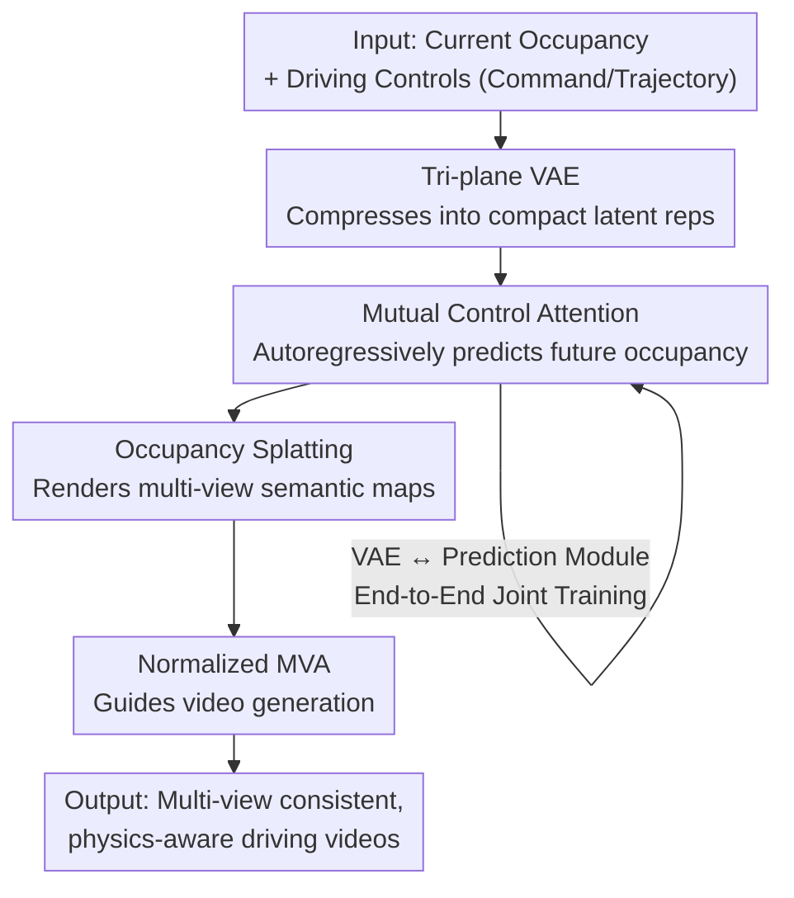

# GenieDrive: Towards Physics-Aware Driving World Model with 4D Occupancy Guided Video Generation

**Conference**: CVPR 2026  
**Paper**: [CVF Open Access](https://openaccess.thecvf.com/content/CVPR2026/html/Yang_GenieDrive_Towards_Physics-Aware_Driving_World_Model_with_4D_Occupancy_Guided_CVPR_2026_paper.html)  
**Code**: To be confirmed (visualizations available on project homepage)  
**Area**: Autonomous Driving / Driving World Models / Video Generation  
**Keywords**: Driving World Models, 4D Occupancy, Tri-plane VAE, Multi-view Video Generation, Physics-Aware

## TL;DR
GenieDrive decouples the black-box process of "generating video directly from driving actions" into two stages: first, using a lightweight occupancy world model with only 3.47M parameters to predict future occupancy from historical 4D occupancy and driving controls (physics constraint); second, projecting the occupancy into semantic maps to guide a pre-trained video model to generate multi-view driving videos. This achieves a relative improvement of 7.2% in mIoU for occupancy prediction at 41 FPS inference, a relative decrease of 20.7% in FVD for video generation, and enables the generation of up to 241 frames (~20s) of editable, multi-view consistent, and physics-aware driving videos.

## Background & Motivation

**Background**: Physics-aware driving world models are critical infrastructure for autonomous driving planning, long-tail data synthesis, and closed-loop evaluation. Current mainstream approaches (such as Vista, Epona, and the MagicDrive series) use a video diffusion model as a black box to directly map driving actions and other conditions to video, relying on learning the denoising process on driving video datasets to "understand" the driving scene.

**Limitations of Prior Work**: Such black-box models lack any physical modeling and constraints, making them highly susceptible to biases in the video data distribution. For example, in almost all public driving datasets, the ego-vehicle goes straight most of the time. Models trained on such data develop a "go-straight bias." Consequently, when commanded to "turn right," the model may still generate a video of the car going straight. The model overfits the training data instead of truly understanding the 4D representation of the driving scene and the physical relationship between "conditions $\leftrightarrow$ video."

**Key Challenge**: Directly mapping low-dimensional actions to high-dimensional videos lacks an intermediate database or physical representation capable of carrying 3D structure and dynamics, rendering "controllability" and "physical consistency" unassured. Conversely, introducing 4D occupancy as an intermediate representation encounters a new trade-off: occupancy consists of high-resolution 3D voxels that require both **efficient compression** (to avoid prohibitive downstream 4D generation costs) and **precise reconstruction** (to prevent loss of physical details). Existing methods struggle to balance both.

**Goal**: (1) Construct an occupancy world model that is accurate, fast, and lightweight to precisely predict future occupancy from driving controls; (2) utilize this occupancy to constrain video generation, obtaining multi-view consistent, physically plausible, long-duration, and editable driving videos.

**Key Insight**: The authors decouple the problem into a two-stage process: "first modeling physics (occupancy), then rendering appearance (video)." Occupancy provides both high-resolution 3D layout and dynamic evolution, serving as a natural physical carrier for driving scenes. By first establishing the physical ground truth of "where the car should go when turning right" in the occupancy space, the video model only needs to handle the appearance rendering. This decouples the challenging end-to-end mapping into two easier-to-learn sub-problems.

**Core Idea**: Replace the "action $\to$ video" black box with a "4D occupancy intermediate representation," using occupancy as a physical constraint and prior to guide downstream multi-view video generation.

## Method

### Overall Architecture
GenieDrive is a two-stage generative pipeline. **Stage 1 (Lightweight Occupancy World Model)**: The current occupancy is encoded into a compact latent representation via a tri-plane VAE. A Mutual Control Attention (MCA) module then autoregressively predicts the next-step latent representation by combining driving controls (command, trajectory, yaw, speed). The VAE and the prediction module are jointly trained in an end-to-end manner. The decoded future occupancy is rendered into multi-view semantic maps via occupancy splatting. **Stage 2 (Physics-Aware Video Generation)**: Using these semantic maps as physical conditions, they are input into a pre-trained video diffusion model (Wan2.1-1.3B). A Normalized Multi-View Attention (MVA) module is inserted after the DiT blocks to learn the spatial relationships among multiple views, ultimately outputting multi-view, temporally consistent driving videos.

The input consists of initial occupancy, initial multi-view frames, and driving controls, while the output is physically plausible multi-view driving videos. The key to the pipeline lies in the occupancy determining the physical correctness in 3D space first, which is then projected into the low-dimensional video space to generate the appearance, ensuring the rendered output naturally satisfies physical constraints.

### Key Designs

**1. 4D Occupancy Physical Intermediate Representation: Decoupling the "Action $\to$ Video" Black Box into "Physics First, Appearance Later"**

This is a paradigm-level design aimed at addressing the limitation where black-box models are biased by data distribution (e.g., turning right with command but going straight in video). Instead of forcing a single diffusion model to learn the high-dimensional mapping of "driving action $\to$ video," the authors insert 4D occupancy as an intermediate representation. The first stage uses a lightweight occupancy world model to predict future occupancy using only historical observations and the given driving actions (note that unlike UniScene/InfiniCube, which require BEV maps as input and act more like "translators", and unlike WoVoGen, which can only predict extremely short sequences of 6 frames). Occupancy simultaneously encodes high-resolution 3D structures and dynamic evolution, ensuring that the physical fact of "where the car should go when turning right" is established in 3D space first. In the second stage, the video model only needs to render this physically validated occupancy into appearance. This not only splits a hard end-to-end mapping into two easier sub-problems, but since occupancy is an editable 3D/4D structure, it naturally supports generating corresponding videos after adding or removing objects in the occupancy space (e.g., Remove/Insert in Fig. 5c), providing a powerful lever for out-of-distribution (OOD) driving data synthesis.

**2. Compact Tri-plane VAE: Breaking the "Compression vs. Reconstruction" Trade-off with 58% Latent Representation Size**

To address the conflict where high-resolution occupancy voxels are difficult to compress efficiently while maintaining precise reconstruction, the authors observe that occupancy contains significant redundancy. Drawing inspiration from low-rank reconstruction, they propose compressing occupancy into a tri-plane representation. Given occupancy $O \in \mathbb{R}^{H\times W\times D}$, it is first downsampled using a 3D convolution $g_\phi$ to obtain voxel features $S \in \mathbb{R}^{h\times w\times d\times C}$, which are then projected along the X, Y, and Z axes into three latent planes $Z_{yz}, Z_{xz}, Z_{xy}$. The projection operation borrows the `[CLS]` token concept from BERT: taking $Z_{xy}$ as an example, the feature is first rearranged as $S' = \mathrm{rearrange}(S,\, hwdC \to (hw)\,d\,C)$, then concatenated with a learnable token $P_{xy}\in\mathbb{R}^{C}$ to obtain $S''=\mathrm{cat}(P_{xy}, S')$, which is passed through a Transformer self-attention layer $Z_{xy}=F_{xy}(S'')$ to output the projection as the value of the learnable token. To decode, the tri-planes are fused using a Hadamard product and combined with position embeddings:

$$\hat{O} = f_\psi\big(Z_{xy}\odot Z_{yz}\odot Z_{xz} + \mathrm{PE}(x,y,z)\big)$$

The VAE is trained self-supervised using three loss terms: cross-entropy, Lovász-softmax, and KL divergence (Eq. 3). Consequently, the latent representation size is only 58% of previous methods, yet retains superior reconstruction. This compact representation is the basis for the subsequent fast 41 FPS inference and the ultra-small 3.47M parameter count. ⚠️ Equations are subject to the original paper.

**3. Mutual Control Attention + End-to-End Training: Letting Control Securely "Lock" Occupancy Evolution and Aligning Reconstruction with Prediction**

The occupancy world model autoregressively predicts the latent representation of the next frame $\hat{Z}_{t+1}=\mathcal{F}_{pred}(Z_t, c, [Z_{t-1},\ldots,Z_{t-k}])$, where $c$ represents control signals like command and trajectory. To precisely model how controls affect scene evolution, the authors design MCA: in each layer, the occupancy latent representation $Z^l$ and control signals $c^l$ interact bi-directionally—first, $Z$ attends to control ($Z^{l'}=Z^l+\mathrm{Attn}(Q_{Z^l},K_{c^l},V_{c^l})$), followed by occupancy self-attention, and finally, the control attends back to the updated occupancy ($c^{l+1}=c^l+\mathrm{Attn}(Q_{c^l},K_{Z^{l+1}},V_{Z^{l+1}})$). Meanwhile, intermediate transformation supervision is borrowed from I2-World: an MLP head $f_{trans}$ at an intermediate layer decodes control latent signals into a transformation matrix, supervised by the ground-truth transformation matrix $T$ using $\mathcal{L}_{reg}=\|T_t^{t+1}, f_{trans}(c_t^m)\|^2$.

The most critical training design is **end-to-end joint training**. The authors point out that previous 4D occupancy methods rely on two-stage training—first training a VAE/VQ-VAE under a reconstruction objective, then predicting in the fixed latent space—but representations learned for reconstruction are not necessarily optimal for prediction. Therefore, the tri-plane VAE and prediction module are jointly optimized end-to-end (Eq. 10), directly supervising the entire pipeline with ground-truth future occupancies. Interestingly, while this direct end-to-end approach fails for other methods (DOME's end-to-end optimization leads to near-zero performance due to diffusion loss compressing the latent space too simplistically, and I2-World's discrete representation suffers severe degradation), GenieDrive benefits significantly because of its continuous representation (CR). The authors verified this via ablation studies removing CR.

**4. Normalized Multi-View Attention: Enabling Single-View Pretrained Models to Stably Learn Multi-View Consistency**

Once occupancy is projected into the video space, the pre-trained video model, designed for single-view generation, will produce inconsistent appearances of the same object across different views if run independently. On the other hand, flattening time, space, and multiple views for self-attention yields quadratic complexity that is computationally prohibitive. The authors discover that "driving scene consistency predominantly resides at the same height across different views." Based on this, they propose an efficient MVA: rearranging features to $\mathrm{rearrange}(Z,\, n(thw)C \to (th)(nw)C)$, which restricts attention to the same height across different views. This MVA block is inserted after the DiT block, allowing the receptive field to span across all timesteps, feature patches, and views. However, because the newly inserted module is untrained, directly integrating it might destroy the pre-trained prior. To address this, the authors introduce cross-normalization for stable fine-tuning: for $M=\mathrm{SelfAttn}(Z)$,

$$Z' = Z + \eta\left(\frac{M-\mu_M}{\sigma_M}\sigma_Z + \mu_Z\right)$$

This normalizes $M$ and rescales it back to the distribution of $Z$, with $\eta$ adjusting the multi-view attention strength. This allows MVA to be optimized without compromising the pre-trained prior. Ablations show that removing this normalization causes FVD to spike from 98 to 213, introducing prominent grid artifacts and blur. The video generation side is fine-tuned using flow-based v-prediction loss (Eq. 12).

## Key Experimental Results

The experiments are conducted on NuScenes (700 training / 150 validation scenes). Occupancy uses Occ3D 2Hz labels, the video model base is Wan2.1-1.3B, and multi-view video is generated at 12Hz. Evaluation metrics include FVD, mIoU, and mAP, trained on 8×48GB GPUs.

### Main Results

**4D Occupancy Prediction (Table 1, key columns)**: Compared to the previous SOTA I2-World, the average mIoU improves by ~7.2% and average IoU by ~4%, achieving the smallest parameters and fastest speed.

| Method | Input | Recon. mIoU | Avg mIoU↑ | Avg IoU↑ | FPS↑ | Params |
|------|------|-------------|-----------|----------|------|------|
| OccWorld | Occ | 66.38 | 17.14 | 26.63 | 18.00 | 72.39M |
| DOME | Occ | 83.08 | 27.10 | 36.36 | 6.54 | 397.55M |
| COME | Occ | 83.08 | 34.23 | 44.13 | 0.30 | 692.97M |
| I2-World | Occ | 81.22 | 39.73 | 49.80 | 37.04 | 22.71M |
| **GenieDrive** | Occ | **86.15** | **42.59** | **51.80** | **41.38** | **3.47M** |

**Multi-View Video Generation (Table 4, key rows)**: Under the 8-frame occupancy condition, GenieDrive-S reduces FVD to 55.93 compared to UniScene's 70.52 (a relative reduction of ~20.7%). The mIoU/mAP also significantly outperform the previous SOTA MagicDrive-V2, and it can roll out to 241 frames.

| Method | Frames | Condition | FVD↓ | mIoU↑ | mAP↑ |
|------|------|------|------|-------|------|
| MagicDrive-V2 | 241 | BEV & 3D Box | 94.84 | 20.40 | 18.17 |
| UniScene | 8 | Occ | 70.52 | 21.75 | 10.32 |
| **GenieDrive-S** | 8 | Occ | **55.93** | **31.00** | **21.23** |
| GenieDrive-M | 37 | Occ | 98.06 | 31.44 | 19.84 |
| GenieDrive-L Rollout | 241 | Occ | 137.25 | 31.03 | 18.89 |

### Ablation Study

**Occupancy World Model (Table 3, average mIoU/IoU)**: End-to-end training is only effective for our method with continuous representation, while collapsing for diffusion-based DOME and discrete I2-World.

| Config | Avg mIoU | Avg IoU | Description |
|------|----------|---------|------|
| DOME | 27.10 | 36.36 | Baseline |
| DOME + E2E | 0.43 | 0.51 | E2E collapses directly |
| I2-World + E2E | 10.09 | 20.25 | Discrete representation under E2E degrades significantly |
| w/o MCA | 38.96 | 48.68 | Remove mutual control attention, significant drop at 3s |
| w/o E2E | 39.79 | 50.46 | No end-to-end training |
| w/o CR | 39.09 | 50.23 | Use discrete representation instead |
| **Full** | **42.59** | **51.80** | Full model |

**Video Generation (Table 5, 37 frames)**: Normalization is more critical than MVA itself; removing normalization almost triples FVD.

| Config | FVD↓ | mIoU↑ | mAP↑ |
|------|------|-------|------|
| w/o Normalized MVA | 120.16 | 30.12 | 18.77 |
| w/o Normalization | 212.67 | 21.49 | 10.04 |
| **Full** | **98.06** | **31.44** | **19.84** |

### Key Findings
- **End-to-End Training is a "Method-Specific Dividend" rather than a General Trick**: The same end-to-end training leads to zero performance in DOME and is halved in I2-World. Only GenieDrive, using a continuous tri-plane representation, reaps the benefits (39.79 $\to$ 42.59). The authors explain that diffusion loss compresses the latent space too simplistically, and discrete quantization loss compounded with end-to-end training amplifies error, serving as a cautionary note for generative world models.
- **Normalization is More Indispensable than Multi-View Attention Itself**: Removing MVA merely results in multi-view inconsistency (FVD 120), whereas omitting normalization directly leads to grid artifacts, causing the FVD to spike to 213. This indicates that when inserting an untrained module into a pre-trained prior, the stability of distribution alignment is far more critical than the expressive capacity of the new module.
- **MCA Provides the Greatest Gain for Long-Term Prediction**: Removing MCA causes a particularly noticeable performance drop at 3s, demonstrating the value of bi-directional interaction between controls and occupancy in long-term evolution modeling.
- **Long-Term Extrapolation Advantage**: In 4s/5s/6s tests (Table 2), the 6s mIoU (23.66) of our method outperforms the 4s metrics of most prior methods, whereas OccWorld/DOME/UniScene degrade rapidly over time.

## Highlights & Insights
- **Using Occupancy as a "Physical Draft" to Render Appearance**: Splitting the hard "action $\to$ video" mapping into "action $\to$ occupancy $\to$ video" ensures strong physical constraints in 3D space. This is a clean approach to overcome the "data distribution bias where turn-right commands produce straight-going videos," transferable to any controllable generation task prone to high-dimensional distribution bias.
- **Tri-plane + BERT [CLS]-style Projection**: Compressing occupancy iteratively by projecting it axially using a learnable token reduces the latent size to 58% while improving reconstruction quality. This is an elegant and reusable trick for 3D voxel compression.
- **Cross Normalization for Stable New Module Integration**: Normalizing the newly inserted module's output and rescaling it back to the original distribution provides a plug-and-play stabilization paradigm for inserting untrained attention modules into large pre-trained models.
- **Editability is a Free Lunch**: Because the intermediate representation is 3D occupancy, adding or removing vehicles/guardrails before generating videos costs virtually nothing, naturally lending itself to OOD long-tail driving data synthesis and closed-loop evaluation.

## Limitations & Future Work
- **Dependence on Ground-Truth Occupancy and Base Model**: Training requires high-quality 4D occupancy annotations like Occ3D, which entails high adaptation costs to scenarios without occupancy annotations. Video quality is also bounded by the performance of the pre-trained Wan2.1-1.3B base model.
- **Two-Stage Error Propagation**: Errors in Stage 1 occupancy predictions directly propagate to Stage 2 video rendering. A cumulative degradation is observed under long rollouts (241 frames) where FVD increases from 92.78 to 137.25.
- **Evaluation Limited to a Single Dataset (NuScenes)**: Generalization across different cities or sensor layouts, alongside downstream gains in real closed-loop planning, has not been fully verified.
- **Future Directions**: Jointly optimizing the two stages to suppress error propagation, introducing stronger physical consistency constraints (e.g., explicit dynamics), and systematically deploying the editing capabilities for automated synthesis of long-tail scenarios.

## Related Work & Insights
- **vs. Vista / Epona (Black-box Video Driving World Models)**: These map directly from action $\to$ video and only support single views, which tend to generate straight-going videos on turn commands or exhibit scene inconsistencies. GenieDrive utilizes occupancy as a physical constraint, generating natively multi-view, physically plausible videos for left/right turns (Fig. 3).
- **vs. UniScene / InfiniCube (Occupancy-guided Video Generation)**: These methods require BEV maps as input, making them behave more like "translators," and generate shorter videos. In contrast, GenieDrive's occupancy is predicted by a world model solely from historical observations and driving actions, supporting up to 241-frame long videos.
- **vs. I2-World / DOME / OccWorld (Occupancy World Models)**: Diffusion-based models (DOME) require heavy computational resources, while autoregressive models (I2-World/OccWorld) suffer from lossy discrete quantization representations. GenieDrive employs a continuous tri-plane VAE to balance fidelity and low training costs, and leverages end-to-end training to align reconstruction and prediction objectives, achieving higher mIoU with significantly fewer parameters.

## Rating
- Novelty: ⭐⭐⭐⭐⭐ Decoupling driving video generation into a two-stage process using 4D occupancy as a physical constraint; the paradigm is clear and addresses substantial issues.
- Experimental Thoroughness: ⭐⭐⭐⭐ Includes comparisons and ablations across occupancy prediction, video generation, long-term extrapolation, and end-to-end transferability, though evaluated only on the NuScenes dataset.
- Writing Quality: ⭐⭐⭐⭐ The motivation (e.g., straight-going bias) is concretely explained, and the designs align clearly with the corresponding ablations.
- Value: ⭐⭐⭐⭐⭐ Lightweight (3.47M / 41 FPS) + editable + long-duration multi-view, offering direct utility for closed-loop evaluation and long-tail data synthesis.

<!-- RELATED:START -->

## Related Papers

- [\[CVPR 2026\] U4D: Uncertainty-Aware 4D World Modeling from LiDAR Sequences](u4d_uncertainty-aware_4d_world_modeling_from_lidar_sequences.md)
- [\[CVPR 2026\] GaussianDWM: 3D Gaussian Driving World Model for Unified Scene Understanding and Multi-Modal Generation](gaussiandwm_3d_gaussian_driving_world_model_for_unified_scene_understanding_and_.md)
- [\[CVPR 2026\] SparseWorld-TC: Trajectory-Conditioned Sparse Occupancy World Model](sparseworld_tc_trajectory_conditioned_sparse_occupancy_world_model.md)
- [\[CVPR 2026\] WorldLens: Full-Spectrum Evaluations of Driving World Models in Real World](worldlens_full-spectrum_evaluations_of_driving_world_models_in_real_world.md)
- [\[CVPR 2026\] DrivePI: Spatial-aware 4D MLLM for Unified Autonomous Driving Understanding, Perception, Prediction and Planning](drivepi_spatial-aware_4d_mllm_for_unified_autonomous_driving_understanding_perce.md)

<!-- RELATED:END -->
