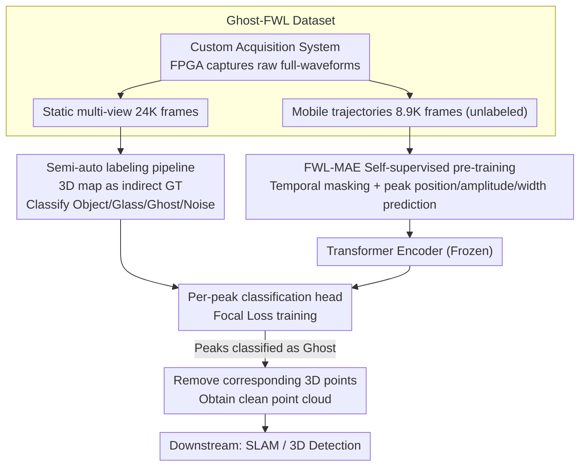

# Ghost-FWL: A Large-Scale Full-Waveform LiDAR Dataset for Ghost Detection and Removal

**Conference**: CVPR 2026  
**arXiv**: [2603.28224](https://arxiv.org/abs/2603.28224)  
**Code**: [https://keio-csg.github.io/Ghost-FWL/](https://keio-csg.github.io/Ghost-FWL/)  
**Area**: Autonomous Driving / 3D Vision  
**Keywords**: Full-Waveform LiDAR, Ghost Detection, Dataset, Self-Supervised Learning, Masked Autoencoder

## TL;DR
Ghost-FWL introduces the first large-scale mobile full-waveform LiDAR dataset (24K frames, 7.5 billion peak-level annotations) and designs the FWL-MAE self-supervised pre-training framework to achieve ghost detection and removal, reducing SLAM trajectory errors by over 66% and 3D detection false positive rates by 50 times.

## Background & Motivation

**Background**: LiDAR is a core sensor for autonomous driving, robotics, and large-scale topographic mapping. It reconstructs 3D geometry by measuring the time-of-flight of laser pulses. Traditional LiDAR only outputs processed point clouds (distance + intensity), discarding the rich physical information contained in the raw waveform.

**Limitations of Prior Work**: LiDAR systems widely suffer from "ghost points"—virtual 3D points created by multi-path reflections on glass or reflective surfaces. As sensor sensitivity increases, ghosting becomes more severe. These false points lead to: (1) False positives in 3D object detection (e.g., "phantom pedestrians" detected behind glass); (2) Localization drift and mapping errors in SLAM.

**Key Challenge**: Existing ghost removal methods rely on point cloud geometric consistency (spatial symmetry, etc.), which requires dense, static scanning environments. In mobile LiDAR scenarios (autonomous driving, robotics), point clouds are sparse and dynamic, and geometric cues are insufficient to distinguish ghosts from real reflections. Conversely, Full-Waveform LiDAR (FWL) records the complete time-intensity profile of each pulse, containing temporal and intensity cues for ghost identification, but no mobile FWL ghost detection dataset currently exists.

**Goal**: (1) Construct the first FWL ghost detection dataset for mobile scenarios; (2) Propose a baseline framework for ghost detection and removal based on FWL data; (3) Design a self-supervised pre-training method suitable for FWL data to address annotation cost issues.

**Key Insight**: FWL data naturally contains multi-path reflection information—the peaks of ghost reflections have distinguishable patterns in temporal position, amplitude, and width compared to real reflections. These physical features can be learned to detect ghosts.

**Core Idea**: Utilize the time-intensity information of full-waveform LiDAR (rather than just point cloud geometry) to detect and remove ghost reflections.

## Method

### Overall Architecture
This paper addresses a fundamental question: since "ghost points" generated by mobile LiDAR in front of glass are difficult to remove using sparse single-frame point cloud geometry, can physical cues in the full waveform (the time-intensity profile of each pulse) be used instead? The authors decoupled the work into data, representation, and detection layers: first, using a custom acquisition system to capture 24K frames of raw full-waveforms across 10 indoor/outdoor scenes, labeled as Object / Glass / Ghost / Noise via a high-precision 3D map reference pipeline. Second, FWL-MAE self-supervised pre-training is performed on unlabeled trajectory data to teach the Transformer encoder physical features. Finally, the encoder is frozen and attached to a lightweight classification head for per-peak prediction. 3D points classified as Ghost are removed, and downstream SLAM and 3D detection are performed on the resulting clean point clouds.

### Key Designs

**1. Ghost-FWL Dataset: Recovering discarded raw waveforms**

Traditional LiDAR hardware compresses full waveforms into "distance + intensity" point clouds, discarding temporal-intensity evidence crucial for ghost detection. Existing FWL datasets are either from static high-precision scanners, lack peak-level labels (PixSet), or are proprietary. The authors access LiDAR FPGA modules to capture raw waveforms: the sensor outputs $512 \times 400$ pixel histograms, recording up to 700 time bins per direction (~1ns resolution, 105m max range). Data covers 4 indoor and 6 outdoor scenes across various times of day. Two strategies were used: multi-view static acquisition (24,412 labeled frames) for supervised training, and mobile trajectory acquisition (8,933 unlabeled frames) for self-supervised pre-training. The annotation scale is ~100x larger than the previous largest labeled FWL dataset.

**2. Semi-automatic labeling pipeline: Using high-precision maps as indirect ground truth**

Ghosts are virtual reflections with no physical counterparts, making direct labeling impossible. The authors introduced an external reference: first, a commercial 360° LiDAR (Livox Mid-360) and fastlio2 SLAM reconstruct a high-precision 3D map $\mathcal{M}$, with glass areas $\mathcal{G}$ and reflective areas $\mathcal{R}$ manually labeled. Multi-frame FWL data is accumulated into high SNR waveforms, and peaks are converted to point clouds aligned with the map. Attribution is automatically determined by the distance to the map $d(\mathbf{x}) = \min_{\mathbf{y} \in \mathcal{M}} \|\mathbf{x} - \mathbf{y}\|$ and regional rules: those near the map surface are Object, those in glass regions are Glass, and those reflecting from glass without map counterparts are Ghost. The Mechanism relies on the fact that while ghosts have no GT, their spatial deviation from real geometry does.

**3. FWL-MAE: Self-supervised learning of peak physical attributes**

Since peak-level annotation is expensive, pre-training on unlabeled data is necessary. FWL-MAE treats input as a full-waveform volume $\mathbf{V} \in \mathbb{R}^{H \times W \times T}$, sampling patches in $(x,y)$ space and masking along the $T$ axis. A 6-layer 6-head Transformer encoder processes the data. The novelty lies in the reconstruction target: unlike voxel-only reconstruction in MARMOT, FWL-MAE adds a linear head to estimate position $p$, amplitude $a$, and width $w$ for each peak. The training objective is voxel MSE combined with peak attribute L1 loss:

$$\mathcal{L}_{\text{FWL-MAE}} = \mathcal{L}_{\text{MSE}} + \lambda_p \mathcal{L}_1^{\text{peak-}p} + \lambda_a \mathcal{L}_1^{\text{peak-}a} + \lambda_w \mathcal{L}_1^{\text{peak-}w}$$

This ensures the learnt representations capture physical meanings of peaks rather than just waveform shapes.

### Loss & Training
Ghost detection utilizes Focal Loss to handle severe class imbalance (Noise being the majority). Weights from the FWL-MAE pre-trained encoder are frozen, and only the 2-layer linear classification head is trained. Raw FWL data is preprocessed to (128, 128, 256), removing bins related to ceiling/floor reflections and internal sensor noise. The dataset consists of 13,853 training, 2,994 validation, and 1,427 test frames.

## Key Experimental Results

### Main Results — Ghost Detection

| Method | Recall↑ | Ghost Removal Rate↑ |
|------|---------|---------------------|
| MARMOT | 0.746 | 0.910 |
| Ours w/o FWL-MAE | 0.704 | 0.900 |
| **Ours (with FWL-MAE)** | **0.751** | **0.918** |

### Downstream Task — SLAM

| Method | ATE (m)↓ | RTE (m)↓ |
|------|----------|----------|
| Dual-Peak | 0.715±0.433 | 0.741±0.406 |
| Multi-Peak | 1.547±1.394 | 1.602±1.381 |
| **Ours** | **0.245±0.138** | **0.245±0.131** |

After ghost removal, ATE decreased by 66-84% and RTE by 67-85%.

### Downstream Task — 3D Object Detection

| Method | Ghost FP Rate↓ |
|------|----------------|
| Dual-Peak | 75.8% |
| Multi-Peak | 67.9% |
| **Ours** | **1.34%** |

The ghost-induced false positive rate dropped from 67.9% to 1.34%, a ~50x reduction.

### Key Findings
- FWL-MAE pre-training significantly improves ghost detection (Recall increased from 0.704 to 0.751), validating self-supervised learning for FWL physical features.
- FWL-MAE outperforms general MARMOT pre-training, indicating that explicit modeling of peak attributes is essential.
- Ghost removal significantly impacts downstream tasks: in SLAM, the Multi-Peak method suffered from severe drift (ATE 1.547m), which was reduced to 0.245m. 3D detection false positives dropped 50-fold.
- Performance gains are most notable near glass surfaces where ghosting is most severe.

## Highlights & Insights
- Accurate problem positioning: The study identifies FWL data as a neglected "gold mine." Traditional compression to peak point clouds loses critical evidence for ghosting.
- Dataset scale and quality: 24K frames and 7.5 billion peak annotations, with a clever indirect ground truth strategy using high-precision 3D maps.
- FWL-MAE Design Motivation: Incorporating peak attributes (position/amplitude/width) captures the physical essence distinguishing FWL from basic histograms.
- Substantial downstream value: A 50x reduction in false positives directly demonstrates practical utility for autonomous driving safety.

## Limitations & Future Work
- Annotations are restricted to static multi-view scans; mobile sequences remain unlabeled due to costs.
- The dataset focuses on glass ghosts; other materials (water, polished metal) and adverse weather (rain, fog) are not covered.
- The 6-layer Transformer encoder may be too shallow for complex multi-path patterns.
- A Recall of 0.751 means ~25% of ghosts remain undetected, which may be insufficient for safety-critical applications.
- Current frame-wise detection misses temporal consistency cues available in continuous sequences.

## Related Work & Insights
- **vs UNIST/Lee et al.**: These static methods rely on geometric consistency and fail in mobile scenarios. Ghost-FWL uses temporal-intensity cues to work on sparse single frames.
- **vs Scheuble et al.**: Their FWL approach focuses on ranging accuracy rather than ghost detection. Their dataset is significantly smaller (240 frames) and private.
- **vs PixSet**: The only other public FWL dataset, but lacks peak-level annotations required for ghost detection.
- **vs MARMOT**: A general transient image MAE using only voxel reconstruction. FWL-MAE's peak attribution head is more specialized for LiDAR data.

## Rating
- Novelty: ⭐⭐⭐⭐⭐ First to define the FWL ghost detection task; dataset fills a critical gap.
- Experimental Thoroughness: ⭐⭐⭐⭐⭐ Comprehensive evaluation from detection to SLAM and 3D detection.
- Writing Quality: ⭐⭐⭐⭐ Clear motivation and detailed dataset construction.
- Value: ⭐⭐⭐⭐⭐ Public dataset and code provide high utility for autonomous driving safety.

<!-- RELATED:START -->

## Related Papers

- [\[CVPR 2026\] SearchAD: Large-Scale Rare Image Retrieval Dataset for Autonomous Driving](searchad_large-scale_rare_image_retrieval_dataset_for_autonomous_driving.md)
- [\[CVPR 2026\] V2U4Real: A Real-world Large-scale Dataset for Vehicle-to-UAV Cooperative Perception](v2u4real_a_real-world_large-scale_dataset_for_vehicle-to-uav_cooperative_percept.md)
- [\[ECCV 2024\] H-V2X: A Large Scale Highway Dataset for BEV Perception](../../ECCV2024/autonomous_driving/h-v2x_a_large_scale_highway_dataset_for_bev_perception.md)
- [\[CVPR 2026\] Learning to Drive is a Free Gift: Large-Scale Label-Free Autonomy Pretraining from Unposed In-The-Wild Videos](learning_to_drive_is_a_free_gift_large-scale_label-free_autonomy_pretraining_fro.md)
- [\[ICLR 2026\] EgoDex: Learning Dexterous Manipulation from Large-Scale Egocentric Video](../../ICLR2026/autonomous_driving/egodex_learning_dexterous_manipulation_from_large-scale_egocentric_video.md)

<!-- RELATED:END -->
