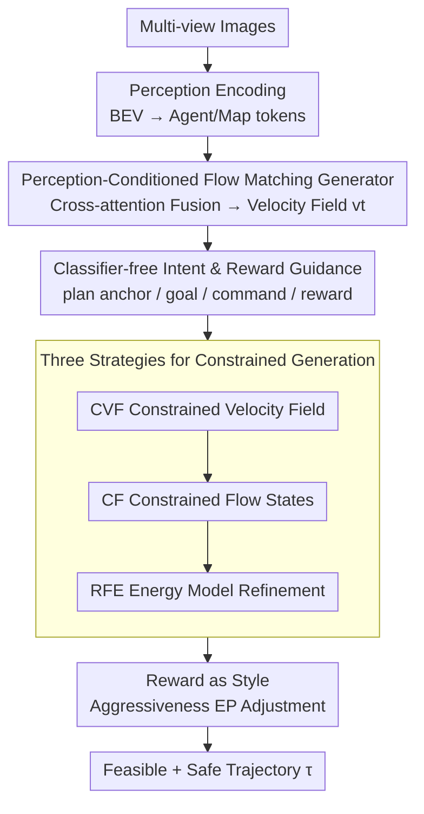

# GuideFlow: Constraint-Guided Flow Matching for Planning in End-to-End Autonomous Driving

**Conference**: CVPR 2026  
**Paper**: [CVF Open Access](https://openaccess.thecvf.com/content/CVPR2026/html/Liu_GuideFlow_Constraint-Guided_Flow_Matching_for_Planning_in_End-to-End_Autonomous_Driving_CVPR_2026_paper.html)  
**Code**: https://github.com/adept-thu/GuideFlow (Coming Soon)  
**Area**: End-to-End Autonomous Driving / Trajectory Planning  
**Keywords**: End-to-end driving planning, Flow matching, Constrained generation, Energy-based models, Mode collapse  

## TL;DR
GuideFlow employs "Flow Matching + Energy-Based Models" for end-to-end driving planning, directly embedding safety and physical hard constraints into the generation process via three mechanisms: Constrained Velocity Field (CVF), Constrained Flow states (CF), and Refining the Flow by EBM (RFE). This approach mitigates multi-modal mode collapse in imitation learning and eliminates the need for post-optimization in generative methods, achieving a SOTA 43.0 EPDMS on NavSim Navhard.

## Background & Motivation

**Background**: End-to-end autonomous driving (E2E-AD) integrates perception, prediction, and planning into a jointly trained differentiable system, where the planning module predicts feasible trajectories. To reflect the multi-intent uncertainty of real-world driving, planning has shifted from single-modal to multi-modal trajectory generation, primarily divided into imitative and generative approaches.

**Limitations of Prior Work**: Both paradigms have critical drawbacks. **Imitative planners** (e.g., UniAD, VAD, SparseDrive) use L2/Huber losses to regress expert trajectories, but since each scene has only one Ground Truth (GT) for supervision, the nominal multi-modal outputs often collapse toward a single dominant mode—known as **mode collapse**. **Generative planners** (e.g., DiffusionDrive, DiffusionPlanner) sample from learned distributions to express multi-modality, but the randomness and high variance of the sampling process **cannot guarantee that generated trajectories satisfy hard constraints** such as collisions, lane boundaries, or kinematics, often requiring an unreliable post-optimization stage.

**Key Challenge**: There is a tension between "diversity" in generative methods and "constraint satisfaction"—implicitly encoding constraints into a latent space is neither interpretable nor easily enforced during sampling, while explicitly forcing trajectory points (per-step projection) severely disrupts the probabilistic path of sampling.

**Goal**: To achieve (1) multi-modal diversity, (2) explicit hard constraint satisfaction, and (3) controllable driving styles within a single generative framework without independent post-optimization.

**Key Insight**: The authors select **Rectified Flow** as the generative backbone, which learns a near-linear transport path between prior and target distributions for fast and stable sampling. They observe that each trajectory update $x^{(k+1)}$ depends on the velocity field $v_\theta$, the previous flow state $x^{(k)}$, and an energy term $E_\theta$ in the refinement stage. Thus, constraints can be injected at these three intervention points.

**Core Idea**: Instead of letting the model learn constraints implicitly, this work **explicitly carves constraints into the flow matching generation process** by correcting the velocity field direction, replacing flow states with constrained anchors mid-sampling, and utilizing energy models to define "violation = high energy," ensuring samples naturally land in the feasible region.

## Method

### Overall Architecture

GuideFlow is a flow-matching-based trajectory generator. Multi-view images are processed by a perception module to obtain BEV representations, which are parsed into Agent tokens (dynamic interactions) and Map tokens (road/lane topology). A trajectory is represented as a flow state $x_t \in \mathbb{R}^{T \times 2}$ (where $T$ is the prediction horizon), fused with scene tokens via cross-attention, and integrated with classifier-free intent/reward conditions to decode the velocity field $v_\theta(x_t, t)$. Finally, during sampling, three constraint strategies (CVF, CF, RFE) correct the velocity field and flow path to integrate the final trajectory.

### Key Designs

**1. Perception-Conditioned Flow Matching Generator: Mitigating mode collapse from the source**

Imitative planners suffer from mode collapse due to L2 supervision on a single GT per scene. GuideFlow adopts Rectified Flow, constructing a linear probability path $x_t = (1-t)x_0 + tx_1$ between a Gaussian prior $\pi_0$ and the target distribution $\pi_1$. The training objective is $L_{RF} = \mathbb{E}_{t,x_0,x_1} \lVert v_\theta(x_t, t) - (x_1 - x_0) \rVert^2$, and inference uses numerical integration $x^{(k+1)} = x^{(k)} + v_\theta(x^{(k)}, t_k) \Delta t$. Starting from random noise and guided by diverse conditions, it naturally generates multi-modal hypotheses. 

To prevent it from favoring only dominant modes, the authors utilize Energy Matching, treating the flow model as an energy-based model (EBM) at $t > 1$ with an energy weight $\varepsilon(t)$. This shapes the manifold into multiple low-energy basins (e.g., yielding vs. merging), with updates becoming $x^{(k+1)} = x^{(k)} + v_\theta \Delta t - \eta(t_k) \nabla_x E_\theta(x^{(k)})$.

**2. Classifier-free Intent and Reward Guidance: High-quality starting points for constraints**

GuideFlow uses four types of dynamic signals: plan anchor $C_p$, goal point $C_g$, driving command $C_d$, and reward $C_r$ (style). Plan anchors are curated from an $N=256$ trajectory vocabulary $V_a$. During sampling, $N$ diverse candidates are generated based on these anchors. Guidance uses the classifier-free approach: $v_\theta^{guide} = (1-\gamma)v_\theta(x_t, t) + \gamma v_\theta(x_t, t, c)$, where $\gamma$ scales the condition strength.

**3. Three Strategies for Constrained Generation (CVF/CF/RFE): Embedding hard constraints into generation**

- **CVF (Constraining the Velocity Field)**: Selects a feasible trajectory $x_1^c$ from anchors and calculates the ideal field $v_t^c = \frac{x_1^c - x_0}{1 - 0}$. The predicted field is corrected toward it:
$$v_t^* = v_t - 2\lambda \frac{v_t \cdot v_t^c}{\lVert v_t^c \rVert^2} v_t^c, \qquad \lambda=0.1$$
- **CF (Constraining the Flow States)**: Instead of step-wise correction, it performs a single intervention at step $k_c$ by replacing $x^{(k_c)}$ with the constrained anchor $x_1^c$, then resuming sampling. This late-stage correction ensures feasibility without disrupting the learned transport dynamics.
- **RFE (Refining the Flow by EBM)**: Defines energy as $E_\theta(x_t) = \lVert \jmath(f_{t>1}(x_t)) - \jmath(x_t) \rVert^2$, where $\jmath(\cdot)$ evaluates constraint satisfaction. The objective $L_{RFE} = E_\theta(x^{(1)}) - E_\theta(x_1)$ penalizes violations, allowing the model to implicitly learn constraint awareness.

**4. Reward as Style: Driving style as a controllable knob**

An Aggressiveness Score (EP) is defined based on the distance traveled along the lane centerline. Tuning EP toward 1 generates more aggressive behavior, turning "style" into an explicit, controllable signal.

### Loss & Training
The total loss consists of the flow matching term $L_{RF}$ and the energy refinement term $L_{RFE}$. Training spans 100 epochs for NavSim (ResNet34 backbone), 8 epochs for NuScenes (SparseDrive-based), and 20 epochs for Bench2Drive.

## Key Experimental Results

### Main Results

NavSim Navhard (Closed-loop, higher EPDMS is better):

| Config | Backbone | Scorer | EPDMS | Notes |
|------|----------|--------|-------|------|
| LTF | ResNet34 | None | 23.1 | Imitation baseline |
| DiffusionDrive | ResNet34 | None | 24.2 | Diffusion-based |
| **GuideFlow** | ResNet34 | None | **27.1** | Outperforms without scorer |
| DriveSuprim | V2-99 | Yes | 42.1 | Previous SOTA |
| **GuideFlow + Scorer** | ResNet34 | Yes | **43.0** | **SOTA, +1.3** |

Bench2Drive & NuScenes:

| Dataset | Metric | Ours | Prev. SOTA | Gain |
|--------|------|------|----------|------|
| Bench2Drive | Driving Score ↑ | 75.21 | 73.86 | +1.35 |
| NuScenes | Avg. Collision ↓ | 0.07% | 0.08% | -0.01% |

### Ablation Study

Constraint Modules (NavSim Navhard, EPDMS):
| Config | EPDMS | Note |
|------|-------|------|
| Baseline | 23.1 | No constraints |
| + CVF | 24.5 | Step-wise correction |
| + CF | 25.1 | Single truncation (Better than CVF) |
| + RFE | 25.5 | Energy refinement (max OOD gain) |
| **+ CF + RFE** | **27.1** | Best combination |

### Key Findings
- **CF > CVF**: Step-wise correction (CVF) disrupts the probability path; single intervention (CF) at step $k_c=50$ provides better generation quality and adaptation.
- **RFE for OOD**: Energy matching scales well to out-of-distribution (OOD) scenarios by defining generalizable constraint rules.
- **Style vs. Safety**: Increasing aggressiveness (EP) improves speed but slightly reduces EPDMS, indicating a trade-off.

## Highlights & Insights
- **Mechanism Decomposition**: By identifying the components of the update equation (field, state, energy), the work provides a clean paradigm for where to inject constraints.
- **One-time Correction (CF)**: The idea of a single truncation mid-sampling is a clever solution to balancing hard constraints with probabilistic path smoothness.
- **EBM Integration**: Unifying flow matching with energy landscapes turns "violation" into a trainable signal rather than just an inference-time heuristic.

## Limitations & Future Work
- The trade-off between style and safety remains an open challenge.
- Reliance on anchor quality: CVF/CF depends on the reference anchor $x_1^c$; if the reference is suboptimal, the correction is also capped.
- Inference speed: At 3.6 FPS (RTX 4090), it is slower than imitative models like SparseDrive (9.0 FPS).
- Expanding energy proxies to incorporate complex social and traffic laws.

## Related Work & Insights
- **vs. Imitative Planners**: GuideFlow avoids mode collapse by design using conditional flow matching rather than deterministic regression.
- **vs. DiffusionDrive/Planner**: Unlike methods that only refine at the end or add energy bias during inference, GuideFlow explicitly supervises the generation process and integrates energy gradients directly into the flow dynamics.

## Rating
- Novelty: ⭐⭐⭐⭐⭐ 
- Experimental Thoroughness: ⭐⭐⭐⭐⭐ 
- Writing Quality: ⭐⭐⭐⭐ 
- Value: ⭐⭐⭐⭐⭐ 

<!-- RELATED:START -->

<!-- RELATED:END -->

## Related Papers

- [\[CVPR 2026\] ActiveAD: Planning-Oriented Active Learning for End-to-End Autonomous Driving](activead_planning-oriented_active_learning_for_end-to-end_autonomous_driving.md)
- [\[CVPR 2026\] WAM-Flow: Parallel Coarse-to-Fine Motion Planning via Discrete Flow Matching for Autonomous Driving](wam-flow_parallel_coarse-to-fine_motion_planning_via_discrete_flow_matching_for_.md)
- [\[CVPR 2026\] ResAD: Normalized Residual Trajectory Modeling for End-to-End Autonomous Driving](resad_normalized_residual_trajectory_modeling_for_end-to-end_autonomous_driving.md)
- [\[CVPR 2026\] Scaling-Aware Data Selection for End-to-End Autonomous Driving Systems](scaling-aware_data_selection_for_end-to-end_autonomous_driving_systems.md)
- [\[CVPR 2026\] DriveMoE: Mixture-of-Experts for Vision-Language-Action Model in End-to-End Autonomous Driving](drivemoe_mixture-of-experts_for_vision-language-action_model_in_end-to-end_auton.md)

<!-- RELATED:END -->
