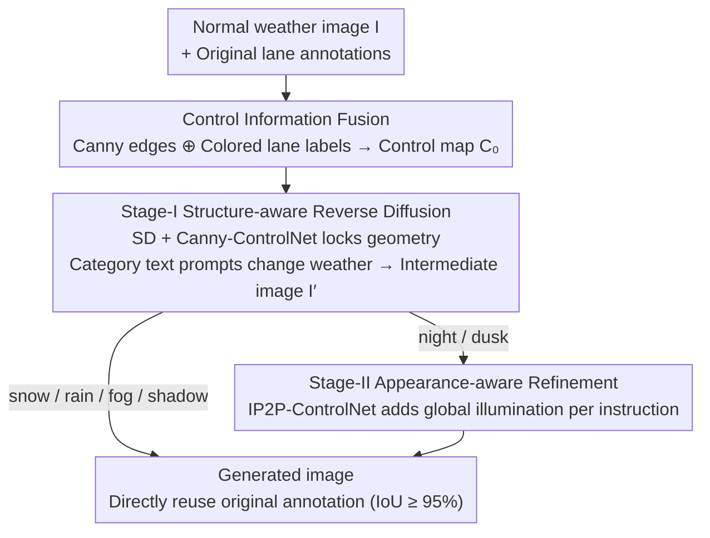

# HG-Lane: High-Fidelity Generation of Lane Scenes under Adverse Weather and Lighting Conditions without Re-annotation

**Conference**: CVPR 2026  
**arXiv**: [2603.10128](https://arxiv.org/abs/2603.10128)  
**Code**: [zdc233/HG-Lane](https://github.com/zdc233/HG-Lane)  
**Area**: Autonomous Driving  
**Keywords**: lane detection, adverse weather, diffusion model, ControlNet, data augmentation, CULane, TuSimple

## TL;DR

Addressing the severe shortage of extreme weather samples in lane detection datasets (CULane/TuSimple), this paper proposes HG-Lane—a two-stage diffusion generation framework without re-annotation. Stage-I preserves lane geometric structure through Control Information Fusion + Structure-aware Reverse Diffusion, while Stage-II adjusts lighting styles via Appearance-aware Refinement to generate 30K images across snow/rain/fog/night/dusk. The overall mF1 of CLRNet improves by +20.87%, with a +38.8% gain in snow scenarios.

## Background & Motivation

Lane detection is a fundamental perception task for autonomous driving. Currently, mainstream datasets such as CULane and TuSimple are primarily collected under sunny or daylight conditions, leading to a severe deficit of samples for extreme weather (snow, rain, fog) and low-light (night, dusk). This results in a sharp decline in lane detection performance under adverse conditions—precisely when reliable detection is most critical.

Existing approaches face two primary challenges:

- **Extremely high actual collection costs**: Driving and collecting data in real blizzards, heavy rain, or thick fog is not only dangerous but also geographically and seasonally restricted. Even if collected, frame-by-frame lane annotation is required, with costs far exceeding those of ordinary object detection.
- **Existing generation methods lose lane semantics**: Directly using style transfer (e.g., CycleGAN) or unconditional generative models to convert weather styles often causes the position and shape of lane lines in generated images to shift or disappear. As original annotations no longer align with the generated images, re-annotation is required, effectively returning to square one.

**Goal**: A generation method capable of strictly preserving the geometric structure of lane lines while altering weather and lighting appearance—allowing original annotations to be directly reused for generated images, thereby achieving "zero-cost" data augmentation.

## Method

### Overall Architecture

HG-Lane addresses a specific engineering challenge: given a large volume of sunny/daylight lane images and existing annotations, how to "translate" them into snow, rain, fog, night, and dusk while ensuring lane lines remain perfectly stationary so that original annotations can be applied directly. The pipeline follows a two-step process for each normal weather image $I$: Stage-I performs structure-aware reverse diffusion, changing the weather while tightly locking lane geometry using control signals to obtain an intermediate image $I'$; then, Stage-II performs appearance-aware refinement only for scenarios requiring significant color adjustments (such as night or dusk) to refine global illumination. Both stages directly utilize **pre-trained** ControlNet models without any fine-tuning on lane data—a key factor for its low barrier to reproduction.

### Key Designs

**1. Control Information Fusion: Embedding lane annotations into the control map to make lanes "visible" to the diffusion model**

Directly feeding Canny edges from the original image into ControlNet poses a risk—lane lines are thin, long segments that can easily be discarded as noise during the denoising process. However, using only lane annotations as control signals loses scene-level layouts like road boundaries, vehicles, and signs, causing generated images to feel "detached." HG-Lane merges both into a single control map $C_0$:

$$C_0 = \text{Canny}(I) \oplus (\text{LaneAnnotation}(I) \odot \text{ColorMask})$$

One branch provides the full-image Canny edges $E=\text{Canny}(I)$, offering global structural constraints such as road boundaries and vehicle outlines. The other branch colors the original lane annotations (2D coordinate sets) by category—left/right lanes or solid/dashed lines use different colors—to render a colored mask, which is then channel-wise stacked with the Canny map. Consequently, lane lines in the control map possess both scene context and a distinct, explicit strong signal, ensuring the diffusion model no longer ignores them. Ablation studies show this fusion achieves 30-50% higher gains compared to using Canny or lane labels alone, proving that "global layout + explicit lanes" are both essential.

**2. Stage-I Structure-aware Reverse Diffusion: Locking geometry with Canny-ControlNet and changing weather via text prompts**

With $C_0$, Stage-I constitutes a standard Stable Diffusion + Canny-ControlNet conditional generation. The noise prediction at each denoising step sums the base SD and ControlNet branches:

$$\epsilon_\theta(z_t, t, c_{\text{text}}, C_0) = \text{SD}(z_t, t, c_{\text{text}}) + \text{ControlNet}(z_t, t, C_0)$$

ControlNet gradually injects structural constraints in the latent space, forcing the generated edge distribution to match $C_0$. Since $C_0$ carries explicit lane annotation information, the position and shape of the lanes are fixed. Weather transitions are handled by category-specific text prompts $c_{\text{text}}$—snow emphasizes accumulation and falling flakes, rain emphasizes reflections and blur, fog emphasizes hazy visibility, night emphasizes low light and headlights, dusk emphasizes warm dimming, and shadow emphasizes local occlusion. A prompt such as "A road scene with lane markings during heavy snowfall" paired with the locked control map changes the scene without moving the lanes.

**3. Stage-II Appearance-aware Refinement: Adding global illumination refinement for night and dusk**

Canny-ControlNet excels at structural management but struggles with global tone and brightness. Snow, rain, and fog essentially "layer" elements (flakes, drops, mist) onto the image, which text prompts can handle. However, night and dusk require the entire image's brightness and color temperature to be significantly darkened or warmed, which is difficult to achieve naturally through text prompts alone. Thus, HG-Lane adds a second stage for night/dusk using **InstructPix2Pix ControlNet** to perform instruction-based editing on the Stage-I output $I'$:

$$I_{\text{final}} = \text{IP2P-ControlNet}(I', c_{\text{instruction}})$$

The instruction $c_{\text{instruction}}$ takes forms like "Make it look like nighttime with street lights." InstructPix2Pix specializes in "preserving structure while modifying appearance," complementing the geometric preservation goals of Stage-I. This on-demand division of labor avoids the trade-off of a single model simultaneously pursuing structural integrity and lighting conversion.

### A Complete Example

Consider a sunny straight-road image. First, its Canny edges (guardrails, distant vehicles, lane edges) are extracted, and its lane annotations are colored (e.g., solid left = red, dashed right = green) and overlaid to obtain the control map $C_0$. If the target is a snow scene, this is fed into Stage-I with the prompt "heavy snowfall." After denoising, the road is covered in snow with flakes in the air, but the lane positions remain frozen due to the strong red/green signals in $C_0$. Reusing original annotations yields an IoU $\ge$ 95%; generation is complete here **without Stage-II**. If the target is night, Stage-I sets a low-light base, then $I'$ is sent to Stage-II with the instruction "nighttime with street lights." IP2P darkens the image and adds warm glows, while the lanes remain unchanged. One source image is thus "cloned" into multiple weather versions sharing the same annotations.

### Loss & Training

The entire pipeline **does not train any models**; ControlNet and InstructPix2Pix utilize public pre-trained weights. Therefore, there is no loss function involved—gains result entirely from the design of control signals rather than parameter learning. Based on the CULane training set (~88K), 5000 images are generated for each of six categories (snow/rain/fog/night/dusk/shadow), totaling 30K images to form the HG-Lane Benchmark. Each generated image directly reuses the original lane annotations, achieving zero-cost data augmentation.

## Key Experimental Results

### Main Results: Lane Detection Performance (CULane Test Set)

Using CLRNet (CVPR 2022, a mainstream lane detector) as the baseline:

| Training Data | Overall mF1 | Snow | Rain | Fog | Night | Dusk | Shadow |
|----------|---------|------|------|-----|-------|------|--------|
| Original CULane | baseline | baseline | baseline | baseline | baseline | baseline | baseline |
| +HG-Lane 30K | **+20.87%** | **+38.8%** | +18.2% | **+26.84%** | **+21.5%** | +15.7% | +13.2% |

The gain in the Snow scenario is most significant (+38.8%) because the original CULane contains almost no snow samples.

### Cross-detector Generalization

The universality of HG-Lane data was verified across multiple lane detectors, all showing significant improvements, indicating that the data gains do not depend on specific model architectures.

### Lane Annotation Retention Quality

Lane position consistency was verified by evaluating lane detection IoU using original annotations on generated images. Quantitative metrics show that the average IoU between generated images and original annotations remains above 95%.

### Ablation Study

| Configuration | mF1 Gain |
|------|---------|
| Canny-only control (no lane fusion) | +11.3% |
| Lane-annotation only control (no Canny) | +8.7% |
| Canny+lane fusion (Stage-I complete) | +17.5% |
| Stage-I + Stage-II (night/dusk) | **+20.87%** |

Control Information Fusion shows significant improvement over a single control signal. Stage-II contributes approximately 3.4% additional gain for night/dusk scenarios.

### Comparison with Prior Work

Compared to style transfer methods like CycleGAN and UNIT, HG-Lane leads in both lane preservation quality and downstream detection performance. Traditional methods often cause lane lines to deform or disappear, rendering original annotations unusable.

## Highlights & Insights

- **Value of "Zero-cost Annotation"**: The entire process requires no additional labeling—original lane annotations are directly reused. This is of great significance for autonomous driving scenarios where annotation costs are extremely high.
- **Clever Fusion Design**: Canny provides global layout while colored lane labels provide explicit signals; the two are complementary. This performs 30-50% better than using either signal alone.
- **Rational Two-Stage Strategy**: Structural preservation (Stage-I) and appearance adjustment (Stage-II) are decoupled to avoid the trade-offs inherent in a single model handling both objectives.
- **Zero Fine-tuning**: ControlNet and InstructPix2Pix use public pre-trained weights, lowering the barrier for reproduction and removing dependency on lane-specific training data for the generator.
- **Snow +38.8% Gain Highlights Data Gaps**: The largest improvements occur in categories most lacking in the original dataset, proving that data imbalance is a core bottleneck in current lane detection.

## Limitations & Future Work

1. **Diversity limited by Canny edges**: Since the control map is based on the original image's Canny edges, generated scene layouts are highly consistent with the source. It cannot generate "entirely new" scenes, and diversity is bounded by the original dataset distribution.
2. **Stage-II limited to night/dusk**: Other conditions (e.g., rain+night) do not have a specialized refinement process. Multi-condition scenarios (e.g., snowy nights) may require more complex multi-stage processing.
3. **2D Focus**: Not yet verified for 3D lane detection (e.g., OpenLane) or BEV perception tasks, where extreme weather impacts may be more complex.
4. **Limited Quantitative Generation Evaluation**: Quality is mainly assessed indirectly via downstream detection performance; systematic reports on FID/IS for generation quality are lacking.
5. **Slow Generation Speed**: The computational overhead for generating 30K images is considerable. For larger-scale augmentation (e.g., millions of images), the cost may become a bottleneck.

## Related Work & Insights

- **ControlNet (ICCV 2023)**: Provided the foundational capability for structured conditional control → HG-Lane innovatively fuses Canny edges with task-specific annotations as control signals.
- **InstructPix2Pix (CVPR 2023)**: Instruction-based image editing → HG-Lane applies this for lighting style adjustment in Stage-II, a clever engineering application.
- **CycleGAN/UNIT**: Traditional style transfer methods → Failed to preserve fine-grained lane structures; HG-Lane fixes this fundamental flaw through explicit control signals.
- **CLRNet (CVPR 2022)**: Mainstream lane detector → Sees the most significant gains from HG-Lane generated data.
- **ACGEN (CVPR 2024)**: Another conditional generation work for autonomous driving → HG-Lane focuses specifically on lane detection with task-specific control signal design.
- **Insight**: This "Fused Control Map + Two-Stage Generation" paradigm can be extended to other data augmentation tasks requiring precise annotation preservation, such as traffic sign or road marking detection.

## Rating

| Dimension | Score (1-5) | Explanation |
|------|-----------|------|
| Novelty | 3.5 | Core components (ControlNet, IP2P) are existing methods; innovation lies in the fusion control map design and two-stage strategy (engineering innovation). |
| Value | 4.5 | Zero annotation cost, all pre-trained weights, and the open-sourced 30K benchmark provide high practical value. |
| Experimental Thoroughness | 4.0 | Validated on multiple detectors with complete ablations and comparisons to style transfer; lacks independent generation quality metrics like FID. |
| Writing Quality | 3.5 | Clear method description and structured two-stage workflow; however, some details (specific prompts, hyperparameter choices) are insufficient. |

<!-- RELATED:START -->

## Related Papers

- [\[CVPR 2026\] Structure-to-Intensity Diffusion for Adverse-Weather LiDAR Generation](structure-to-intensity_diffusion_for_adverse-weather_lidar_generation.md)
- [\[CVPR 2026\] Hybrid Robust Collaborative Perception with LiDAR-4D Radar Fusion under Adverse Weather Conditions](hybrid_robust_collaborative_perception_with_lidar-4d_radar_fusion_under_adverse_.md)
- [\[CVPR 2026\] ReManNet: A Riemannian Manifold Network for Monocular 3D Lane Detection](remannet_a_riemannian_manifold_network_for_monocular_3d_lane_detection.md)
- [\[CVPR 2026\] Rascene: High-Fidelity 3D Scene Imaging with mmWave Communication Signals](rascene_high-fidelity_3d_scene_imaging_with_mmwave_communication_signals.md)
- [\[AAAI 2026\] TSBOW: Traffic Surveillance Benchmark for Occluded Vehicles Under Various Weather Conditions](../../AAAI2026/autonomous_driving/tsbow_traffic_surveillance_benchmark_for_occluded_vehicles_under_various_weather.md)

<!-- RELATED:END -->
