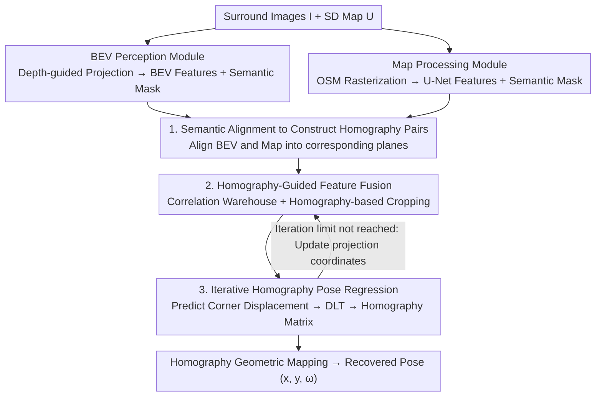

# HOLO: Homography-Guided Pose Estimator Network for Fine-Grained Visual Localization on SD Maps

**Conference**: CVPR 2026  
**Paper**: [CVF Open Access](https://openaccess.thecvf.com/content/CVPR2026/html/Zhong_HOLO_Homography-Guided_Pose_Estimator_Network_for_Fine-Grained_Visual_Localization_on_CVPR_2026_paper.html)  
**Code**: To be confirmed (the paper states it will be public)  
**Area**: Autonomous Driving / Visual Localization / BEV Perception  
**Keywords**: Visual Localization, SD Map, Homography Estimation, BEV, 3-DoF Pose

## TL;DR
HOLO reformulates "fine-grained localization of surround-view images on standard-definition (SD) maps" as a **homography estimation problem between BEV features and map tiles**: first, semantic alignment is used to pull the two modalities into feature pairs satisfying homography constraints; then, the homography relationship guides feature fusion and constrains the pose output within a feasible solution space. This approach achieves faster convergence and higher localization accuracy than traditional "attention fusion + direct 3-DoF pose regression" methods, improving Recall@1m/2m on nuScenes by approximately 16%.

## Background & Motivation

**Background**: Autonomous driving requires reliable ego-localization, yet GPS drifts significantly in urban canyons, tunnels, and occluded areas. Visual localization serves as a powerful supplement in GPS-denied scenarios. On the map side, there is a shift from expensive and hard-to-maintain High-Definition (HD) maps toward lightweight, easily accessible **Standard-Definition (SD) maps**, such as OpenStreetMap. Technologically, two routes exist: **Matching-based** (e.g., OrienterNet, which performs BEV-to-map matching via exhaustive pose candidates, where accuracy is limited by sampling resolution and speed decreases with more candidates) and **Regression-based** (e.g., MapLocNet, which directly regresses the target pose, bypassing matching but struggling with continuous pose value fitting, leading to harder convergence).

**Limitations of Prior Work**: The authors identify two fundamental flaws in regression-based methods. ① **Lack of geometric guidance in the feature fusion stage**: Most methods rely on attention mechanisms to implicitly learn cross-modal correlation, which is inefficient. ② **Lack of geometric constraints for direct 3-DoF pose regression**: This leads to unstable gradients, difficult optimization, and a tendency to overfit.

**Key Challenge**: Regression-based methods inherently face a more difficult task than matching-based methods, which simply pick the highest similarity among limited candidates. Existing regression methods fail to utilize the **innate geometric priors** between BEV and maps, exacerbating the difficulty.

**Goal**: ① Inject explicit geometric guidance into feature fusion; ② Add geometric constraints to the pose output to compress the solution space.

**Key Insight**: The authors observe a neglected geometric fact: **local BEV representations and their corresponding map tiles are essentially two projective views of the same ground plane, existing in a homography relationship**. Consequently, localization can be rewritten as "estimating the homography matrix between BEV and the map," from which the vehicle pose is geometrically recovered, rather than performing end-to-end hard regression of $(x, y, \omega)$.

**Core Idea**: Use the homography geometric prior between BEV and SD maps to **both guide feature fusion and constrain pose decoding**, unifying image-to-map localization into an end-to-end joint optimization of "semantic alignment + weakly supervised homography estimation."

## Method

### Overall Architecture

The input consists of six-way surround-view images $I=\{I_i\}_{i=1}^N$ and a reference map $U$ defined by noisy GPS; the output is the vehicle's 3-DoF pose $p=(x, y, \omega)$ on the map. The network comprises three components: the **BEV Perception Module** projects surround-view images into BEV space and outputs semantic masks; the **Map Processing Module** rasterizes, encodes, and outputs semantic masks for the OSM vector map; these are joined via **Semantic Alignment** to form feature pairs satisfying homography constraints, providing explicit geometric priors for downstream tasks; finally, the **Homography-Guided Pose Estimation Module** uses homography to guide correlation calculations between BEV and map features, iteratively predicting corner displacements $\rightarrow$ solving for the homography matrix $\rightarrow$ geometrically recovering the pose. The entire network is trained end-to-end using semantic loss + pose loss, where both tasks benefit each other.

### Key Designs

**1. Reformulating Localization as Homography Estimation + Semantic Alignment for Feature Pairing**

Prior methods treat image-map localization as pure regression or pure matching, ignoring the planar geometric relationship. The first step of HOLO is to **ensure BEV and map features satisfy homography constraints**; otherwise, "homography guidance" cannot be applied. The BEV module follows the depth-guided projection of LSS/OrienterNet: EfficientNet-B0 extracts multi-scale features, jointly predicts discrete depth distributions and semantic embeddings, and lifts them into a BEV tensor $\mathcal{F}_{bev}\in\mathbb{R}^{C\times H_{bev}\times W_{bev}}$ via differentiable voxel pooling, with a segmentation head producing the BEV semantic mask $M^{sem}_{bev}$. The map module rasterizes OSM vectors (retaining only **Roads and Buildings** to resist OSM inaccuracy), assigns learnable embeddings, and uses a VGG16-based U-Net to encode map features $\mathcal{F}_{map}$ and mask $M^{sem}_{map}$. Both masks are supervised by SD map ground truth, **forcing BEV and map to align in semantic space**. Once aligned, they constitute corresponding plane pairs for homography estimation.

**2. Homography-Guided Feature Fusion: Correlation Warehouse + Homography Cropping**

Instead of using attention to implicitly learn cross-modal correspondence, HOLO adopts **explicit correlation**. A Siamese ResNet downsamples $\mathcal{F}_{BEV}, \mathcal{F}_{Map}$ by 4x, projecting them via $1\times1$ convolutions into homography features $F_{BEV}, F_{Map}\in\mathbb{R}^{D\times H'\times W'}$. A dense correlation volume $C_{ijkl}=\text{ReLU}(F_{BEV}(i,j)^\top F_{Map}(k,l))$ is computed once and treated as a "feature warehouse." During each iteration, **correlation is not recomputed**; instead, projection coordinates $X$ of $F_{BEV}$ are mapped to $F_{Map}$ using the previous homography $H_{k-1}$. Local correlation patches $S_k=\{C(u,v)\mid(u,v)\in N(X_k,r)\}$ are cropped around each coordinate. This ensures that **each additional iteration only requires running the pose decoder once with almost zero overhead** (Table 4: GFLOPs per iteration +0.98, FPS -5.62%), unlike attention-based fusion which requires full recomputation.

**3. Iterative Homography Pose Regression: Corner Displacement → DLT → Homography Matrix**

HOLO's pose decoder **does not directly predict $(x, y, \omega)$, but outputs corner displacements $\Delta D_k$**. These are transformed into a homography matrix $H_k$ via Direct Linear Transformation (DLT). $H_k$ updates the projection coordinates $X$ for the next iteration (6 iterations total). The final pose is **geometrically recovered** from the homography matrix: the BEV grid center $(u_c, v_c)$ is projected via $s[u'_c, v'_c, 1]^\top = H[u_c, v_c, 1]^\top$ to get the map position $(x, y)$; an auxiliary point $(u_c, v_c+\Delta v)$ is projected to $(u'_a, v'_a)$ to calculate the heading $\omega = \arctan2(v'_a-v'_c, u'_a-u'_c) - \arctan2(\Delta v, 0)$. Constraining the pose to the solution space of "valid homographies" leads to more stable optimization and faster convergence (Table 2: Recall@1m improves from 9.88 to 26.57 for a single iteration).

### Loss & Training

A multi-task loss is used for end-to-end optimization. **Semantic loss** uses the SD map as supervision, applying BCE to the predicted masks: $L_{sem}=\sum_{i\in\{bev,map\}}\text{BCE}(M^{sem}_i,M^{GT}_i)$. **Pose loss** uses L2 for translation and L1 for heading: $L_{pose}=\lambda_{trans}\|\hat{t}-t\|_2^2+\lambda_{ori}\|\hat{\omega}-\omega\|_1$. The total objective is $L=\lambda_{sem}L_{sem}+L_{pose}$, with weights $\lambda_{sem}=1000, \lambda_{trans}=1, \lambda_{ori}=10$. Training details: A6000 GPU, AdamW, max lr $3.5\times10^{-4}$, batch size 16, 180k steps, OneCycle scheduler. BEV covers 64m×64m@0.25m/px, map 128m×128m@0.5m/px. Random noise of ±30°/±30m is added during training.

## Key Experimental Results

### Main Results

Evaluated on nuScenes (700 train / 150 val), with SD maps retrieved from OSM. Localization recall and absolute errors are shown below:

| Method | Input | Recall@1m | Recall@2m | Recall@1° | APE(m)↓ | AOE(°)↓ |
| :--- | :--- | :--- | :--- | :--- | :--- | :--- |
| OrienterNet | Camera | 15.74 | 33.27 | 31.69 | 15.47 | 26.43 |
| MapLocNet | Camera | 20.10 | 45.54 | 58.61 | — | — |
| SegLocNet-drivable | Camera+LiDAR | 59.08 | 76.04 | 63.19 | 5.30 | 10.11 |
| HOLO-CA (Attention base) | Camera | 21.47 | 46.70 | 39.52 | 4.31 | 1.78 |
| **HOLO-road (Road only)** | Camera | 30.40 | 54.36 | 69.76 | 3.76 | 1.06 |
| **Ours (HOLO-drivable)** | Camera | **36.41** | **61.21** | **73.74** | **3.37** | **1.02** |

> Key Comparison: Compared to MapLocNet, using the road layer alone improves Recall@1m/2m by +10.30%/+8.82% and Recall@1°/+11.15%. Heading error (AOE) drops from double digits to ~1°, a qualitative leap. Even using only SD map road layers (without HD map drivable area layers), performance approaches HD-dependent methods.

### Ablation Study

| Config | Recall@1m | Recall@1° | Description |
| :--- | :--- | :--- | :--- |
| HOLO-CA + 3-DoF Head | 10.06 | 18.04 | Attention fusion + Direct regression |
| HOLO-CA + Homography Head | 21.47 | 39.52 | Significant gain by changing the head |
| HOLO (1-iter) + 3-DoF Head | 9.88 | 10.08 | Proposed fusion + Direct regression |
| **HOLO (1-iter) + Homography** | **26.57** | **45.62** | Both proposed designs |

| Iterations | Recall@1m | Recall@1° | Notes |
| :--- | :--- | :--- | :--- |
| 1 | 26.57 | 45.62 | — |
| 2 | 31.64 | 67.37 | 25.6 FPS |
| 6 | **36.41** | **73.74** | 19.9 FPS |

### Key Findings
- **Homography head is the primary contributor**: Regardless of the fusion method, replacing "direct 3-DoF regression" with "corner displacement $\rightarrow$ homography" more than doubles Recall@1m.
- **Near-zero iterative cost**: Each iteration adds only +0.98 GFLOPs, whereas previous methods' FPS drops by 25% because HOLO only updates sampling positions in a pre-computed warehouse.
- **Cross-resolution robustness**: Fixing the map at 0.5mpp and changing BEV resolution (0.25 vs 0.5mpp) yields consistent performance.
- **Noise resistance**: Performance remains superior to MapLocNet even when GPS noise increases from 30m to 40m.

## Highlights & Insights
- **Geometric Insight**: The observation that BEV and map tiles are homography pairs is crucial. It rewrites a difficult continuous regression task into a geometrically constrained estimation task.
- **Correlation Warehouse + Homography Cropping**: Computing the dense correlation volume once and cropping iteratively is an efficient engineering choice for real-time performance (20 FPS).
- **Geometric vs. Hard Regression**: Predicting displacements and then solving geometrically simplifies the network's task and relies on deterministic operations for the rest.

## Limitations & Future Work
- **Single-frame, no temporal awareness**: Current localization is per-frame; incorporating temporal perception is listed for future work.
- **Dependency on semantic quality**: Sparse areas (suburbs) may lead to degenerate homography pairs if road/building elements are missing.
- **Domain Adaptation**: Evaluated only on nuScenes; robustness across different cities and OSM consistency remains to be seen.

## Related Work & Insights
- **vs OrienterNet (Matching)**: OrienterNet is limited by discrete sampling resolutions; HOLO regresses continuous poses and uses homography to stabilize training.
- **vs MapLocNet (Regression)**: MapLocNet lacks geometric priors; HOLO's homography-guided approach improves Recall@1m/2m by ~16% and reduces AOE drastically.
- **vs SSHNet (Homography)**: Unlike general cross-modal homography networks that require multi-stage training, HOLO utilizes GT poses for end-to-end joint optimization.

## Rating
- Novelty: ⭐⭐⭐⭐⭐ First work to unify BEV semantic reasoning and homography learning for image-to-map localization.
- Experimental Thoroughness: ⭐⭐⭐⭐ Strong comparisons and ablations, though limited to the nuScenes dataset.
- Writing Quality: ⭐⭐⭐⭐ Clear derivation of the geometric motivation.
- Value: ⭐⭐⭐⭐⭐ High potential for production deployment due to the use of low-cost SD maps and 20 FPS real-time speed.

<!-- RELATED:START -->

## Related Papers

- [\[AAAI 2026\] Fine-Grained Representation for Lane Topology Reasoning](../../AAAI2026/autonomous_driving/fine-grained_representation_for_lane_topology_reasoning.md)
- [\[CVPR 2026\] Plant Taxonomy Meets Plant Counting: A Fine-Grained, Taxonomic Dataset for Counting Hundreds of Plant Species](plant_taxonomy_meets_plant_counting_a_fine-grained_taxonomic_dataset_for_countin.md)
- [\[CVPR 2026\] LA-Pose: Latent Action Pretraining Meets Pose Estimation](la-pose_latent_action_pretraining_meets_pose_estimation.md)
- [\[CVPR 2026\] BEV-SLD: Self-Supervised Scene Landmark Detection for Global Localization with LiDAR Bird's-Eye View Images](bev-sld_self-supervised_scene_landmark_detection_for_global_localization_with_li.md)
- [\[CVPR 2025\] Distilling Monocular Foundation Model for Fine-grained Depth Completion](../../CVPR2025/autonomous_driving/distilling_monocular_foundation_model_for_fine-grained_depth_completion.md)

<!-- RELATED:END -->
