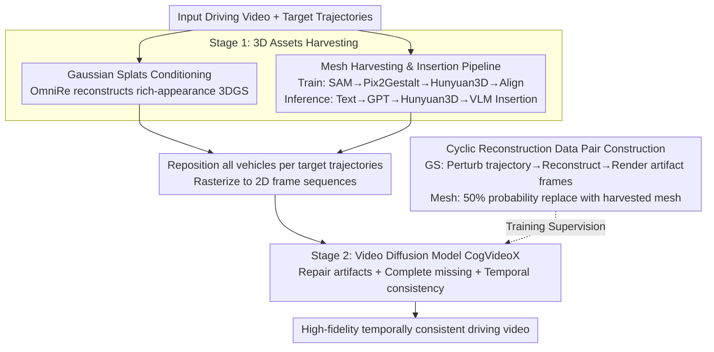

# HorizonForge: Driving Scene Editing with Any Trajectories and Any Vehicles

**Conference**: CVPR2026  
**arXiv**: [2602.21333](https://arxiv.org/abs/2602.21333)  
**Code**: [Project Page](https://horizonforge.github.io/)  
**Area**: Autonomous Driving / Scene Generation and Editing  
**Keywords**: Driving Scene Editing, 3D Gaussian Splatting, Video Diffusion Models, Trajectory Control, Mesh Insertion, Multi-agent Simulation

## TL;DR

HorizonForge proposes a unified framework that reconstructs driving scenes into editable Gaussian Splats + Mesh representations. It achieves precise 3D manipulation through trajectory control and language-driven vehicle insertion. High-quality driving videos with spatio-temporal consistency are then generated via a video diffusion model, outperforming all baseline methods with a 91.02% user preference rate.

## Background & Motivation

**Scarcity of Long-tail Scenarios**: Autonomous driving systems must be evaluated in safety-critical scenarios like aggressive lane changes or emergency braking. However, such data is extremely rare and expensive to collect, necessitating simulation-based generation.

**Poor Generalization of Reconstruction Methods**: 3DGS/NeRF-based reconstruction methods (e.g., OmniRe) offer high geometric accuracy but suffer from artifacts in unseen views, making it difficult to generalize to new trajectories.

**Lack of Physical Constraints in Generative Methods**: Purely generative methods (diffusion models) can synthesize new content but lack explicit 3D structural priors, leading to inconsistent scene structures and a lack of fine-grained control over traffic participants.

**Complexity of Hybrid Methods**: Existing hybrid methods (e.g., Difix3D, StreetCrafter) rely on complex architectures or require expensive per-trajectory optimization, limiting scalability.

**Missing Unified Evaluation Benchmark**: Existing evaluation sets (e.g., StreetCrafter's ego lane change) cover only single operation types, lacking a comprehensive benchmark for both ego and agent-level editing tasks.

**Lack of Systematic Research on 3D Representations**: There has been no systematic comparative analysis of which 3D representation is best suited as a condition for diffusion models.

## Method

### Overall Architecture

HorizonForge consists of two stages: **3D Assets Harvesting** and **Video Rendering**.

- **Stage 1**: Reconstructs input driving videos into editable 3D assets—Gaussian Splats (via OmniRe) + 3D Mesh (via Hunyuan3D). All vehicles are repositioned in 3D space according to target trajectories $\mathcal{T}=\{\tau_i\}_{i=1}^N$.
- **Stage 2**: Rasterizes the edited 3D scene into 2D frame sequences, then uses a fine-tuned video diffusion model (based on the CogVideoX backbone) to repair artifacts, complete missing regions, and generate high-fidelity, temporally consistent driving videos.

### Key Designs

**1. Gaussian Splats Conditioning**

- Uses OmniRe to reconstruct 3DGS scene representations from input videos, encoding continuous density and color information to provide rich mid-level priors for the diffusion model.
- Systematic comparison reveals: Gaussian Splats >> Colored Point Clouds >> 3D BBox; richer representations lead to higher generation quality.

**2. Mesh Harvesting and Insertion Pipeline**

- **Training Phase**: Uses GT 3D boxes + LiDAR from the Waymo dataset to select best observation frames. SAM segments the vehicle $\rightarrow$ Pix2Gestalt completes occlusions $\rightarrow$ Hunyuan3D generates mesh $\rightarrow$ GPT infers orientation $\rightarrow$ scale alignment via joint depth+IoU optimization.
- **Inference Phase**: User provides text description $\rightarrow$ GPT generates reference image $\rightarrow$ Hunyuan3D generates mesh $\rightarrow$ VLM infers rotation and scale $\rightarrow$ Insertion into the scene, enabling **any text-driven vehicle insertion**.

**3. Cyclic Reconstruction Data Pair Construction**

- For Gaussian Splats: Perturbs original trajectories $\tilde{\mathcal{T}} = \mathcal{T} + \Delta\mathcal{T}$, renders perturbed frames $\rightarrow$ reconstructs new GS scene $\rightarrow$ renders under original trajectories to get frames with artifacts, paired with GT for training.
- For Mesh: Randomly replaces GS assets with extracted meshes with 50% probability to construct mesh-GS hybrid data pairs, narrowing the lighting/texture gap between meshes and real images.

### Loss & Training

Standard diffusion denoising loss:

$$\mathcal{L}_{\text{vdm}} = \mathbb{E}_{t,\epsilon}\left[\|\epsilon - \epsilon_\theta(x_t, t, v_c)\|_2^2\right]$$

where $v_c$ represents conditional video frames rendered from Gaussian Splats/Mesh. The model is fine-tuned for 60k steps on the CogVideoX backbone using TrajectoryCrafter weights.

## Main Results

### HorizonSuite Benchmark Comparison

Comparison with StreetCrafter, Difix3D, and OmniRe on the custom **HorizonSuite** benchmark (109 high-quality edited trajectories covering ego/agent-level speed changes, lane changes, turns, insertions, and deletions):

| Method | Overall FID↓ | Overall FVD↓ | Best Metrics Count |
|------|-------------|-------------|-----------|
| StreetCrafter | 91.16 | 1245.96 | 0 |
| Difix3D | 80.84 | 991.23 | 0 |
| OmniRe | 44.37 | 546.00 | Few |
| **HorizonForge** | **33.19** | **536.49** | **Most** |

- HorizonForge achieves the best results across nearly all tasks and metrics, with Overall FID improved by **25.19%** over the runner-up OmniRe.
- In vehicle insertion tasks, FID decreased from 182.29 to 117.46 (↓35.5%), and OSR increased from 4.23 to 5.86.

### Ablation Study

| Conditional Representation | Overall FID↓ | Overall FVD↓ |
|---------|-------------|-------------|
| 3D BBox + Mesh | 81.74 | 1521.07 |
| Colored Point Cloud + Mesh | 54.14 | 813.67 |
| Image DM (Same Condition) | 75.83 | 837.99 |
| **Gaussian + Mesh (Ours)** | **33.19** | **536.49** |

**Key Findings**:
- **3D Representation Matters**: The rich-appearance prior encoded by Gaussian Splats holds a massive advantage over sparse representations (BBox, Point Cloud). BBox performed worst across all metrics.
- **Temporal Prior Matters**: Video diffusion models significantly outperform image diffusion models. While the latter has acceptable fidelity, it suffers from severe inter-frame flickering.

### User Study

| Method | Wins / Total | Win Rate |
|------|------------|------|
| StreetCrafter | 2/501 | 0.40% |
| Difix3D | 4/501 | 0.80% |
| OmniRe | 39/501 | 7.78% |
| **HorizonForge** | **456/501** | **91.02%** |

The user preference rate dominates all baseline methods, validating the overall advantage of the generated videos in terms of realism, stability, and trajectory consistency.

## Highlights & Insights

- **Simple and Unified Framework**: No complex conditional pipelines or per-trajectory optimization required; once the 3D scene is reconstructed, any trajectory variants can be generated in a feed-forward manner.
- **Any Vehicle Insertion**: Pure text descriptions can generate and insert 3D vehicle meshes, completing the link from Language $\rightarrow$ 3D $\rightarrow$ Video.
- **Systematic Design Insights**: First systematic comparison of the impact of 3D representation and temporal modeling on a unified benchmark, providing clear design guidelines.
- **HorizonSuite Benchmark**: Covers 5 types of ego/agent-level editing tasks with 5 evaluation metrics (including VIMS, BAS, OSR), filling the gap in multi-agent controllable driving scene evaluation.
- **Overwhelming User Preference**: A 91.02% win rate and 25.19% FID improvement demonstrate the effectiveness of the method.

## Limitations & Future Work

- **Dependence on High-quality 3DGS Reconstruction**: OmniRe's reconstruction quality directly affects downstream generation; degradation may occur in areas with sparse LiDAR or heavy occlusion.
- **Mesh-to-Scene Lighting/Texture Gap**: Although randomized lighting during training alleviates some issues, meshes generated by Hunyuan3D may still exhibit noticeable texture differences from the real scene.
- **Validation Limited to Waymo**: Generalization has not yet been verified on other datasets like nuScenes.
- **Performance in Direction Change Tasks**: In ego Direction Change tasks, FID=144.83, much higher than other editing types; large-angle turns remain a challenge.
- **Computational Overhead**: The overall pipeline is heavy, requiring OmniRe reconstruction, Hunyuan3D mesh generation, and 60k steps of diffusion model fine-tuning.

## Related Work & Insights

- **Reconstruction Solutions**: OmniRe and 3DGS provide high-fidelity reconstruction but limited controllability.
- **Generative Solutions**: Stable Video Diffusion and VideoCrafter2 lack explicit physical constraints, leading to unstable outputs.
- **Hybrid Solutions**: StreetCrafter (Point cloud + Image diffusion) and Difix3D (Reconstruction denoising + Image diffusion) are limited by sparse conditions or lack of temporal modeling.
- **HorizonForge** Core Difference: Utilizes the richest 3D representation (GS+Mesh) + the most effective temporal model (Video Diffusion) with a streamlined architecture to achieve optimal results.

## Rating

- Novelty: ⭐⭐⭐ — The framework design is not entirely new (reconstruction + diffusion refinement has precedents), but the Mesh Harvesting/Insertion pipeline and systematic representation comparison are unique contributions.
- Experimental Thoroughness: ⭐⭐⭐⭐⭐ — The self-built HorizonSuite benchmark is comprehensive, ablations are detailed, and the user study scale is large.
- Writing Quality: ⭐⭐⭐⭐ — Structure is clear with rich visuals, though some symbol definitions are slightly rushed.
- Value: ⭐⭐⭐⭐⭐ — Provides clear design guidelines for autonomous driving simulation editing; both the benchmark and framework have significant practical value.

<!-- RELATED:START -->

## Related Papers

- [\[CVPR 2026\] TerraSeg: Self-Supervised Ground Segmentation for Any LiDAR](terraseg_self-supervised_ground_segmentation_for_any_lidar.md)
- [\[ICLR 2026\] SEAL: Segment Any Events with Language](../../ICLR2026/autonomous_driving/segment_any_events_with_language.md)
- [\[CVPR 2025\] SceneCrafter: Controllable Multi-View Driving Scene Editing](../../CVPR2025/autonomous_driving/scenecrafter_controllable_multi-view_driving_scene_editing.md)
- [\[NeurIPS 2025\] Towards Predicting Any Human Trajectory in Context](../../NeurIPS2025/autonomous_driving/towards_predicting_any_human_trajectory_in_context.md)
- [\[NeurIPS 2025\] OpenBox: Annotate Any Bounding Boxes in 3D](../../NeurIPS2025/autonomous_driving/openbox_annotate_any_bounding_boxes_in_3d.md)

<!-- RELATED:END -->
