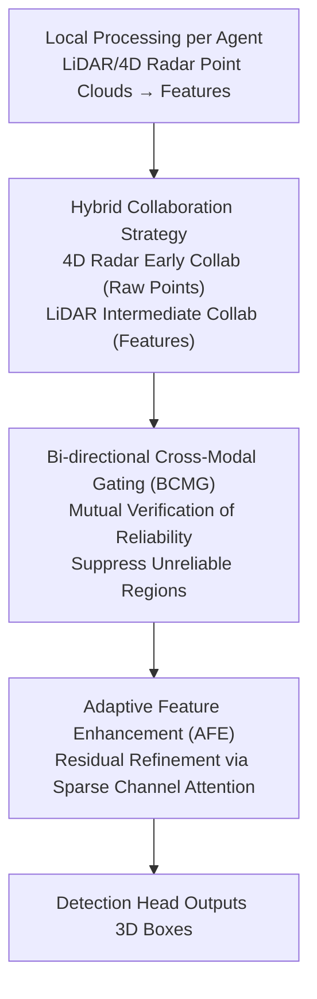

# Hybrid Robust Collaborative Perception with LiDAR-4D Radar Fusion under Adverse Weather Conditions

**Conference**: CVPR 2026  
**Paper**: [CVF Open Access](https://openaccess.thecvf.com/content/CVPR2026/html/Yang_Hybrid_Robust_Collaborative_Perception_with_LiDAR-4D_Radar_Fusion_under_Adverse_CVPR_2026_paper.html)  
**Code**: None  
**Area**: Autonomous Driving / Collaborative Perception / 3D Object Detection  
**Keywords**: Collaborative Perception, LiDAR-4D Radar Fusion, Adverse Weather, Cross-modal Gating, V2X

## TL;DR
Targeting "multi-agent collaborative perception under adverse weather," HRCP proposes a hybrid collaboration strategy based on the physical characteristics of sensors (early collaboration for sparse 4D radar via raw point clouds; intermediate collaboration for dense LiDAR via features). It reformulates LiDAR-4D radar fusion as "jointly reconstructing a dense and reliable representation," using Bi-directional Cross-Modal Gating (BCMG) for mutual reliability verification and Adaptive Feature Enhancement (AFE) to recover information loss, outperforming SOTA on V2X-R simulation and V2X-Radar-C real-world datasets.

## Background & Motivation
**Background**: Collaborative perception enables multiple agents to share information via V2X communication, categorized into early, intermediate, and late fusion. Current mainstream methods (mostly LiDAR or LiDAR-camera based) predominantly use **intermediate fusion**—sharing encoded features—to balance detection accuracy and communication bandwidth.

**Limitations of Prior Work**: Both LiDAR and cameras are sensitive to weather; fog and snow cause missing or false features. These modalities **share vulnerabilities to the environment** and may fail simultaneously in critical scenarios. 4D radar is naturally weather-resistant and can compensate for this, but fusing sparse 4D radar with degraded LiDAR faces two persistent issues: ① **Cross-modal contamination**—naive fusion allows degraded LiDAR and sparse radar to pollute each other; ② **Information loss**—denoising methods often discard remaining useful features while suppressing noise.

**Key Challenge**: Even worse, LiDAR degradation **accumulates during transmission** in collaborative scenarios; the degradation distribution becomes denser and heavier after multi-agent aggregation. The only existing collaborative LiDAR-4D radar method (V2X-R/MDD) treats sparse radar **identically to dense LiDAR** using intermediate collaboration. This doubles communication overhead and limits performance because encoding (voxelization discretization) further loses details of the already sparse radar data.

**Goal**: ① Design a collaborative transmission strategy tailored to the physical characteristics of each sensor to avoid wasting bandwidth on sparse radar; ② Upgrade LiDAR-4D radar fusion from "simple feature aggregation" to "jointly reconstructing a dense reliable representation" to solve cross-modal contamination and information loss.

**Key Insight**: LiDAR generates large data volumes, making raw point cloud transmission (early collaboration) bandwidth-intensive; thus, it uses intermediate fusion for features. 4D radar data is extremely small; early transmission of raw point clouds adds negligible cost, preserves complete structures otherwise lost to voxelization, and supports point-level alignment. The two sensor types should utilize different collaborative strategies.

**Core Idea**: Replace "homogeneous intermediate collaboration + simple concatenation fusion" with "modality-specific hybrid collaboration + fusion as joint reconstruction (verify first, then refine)."

## Method

### Overall Architecture
Given $N$ agents equipped with LiDAR and 4D radar, the HRCP pipeline consists of four stages: **1) Local Processing**: Each agent uses a shared encoder $\phi_{Enc}$ to extract LiDAR features $F_i^l=\phi_{Enc}(X_i^l)$; **2) Multi-agent Collaboration** (Hybrid Strategy): 4D radar uses **early collaboration**, where raw point clouds from different agents are spatially aligned and merged $f_{merge}$ before encoding to obtain $F_A^r=\phi_{Enc}(f_{merge}(X_i^r,\{X_{j\to i}^r\}))$; LiDAR uses **intermediate collaboration**, aggregating features via an agent fusion network $\phi_A$ to obtain $F_A^l$; **3) Modal Fusion**: A fusion network $\phi_M$ merges $F_A^l, F_A^r$ into a multi-agent multi-modal representation $F_A^M$; **4) Box Prediction**: A detection head outputs 3D boxes $B$ from $F_A^M$.

The core innovation lies in Step 3: The authors model fusion as **joint reconstruction**. Assuming a latent feature $\mathcal{F}$ under ideal conditions exists, the observed BEV features are two degraded views: $F_A^l=\mathcal{D}_n(\mathcal{F})$ (weather degradation) and $F_A^r=\mathcal{D}_s(\mathcal{F})$ (radar sparsity). The goal is to reconstruct $F_A^M$ to approximate $\mathcal{F}$. Since "suppressing dense noise" and "extracting useful cues" are conflicting objectives for a single network, the process is decoupled into **Reliability Verification (BCMG)** followed by **Comprehensive Refinement (AFE)**.

### Key Designs

**1. Hybrid Collaboration Strategy: Modality-specific Transmission based on Sensor Physics**

Addressing the pain point where "existing methods treat sparse radar like dense LiDAR, doubling bandwidth while losing performance," HRCP assigns different modes. Since LiDAR point clouds are dense, early transmission is prohibitive; intermediate collaboration transmits encoded features for accuracy-bandwidth trade-off. 4D radar point clouds are extremely sparse; early transmission has minimal cost (Fig 3: intermediate features are $\sim 21.4\times$ more expensive than raw radar points, yet raw radar points are $\sim 24.5\times$ cheaper than raw LiDAR points). Moreover, raw points preserve structures lost during voxelization and support cross-agent point-level alignment. This strategy is more efficient and accurate than homogeneous intermediate collaboration.

**2. Bi-directional Cross-Modal Gating (BCMG): Mutual Verification to Suppress Unreliable Regions**

In the joint reconstruction framework, the first step is to "verify reliability and ensure cross-modal consistency." BCMG utilizes the weather-resistance of 4D radar to identify reliable vs. degraded regions in the LiDAR feature map. Conversely, it uses the dense structural details of LiDAR to distinguish "real object returns" from "unstructured clutter" in the radar data. Specifically, it generates a soft attention gate for each modality **conditioned on the other**:
$$\mathcal{G}_l=\sigma(W_{r\to l}\ast F_A^r),\quad \mathcal{G}_r=\sigma(W_{l\to r}\ast F_A^l)$$
Element-wise multiplication is performed: $\tilde{F}_A^l=\mathcal{G}_l\odot F_A^l$ and $\tilde{F}_A^r=\mathcal{G}_r\odot F_A^r$, resulting in "radar-validated LiDAR features" (suppressed weather noise) and "LiDAR-guided radar features" (suppressed clutter). This is essentially a **subtractive/suppression** operation.

**3. Adaptive Feature Enhancement (AFE): Counteracting Information Loss**

BCMG is subtractive, but weather degradation involves both noise and **signal attenuation** (Fig 5: fog/snow weakens real returns). Suppression alone is sub-optimal. AFE uses a residual network with sparse channel attention to refine degraded and suppressed regions. It concatenates the radar-validated LiDAR features $\tilde{F}_A^l$, LiDAR-guided radar features $\tilde{F}_A^r$, and raw radar features $F_A^r$ into a shared latent space $F_{emb}=f_{emb}(\text{Cat}[\tilde{F}_A^l,\tilde{F}_A^r,F_A^r])$. Sparse channel attention $s=\sigma(\text{Conv1D}(\text{GMP}(F_{emb})))$ adaptively scales channels to locate regions needing refinement. The residual term is added back to the LiDAR features: $F_A^M=\tilde{F}_A^l+f_{out}(F_{att})$. This design recovers signal in adverse weather and learns latent interactions in clear weather.

### Loss & Training
Since the ideal feature $\mathcal{F}$ is unavailable even in clear weather, end-to-end learning is used without explicit supervision on latent features. The detection head includes classification (focal loss $\mathcal{L}_{cls}$) and regression (smooth L1 $\mathcal{L}_{reg}$) branches. Total loss: $\mathcal{L}_{total}=\beta_{cls}\mathcal{L}_{cls}+\beta_{reg}\mathcal{L}_{reg}$ with $\beta_{cls}=1, \beta_{reg}=2$. Backbone: PointPillar (0.4m resolution), 8×RTX 3090, Adam optimizer, lr=1e-3.

## Key Experimental Results

### Main Results
Evaluated on V2X-R (CARLA + OpenCDA with fog/snow simulation) and V2X-Radar-C (real-world 4D radar collaboration), using mAP@IoU{0.3, 0.5, 0.7}. Baseline multi-modal methods were extended with self-attention agent fusion for fairness.

mAP@0.7 on V2X-R:

| Method | Clear | Fog | Snow |
| :--- | :--- | :--- | :--- |
| CoAlign | 79.37 | 61.62 | 67.54 |
| L4DR | 80.15 | 60.94 | 67.93 |
| MDD | 79.21 | 59.52 | 63.31 |
| **HRCP (Ours)** | **84.07** | **66.04** | **76.63** |

Compared to the runner-up, HRCP improves mAP@0.7 by 4.42% / 9.09% in fog/snow over CoAlign, and by 5.10% / 8.70% over L4DR. It also performs best in clear weather.

Real-world V2X-Radar-C:

| Method | mAP@0.3 | mAP@0.5 | mAP@0.7 |
| :--- | :--- | :--- | :--- |
| CoAlign | 52.55 | 43.91 | 29.66 |
| L4DR | 48.06 | 42.33 | 30.71 |
| **HRCP** | **54.08** | **49.72** | **33.19** |

Improvements of +1.53% / +3.68% / +2.48% over the runner-up validate real-world efficacy. Robustness experiments (Table 2) show HRCP maintaining the highest performance with the slowest decay as pose errors increase.

### Ablation Study
Ablation of modalities and components on V2X-R (mAP@0.3/0.5/0.7):

| Config | Fog | Snow | Note |
| :--- | :--- | :--- | :--- |
| (a) Radar Only | 82.04/74.25/42.53 | 82.04/74.25/42.53 | Robust but too sparse |
| (b) LiDAR Only | 67.26/65.86/50.28 | 82.23/78.24/51.75 | Severe degradation |
| (c) LiDAR-Radar Fusion | 85.48/80.60/56.76 | 87.87/84.41/63.54 | Dual-modal baseline |
| (d) w/o AFE | 87.21/82.30/59.91 | 91.42/88.62/64.61 | Missing info recovery |
| (e) w/o BCMG | 84.15/78.70/60.05 | 91.41/88.78/70.87 | Missing consistency |
| (f) Full HRCP | — | — | Best (ref Main Results) |

### Key Findings
- **Single modalities are insufficient; fusion is essential**: Radar alone is weather-resistant but lacks precision (mAP@0.7: 42.53); LiDAR alone degrades sharply. Fusion provides a significant leap.
- **BCMG and AFE are complementary**: Removing AFE drops mAP@0.7 in snow to 64.61, while removing BCMG drops mAP@0.3 in fog to 84.15, confirming that "suppression without recovery" and "refinement without verification" are both sub-optimal.
- **Gains are most prominent in adverse weather and high IoU**: The 9.09% boost in snow and larger gains at mAP@0.7 suggest the method is particularly effective for high-precision collaborative perception.

## Highlights & Insights
- **Practicality of Sensor-Specific Strategies**: Allocating "sparse radar to early" and "dense LiDAR to intermediate" is a pragmatic insight. It accounts for bandwidth while preserving point-level structures—a principle transferable to any dense+sparse sensor duet.
- **Elegant Joint Reconstruction Formulation**: Modeling observed features as $F_A^l=\mathcal{D}_n(\mathcal{F})$ and $F_A^r=\mathcal{D}_s(\mathcal{F})$ naturally leads to the "verify, then refine" pipeline, offering higher interpretability than simple concatenation.
- **Bi-directional Conditioning**: The BCMG gates allow modalities to act as mutual validators rather than unidirectional enhancers, simultaneously suppressing LiDAR weather noise and radar unstructured clutter.

## Limitations & Future Work
- **Limitations**: The ideal feature $\mathcal{F}$ is latent and lacks direct supervision. The method currently targets only LiDAR+4D radar and excludes other modalities like cameras.
- **Observations**: Early collaboration for raw radar depends on accurate cross-agent spatial alignment $f_{merge}$; pose errors might still amplify alignment issues (though pose robustness experiments indicate stability).
- **Future Directions**: Explore self-supervision/contrastive constraints to approximate $\mathcal{F}$ or extend the hybrid strategy to LiDAR+Radar+Camera based on their bandwidth-robustness profiles.

## Related Work & Insights
- **vs V2X-R / MDD**: These were the first to collaborate LiDAR and 4D radar but used homogeneous intermediate fusion, doubling bandwidth. HRCP saves bandwidth and preserves structure via hybrid collaboration, vastly outperforming them in mAP@0.7.
- **vs L4DR / InterFusion**: These utilize gating/attention for single-agent fusion. In collaborative scenarios where degradation is amplified, they suffer from cross-modal contamination. HRCP’s "joint reconstruction" approach is more robust for multi-agent settings.
- **vs CoAlign**: CoAlign handles pose errors via pose-graph modeling. HRCP leads in pose robustness experiments, suggesting superior resilience to the combination of weather and pose degradation.

## Rating
- **Novelty**: ⭐⭐⭐⭐ The combination of hybrid collaboration and joint reconstruction is novel and addresses real pain points, though individual modules (gating, attention) are relatively standard.
- **Experimental Thoroughness**: ⭐⭐⭐⭐ Extensive cross-dataset, multi-weather, and multi-IoU evaluations. Lacks comparisons with cameras and detailed bandwidth-performance curves.
- **Writing Quality**: ⭐⭐⭐⭐ Clear mapping between motivation (contamination/loss) and method (verification/refinement).
- **Value**: ⭐⭐⭐⭐ High practical value for adverse weather collaborative perception; the bandwidth and reconstruction perspectives are highly transferable.

<!-- RELATED:START -->

## Related Papers

- [\[CVPR 2026\] HG-Lane: High-Fidelity Generation of Lane Scenes under Adverse Weather and Lighting Conditions without Re-annotation](hg-lane_high-fidelity_generation_of_lane_scenes_under_adverse_weather_and_lighti.md)
- [\[CVPR 2026\] Structure-to-Intensity Diffusion for Adverse-Weather LiDAR Generation](structure-to-intensity_diffusion_for_adverse-weather_lidar_generation.md)
- [\[CVPR 2026\] DSERT-RoLL: Robust Multi-Modal Perception for Diverse Driving Conditions with Stereo Event-RGB-Thermal Cameras, 4D Radar, and Dual-LiDAR](dsert-roll_robust_multi-modal_perception_for_diverse_driving_conditions_with_ste.md)
- [\[CVPR 2026\] CoLC: Communication-Efficient Collaborative Perception with LiDAR Completion](colc_communication-efficient_collaborative_perception_with_lidar_completion.md)
- [\[CVPR 2026\] R4Det: 4D Radar-Camera Fusion for High-Performance 3D Object Detection](r4det_4d_radar-camera_fusion_for_high-performance_3d_object_detection.md)

<!-- RELATED:END -->
