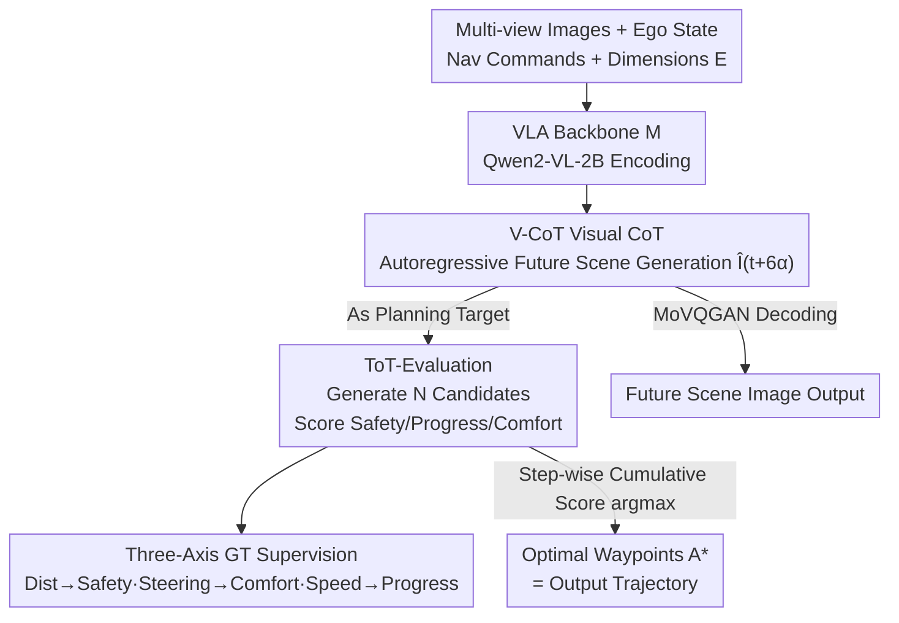

# HybridDriveVLA: Vision-Language-Action Model with Visual CoT reasoning and ToT Evaluation for Autonomous Driving

**Conference**: CVPR 2026  
**Paper**: [CVF OpenAccess](https://openaccess.thecvf.com/content/CVPR2026/html/Bassole_HybridDriveVLA_Vision-Language-Action_Model_with_Visual_CoT_reasoning_and_ToT_Evaluation_CVPR_2026_paper.html)  
**Code**: None  
**Area**: Autonomous Driving / VLA / Multimodal VLM  
**Keywords**: Visual Chain-of-Thought, Tree-of-Thought Evaluation, End-to-end Driving, Trajectory Planning, nuScenes

## TL;DR
HybridDriveVLA replaces the traditional "image-to-text then CoT reasoning" in driving VLAs with direct prediction of future scenes in the visual domain (V-CoT). It employs a Tree-of-Thought multi-trajectory evaluation (ToT-Evaluation) to score candidates point-by-point across safety, progress, and comfort dimensions to select the optimal waypoint sequence, reducing the average collision rate of autoregressive VLAs to 0.17% on nuScenes.

## Background & Motivation

**Background**: End-to-end autonomous driving is rapidly converging toward a paradigm driven by Vision-Language-Action (VLA) models. These models map raw sensor data and navigation instructions directly to vehicle control actions, leveraging the knowledge and reasoning capabilities of foundation models to understand complex traffic scenarios. To improve interpretability, mainstream approaches (DriveVLM, DriveLM, LingoQA, GPT-Driver, etc.) typically "translate" visual scenes into text, perform step-by-step reasoning via Chain-of-Thought (CoT) in the text space, and finally output a trajectory.

**Limitations of Prior Work**: This "image-to-text + text CoT" pipeline has two fundamental issues. First, discretizing continuous, high-dimensional visual scenes into text tokens introduces a **modality gap**—spatial information (lane geometry, precise object positions, continuous scene evolution) is irreversibly lost during linguistic abstraction, despite being critical for precise planning. Second, existing VLAs usually predict only a **single** waypoint sequence—a statistically "most likely" trajectory that attempts to balance safety, progress, and comfort simultaneously—without independent deliberation of each dimension. In multi-agent, uncertain intersection scenarios, such "finalized" trajectories can easily fail in one dimension (e.g., unsafe, uncomfortable, or stagnant).

**Key Challenge**: Interpretability is gained at the cost of text conversion, which loses spatial precision; meanwhile, single-sequence planning compresses multi-dimensional trade-offs into an indecipherable black-box decision. Researchers seek to achieve interpretability, spatial precision, and multi-dimensional deliberation simultaneously.

**Goal**: (1) Maintain the reasoning process within the visual domain to preserve spatial information; (2) Decompose "single multi-dimensional trajectories" into "multiple candidates + per-dimension scoring + explicit selection," making the importance of each driving dimension visible and evaluable.

**Key Insight**: Mimic the cognitive loop of a human driver—first "imagining" the next scene (anticipation), then "weighing" various paths regarding safety, progress, and comfort relative to that imagined goal before selecting one (deliberation). The former naturally corresponds to visual prediction, while the latter corresponds to tree-based search/self-evaluation.

**Core Idea**: Use **Visual CoT to predict future scene images** as planning targets (preserving spatial information), then utilize **Tree-of-Thought Evaluation** to generate multiple waypoint sequences and select the optimum by scoring across three axes. This unifies CoT and ToT within a single VLA model for the first time.

## Method

### Overall Architecture

HybridDriveVLA is built on a pretrained VLA backbone $M$ (Qwen2-VL-2B: containing a visual encoder + projection, text tokenizer, and text detokenizer). At time $t$, inputs include synchronized multi-view images $I_t=\{i^1_t,\dots,i^h_t\}$, ego-state $l_t$, navigation commands $c_t$ (LEFT/RIGHT/FORWARD), natural language instructions $o_t$, and a set of evaluation dimensions $E=\{e_{safety}, e_{progress}, e_{comfort}\}$.

The reasoning task is split into two steps within a single autoregressive sequence: First, **V-CoT** autoregressively generates the "next scene image" $\hat I_{t+6\alpha}$ at time $t+6\alpha$ (encoded into discrete visual tokens via MoVQGAN and decoded back to an image), serving as the **target state** for planning. Second, **ToT-Evaluation** conditions on this target image to generate $N$ candidate waypoint sequences. Each waypoint in a sequence is assigned safety, progress, and comfort scores. The optimal sequence $A^*$ is chosen by maximizing cumulative scores. This entire mechanism is completed in a single generative inference flow, outputting both the "imagined future scene" and the "selected waypoint actions."

### Key Designs

**1. V-CoT (Visual Chain-of-Thought): Anticipation in the Visual Domain**

To address the loss of spatial accuracy in text CoT, V-CoT enables the model to **predict the future directly in visual space**. Starting from input features, it autoregressively generates the next scene image at $t+6\alpha$ (approx. 3 seconds later) as the goal:

$$\hat I_{t+6\alpha} = M(I_t, E, l_t, c_t, o_t)$$

Each future scene image is encoded by MoVQGAN into $\sigma=512$ discrete visual tokens $\{q_1,\dots,q_\sigma\}$. Training minimizes the negative log-likelihood of reconstructing these tokens using backbone $M$:

$$\mathcal{L}_{\text{V-CoT}} = -\sum_{d=1}^{\sigma}\log P_\theta(q_d \mid q_{<\sigma}, I_t, E, l_t, c_t, o_t)$$

where $q_d$ is the ground-truth visual token at position $d$. This step allows the model to "simulate the next maneuver in its mind," producing an image that preserves lane layouts and object positions, rather than text that flattens this information.

**2. ToT-Evaluation: Multi-Candidate Scoring and Explicit Selection**

To resolve the black-box nature of single-sequence planning, ToT-Evaluation generates $N$ candidate waypoint sequences conditioned on the V-CoT target image $\hat I_{t+6\alpha}$. Each sequence $A_n=\{a^n_{t+\alpha},\dots,a^n_{t+6\alpha}\}$ includes per-waypoint scores $\mathcal{S}^n_{t+k\alpha}=\{s^{n,safety}, s^{n,progress}, s^{n,comfort}\}$, generated by the backbone:

$$\{(a^n_{t+k\alpha}, \mathcal{S}^n_{t+k\alpha})\}_{n=1}^N = M(I_t, \hat I_{t+6\alpha}, E, l_t, c_t, o_t)$$

During inference, the total score for each waypoint is calculated as $T^n_{t+k\alpha}=\sum_j s^{n,j}_{t+k\alpha}$ ($j\in\{safety,progress,comfort\}$). The candidate with the highest cumulative score at each step is selected:

$$n^* = \arg\max_{n\in\{1,\dots,N\}} T^n_{t+k\alpha}$$

This acts as a "reasoning-based beam search," where multi-dimensional trade-offs are **explicitly decomposed and interpretable**. The training objective maximizes the log-likelihood of generating ground-truth waypoint sequences and their scores:

$$\mathcal{L}_{\text{ToT-Eval}} = -\sum_{n=1}^{N}\sum_{k=1}^{6}\sum_j \log P_\theta\big(a^n_{t+k\alpha}, s^{n,j}_{t+k\alpha} \mid a^n_{<t+k\alpha}, s^{n,j}_{<t+k\alpha}, I_t, \hat I_{t+6\alpha}, E, l_t, c_t, o_t\big)$$

**3. Three-Axis Interpretable Ground-Truth Scores**

For ToT-Evaluation to learn scoring, quantifiable ground-truth metrics are derived from nuScenes statistics. These are linearly normalized into scores via $\sigma(\cdot)$:

- **Safety Score**: Based on minimum Euclidean distance $d_{t+k\alpha}$ to other objects; larger distances yield higher scores:
$$s^{safety}_{t+k\alpha} = \sigma\!\left(\frac{d_{t+k\alpha}-d^{min}}{d^{avg}-d^{min}}\right)$$
- **Comfort Score**: Based on steering rate $c_{t+k\alpha}$; smoother steering yields higher scores:
$$s^{comfort}_{t+k\alpha} = \sigma\!\left(1-\frac{c_{t+k\alpha}-c^{min}}{c^{avg}-c^{min}}\right)$$
- **Progress Score**: Based on vehicle speed $v_{t+k\alpha}$; higher speeds up to limits yield higher scores:
$$s^{progress}_{t+k\alpha} = \sigma\!\left(\frac{v_{t+k\alpha}-v^{min}}{v^{avg}-v^{min}}\right)$$

### Loss & Training

The total loss optimizes future anticipation and planning evaluation jointly:

$$\mathcal{L}_{\text{HybridDriveVLA}} = \mathcal{L}_{\text{V-CoT}} + \mathcal{L}_{\text{ToT-Eval}}$$

Training proceeds in two stages:
- **Supervised Fine-Tuning (SFT)**: Jointly optimizes next-scene prediction and waypoint sequences on paired multi-view image data. This aligns visual and language token spaces.
- **Instruction Tuning (IT)**: Uses LoRA on template-based vision-instruction corpora from nuScenes. The visual tower is **frozen**, and only the LM and LoRA adapters are updated to refine multi-axis deliberation.

## Key Experimental Results

### Main Results

Evaluations on nuScenes utilize ST-P3 and UniAD protocols. HybridDriveVLA uses a Qwen2-VL-2B backbone:

| Method | Type | ST-P3 L2 Avg (m) ↓ | ST-P3 Collision Avg (%) ↓ | UniAD L2 Avg (m) ↓ | UniAD Collision Avg (%) ↓ |
|------|------|------|------|------|------|
| GPT-Driver | Autoregressive (GPT-3.5) | 0.44 | 0.17 | 0.84 | 0.44 |
| DriveVLM | Autoregressive (Qwen-VL-7B) | 0.40 | 0.27 | – | – |
| RDA-Driver | Autoregressive (LLaVA-7B) | 0.40 | 0.10 | 0.80 | 0.32 |
| OpenDriveVLA | Autoregressive (Qwen2.5-3B) | 0.33 | 0.10 | 0.67 | 0.30 |
| **Ours (Full)** | Autoregressive (2B) | **0.26** | **0.17** | **0.31** | **0.19** |

Ours achieves an average collision rate of **0.17% (ST-P3) / 0.19% (UniAD)**. With only 2B parameters, it significantly outperforms larger (7B/3B) autoregressive counterparts in collision avoidance and L2 error.

### Ablation Study

| Configuration | ST-P3 Collision Avg (%) | Description |
|------|------|------|
| Ours (Full, V-CoT + ToT) | 0.17 | Complete model |
| w/o V-CoT (ToT-Evaluation only) | 0.23 | Removing visual target worsens collisions by ~26% |
| w/o V-CoT SFT stage | 0.23 | Direct IT without visual alignment results in performance degradation |

### Key Findings
- **V-CoT and ToT-Evaluation are complementary**: Deliberation must be anchored to a specific imagined visual future to be effective.
- **SFT is a prerequisite for deliberation**: The model must first "understand" the visual scene before it can effectively reason and select optimal paths during instruction tuning.
- **Small backbones are competitive**: A 2B parameter model achieves SOTA-level collision rates among autoregressive VLAs.

## Highlights & Insights
- **Maintaining CoT in the pixel domain** is the core innovation. By treating the "intermediate reasoning product" as a future scene image, Ours avoids the loss of spatial accuracy inherent in language-based abstraction.
- **Unification of CoT and ToT**: Integrates "imagining a goal" (V-CoT) and "deliberating paths" (ToT) into a single autoregressive flow.
- **Waypoint-based beam search perspective**: Leverages existing LLM autoregressive mechanisms to expand and evaluate branches at the waypoint level without external search modules.

## Limitations & Future Work
- **Limited to nuScenes/NAVSIM benchmarks**: Robustness in long-horizon, complex urban topologies or real-world closed-loop deployment remains unverified.
- **Dependency on V-CoT generation quality**: Planning is anchored to the generated scene; hallucinations or drift in MoVQGAN reconstruction could propagate errors.
- **Fixed weighting for three-axis scores**: Total scores currently use simple summation; adaptive weighting for different scenarios was not discussed.

## Related Work & Insights
- **vs DriveVLM / GPT-Driver**: These models lose spatial information via text translation; Ours maintains spatial precision via visual-domain reasoning, achieving lower collision rates with a smaller backbone.
- **vs UniAD / TransFuser**: These end-to-end planners lack explicit reasoning interpretability; Ours fills this gap with V-CoT and per-dimension scoring.
- **vs OpenDriveVLA**: Ours introduces the multi-candidate ToT deliberation mechanism, significantly improving safety over single-trajectory autoregressive outputs.

## Rating
- Novelty: ⭐⭐⭐⭐ Unifies visual CoT and ToT Evaluation; creative use of generative future scenes as planning targets.
- Experimental Thoroughness: ⭐⭐⭐ Dual-benchmark validation and ablation, though lacks analysis of generation quality/weight sensitivity.
- Writing Quality: ⭐⭐⭐ Clear motivation and formulas; however, some table layouts and consistent notation could be improved.
- Value: ⭐⭐⭐⭐ Interpretable multi-axis deliberation and adjustable driving styles offer significant utility for production-level safety.

<!-- RELATED:START -->

## Related Papers

- [\[CVPR 2026\] NoRD: A Data-Efficient Vision-Language-Action Model that Drives without Reasoning](nord_a_data-efficient_vision-language-action_model_that_drives_without_reasoning.md)
- [\[CVPR 2026\] DriveMoE: Mixture-of-Experts for Vision-Language-Action Model in End-to-End Autonomous Driving](drivemoe_mixture-of-experts_for_vision-language-action_model_in_end-to-end_auton.md)
- [\[CVPR 2026\] Learning Vision-Language-Action World Models for Autonomous Driving](vla_world_learning_vision_language_action_world_models_for_autonomous_driving.md)
- [\[CVPR 2026\] Drive My Way: Preference Alignment of Vision-Language-Action Model for Personalized Driving](drive_my_way_preference_alignment_of_vision-language-action_model_for_personaliz.md)
- [\[CVPR 2026\] Unifying Language-Action Understanding and Generation for Autonomous Driving](unifying_language-action_understanding_and_generation_for_autonomous_driving.md)

<!-- RELATED:END -->
