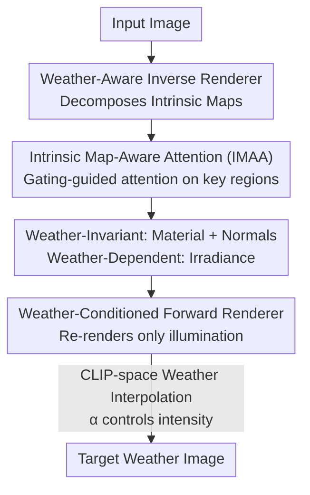

Markdown

# IntrinsicWeather: Controllable Weather Editing in Intrinsic Space

**Conference**: CVPR 2026  
**arXiv**: [2508.06982](https://arxiv.org/abs/2508.06982)  
**Code**: https://yixinzhu042.github.io/IntrinsicWeather/ (Project Page)  
**Area**: Autonomous Driving / Diffusion Models / Inverse Rendering  
**Keywords**: Weather Editing, Intrinsic space decomposition, Inverse rendering, Diffusion priors, Autonomous driving perception

## TL;DR
Diffusion models are utilized to decompose images into intrinsic maps consisting of "weather-invariant material/geometry + weather-dependent illumination." Target weather is then re-rendered in the intrinsic space using text prompts. This approach achieves fine-grained controllable weather editing while preserving scene material and geometry, outperforming SOTA in inverse rendering PSNR by over 10 dB and significantly enhancing the robustness of downstream detection/segmentation in adverse weather.

## Background & Motivation
**Background**: Current mainstream weather editing methods primarily operate in pixel space—employing a unified diffusion or generative model to directly translate "sunny" images into "rainy/snowy" ones. Representative works include WeatherWeaver, which splits the task into "weather removal + weather synthesis" stages, and general image editing models like FluxKontext and Qwen-Image-Edit.

**Limitations of Prior Work**: Pixel-space editing entangles weather effects with scene appearance. Modifying weather often inadvertently damages underlying materials, geometry, and lighting—for instance, changing vehicle colors during snow removal, altering pedestrian poses/counts, or leaving inconsistent sunny-day shadows when adding rain. Fundamentally, these methods lack physical interpretability and cannot guarantee consistency across material, geometry, and illumination.

**Key Challenge**: Weather phenomena (rain, snow, fog, accumulation) are primarily tied to the scene's **illumination** rather than the inherent properties of the materials. Pixel-space methods fail to decouple these factors, creating an inherent conflict between "changing weather" and "preserving structure."

**Goal**: ① Reliably decompose images into intrinsic space (material, geometry, illumination) for large-scale outdoor/driving scenes; ② Synthesize target weather in intrinsic space with fine-grained text control; ③ Use the edited "clean" images to improve downstream perception.

**Key Insight**: The authors are inspired by diffusion-prior-based intrinsic decomposition/recomposition works like RGB↔X and DiffusionRenderer—however, those methods were only effective for indoor or object-level tasks and did not address weather or generalize to large-scale autonomous driving scenes. The authors argue that by improving decomposition quality for outdoor scenes, "weather editing" can be simplified to "modifying only the illumination map."

**Core Idea**: Shift weather editing from pixel space to intrinsic space. Inverse rendering extracts weather-invariant material/geometry and a weather-dependent illumination map; forward rendering modifies only the illumination, using CLIP-space interpolation to control weather intensity while naturally preserving material and geometry.

## Method

### Overall Architecture
IntrinsicWeather consists of two complementary diffusion modules based on Stable Diffusion 3.5. The **weather-aware inverse renderer** decomposes the input image into a set of intrinsic maps: weather-invariant material maps (albedo, roughness, metallicity), a normal map, and an irradiance map capturing illumination and weather effects. The **weather-conditioned forward renderer** then combines these geometric/material maps with a text prompt describing the target weather to re-render a new image. In this pipeline—"Input → Intrinsic Maps → Re-rendered Image"—the key is that weather resides solely in the irradiance branch. Since material and geometry maps remain constant during editing, the system achieves controllable editing with high fidelity to geometry and material.

To ensure accurate decomposition in large outdoor scenes, the **Intrinsic Map-Aware Attention (IMAA)** is introduced to the inverse renderer. For continuous intensity adjustment, the forward renderer utilizes **CLIP-space weather interpolation**. To bridge the domain gap for real-world generalization, the authors constructed two datasets (Synthetic + Real) with intrinsic map annotations.

### Key Designs

**1. Intrinsic Space Decomposition: Decoupling Weather from Material/Geometry**

The primary flaw of pixel-space editing is the entanglement of weather and appearance. The authors move the operation to the intrinsic space. The inverse renderer splits an image into weather-invariant material properties (albedo / roughness / metallicity) + normal, and a specific irradiance map carrying lighting and weather. Because phenomena like rain, snow, and fog are physically determined by lighting, isolating them into the irradiance branch reduces "weather editing" to "re-rendering only the lighting branch while keeping materials and geometry intact," fundamentally resolving the conflict where weather changes damage structure. During forward rendering, providing these maps and a target weather prompt allows for the synthesis of new images with geometric consistency and natural lighting—enabling the complete removal of airborne particles (snowflakes) and ground accumulation (snow) without altering car colors or pedestrian poses.

**2. Intrinsic Map-Aware Attention (IMAA): Stabilizing Decomposition on Small Outdoor Objects**

Outdoor/driving scenes exhibit extreme variation in object scale. Original Stable Diffusion lacks explicit attention guidance, leading to poor decomposition for distant small objects and complex geometric areas. The authors observed that different intrinsic maps naturally demand focus on different image regions (normals on geometric transitions, metallicity on vehicles/poles/fences). IMAA extracts patch tokens $p$ using DINOv2 and assigns a learnable embedding $d \in \mathbb{R}^{D_{model}}$ to each intrinsic map. A gating mechanism calculates a map-aware mask: $m = \text{gating}(p, d) = \text{MLP}([f_p(p), f_d(d)])$, where $f_p, f_d$ are linear projections. This mask is incorporated as a joint attention bias $M$, applied only to image tokens ($K_I$) while leaving text tokens untouched, then injected into the DiT attention: $\text{Attn}(Q,K,V) = \text{Softmax}(\frac{QK^T}{\sqrt{d_k}} + M)V$. This affects both text-to-image and image-to-image attention, pressing text guidance into important regions and strengthening internal feature aggregation. Consequently, the model is "forced" to inspect regions most relevant to the map being estimated. Ablation shows that removing IMAA causes albedo PSNR to drop from 27.99 to 26.78 and irradiance from 29.66 to 26.99.

**3. CLIP-space Weather Interpolation: Continuous Control of Weather Intensity**

Discrete weather category prompts are insufficient for fine-grained transitions like "light rain → heavy rain" or "thin snow → snow-covered road." In the CLIP text space, the authors first compute a weather transition direction $e = \text{Embed}(w_1) - \text{Embed}(w_2)$ (where $w_1$ is the target weather like "rainy" and $w_2$ is the original weather like "overcast"). Starting from a weather-neutral embedding $w_{base}$, they step $\alpha$ distance along this direction: $E = \text{Embed}(w_{base}) + \alpha \cdot e$, feeding $E$ into the model. By sampling different $\alpha$, the forward renderer synthesizes continuous intermediate weather states—far more realistic than WeatherWeaver's pseudo-transition of stacking filters (roads gradually wet as rain intensifies; snow settles on branches before covering roads). To preserve the pre-trained model's rich priors, feature distillation is used to align some intermediate features of the forward renderer with the original Stable Diffusion.

### Loss & Training
Both renderers are fine-tuned based on SD 3.5. IMAA employs a **heuristic-guided progressive training** strategy to stabilize learning and ensure it provides meaningful guidance early on—for example, using gradient operators to extract illuminated regions and shadow boundaries as priors for the irradiance map. The forward renderer uses feature distillation to align with original SD features to preserve generative priors. Training data follows a two-step process: using 38K synthetic images (WeatherSynthetic) for base capability, followed by fine-tuning on 18K real images (WeatherReal, with pseudo-labels from their own inverse renderer + FluxKontext) for real-world generalization; WeatherReal is used only for fine-tuning, not evaluation.

## Key Experimental Results

### Main Results

**Comparison with Pixel-space Editing / Rendering Methods (Tab. 1)** — Higher CLIP-S indicates better text alignment and rationality:

| Method | Type | CLIP-S(Rainy) ↑ | CLIP-S(Snowy) ↑ | DINO-S ↑ |
|------|------|------|------|------|
| **Ours** | Rendering | **20.76** | **22.32** | 73.63 |
| RGB↔X | Rendering | 20.29 | 19.92 | 55.87 |
| DiffusionRenderer | Rendering | – | – | 43.12 |
| Flux-Kontext | Pixel | 19.46 | 22.25 | 85.50 |
| Qwen-Image-Edit | Pixel | 21.56 | 22.43 | 53.70 |
| WeatherWeaver | Pixel | 20.25 | 21.41 | 67.01 |

Ours achieves the highest CLIP-S (best text alignment + rationality); DINO-S is second only to Flux-Kontext, but Flux-Kontext fails to effectively remove/synthesize weather, and Qwen's higher PickScore comes at the cost of inconsistent textures/geometry. A user study with 61 participants across 8 cases showed a mean preference rate of **81.67%** for the proposed method.

**Inverse Rendering Decomposition Quality (WeatherSynthetic Test Set, Tab. 3)**:

| Method | Albedo PSNR ↑ | Normal PSNR ↑ | Normal MAE ↓ | Irradiance PSNR ↑ |
|------|------|------|------|------|
| **Ours** | **27.99** | **25.06** | **4.24** | **29.66** |
| DiffusionRenderer | 11.91 | 16.43 | 28.68 | – |
| RGB↔X (w/ finetune) | 11.35 | 16.14 | 7.05 | 16.38 |
| IID (w/ finetune) | 11.55 | – | – | – |
| IDArb | 6.40 | 10.77 | 22.42 | – |

Ours leads across all metrics. Albedo PSNR jumps from ~11.9 (second best) to 27.99 (>10 dB gain). Even with fine-tuning on this dataset, IID/RGB↔X cannot bridge the gap.

**Downstream Perception Gain (ACDC Val Set, Tab. 2)** — Adverse weather images are edited to clear weather before running detection/segmentation:

| Model | AP0.5 | AP0.75 | mAP[0.5:0.95] | mIOU |
|------|------|------|------|------|
| DETR | 56.56 | 13.15 | 47.00 | – |
| DETR + ours | **61.32** | **24.60** | **54.87** | – |
| Segformer | – | – | – | 24.13 |
| Segformer + ours | – | – | – | **30.05** |
| **Gain** | +4.76 | +11.45 | +7.87 | +5.92 |

AP75 improved from 13.15% to 24.60% (relative +87.1%), and mIOU improved from 24.13% to 30.05% (relative +24.5%).

### Ablation Study

| Configuration | Albedo PSNR | Irradiance PSNR | Note |
|------|------|------|------|
| Full (w/ IMAA) | 27.99 | 29.66 | Full Model |
| w/o IMAA | 26.78 | 26.99 | Without attention guidance, decomposition of small/metallic parts degrades |
| w/o WeatherReal | — | — | Only synthetic training; inadequate realism in lighting/weather synthesis on real samples |

### Key Findings
- **IMAA contributes most to Irradiance**: Removing it dropped irradiance PSNR by 2.67 dB, compared to a 1.21 dB drop for albedo—indicating the light branch relies most on spatial attention since shadow boundaries and lit areas are crucial for weather editing.
- **Intrinsic vs. Pixel Space Advantage**: This method completely clears airborne particles and ground accumulation. Weather restoration methods (AWRaCLe, Histoformer) only remove airborne particles and cannot modify ground materials or global lighting.
- **Real-world fine-tuning is indispensable**: Training solely on synthetic data leads to poor generalization on real samples; WeatherReal fine-tuning is required for realistic lighting and object appearance.

## Highlights & Insights
- **Redefining "Weather Editing" as "Modifying One Illumination Map"**: By physically isolating weather into the irradiance branch, materials and geometry remain untouched during editing—the fundamental reason for its vastly superior structural consistency compared to pixel-space methods.
- **Transferable IMAA Gating Logic**: The observation that different output maps should focus on different input regions—implemented via learnable embeddings and gating—can be extended to any "one-image, multi-head" dense prediction task (e.g., multi-task segmentation) to specialize each head.
- **CLIP-Space Directional Interpolation**: Modeling "weather intensity" as a direction vector in CLIP text embeddings with a scalar $\alpha$ for sampling is a lightweight paradigm for fine-grained control applicable to any semantic axis transition (lighting, season, time).
- **Editing as Data Augmentation/Preprocessing**: Placing generative editing at the input side of a perception model to actively correct environmental distortions is a practical route for improving adverse weather robustness.

## Limitations & Future Work
- **Dependency on Self-Constructed Datasets**: Synthetic data utilizes UE5, while real data relies on pseudo-labels from their own renderer + FluxKontext; pseudo-label quality determines the performance ceiling.
- **Recursive Dependency in Real-world Evaluation**: Since WeatherReal's intrinsic maps were generated by this model's inverse renderer, fine-tuning on it may introduce a self-consistency bias.
- **Limited Downstream Evaluation**: Evaluation is restricted to ACDC with DETR/Segformer, focusing only on the "adverse → clear" direction without covering more backbones or diverse task combinations.
- **Computational Cost**: Two independent SD 3.5 models in series involves significant diffusion sampling overhead; real-time deployment for autonomous driving remains a challenge (inference latency was not reported).

## Related Work & Insights
- **vs. WeatherWeaver**: WeatherWeaver operates in pixel space with a two-stage process. This method works in intrinsic space, modifying only the lighting branch, yielding better geometric fidelity and continuous control.
- **vs. RGB↔X / DiffusionRenderer**: These address intrinsic decomposition but focus on indoor or single objects. This work introduces IMAA to achieve high-fidelity outdoor decomposition (>10 dB PSNR gain).
- **vs. IntrinsicEdit**: Focuses on object-level editing; this work targets large-scale outdoor scenes and specific weather effects.
- **vs. Weather Restoration (AWRaCLe / Histoformer)**: These are restoration tasks (removing particles); this work can modify ground materials/lighting and synthesize any target weather.
- **vs. 3D Space Editing**: Requires precise geometry often unavailable in real driving; this work avoids that by performing single-image inverse rendering.

## Rating
- Novelty: ⭐⭐⭐⭐⭐ Decoupling weather in intrinsic space + IMAA + CLIP interpolation represents a clear paradigm shift for outdoor autonomous driving scenes.
- Experimental Thoroughness: ⭐⭐⭐⭐ Solid quantitative comparisons across inverse/forward/downstream tasks, though downstream evaluation is limited to ACDC and inference cost is missing.
- Writing Quality: ⭐⭐⭐⭐ Clear motivation and illustrations; some technical details are deferred to the supplement.
- Value: ⭐⭐⭐⭐⭐ Provides a complete framework for intrinsic weather editing and two datasets with annotations, offering direct utility for autonomous driving robustness.

<!-- RELATED:START -->

## Related Papers

- [\[CVPR 2025\] SceneCrafter: Controllable Multi-View Driving Scene Editing](../../CVPR2025/autonomous_driving/scenecrafter_controllable_multi-view_driving_scene_editing.md)
- [\[CVPR 2026\] Structure-to-Intensity Diffusion for Adverse-Weather LiDAR Generation](structure-to-intensity_diffusion_for_adverse-weather_lidar_generation.md)
- [\[CVPR 2026\] LiDAR-to-4DRadar Diffusion Bridge via Cross-Modal Alignment and Translation in Latent Space](lidar-to-4dradar_diffusion_bridge_via_cross-modal_alignment_and_translation_in_l.md)
- [\[CVPR 2026\] x2-Fusion: Cross-Modality and Cross-Dimension Flow Estimation in Event Edge Space](x2-fusion_cross-modality_and_cross-dimension_flow_estimation_in_event_edge_space.md)
- [\[CVPR 2026\] HorizonForge: Driving Scene Editing with Any Trajectories and Any Vehicles](horizonforge_driving_scene_editing_with_any_trajectories_and_any_vehicles.md)

<!-- RELATED:END -->
