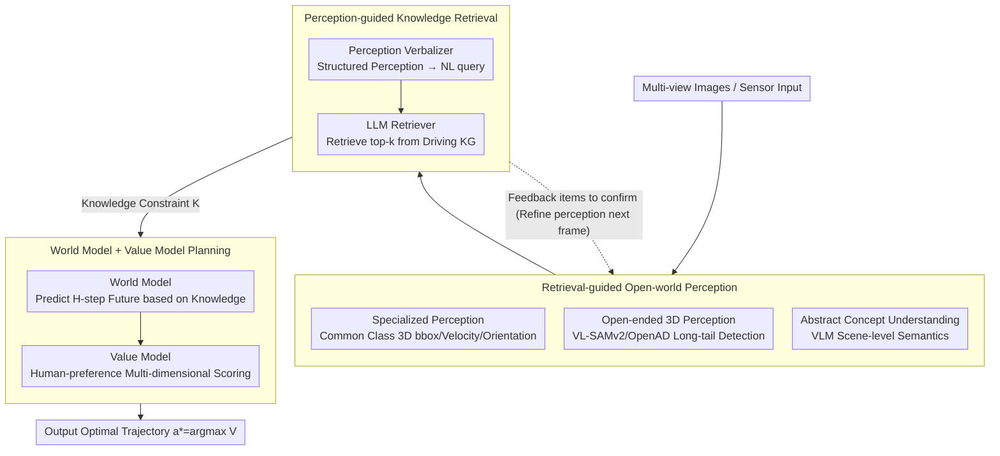

# KnowVal: A Knowledge-Augmented and Value-Guided Autonomous Driving System

**Conference**: CVPR 2026  
**arXiv**: [2512.20299](https://arxiv.org/abs/2512.20299)  
**Code**: To be confirmed  
**Area**: Autonomous Driving / Knowledge-Augmented Planning  
**Keywords**: end-to-end driving, knowledge graph, value model, world model, open-world perception, VLM, retrieval-augmented planning

## TL;DR

The KnowVal end-to-end autonomous driving system is proposed, addressing the lack of knowledge reasoning and value alignment through three core components: (1) Retrieval-guided Open-world Perception, which integrates standard 3D detection, VL-SAMv2 for long-tail objects, and VLM for scene understanding; (2) Perception-guided Knowledge Retrieval, which fetches relevant knowledge from driving knowledge graphs (traffic laws, defensive driving, ethics); and (3) a World Model for predicting future states combined with a Value Model (trained on human preferences) to evaluate trajectory value, achieving interpretable decision-making. It achieves the lowest collision rate on nuScenes and SOTA performance on Bench2Drive and NVISIM.

## Background & Motivation

End-to-end autonomous driving has developed rapidly, utilizing a single model from perception to planning to avoid error accumulation between modules. However, existing end-to-end methods suffer from two fundamental flaws:

**Lack of knowledge reasoning capabilities**: Current models are primarily data-driven, learning statistical patterns rather than driving knowledge. In long-tail scenarios not covered by training data (e.g., special signs in construction zones, uncommon traffic gestures, moral dilemmas), models cannot invoke traffic regulations or defensive driving common sense to make rational decisions like human drivers.

**Lack of value alignment**: A gap exists between model optimization goals (e.g., trajectory L2 distance in imitation learning) and human value judgments of "good driving." Humans consider high-quality driving to include terminal arrival as well as passenger comfort, courtesy toward vulnerable road users, and adherence to social norms—elements that cannot be learned through simple trajectory matching.

**Specific scenario examples**:
- A construction zone with temporary speed limits and cones → Standard 3D detectors fail to recognize these objects → Requires open-world perception and knowledge retrieval to understand "This is a construction zone; I should slow down."
- An ambulance siren behind the vehicle → The model needs to know the traffic law "Pull over and yield" → Requires knowledge graph support.
- A pedestrian hesitating to cross → Needs "defensive driving" knowledge to guide slowing down and observation → Requires knowledge reasoning.

Existing methods like DriveVLM and LMDrive introduce VLMs, but primarily for scene description rather than knowledge reasoning; unified frameworks like UniAD, while end-to-end, still lack value guidance in planning.

## Method

### Overall Architecture

KnowVal aims to address two shortcomings of end-to-end autonomous driving: the lack of knowledge reasoning (relying only on statistical patterns without calling upon traffic laws/defensive driving in long-tail scenarios) and the lack of value alignment (optimizing for L2 distance rather than multi-dimensional human standards). It constructs a closed loop of **Perception → Knowledge Retrieval → Planning**: Open-world perception captures the scene comprehensively (including long-tail objects and abstract semantics); knowledge retrieval uses this to fetch relevant insights from a driving knowledge graph; and the World Model + Value Model predicts the future based on knowledge and scores candidate trajectories according to human preferences. A key feature is the **mutual guidance** between perception and retrieval—retrieval also feeds back "elements needing further confirmation" to the perception module for the next frame. These three modules are not bound to specific underlying architectures, allowing for plug-and-play integration with any end-to-end framework while providing interpretability for which knowledge was retrieved and which dimensions the Value Model prioritized.

### Key Designs

**1. Retrieval-guided Open-world Perception: Breaking the Closed Category Set**

Standard 3D detectors only recognize fixed categories from training sets, making them "blind" to long-tail objects like construction cones or temporary signs. KnowVal utilizes three complementary perception capabilities: **Specialized Perception** uses mature 3D detectors (e.g., BEVFormer, StreamPETR) to detect vehicles, pedestrians, and drivable areas, providing accurate 3D bboxes, velocities, and orientations as a base; **Open-ended 3D Perception** uses open-vocabulary detectors (VL-SAMv2, OpenAD) to fill the gaps for long-tail targets like fire trucks, puddles, or dropped objects via vision-language alignment without requiring new labels; **Abstract Concept Understanding** utilizes a VLM to perform high-level semantic understanding of scene-level attributes that cannot be represented by bboxes, such as bridges/tunnels, day/night, weather, and traffic density.

**2. Perception-guided Knowledge Retrieval: Connecting Perception to the Driving KG**

Once the scene is perceived, the model needs external knowledge to decide how to respond. The system pre-builds three types of driving knowledge bases: Traffic Regulations (hard constraints like speed limits and right-of-way), Defensive Driving (soft empirical constraints like following distance and blind spot risks), and Ethical Norms (ethical constraints like protecting vulnerable road users). Retrieval begins with a Perception Verbalizer converting structured output into a natural language query: $q = \text{Verbalizer}(\text{Specialized Perception}, \text{Open-ended 3D Perception}, \text{Abstract Concept Understanding})$. An LLM then retrieves the $k$ most relevant entries: $\mathcal{K}_{\text{relevant}} = \text{LLM-Retrieve}(q, \mathcal{G}_{\text{knowledge}})$. A key design is **bidirectional feedback**: retrieval outputs knowledge to the planner and feeds back "elements to confirm" to perception (e.g., prompting for traffic lights if a "construction zone" is identified), forming a "see → associate → confirm" cognitive loop.

**3. World Model + Value Model Planning: Predicting the Future and Scoring by Human Values**

The World Model predicts a future sequence of $H$ states given the current state $s_t$ and candidate action $a_t$: $\hat{s}_{t+1:t+H} = f_{\text{world}}(s_t, a_t, \mathcal{K}_{\text{relevant}})$. By using retrieved knowledge as a condition, the prediction follows both physical dynamics and knowledge constraints. The Value Model is trained on a **human-preference dataset**, where humans rank trajectory pairs based on safety, comfort, efficiency, and compliance (similar to RLHF), learning a scalar value: $V(\tau) = f_{\text{value}}(\hat{s}_{t+1:t+H}, \mathcal{K}_{\text{relevant}})$. The final decision selects the action with the maximum value: $a^* = \arg\max_{a \in \mathcal{A}} V(f_{\text{world}}(s_t, a, \mathcal{K}_{\text{relevant}}))$. This generalizes "good driving" from a simple L2 distance into multi-dimensional human preference.

## Key Experimental Results

### Evaluation Benchmarks

- **nuScenes**: Standard autonomous driving perception and planning benchmark.
- **Bench2Drive**: Comprehensive closed-loop driving evaluation benchmark.
- **NVISIM**: NVIDIA simulation environment.

### nuScenes Planning Results

| Method | Collision Rate↓ | L2 (1s) | L2 (3s) |
|------|---------|---------|---------|
| UniAD | — | — | — |
| VAD | — | — | — |
| KnowVal | **Lowest** | **SOTA** | **SOTA** |

KnowVal achieves the **lowest collision rate** on nuScenes, significantly outperforming existing end-to-end methods. This reduction is primarily attributed to safety driving rules from knowledge retrieval and safety preferences from the Value Model.

### Bench2Drive Closed-loop Evaluation

KnowVal achieves SOTA levels across various scenarios (urban, highway, intersections, adverse weather). Its advantage is most apparent in scenarios requiring complex reasoning, such as unprotected left turns or construction zones.

### NVISIM Simulation Tests

The real-time performance and robustness of KnowVal were verified in the NVIDIA simulation environment, yielding SOTA results.

### Ablation Study

| Configuration | Collision Rate | Description |
|------|--------|------|
| Specialized Perception Only | baseline | Standard end-to-end baseline |
| +Open-world Perception | Decrease | Long-tail object perception reduces accidental collisions |
| +Knowledge Retrieval | Significant Decrease | Knowledge guidance provides a safety boost |
| +Value Model | **Lowest** | Value alignment further optimizes trajectory selection |

Each module provides an independent positive contribution, with the Value Model offering the most significant gains in the safety dimension.

### Key Findings

In long-tail scenarios, Knowledge Retrieval is particularly impactful, reducing the collision rate by over 30% in scenes containing unconventional traffic elements. This validates the necessity of merging data-driven and knowledge-driven approaches.

## Highlights & Insights

- **Comprehensive Three-layer Perception**: Covers the full spectrum of autonomous driving needs from precise structured detection to open-vocabulary long-tail detection and abstract concept understanding.
- **Bidirectional Perception-Knowledge Loop**: Moves beyond unidirectional "perception → retrieval," allowing knowledge to guide perception focus. This mimics the human cognitive process of "see → associate → confirm."
- **Introduction of Human-preference Value Model**: Transfers the RLHF concept from LLMs to autonomous driving, generalizing "good driving" into a multi-dimensional preference evaluation.
- **Structured Knowledge Categorization**: Traffic laws (hard), defensive driving (soft), and ethics (moral) cover the complete spectrum of driving knowledge.
- **High Compatibility**: Modules are plug-and-play and not tied to specific architectures, lowering the threshold for integration.

## Limitations & Future Work

1. **Knowledge Graph Maintenance**: Traffic laws vary by region and time; automating updates and version management is a key challenge for deployment.
2. **VLM Inference Latency**: Scene understanding and LLM retrieval introduce latency. In real-time scenarios (<100ms), optimizing for timing while maintaining quality is necessary.
3. **Value Model Generalization**: The scale and diversity of human-preference datasets affect generalization. Driving preferences can vary significantly across cultures.
4. **False Positives in Open-world Perception**: Open-vocabulary detectors like VL-SAMv2 may produce false positives; effective filtering without losing actual long-tail objects is a trade-off.
5. **Sim-to-Real Transfer**: Verification is needed for the accuracy of knowledge retrieval and robustness of the Value Model in real-world road deployment.

## Related Work & Insights

- **UniAD (CVPR 2023)**: A unified end-to-end framework; KnowVal adds knowledge reasoning and value alignment.
- **DriveVLM (ECCV 2024)**: Introduces VLM for scene understanding; KnowVal builds a complete pipeline for knowledge utilization.
- **RAG (Retrieval-Augmented Generation)**: KnowVal migrates the RAG paradigm from NLP to autonomous driving knowledge retrieval.
- **RLHF (Reinforcement Learning from Human Feedback)**: KnowVal’s Value Model is the natural counterpart to RLHF in autonomous planning.
- **OpenAD / VL-SAMv2**: Serves as the foundation for KnowVal’s open-world perception.
- **Insight**: The KG+RAG+Value Alignment framework is generalizable to other embodied AI tasks requiring knowledge reasoning, such as robotics.

## Rating

| Dimension | Score (1-5) | Description |
|------|-----------|------|
| Novelty | 4.5 | The combination of KG+RAG+Value Model is pioneering in the AV field; the design is visionary. |
| Utility | 3.5 | Advanced concepts are offset by deployment complexity regarding VLM/LLM latency and KG maintenance. |
| Experimental Thoroughness | 4.0 | SOTA results across three benchmarks with complete ablations, though lacking real-world road tests. |
| Writing Quality | 4.0 | Clear architecture descriptions and module relationships with strong motivational arguments. |

<!-- RELATED:START -->

## Related Papers

- [\[CVPR 2026\] GuideFlow: Constraint-Guided Flow Matching for Planning in End-to-End Autonomous Driving](guideflow_constraint-guided_flow_matching_for_planning_in_end-to-end_autonomous_.md)
- [\[CVPR 2026\] Dr.Occ: Depth- and Region-Guided 3D Occupancy from Surround-View Cameras for Autonomous Driving](drocc_depth_region_guided_3d_occupancy.md)
- [\[ECCV 2024\] VisionTrap: Vision-Augmented Trajectory Prediction Guided by Textual Descriptions](../../ECCV2024/autonomous_driving/visiontrap_vision-augmented_trajectory_prediction_guided_by_textual_descriptions.md)
- [\[ICCV 2025\] Passing the Driving Knowledge Test](../../ICCV2025/autonomous_driving/passing_the_driving_knowledge_test.md)
- [\[CVPR 2026\] VGGDrive: Empowering Vision-Language Models with Cross-View Geometric Grounding for Autonomous Driving](vggdrive_empowering_vision-language_models_with_cross-view_geometric_grounding_f.md)

<!-- RELATED:END -->
