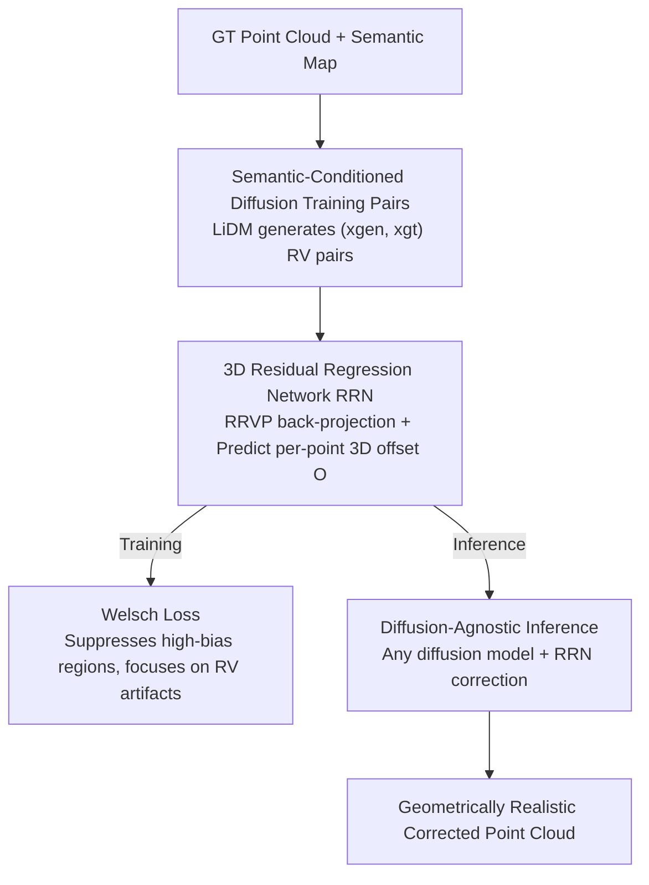

# L3DR: 3D-aware LiDAR Diffusion and Rectification

**Conference**: CVPR 2026  
**Paper**: [CVF Open Access](https://openaccess.thecvf.com/content/CVPR2026/html/Liu_L3DR_3D-aware_LiDAR_Diffusion_and_Rectification_CVPR_2026_paper.html)  
**Code**: https://github.com/liuQuan98/L3DR  
**Area**: Autonomous Driving / Diffusion Models / 3D Vision  
**Keywords**: LiDAR Point Cloud Generation, Range-view Diffusion, Residual Regression, Geometric Realism, Welsch Loss

## TL;DR
L3DR appends a 3D residual regression network after range-view (RV) LiDAR diffusion to compute per-point offsets that correct "depth bleeding" and "wavy surface" artifacts in back-projected 3D point clouds. By using a Welsch loss to bypass high-bias hallucination regions in training pairs, it achieves SOTA geometric realism on KITTI, KITTI360, nuScenes, and Waymo with minimal computational overhead.

## Background & Motivation

**Background**: Autonomous driving perception requires large-scale LiDAR point clouds, which are costly to collect. Consequently, synthesizing point clouds with generative models is a critical demand. The mainstream pipeline involves projecting 3D point clouds into RV depth maps (Height = Pitch, Width = Azimuth), applying 2D image diffusion models (LiDARGen, R2DM, LiDM, etc.) for denoising, and then back-projecting to 3D.

**Limitations of Prior Work**: Although RV representations allow the reuse of 2D diffusion, they lose 3D geometric sparsity and self-occlusion information. Consequently, while generated point clouds appear realistic in 2D, they exhibit severe artifacts when back-projected to 3D: incorrect depth continuity at edges (depth bleeding between foreground vehicles and background) and smooth "wavy" or "rounded" surfaces on structures that should be flat, like walls. These artifacts significantly degrade 3D geometric realism.

**Key Challenge**: 2D diffusion models are constrained by Lipschitz continuity. Theoretically, they cannot generate arbitrarily sharp spatial jumps (Theorem 1 in the Pilot Study: DDIM output is locally Lipschitz with respect to input noise, bounding the spatial gradient $\|\nabla x_0\|\le L$). Thus, 2D models inherently fail to produce sharp boundaries. Conversely, the gradient upper bound for 3D models on RV maps, $\|\nabla x_{3d}\|\le L_{3D}\cdot\Delta d$, is **unbounded** as the depth difference $\Delta d$ between adjacent pixels increases, allowing for sharp boundaries. This suggests using a 3D network to "rectify" the geometric errors of 2D diffusion.

**Goal**: To eliminate 3D geometric artifacts in generated RV point clouds without retraining the diffusion model or significantly increasing compute. This involves solving two sub-problems: (1) Where to source training data for the rectification network? (2) How to prevent non-artifact errors in the training data from contaminating the learning target?

**Key Insight**: The generation quality is decomposed into "global layout realism" (handled well by 2D RV diffusion) and "local geometric realism" (poorly handled by 2D), the latter of which is assigned to a specialized 3D residual regression network.

**Core Idea**: A 3D network regresses and cancels per-point 3D offsets (residuals) from the RV diffusion output, targeting specifically low-amplitude high-variance RV artifacts while ignoring large-amplitude high-bias hallucination regions.

## Method

### Overall Architecture
L3DR is a framework consisting of "2D diffusion for layout + 3D network for geometry," featuring two-stage training and diffusion-agnostic inference. **Stage 1** utilizes semantic-conditioned LiDAR diffusion (retrained LiDM) to generate point clouds based on training set semantic maps, collecting pairs of generated RVs $x_{gen}$ and ground truth (GT) RVs $x_{gt}$ that are structurally similar but contain RV artifacts. **Stage 2** back-projects the generated point clouds to 3D and feeds them into a 3D Residual Regression Network (RRN) to predict per-point 3D offsets. This is supervised by a Welsch loss to regress the artifacts away. During **inference**, the front-end diffusion model can be any LiDAR diffusion method, with RRN serving as a universal post-processing module for geometric correction.

### Key Designs

**1. Semantic-conditioned diffusion for training pairs: Generating "artifact-prone but aligned" supervision data**

The rectification network must learn to transform artifact-heavy point clouds back into clean ones. However, RV artifacts are irregular and lack an explicit distribution, making it impossible to synthesize data via simple noise addition. The authors retrain a SOTA conditional model, LiDM: using VQ-VAE to compress RV maps into latent space, a diffusion UNet to predict latent noise, and concatenated downsampled semantic maps as control conditions. Once converged, GT $x_{gt}$ and generated $x_{gen}$ are collected. LiDM is chosen because its outputs are structurally close to GT but contain residual RV artifacts at small scales. The framework is not locked to LiDM; any method producing such approximate pairs is viable.

**2. 3D Residual Regression Network (RRN): Regressing offsets in 3D and radial projection**

This is the core for correcting 2D geometric errors in 3D space. First, the lossless Radial Range-View Projection (RRVP) back-projects generated RVs into point clouds $P_{gen}=\mathrm{RRVP}(x_{gen})$. A 3D backbone $F:\mathbb{R}^{N\times k}\to\mathbb{R}^{N\times 3}$ predicts 3D offsets $O=F(P_{gen})$ ($k=3$ for coordinates; $k=6$ if including semantic maps). Crucially, the offset is projected onto the per-point radial direction to obtain the final residual $\hat{O}=P_{gen}\,\mathrm{diag}(P_{gen}O^\top)/\sqrt{\mathrm{diag}(P_{gen}P_{gen}^\top)}$, then $P_{ref}=P_{gen}+\hat{O}$. Using 3D operators (sparse convolution/local attention) instead of 2D is justified by the Pilot Study: 3D kernels have receptive fields defined in 3D space. When depth differences between adjacent pixels are large, they fall outside the receptive field, allowing for the generation of sharp boundaries.

**3. Welsch Loss: Bypassing high-bias hallucination regions via bias-variance decomposition**

Training pairs contain two types of errors: high-variance errors (RV artifacts, low amplitude) and high-bias errors (coherent but incorrect "hallucinations" due to insufficient semantic constraints, such as a skewed wall or a displaced tree, with large amplitude). Direct L1/L2 regression would be dominated by large-amplitude high-bias regions, causing the network to ignore local geometric artifacts. The Welsch loss uses the fact that artifact amplitudes are significantly smaller than bias amplitudes for soft separation. Define the Welsch function $\psi_\nu(x)=1-\exp\!\big(-x^2/(2\nu^2)\big)$ (inverted bell curve, $\nu$ controls width). The loss is $\mathcal{L}_{RRN}=\mathrm{mean}\big(\psi_\nu(\mathrm{RVP}(P_{gen}+\hat{O})-x_{gt})\big)$. For large residuals, $\psi_\nu$ saturates toward 1 and gradients approach 0, allowing the network to ignore large-bias regions and focus on small-scale artifacts.

**4. Diffusion-Agnostic Inference: RRN as a plug-and-play geometric post-processor**

Since RRN learns how to remove RV artifacts independently of the specific diffusion model, the front-end can be replaced during inference. The process: generate $x'_{gen}$ with any LiDAR diffusion, back-project via RRVP to $P'_{gen}$, compute residuals $\hat{O}'$ via radial projection, and output $P'_{ref}=P'_{gen}+\hat{O}'$. Experiments show that RRN, even if trained on LiDM semantic data, generalizes to unseen unconditional diffusion networks as a "plug-and-play" geometric refinement module.

### Loss & Training
The primary loss for RRN is the Welsch loss $\mathcal{L}_{RRN}$. The default backbone is SPUNet (PTV3 was also tested). RV dimensions are $(64, 1024)$ for 64-beam KITTI/Waymo. For 32-beam nuScenes, $(32, 1024)$ caused divergence, so the authors "over-provisioned" to $(64, 1024)$ to stabilize training dynamics, suggesting that sufficient image resolution is critical for stability. Training was conducted on 4×RTX 4090 for 150 epochs.

## Key Experimental Results

**Metrics**: **FSVD / FPVD** (Fréchet Sparse/Point-Voxel Distance for perceptual quality, lower is better), **JSD** (Jensen-Shannon Divergence), **MMD** (Minimum Matching Distance).

### Main Results

Unconditional KITTI360 and semantic-conditioned nuScenes/Waymo generation (selected):

| Dataset / Task | Method | FSVD↓ | FPVD↓ | JSD↓ | MMD×10⁻⁴↓ |
|--------|------|------|------|------|------|
| KITTI360 Uncond. | R2DM | 36.8 | 30.9 | 0.168 | 2.92 |
| KITTI360 Uncond. | **Ours-R2DM** | 35.9 | 28.2 | 0.165 | 2.90 |
| KITTI360 Uncond. | LiDM | 38.8 | 29.0 | 0.211 | 3.84 |
| KITTI360 Uncond. | **Ours-LiDM** | 35.8 | 26.1 | 0.182 | 3.27 |
| nuScenes Semantic | LiDM | 86.6 | 74.8 | 0.145 | 2.81 |
| nuScenes Semantic | **Ours-LiDM-Sem** | 81.3 | 67.0 | 0.133 | 2.72 |
| Waymo Semantic | LiDM | 21.4 | 21.9 | 0.104 | 1.30 |
| Waymo Semantic | **Ours-LiDM-Sem** | 18.3 | 20.3 | 0.086 | 1.25 |

On LiDM, FPVD improved by ~10% and JSD by ~13.7%. The framework also worked for non-latent diffusion like R2DM (JSD improved 1.8%), demonstrating backend universality. Average improvements on nuScenes/Waymo were 11.6% / 7.0%. For SemanticKITTI, adding semantic input to L3DR (Ours-Sem) boosted MMD by approximately 52.5%.

### Ablation Study

Ablations on backbone, loss, semantic input, and 2D vs 3D on SemanticKITTI:

| Backbone | Loss | RRN Semantic | FSVD↓ | FPVD↓ | JSD↓ | MMD↓ |
|------|------|------|------|------|------|------|
| / (Baseline) | / | - | 18.3 | 15.3 | 7.1 | 16.2 |
| SPUNet | Welsch | - | 16.4 | 12.1 | 6.7 | 16.7 |
| SPUNet | MSE | - | 26.3 | 25.1 | 7.0 | 12.6 |
| SPUNet | Welsch | ✓ | **12.5** | 10.7 | 6.7 | 15.0 |
| PTV3 | MSE | - | 42.4 | 42.6 | 7.4 | 18.8 |
| 2D UNet | Welsch | - | 19.2 | 16.4 | 7.1 | 16.3 |

### Key Findings
- **Loss choice is critical**: Swapping Welsch for MSE doubled FSVD/FPVD (16.4/12.1 to 26.3/25.1). Bypassing high-bias regions is essential; otherwise, the rectification makes the output worse.
- **3D backbone is necessary**: Replacing 3D UNet with a 2D image UNet resulted in performance (19.2/16.4) worse than the baseline (18.3/15.3), confirming that only 3D operators can produce sharp boundaries.
- **Semantic input enhances performance**: SPUNet + Welsch + semantic map achieves the best FSVD (12.5).
- **Near-zero computational cost**: RRN adds only 19.65 ms latency on an RTX 4090 (compared to >550 ms for diffusion sampling) and 37.9 M parameters.

## Highlights & Insights
- **Theoretic-Empirical grounding**: Establishes a theoretical upper bound for 2D diffusion vs 3D networks using Lipschitz continuity (Theorem 1), followed by empirical verification with RV gradient JSD (0.222 → 0.176).
- **Adaptability of Welsch Loss**: Transfers "soft outlier suppression" from robust statistics to distinguish between high-bias hallucinations and high-variance artifacts. Highly applicable to any regression task with untrustworthy large errors.
- **Radial Projection Design**: Regressing residuals constrained to the radial direction instead of raw coordinates preserves RV physics and shrinks the learning space, enabling geometric gains with a small network.
- **Pragmatic Positioning**: Positioned as a "geometric post-processor for any LiDAR diffusion," requiring no front-end retraining.

## Limitations & Future Work
- **Dependency on Front-end Quality**: RRN training relies on LiDM; systematic distortions in the front-end diffusion might bias the "rectification prior."
- **High-bias regions are ignored, not fixed**: The Welsch loss bypasses large-bias hallucinations (e.g., misaligned walls). L3DR ensures local geometry is clean but does not solve global semantic hallucinations.
- **MMD parity**: MMD does not lead across all unconditional benchmarks (e.g., trailing ProjectedGAN's 2.88), suggesting room for improvement in distribution matching.
- **nuScenes Stability**: Convergence required 64-beam over-provisioning for 32-beam data; the exact mechanism remains an assumption regarding image resolution and training dynamics.

## Related Work & Insights
- **vs LiDM / R2DM / LiDARGen (RV Diffusion)**: These models generate in 2D RV space and suffer from Lipschitz constraints. L3DR complements them by refining 3D geometry post-hoc.
- **vs LidarDM / DynamicCity (3D Representations)**: These methods use mesh/occupancy or ray-casting, which are resource-heavy. L3DR maintains the efficiency of RV diffusion while adding a lightweight 3D network for local geometry.

## Rating
- Novelty: ⭐⭐⭐⭐ Solving the "2D generation + 3D refinement" problem with Lipschitz theory is solid, though the tools (residual regression, robust loss) are established.
- Experimental Thoroughness: ⭐⭐⭐⭐⭐ Comprehensive coverage across 4 datasets, conditional/unconditional tasks, multiple backends, and detailed ablations.
- Writing Quality: ⭐⭐⭐⭐ Strong theoretical motivation, though engineering details for nuScenes are slightly speculative.
- Value: ⭐⭐⭐⭐ A practical, plug-and-play, low-overhead geometric refinement component for LiDAR synthesis.

<!-- RELATED:START -->

## Related Papers

- [\[CVPR 2026\] Structure-to-Intensity Diffusion for Adverse-Weather LiDAR Generation](structure-to-intensity_diffusion_for_adverse-weather_lidar_generation.md)
- [\[CVPR 2026\] TACO: Task-Aware Contrastive Learning for Joint LiDAR Localization and 3D Object Detection](taco_task-aware_contrastive_learning_for_joint_lidar_localization_and_3d_object_.md)
- [\[CVPR 2026\] U4D: Uncertainty-Aware 4D World Modeling from LiDAR Sequences](u4d_uncertainty-aware_4d_world_modeling_from_lidar_sequences.md)
- [\[CVPR 2026\] Points-to-3D: Structure-Aware 3D Generation with Point Cloud Priors](points-to-3d_structure-aware_3d_generation_with_point_cloud_priors.md)
- [\[CVPR 2026\] LiDAR-to-4DRadar Diffusion Bridge via Cross-Modal Alignment and Translation in Latent Space](lidar-to-4dradar_diffusion_bridge_via_cross-modal_alignment_and_translation_in_l.md)

<!-- RELATED:END -->
## Related Papers

- [\[CVPR 2026\] Structure-to-Intensity Diffusion for Adverse-Weather LiDAR Generation](structure-to-intensity_diffusion_for_adverse-weather_lidar_generation.md)
- [\[CVPR 2026\] TACO: Task-Aware Contrastive Learning for Joint LiDAR Localization and 3D Object Detection](taco_task-aware_contrastive_learning_for_joint_lidar_localization_and_3d_object_.md)
- [\[CVPR 2026\] Points-to-3D: Structure-Aware 3D Generation with Point Cloud Priors](points-to-3d_structure-aware_3d_generation_with_point_cloud_priors.md)
- [\[CVPR 2026\] U4D: Uncertainty-Aware 4D World Modeling from LiDAR Sequences](u4d_uncertainty-aware_4d_world_modeling_from_lidar_sequences.md)
- [\[CVPR 2026\] LiDAR-to-4DRadar Diffusion Bridge via Cross-Modal Alignment and Translation in Latent Space](lidar-to-4dradar_diffusion_bridge_via_cross-modal_alignment_and_translation_in_l.md)

<!-- RELATED:END -->
