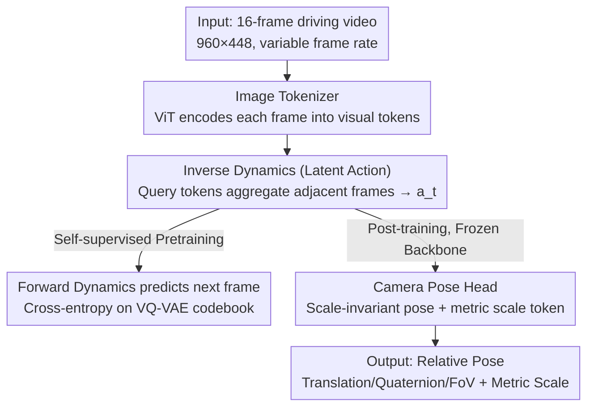

# LA-Pose: Latent Action Pretraining Meets Pose Estimation

**Conference**: CVPR 2026  
**Paper**: [CVF Open Access](https://openaccess.thecvf.com/content/CVPR2026/html/Wang_LA-Pose_Latent_Action_Pretraining_Meets_Pose_Estimation_CVPR_2026_paper.html)  
**Code**: None  
**Area**: Autonomous Driving / Camera Pose Estimation  
**Keywords**: Self-supervised pretraining, latent action, inverse dynamics, camera pose, ego-motion

## TL;DR
LA-Pose repurposes the Genie-style "inverse dynamics latent action"—originally used to drive world models or robotic policies—as input features for camera pose estimation. By performing self-supervised pretraining on 10 million unlabeled driving videos to learn latent actions, followed by post-training a lightweight pose head on a minimal amount of 3D-annotated data, the method achieves over 10% higher pose accuracy than feed-forward SOTAs like VGGT on Waymo/PandaSet while using orders of magnitude less labeled data.

## Background & Motivation

**Background**: Feed-forward 3D reconstruction methods (DUSt3R, VGGT, Rig3R, MapAnything) are advancing rapidly, enabling direct prediction of structure and camera pose in a single forward pass with high precision. However, they rely heavily on 3D annotations—ground truth poses derived from SfM, LiDAR, or simulation engines—which require expensive hardware and precise calibration.

**Limitations of Prior Work**: High-quality 3D annotations are only available in a few carefully curated datasets, which are tiny compared to the vast amount of unlabeled driving videos on the internet. Supervised data has become a bottleneck, yet "self-supervised pretraining"—the paradigm that revolutionized NLP, image, and video fields—is rarely applied to geometry-aware tasks like camera pose estimation.

**Key Challenge**: There is a trade-off between using large-scale unlabeled videos without pose signals and using annotated data that suffers from limited scale and distribution bias. Methods like VGGT are constrained by their training distributions (VGGT requires 64 A100s for 9 days) and often fail when generalizing to new scenes.

**Goal**: To efficiently utilize large-scale unlabeled driving videos for camera pose estimation while maintaining the simplicity of feed-forward testing, thereby reducing the dependency on expensive 3D annotations by orders of magnitude.

**Key Insight**: The authors observe that for vehicles, motion is the direct consequence of actions. "Latent actions" inferred from adjacent frames via inverse dynamics (as seen in Genie) essentially encode inter-frame motion changes, representing a compressed form of pose. Since latent actions naturally characterize ego-motion, they can be directly used as features for pose estimation.

**Core Idea**: Instead of using latent actions for their "intended" purpose (action conditioning for world models or action proxies for robotics), they are repurposed as motion-centric features for pose estimation. This involves self-supervised pretraining to learn latent actions followed by post-training a pose head with limited labels, effectively replacing expensive 3D supervision with pretraining.

## Method

### Overall Architecture
LA-Pose is a two-stage framework. **Stage 1 (Latent Action Pretraining)**: Based on the Genie architecture (simplified for pose tasks), an inverse dynamics model learns latent actions from adjacent video frames, while a forward dynamics model uses these latent actions to predict tokens of the next frame. This process is fully self-supervised and trained on 10.2 million unlabeled driving video clips. **Stage 2 (Camera Pose Post-training)**: The forward dynamics model is discarded, and a lightweight pose head is attached to the pretrained inverse dynamics encoder. This head is post-trained on a small amount of data with high-quality 3D ground truth to predict relative camera pose (translation, quaternion rotation, field of view) and metric scale. Crucially, the inverse dynamics backbone is **frozen** during post-training (rather than fine-tuned) to preserve the learned motion priors and ensure better generalization.

### Key Designs

**1. Latent Action Bottleneck: Compressing dimensions to force "Motion-only, No Appearance" encoding**

The inverse dynamics model adds a key modification to Genie's ST-Transformer causal encoder: it introduces 1536-dimensional learnable query tokens, replicated for each frame as $\{q_1,\dots,q_{T-1}\}$. The output represents latent actions $\{a_1,\dots,a_{T-1}\}$, where each query token aggregates information from two adjacent frames. More importantly, it adds a pair of three-layer MLPs at the bottleneck to compress the latent action dimension from 1536 down to **50** before decompressing it back to 1536. While this compression seems lossy, it is vital for pose quality. A high-dimensional latent space (1536-D) results in lower reconstruction loss during pretraining because it directly encodes dense motion flow and appearance cues, making forward prediction easier. However, this causes **information leakage**—appearance features mix with latent actions, weakening the abstraction of ego-motion and hurting downstream pose accuracy. A low-dimensional space (50-D) results in higher pretraining loss but forces compact, motion-centric representations that transfer more effectively to pose estimation. This is a vivid counter-example where "performing too well on the proxy task" is actually harmful.

**2. Self-supervised Inverse-Forward Dynamics Pretraining: Learning pose priors from unlabeled videos**

To address the bottleneck of 3D annotations, the authors use a forward dynamics model with an ST-Transformer to predict future frames using latent actions, with two simplifications: the final MLP head is replaced by 4 lightweight transformer blocks acting on the decoder states, and the prediction target is a **pretrained VQ-VAE codebook**. The ground truth future frame is encoded into discrete codes by a frozen VQ-VAE encoder, and the model predicts logits over the same codebook. The pretraining loss is the cross-entropy between the predicted logits and the ground truth code indices. This allows the entire pretraining phase to use only raw videos without any pose ground truth, enabling motion supervision at scale (10.2M driving clips covering diverse environments, traffic densities, and weather).

**3. Scale-decoupled Pose Head: Separating metric scale from scale-invariant representations**

Latent actions encode relative motion, but the "metric scale" in relative pose is difficult to learn. The authors adopt a scale-decoupling approach: ground truth metric motion is converted into relative motion $\{t_1,\dots,t_T\}$, and the mean translation magnitude $s=\mathrm{mean}_i(\|t_i\|_2)$ is used as the metric scale. The scale-invariant relative motion $\tilde{t}_i=t_i/\max(s,\epsilon)$ (where $\epsilon=1$ for stability) is then derived. Since the frame rate varies during training (1–4fps jitter), normalization is performed per given frame rate. The pose head introduces a separate learnable metric scale token, which, along with 15 latent action tokens, passes through a non-causal self-attention transformer to aggregate information across the sequence. Two independent MLP heads decode the output: one produces a 7D relative pose (3D translation + 4D quaternion) and 1D field of view (FoV), while the other produces a scalar metric scale (with exponential activation for positivity). Post-training loss is the L1 loss on normalized translation, quaternions, FoV, and log-scale.

### Loss & Training
Pretraining loss is the cross-entropy between predicted logits and VQ-VAE code indices. Post-training loss consists of four L1 terms (normalized translation, quaternion rotation, FoV, and log-space metric scale). The inverse dynamics component can be frozen or fine-tuned (default is frozen). Pretraining was conducted on 32 H100 GPUs with a global batch size of 64 using a cosine scheduler for 160k steps (~4 days). Post-training used a small amount of high-quality annotated data from Waymo/nuScenes/Argoverse (750/850/700 scenes, respectively) on 8 H100s for 100k steps (~2 days). Training samples consist of 16 consecutive frames from a single front camera, with frame rates randomly jittered between 1–4fps to learn both short- and long-term motion dynamics. The authors emphasize that the computational cost is significantly lower than competitors (e.g., VGGT requires 64 A100s for 9 days).

## Key Experimental Results

### Main Results
Evaluations were performed on Waymo Open (in-domain) and PandaSet (zero-shot/unseen). Metrics include: **AUC@5** (Area Under the Curve for relative rotation and translation angular error at a 5° threshold, higher is better); **ATE-S** (Scale-invariant Alignment Trajectory Error RMSE, calculated after normalizing the trajectory to unit mean magnitude and global SE(3) alignment, lower is better); and **ATE-M** (Metric ATE without normalization, reported only for baselines providing metric prediction, lower is better). Comparisons were made against Rig3R, VGGT, and MapAnything—all of which use substantially more supervised 3D data than LA-Pose.

| Dataset | Method | AUC@5↑ (%) | ATE-S↓ (×10⁻²) | ATE-M↓ (m) |
|--------|------|------------|-----------------|-------------|
| Waymo | Rig3R | 77.9 | 3.17 | - |
| Waymo | VGGT | 74.8 | 1.43 | - |
| Waymo | MapAnything | 65.0 | 3.00 | 4.74 |
| Waymo | **LA-Pose** | **91.4** | **1.20** | **0.88** |
| PandaSet (Unseen) | VGGT | 75.0 | **0.99** | - |
| PandaSet (Unseen) | MapAnything | 62.4 | 2.75 | 7.28 |
| PandaSet (Unseen) | **LA-Pose** | **86.3** | 1.13 | **0.86** |

On Waymo, LA-Pose achieved an AUC@5 of 91.4%, significantly outperforming all baselines. On the zero-shot PandaSet, it maintained a strong generalization of 86.3% (with an ATE-S of 1.13, close to VGGT's 0.99). It surpassed recent feed-forward methods by over 10% in pose accuracy on both benchmarks. Distribution analysis of AUC@5 also shows that LA-Pose not only has a higher mean but also significantly lower variance; most samples approach perfect accuracy, while VGGT has a long tail of low scores. This suggests LA-Pose is more stable and reliable across diverse scenes. Even on difficult samples involving rain, night, fog, or sharp turns, LA-Pose produces stable and geometrically coherent trajectories.

### Ablation Study

| Dimension | Configuration | Key Metric | Conclusion |
|----------|------|----------|------|
| Latent Dim (Tab. 2, Waymo) | 50-D | Pretrain loss @200k: 1.67; AUC@5: 85.4; ATE-M: **1.62** | Compression promotes motion-centric reps |
| Latent Dim | 1536-D | Pretrain loss @200k: **1.15**; AUC@5: 86.5; ATE-M: 1.94 | Better reconstruction but leaks info, worse ATE-M |
| Frozen vs. FT Backbone (Fig. 5) | Frozen (Default) | Waymo: On par with FT; PandaSet: Much better | Freezing preserves motion priors for generalization |
| Frozen vs. FT | Fine-tuned | Zero-shot PandaSet: Significant degradation | FT overfits to post-training distribution |
| Frame Rate (Tab. 3, 4.0fps) | LA-Pose / VGGT | AUC@5: **93.4** / 74.1; ATE-S: **0.87** / 1.03 | Consistent lead over VGGT across rates |
| Frame Rate (1.0fps) | LA-Pose / VGGT | AUC@5: **85.7** / 74.6; ATE-S: **1.16** / 1.43 | High accuracy even at low frame rates |

### Key Findings
- **Compression is crucial and counter-intuitive**: The 50-D latent action has a higher pretraining loss but yields nearly identical AUC@5 and significantly better ATE-M after freezing the backbone. "Good reconstruction" does not equal "good motion representation"; strong compression enhances motion awareness and metric scale consistency.
- **Frozen > Fine-tuned (for Generalization)**: Performance is comparable on in-domain Waymo, but fine-tuning leads to clear degradation on zero-shot PandaSet. This proves that pretrained motion priors are precious and should not be distorted by small post-training datasets.
- **Robustness emerges from pretraining, not biased sampling**: The post-training data consists mostly of simple straight-line sequences with no specific sampling for rare cases. However, the model remains stable in rain, night, fog, and sharp turns. This robustness emerges naturally from large-scale self-supervised pretraining.

## Highlights & Insights
- **The "Aha!" moment is the repurpose perspective**: Latent actions were intended as action conditions for world models or robotic policies; the authors use them as geometric features because "vehicle motion = direct consequence of action." This makes latent actions a natural compressed representation of ego-pose. Repurposing existing self-supervised representations for new tasks is a clever strategy.
- **The bottleneck dimension as a regularization knob** is noteworthy: Using a 50-D MLP bottleneck to strip away appearance and force motion-centric representations turns the "proxy task trade-off" into a controllable design parameter.
- **Freezing the backbone for generalization** is a finding applicable to any "large-scale pretraining + small-data post-training" paradigm. Small annotated datasets easily bias general priors; freezing is a simple, effective way to retain generalization.
- The recipe of "self-supervised pretraining on unlabeled video → post-training a pose head on small data" could be extended beyond driving to general embodied videos (multi-agent, diverse environments, various camera rigs) to learn cross-domain transferable geometric priors.

## Limitations & Future Work
- The authors acknowledge that **accuracy drops for rare motions (e.g., reversing)**; these scenarios are under-represented in the supervised post-training data, leading to unstable poses (though the pretrained backbone still provides partially coherent trajectories).
- ⚠️ Pretraining used 10.2 million **internal/proprietary** driving videos, making it non-reproducible. Furthermore, evaluations were limited to two driving benchmarks and a single front camera; effectiveness for multi-camera or non-driving domains has not been directly verified.
- Metric scale still depends on LiDAR calibration ground truth during post-training; pure self-supervision cannot yet achieve absolute scale. ATE-M on zero-shot PandaSet is good but based on a limited sample size (185 test samples).
- Future directions: Expanding pretraining data to cover rare motions like reversing; extending the method to in-the-wild embodied videos for universal geometric priors; and exploring latent actions for multi-camera and multi-modal setups.

## Related Work & Insights
- **vs. Feed-forward 3D Reconstruction (DUSt3R / VGGT / Rig3R / MapAnything)**: These rely on massive supervised 3D labels to regress pose/point clouds, making them computationally expensive and distribution-bound. LA-Pose is equally simple during inference but replaces expensive supervision with large-scale self-supervised pretraining, achieving higher accuracy with orders of magnitude less labeling.
- **vs. Genie and Robotic Successors (Latent actions for policy/world models)**: Genie uses latent actions as action conditions for controllable video generation; robotics works use them as action proxies. LA-Pose does neither generation nor RL; it treats latent actions as a structured self-supervised ego-motion representation for pose estimation.
- **vs. Self-supervised Pose/Photometric Methods**: Early self-supervised pose works were mostly designed for view synthesis, emphasizing photometric reconstruction accuracy without large-scale pretraining. LA-Pose introduces predictive self-supervision to camera pose, learning geometry-aware representations that bridge the gap between temporal modeling and precise ego-pose.

## Rating
- Novelty: ⭐⭐⭐⭐⭐ First to prove self-supervised inverse dynamics is effective for pose estimation; the repurposing of latent actions is highly original.
- Experimental Thoroughness: ⭐⭐⭐⭐ Two driving benchmarks plus solid ablations on dimensions/freezing/frame rates. However, it is limited to the driving domain and single cameras, and the pretraining data is non-reproducible.
- Writing Quality: ⭐⭐⭐⭐ Clear motivational logic; the analysis of "counter-intuitive compression improving pose" is persuasive.
- Value: ⭐⭐⭐⭐ Successfully replaces the 3D annotation bottleneck with unlabeled video, offering clear inspiration for scalable geometric perception, though absolute scale still relies on calibration ground truth.

<!-- RELATED:START -->

## Related Papers

- [\[CVPR 2026\] PTC-Depth: Pose-Refined Monocular Depth Estimation with Temporal Consistency](ptc-depth_pose-refined_monocular_depth_estimation_with_temporal_consistency.md)
- [\[CVPR 2026\] EMDUL: Expanding mmWave Datasets for Human Pose Estimation with Unlabeled Data and LiDAR Datasets](expanding_mmwave_datasets_for_human_pose_estimation_with_unlabeled_data_and_lida.md)
- [\[CVPR 2026\] Towards Balanced Multi-Modal Learning in 3D Human Pose Estimation](towards_balanced_multi-modal_learning_in_3d_human_pose_estimation.md)
- [\[CVPR 2026\] VIRD: View-Invariant Representation through Dual-Axis Transformation for Cross-View Pose Estimation](vird_view-invariant_representation_through_dual-axis_transformation_for_cross-vi.md)
- [\[CVPR 2026\] SG-NLF: Spectral-Geometric Neural Fields for Pose-Free LiDAR View Synthesis](sgnlf_spectralgeometric_neural_fields_for_posefre.md)

<!-- RELATED:END -->
