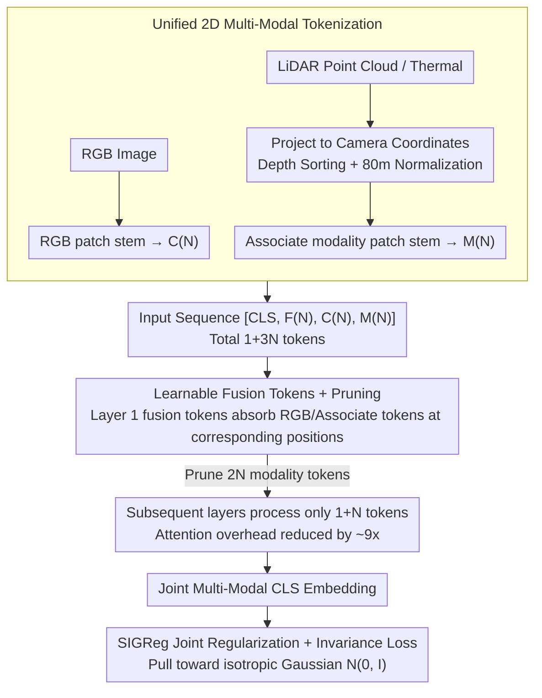

# Le MuMo JEPA: Multi-Modal Self-Supervised Representation Learning with Learnable Fusion Tokens

**Conference**: CVPR 2026  
**arXiv**: [2603.24327](https://arxiv.org/abs/2603.24327)  
**Code**: None  
**Area**: Autonomous Driving / Multi-Modal Self-Supervised Learning  
**Keywords**: Multi-modal self-supervised, JEPA, fusion tokens, latent bottleneck, RGB-LiDAR fusion

## TL;DR

This work extends the LeJEPA self-supervised framework to multi-modal settings. It introduces learnable fusion tokens as Perceiver-style latent bottlenecks within a shared Transformer to efficiently fuse RGB and associate modalities (LiDAR depth/thermal). By employing a pruning strategy, it reduces attention overhead by approximately 9x. On the Waymo dataset, it achieves a CenterNet 3D detection mAP XY of 23.6 (a 4.3 gain over RGB-only LeJEPA) and reduces Depth MAE from 4.704 to 2.860.

## Background & Motivation

**Background**: Autonomous driving perception systems rely on multiple sensors (cameras, LiDAR, etc.). However, mainstream multi-modal perception models (e.g., BEVFusion, TransFusion) are predominantly trained using full supervision, requiring extensive 3D annotations. While self-supervised learning (BYOL, DINO, MAE, I-JEPA, etc.) has achieved excellent results in single modalities, most current methods handle only one modality.

**Limitations of Prior Work**: (1) Single-modality self-supervision ignores complementary signals from multiple sensors—RGB provides texture and color, while LiDAR provides geometric depth; learning them separately fails to exploit these synergies. (2) Existing multi-modal self-supervised methods (e.g., ImageBind using contrastive learning, MultiMAE using masked reconstruction) do not significantly outperform single-modality baselines when trained strictly from scratch. (3) Weak late fusion lacks expressiveness, while the quadratic complexity of all-to-all attention for all tokens is prohibitively high.

**Key Challenge**: Multi-modal fusion requires dense cross-modal interactions to capture complementary information, but the computational cost of full cross-modal attention between tokens from two modalities is too high (doubling the tokens results in approximately 4x the attention overhead).

**Key Insight**: The SIGReg regularization in the JEPA framework provides a modality-agnostic shared objective—pulling embeddings from both modalities toward an isotropic Gaussian distribution $\mathcal{N}(0, \mathbf{I})$, without requiring negative samples for paired contrastive mining.

**Core Idea**: Introducing learnable fusion tokens as spatial memory buffers. By pruning modality-specific tokens after the first attention layer, the model is forced to compress cross-modal evidence into the fusion token grid early through an information bottleneck, while simultaneously drastically reducing the computational load of subsequent layers.

## Method

### Overall Architecture

This paper addresses the following: in autonomous driving, cameras and LiDAR provide complementary signals, but single-modality self-supervision fails to capture cross-modal information. Conversely, feeding all tokens from both modalities into a Transformer for all-to-all attention results in a roughly 4-fold increase in computational cost due to the doubled sequence length. The proposed solution involves a shared ViT-Small/16 encoder that incorporates an additional set of "fusion tokens" acting as intermediaries for cross-modal information. Information is first compressed into these tokens, followed by the pruning of the original modality tokens.

The pipeline operates as follows: LiDAR depth is projected into the camera coordinate system and aligned with RGB as a 2D depth map. Each modality then passes through an independent patch stem for tokenization. The encoder input is a sequence $[\text{CLS}(1), \mathbf{F}(N), \mathbf{C}(N), \mathbf{M}(N)]$, where $\mathbf{F}$ represents fusion tokens, $\mathbf{C}$ represents RGB tokens, and $\mathbf{M}$ represents associated modality tokens (LiDAR depth or thermal infrared). The sequence consists of $1+3N=589$ tokens for $N=196$. After the first attention layer allows the fusion tokens to absorb information from both modalities, the model prunes all $2N$ modality tokens. Subsequent layers operate only on the remaining $1+N$ tokens. The training objective combines the LeJEPA invariance loss with SIGReg regularization applied to the joint multi-modal CLS embedding.

### Key Designs

**1. Unified 2D Multi-Modal Tokenization: No separate 3D backbones**  
Heterogeneous sensor data comes in various formats (LiDAR is sparse point clouds, thermal is 2D imagery). Assigning a separate backbone to each would lead to complex, non-reusable architectures. Here, data is unified and rendered onto a shared 2D token grid: LiDAR point clouds are projected to the camera frame using depth sorting (near objects occlude far ones) and normalized to a maximum of 80m to create an aligned depth map. Thermal images are resized to the same spatial grid. Each modality passes through an independent patch stem, with modality embeddings $\mathbf{e}_{cam}, \mathbf{e}_{mod}$ added to distinguish sources. This approach sacrifices native 3D structures but enables a unified dense ViT architecture, allowing the framework to switch from RGB-LiDAR to RGB-Thermal simply by swapping the patch stem.

**2. Learnable Fusion Tokens + Pruning: Information bottleneck via a single attention layer**  
After tokenization, tokens from both modalities enter the same sequence. Standard cross-modal attention results in $\mathcal{O}((1+3N)^2)$ complexity, where doubling the tokens significantly increases cost. Weak late fusion, on the other hand, is insufficiently expressive. The compromise here is to create $N$ learnable fusion tokens (matching the number of patches). In the first layer, each fusion token $\mathbf{f}_i$ attends only to its spatially corresponding RGB patch $\mathbf{c}_i$ and associated modality patch $\mathbf{m}_i$ to aggregate cross-modal evidence. After this layer, all $2N$ modality tokens are pruned. Subsequent layers process only $1+N$ tokens, reducing attention complexity from $\mathcal{O}((1+3N)^2)$ to $\mathcal{O}((1+N)^2)$, an approx. 9x reduction (for $N=196$, 589 tokens contract to 197). This pruning forces the model to compress information into the fusion tokens early, creating an explicit information bottleneck.

**3. SIGReg Joint Multi-Modal Regularization: Pulling modalities toward the same Gaussian**  
After pruning, only fusion tokens continue to aggregate in the encoder. The training objective is applied to the resulting joint multi-modal CLS embedding. To prevent representation collapse without the complexity of negative mining (ImageBind) or teacher-student networks, SIGReg is employed. It passes the joint multi-modal CLS embedding through a projection head and uses feature function matching via random projections to pull the empirical embedding distribution toward an isotropic Gaussian $\mathcal{N}(0, \mathbf{I})$, with a complexity of just $\mathcal{O}(BK(T+d))$. This directly suppresses modality-specific anisotropy (i.e., the tendency for RGB and LiDAR to cluster separately) more effectively than methods like VICReg.

### Loss & Training

$$\mathcal{L}_{\text{MM}} = \lambda \cdot \mathcal{L}_{\text{SIGReg}}(\mathbf{Z}^{(\text{joint})}) + (1 - \lambda) \cdot \mathcal{L}_{\text{inv}}^{(\text{joint})}$$

where $\mathcal{L}_{\text{inv}}^{(\text{joint})}$ represents the mean squared invariance loss, which brings global and local fusion crop embeddings closer together. Training utilizes multi-crop augmentation: global crops at $224 \times 224$ (scale $[0.4, 1.0]$) and local crops at $96 \times 96$ (scale $[0.05, 0.4]$). For Waymo and nuScenes, models undergo 5 epochs of SSL followed by 5 epochs of probe training.

## Key Experimental Results

### Main Results (Waymo, from-scratch)

| Method | Training Data | mAP XY ↑ | Depth MAE ↓ | Seg. mIoU ↑ |
|------|---------|----------|-------------|-------------|
| LeJEPA | RGB | 19.3 | 4.704 | 0.261 |
| DINOv3 | RGB | 15.2 | 5.314 | 0.239 |
| LiDAR-only | Depth | 15.4 | 2.982 | 0.151 |
| MultiMAE-SS | RGB+Depth | 13.5 | 4.441 | 0.221 |
| ImageBind | RGB+Depth | 13.4 | 4.309 | 0.243 |
| **Ours (Le MuMo JEPA)** | **RGB+Depth** | **23.6** | **2.860** | **0.275** |

### Ablation Study (Waymo Fusion Strategy Comparison)

| Configuration | mAP XY ↑ | Depth MAE ↓ | Seg. mIoU ↑ |
|------|----------|-------------|-------------|
| Early Fusion RGBD | 18.1 | 4.767 | 0.248 |
| Late Fusion | 18.7 | 4.802 | 0.251 |
| FT-Pruned + VICReg | 22.8 | 2.911 | 0.248 |
| FT-Persistent + SIGReg | 23.1 | 2.846 | 0.271 |
| **Ours (Default)** | **23.6** | **2.860** | **0.275** |

### Key Findings
- **Ours** outperforms the strongest single-modality baseline (LeJEPA 19.3) by 4.3 in mAP XY and reduces Depth MAE from 4.704 to 2.860.
- ImageBind and MultiMAE trained from scratch on Waymo underperform even compared to single-modality LeJEPA, indicating that contrastive and reconstruction objectives have higher data requirements in small-scale from-scratch settings.
- Pruned fusion is more efficient than persistent routing while achieving better precision-efficiency trade-offs; the information bottleneck forces early cross-modal compression.
- SIGReg outperforms VICReg on joint multi-modal CLS embeddings as the isotropic Gaussian target more directly suppresses modality-specific anisotropy.
- **Ours** achieves state-of-the-art results on nuScenes (mAP XY 9.52 vs. 6.95 for the runner-up) and demonstrates superior cross-domain transfer on FLIR RGB-Thermal (Waymo→FLIR mAP50 1.56 vs. ImageBind 0.72).

## Highlights & Insights
- **Exquisite Information Bottleneck**: Pruning modality tokens after only one layer of fusion absorption forces the model to achieve better representation compression through computational constraints.
- **SIGReg as a Modality Binder**: Pulling different modalities toward the same data-independent target distribution is more natural than pairwise contrastive learning, requiring no negative samples or teacher networks.
- **Unified 2D Avoids 3D Backbones**: Projecting LiDAR to 2D sacrifices some native 3D structure but gain structural uniformity and flexibility.
- **Fair From-Scratch Comparison**: Training all methods from zero with identical data and compute budgets eliminates the confounding factor of pre-trained weights.

## Limitations & Future Work
- Projecting LiDAR to 2D discards native 3D structural information (e.g., occlusion relations, point cloud density variations), potentially limiting performance in complex 3D reasoning.
- Evaluation is limited to ViT-Small/16; larger models (ViT-Base/Large) might exhibit different fusion dynamics.
- The number of training epochs is very short (5 epochs) compared to standard SSL (300+ epochs); convergence may not be fully achieved.
- After pruning, cross-modality interaction relies entirely on a single attention layer, which may lose complex relationships that require multiple layers.

## Related Work & Insights
- **vs ImageBind**: ImageBind uses contrastive learning for alignment, but from-scratch mAP XY on Waymo is only 13.4. **Ours** reaches 23.6, suggesting the SIGReg + fusion token approach is superior for small data.
- **vs MultiMAE**: MultiMAE's masked reconstruction performs poorly from scratch (13.5-13.7); even with multitask supervision, it remains inferior to **Ours**.
- **vs BEVFusion**: BEVFusion is fully supervised. **Ours** is entirely self-supervised (direct numerical comparison is not feasible).
- **Insight**: The key to self-supervised multi-modal fusion lies not in aligning two modalities, but in information compression within a shared representation space—bottleneck design is more critical than fusion granularity.

## Rating
- **Novelty**: ⭐⭐⭐⭐ The extension of multi-modal JEPA with fusion tokens and SIGReg is novel; the pruning strategy is clever.
- **Experimental Thoroughness**: ⭐⭐⭐⭐ Three datasets, multiple baselines, detailed ablations; however, limited by short training epochs and small model size.
- **Writing Quality**: ⭐⭐⭐⭐ Clear methodology and transparent experimental settings.
- **Value**: ⭐⭐⭐⭐ Provides an efficient fusion paradigm for multi-modal SSL, though its value in large-scale deployment remains to be verified.

<!-- RELATED:START -->

## Related Papers

- [\[CVPR 2026\] RPGFusion: 4D Radar Prior-Guided Multi-Modal Fusion for 3D Detection](rpgfusion_4d_radar_prior-guided_multi-modal_fusion_for_3d_detection.md)
- [\[AAAI 2026\] Dual-branch Spatial-Temporal Self-supervised Representation for Enhanced Road Network Learning](../../AAAI2026/autonomous_driving/dual-branch_spatial-temporal_self-supervised_representation_for_enhanced_road_ne.md)
- [\[CVPR 2026\] CCF: Complementary Collaborative Fusion for Domain Generalized Multi-Modal 3D Object Detection](ccf_complementary_collaborative_fusion_for_domain_generalized_multi-modal_3d_obj.md)
- [\[CVPR 2026\] TerraSeg: Self-Supervised Ground Segmentation for Any LiDAR](terraseg_self-supervised_ground_segmentation_for_any_lidar.md)
- [\[CVPR 2026\] Towards Balanced Multi-Modal Learning in 3D Human Pose Estimation](towards_balanced_multi-modal_learning_in_3d_human_pose_estimation.md)

<!-- RELATED:END -->
