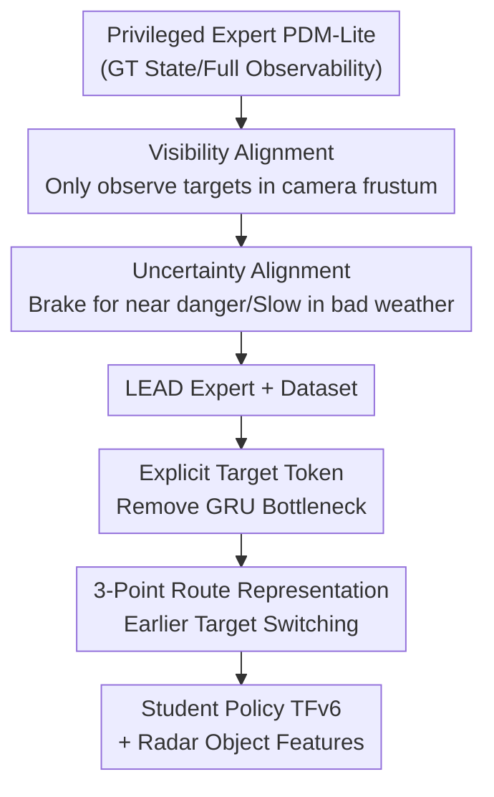

# LEAD: Minimizing Learner-Expert Asymmetry in End-to-End Driving

**Conference**: CVPR 2026  
**arXiv**: [2512.20563](https://arxiv.org/abs/2512.20563)  
**Code**: https://github.com/kesai-labs/lead (Available)  
**Area**: Autonomous Driving / Robotics / Imitation Learning  
**Keywords**: End-to-end Driving, Imitation Learning, Privileged Expert, CARLA, Closed-loop Evaluation

## TL;DR
This paper identifies that the root cause of the "student failing to learn the privileged expert" in CARLA is not insufficient model capacity, but rather the expert's use of privileged information that is invisible or unmeasurable for the student, combined with sparse navigation intent. By constraining the expert's perception and decision-making to the student's observable range (LEAD expert + dataset) and restructuring the target point injection in the student policy (TFv6), this work achieves 95 DS on Bench2Drive and more than doubles previous SOTA performance on Longest6 v2 / Town13.

## Background & Motivation
**Background**: The dominant paradigm for CARLA closed-loop driving is "Learning by Cheating" (LBC) two-stage imitation learning—first creating a rule-based/RL privileged expert using ground-truth (GT) states (precise maps, velocities/accelerations of other vehicles, global 3D boxes), and then training a student policy using only camera/LiDAR to mimic the expert's actions. For years, it was assumed that "a stronger expert leads to a stronger student," focusing efforts on scaling expert performance and model sizes.

**Limitations of Prior Work**: Student closed-loop performance has long plateaued at levels significantly lower than experts. The authors observe two long-ignored issues: ① The expert utilizes vast amounts of information that the student cannot access or accurately estimate, making its demonstrations "unlearnable" for the student; ② During testing, the student relies only on a **single target point** to express "where to drive," making the intent severely under-determined and causing the model to degenerate into "mindlessly steering toward the target point."

**Key Challenge**: The expert is optimal under **fully observable, zero-noise** states, but the same sequence of actions becomes unlearnable and dangerous when imitated by a student with **partial observability and high uncertainty**—this is "learner-expert asymmetry." Previous attempts either jointly trained differentiable experts (impractical for rule-based, non-differentiable driving experts) or simply increased navigation signal density (which prior work showed yielded minimal gains).

**Goal**: To decompose and eliminate this asymmetry into three actionable categories—visibility, uncertainty, and intent—and verify that eliminating them directly improves closed-loop performance more effectively than simply changing model architectures.

**Key Insight**: Instead of aiming to "maximize expert performance," redesign the expert with the goal of "making demonstrations easier for the student to learn." Simultaneously, the paper finds that target point bias (where the policy treats the target as a correction signal and steers sharply when off-track) persists even with strong scene representations, rooted in intent under-specification and late target point injection.

**Core Idea**: "Degrade" the expert's privileged information to the student's observable level (creating the LEAD expert and dataset) and transition the student's navigation conditioning from "single-point, late-stage decoder injection" to "three-point, early-stage encoder injection" to align imitation supervision with real-world student observations.

## Method

### Overall Architecture
The improvement is split into two alignment tracks within the LBC framework: **first aligning the supervision provided by the expert (state alignment), then aligning how the student processes intent (intent alignment)**. The baseline is the current Longest6 v2 SOTA, TransFuser++ (referred to as TFv5)—an end-to-end policy that uses self-attention to fuse camera+LiDAR into BEV scene tokens and cross-attention with route queries for lateral control. Under a controlled setting with **constant model architecture and data scale**, the authors incrementally converge expert/intent information to the student's visible range, resulting in the LEAD expert+dataset and the TFv6 student policy.

The pipeline from top to bottom is: Original privileged expert PDM-Lite → Constrained by visibility/uncertainty to become LEAD expert → Collect LEAD dataset → Train student policy; Student side changes target points from late GRU injection to explicit encoder tokens and expands from one point to three → TFv6.

### Key Designs

**1. Visibility Alignment: Cropping the Expert's "God's View" to the Camera Frustum**

The pain point is that PDM-Lite uses GT 3D boxes to predict collisions and reacts to **actors invisible to the student camera** (e.g., pedestrians behind the car, occluded vehicles). Such "non-causal" braking appears as unlearnable noise to the student. LEAD constrains expert planning inputs to signals coverable by student sensors: dynamic actors are kept only if they fall within the camera field of view (considering size, weather, and day/night), and traffic lights are only considered if they are in the camera frustum. For speed limit signs, since limits are not given directly and signs are only intermittently visible, the expert's max target speed is set to the minimum of "sign limit" and "typical speed of surrounding traffic"—the latter being inferable from local context. This ensures the expert no longer acts based on things the student cannot see, making demonstrations causal and learnable.

**2. Uncertainty Alignment: Making the Expert Maintain Safety Margins like a "Noisy Estimator"**

The expert uses zero-noise velocity/acceleration for precise collision prediction, allowing it to drive with minimal safety margins. However, students cannot estimate these quantities as precisely from raw sensors, leading to dangerous actions when mimicking. LEAD injects "conservatism" into the expert's braking logic: in addition to braking for predicted trajectory collisions, the expert now **brakes whenever an observable hazard is nearby** (removing reliance on precise motion estimation). It also actively reduces speeds in low-visibility conditions (night, heavy rain) to reflect decreased perception confidence and **enlarges** collision detection boxes for oncoming traffic at unprotected intersections, using spatial margins instead of precise motion prediction for safety. Notably, this doesn't hurt expert capacity—Table 5 shows LEAD expert performs on par with PDM-Lite on B2D/Longest6 v2.

**3. Intent Alignment: Replacing Late Single-Point Injection with Early 3-Point Tokenization**

The student relies on a single target point for intent, causing two failure modes: ① Collapse of trajectory prediction when the target is far or abnormally positioned (e.g., behind the car in a roundabout); ② "Target point fixation" where the policy ignores hazards and steers sharply toward a target in an adjacent lane. The authors prove this target point bias persists despite strong scene representations, citing two causes: **intent under-specification** (one point cannot disambiguate multi-step maneuvers like lane changes) and **late injection** (geometric coordinates enter late in the decoder, failing to interact with encoder scene features and instead becoming the dominant signal).

Two-step reconstruction: First, **remove the GRU refinement stage** and represent target points as **explicit tokens** alongside BEV tokens (normalized to $[-1,1]$ using training statistics). This allows target points to interact with scene features during encoding, mitigating the first failure mode (Table 2: +6 DS / +2 DS). Second, replace the single-point condition with a **compact 3-point route representation** (previous/current/future targets) and **reduce the switching distance threshold** for the current target. This allows future targets to take effect earlier and provides stronger supervision—for instance, when the current target is only 2-3 meters away and lacks long-range path information, the policy can rely on the future target (Table 3: +1.4 DS / +2 DS).

> ⚠️ **Why GRU is a bottleneck**: GRU was introduced to model temporal dependencies, but the planning query already integrates spatio-temporal context via stacked self/cross-attention, making GRU redundant. Positioned after a much more expressive Transformer decoder (6 layers × 256 dims), the GRU (single layer × 64 units) forms a shallow bottleneck: it fails to integrate context and instead amplifies the strongest signal (the target point). Furthermore, the GRU only conditions path/steering on the target, while target speed is predicted independently—if the car drifts off-track, the steering pulls toward the target while speed remains mismatched, causing errors under distribution shift.

### Loss & Training
No new losses are added; the model follows the imitation learning objectives of TransFuser++. For training scale: controlled ablations (Section 3) use 40 hours of driving data. Main experiments scale the LEAD dataset to **73 hours**, covering more towns/lighting/weather/sensor configs, trained on 4 L40S GPUs with mixed precision for about a week. On the sensor side, the student is given 4 radar units (75 points/unit/frame); a lightweight learning module pre-processes raw radar points into object-level features, which **bypass the sensor fusion encoder** and enter the planning decoder directly as additional context tokens. All results are averaged over 3 seeds.

## Key Experimental Results

### Controlled Ablations (Fixed Architecture/Data Scale)
Three controlled tables demonstrate the contribution of each alignment step (DS = Driving Score, higher is better):

| Improvement Step | Longest6 v2 DS | Bench2Drive DS | Description |
|------------------|----------------|----------------|-------------|
| TFv5 + PDM-Lite Dataset | 22.51 | 83.56 | Baseline |
| TFv5 + LEAD Dataset (State Alignment) | 34.05 | 84.94 | Longest6 +11.5 |
| TFv6 Remove GRU (Explicit Target Token) | 40.70 | 87.26 | Longest6 +6.7 / B2D +2.3 |
| TFv6 Use 3 Target Points (Intent Density) | 42.13 | 89.29 | Longest6 +1.4 / B2D +2.0 |

### Main Results: Closed-loop SOTA (Bench2Drive / Longest6 v2, Table 5)
Best model with expanded data/backbone/sensors (140° FOV Camera + LiDAR + Radar + RegNetY-032):

| Method | Backbone | B2D DS | B2D SR | Longest6 v2 DS | Longest6 v2 RC |
|--------|----------|--------|--------|----------------|----------------|
| HiP-AD | ResNet-50 | 86.8 | 69.1 | 7 | 56 |
| SimLingo | InternViT-300M | 85.1 | 67.2 | 22 | 70 |
| TFv5 | RegNetY-032 | 83.5 | 67.3 | 23 | 70 |
| **TFv6 (Ours)** | RegNetY-032 | **95.2** | **86.8** | **62** | 91 |
| PDM-Lite (Privileged Expert) | - | 97.0 | 92.3 | 73 | 100 |
| LEAD (Ours Expert) | - | 96.8 | 96.6 | 73 | 93 |

Note: The camera-only version of TFv6 (ResNet-34, 360°) achieved 91.6 DS on B2D and 43 DS on Longest6 v2, surpassing all student baselines. Compared to TFv5/SimLingo (CARLA Challenge 2024 winners), Longest6 v2 improved by +39 DS and +21 RC.

### Town13 Generalization (Unseen Town, Table 4, using NDS)

| Method | RC | DS | NDS | Setting |
|------|-----|-----|------|------|
| TFv5 | 50.20 | 1.08 | 2.12 | Val (Town13 unseen during training) |
| **TFv6** | 39.70 | **3.52** | **4.04** | Val |
| TFv6 | 71.82 | 5.28 | 14.65 | Train (For analysis only) |
| PDM-Lite | 83.40 | 36.30 | 58.50 | Val (Privileged Expert upper bound) |

### Real-world Open-loop Transfer (LTFv6, Table 6)
Removing LiDAR/Radar and replacing LiDAR with positional encoding (LTF setting):

| Method | NAVSIM v1 (PDMS) | NAVSIM v2 (EPDMS) | WOD-E2E (RFS) |
|------|------------------|-------------------|---------------|
| LTF | 83.8 | 23.1 | - |
| LTFv6 | 85.4 | 28.3 | 7.51 |
| + LEAD Pre-training | 86.4 | 31.4 | 7.76 |
| Expert (Upper Bound) | 94.5 | 51.3 | 8.10 |

### Key Findings
- **State alignment is the single most significant improvement**: Simply switching to the LEAD dataset (without architecture changes) yielded +11.5 DS on Longest6 v2, proving "expert design" is a long-ignored lever.
- **DS overestimates robustness on short routes**: TFv6's DS on B2D is nearly identical to the LEAD expert (diff ~2), but SR (Success Rate) is still ~10 points lower—because DS penalizes infractions near the end of a route lightly, while SR's "all-or-nothing" metric exposes the true gap.
- **Significant generalization gap remains**: TFv6 drops from 14.65 NDS on Town13 Train to 4.04 NDS on Town13 Val, highlighting that benchmarks that strictly exclude validation towns from training are the only meaningful ones.
- **Intent alignment has side effects**: Weakening target point bias reduces overall infractions but increases "Route Deviation"—as the model no longer attempts to yank the car back to the target point after drifting (Figure 2).

## Highlights & Insights
- **Redefining the problem**: Re-attributes "student failure" from "insufficient model capacity" to "unlearnable expert supervision/under-determined intent," providing a clean, transferable diagnostic framework for any teacher-student imitation learning setting.
- **Counter-intuitive "Degraded Expert" works**: While common intuition suggests making experts stronger, this paper deliberately removes expert privileges (cropping FOV, adding safety margins). Experiments prove the LEAD expert maintains high performance while becoming significantly more learnable.
- **Injection position > Signal density**: Previous attempts to increase navigation signal density failed; this paper highlights that "the method and position of injection are equally important"—moving the target point from late-stage GRU to an early-stage encoder token yielded +6 DS, a highly practical architectural trick.
- **Transferability**: Pre-training on LEAD synthetic data consistently improved results on three real-world open-loop benchmarks (NAVSIM/WOD-E2E), suggesting that "aligned synthetic supervision" can bridge sim-to-real distribution shifts.

## Limitations & Future Work
- **Unsolved generalization gap**: The NDS on Town13 Val (4.04) is far below Train (14.65) and the expert upper bound (58.50); cross-town generalization remains an open problem.
- **DS/SR gap indicates robustness issues**: While DS on B2D is near expert levels, the 10-point SR gap shows the policy is not yet stable in terms of "zero infractions for the whole duration."
- **Dependency on CARLA**: Long-range closed-loop evaluation is currently only viable in CARLA; conclusions are constrained by its scene distribution. The authors note that log-replay benchmarks cannot test long-range behavior, suggesting generative simulation as a path forward.
- **Real-world validation is open-loop only**: Gains on NAVSIM/WOD-E2E are relatively modest (e.g., 7.51→7.76 on WOD-E2E), and true closed-loop benefits in the real world remain to be verified.

## Related Work & Insights
- **vs PDM-Lite**: Built on top of PDM-Lite, but with the opposite goal—LEAD pursues "learnability" rather than pure driving performance, enabling a massive student performance leap without sacrificing expert capability.
- **vs TFv5 (TransFuser++)**: Updates the family architecture by removing the GRU bottleneck, tokenizing target points, using 3-point intent, and adding radar features, significantly outperforming TFv5 on all closed-loop benchmarks.
- **vs SimLingo / HiP-AD**: While SimLingo and HiP-AD are competitive on the short-route B2D benchmark, HiP-AD's performance craters to 7 DS on Longest6 v2—demonstrating that long-range closed-loop benchmarks are necessary to expose weaknesses masked by short routes.
- **vs Traditional State-Asymmetry methods**: Classic approaches rely on differentiable experts and online interaction to adapt student/expert, which is impractical for large-scale driving with rule-based experts. LEAD bypasses this by "directly constraining expert inputs and logic" in an offline, non-differentiable-friendly manner.

## Rating
- Novelty: ⭐⭐⭐⭐ Redefining "learning failure" and decomposing it into actionable asymmetries is fresh, though individual technical implementations (FOV cropping/margins/injection shift) are somewhat engineering-heavy.
- Experimental Thoroughness: ⭐⭐⭐⭐⭐ Comprehensive ablations + 5 benchmarks (including unseen generalization and real-world transfer) + 3-seed averages. Very solid.
- Writing Quality: ⭐⭐⭐⭐⭐ Clear problem diagnosis, specific analysis of failure modes, and well-structured control variables.
- Value: ⭐⭐⭐⭐⭐ Refreshes SOTA on multiple CARLA benchmarks (95 DS and doubling Longest6 scores), open-sources code/data, highly valuable for the end-to-end community.

<!-- RELATED:START -->

## Related Papers

- [\[CVPR 2026\] End-to-End Language-Action Model for Humanoid Whole Body Control](end-to-end_language-action_model_for_humanoid_whole_body_control.md)
- [\[CVPR 2026\] RoboTAG: End-to-end Robot Pose Estimation via Topological Alignment Graph](robotag_end-to-end_robot_pose_estimation_via_topological_alignment_graph.md)
- [\[NeurIPS 2025\] SutureBot: A Precision Framework & Benchmark for Autonomous End-to-End Suturing](../../NeurIPS2025/robotics/suturebot_a_precision_framework_benchmark_for_autonomous_end-to-end_suturing.md)
- [\[NeurIPS 2025\] AutoVLA: A Vision-Language-Action Model for End-to-End Autonomous Driving with Adaptive Reasoning and Reinforcement Fine-Tuning](../../NeurIPS2025/robotics/autovla_a_vision-language-action_model_for_end-to-end_autonomous_driving_with_ad.md)
- [\[CVPR 2025\] TinyNav: End-to-End TinyML for Real-Time Autonomous Navigation on Microcontrollers](../../CVPR2025/robotics/tinynav_end-to-end_tinyml_for_real-time_autonomous_navigation_on_microcontroller.md)

<!-- RELATED:END -->
