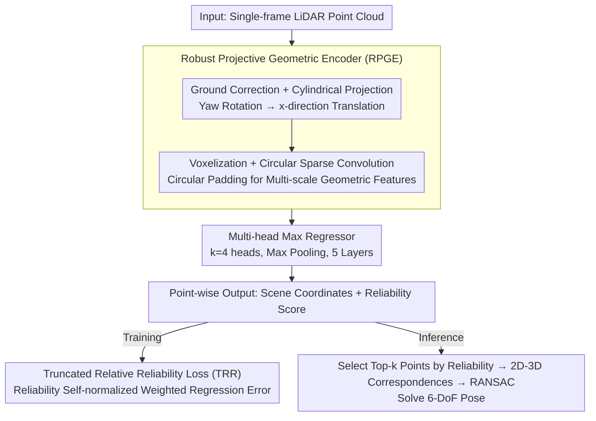

# LEADER: Learning Reliable Local-to-Global Correspondences for LiDAR Relocalization

**Conference**: CVPR 2026 Highlight  
**arXiv**: [2604.11355](https://arxiv.org/abs/2604.11355)  
**Code**: [https://github.com/JiansW/LEADER](https://github.com/JiansW/LEADER)  
**Area**: Autonomous Driving  
**Keywords**: LiDAR relocalization, Scene Coordinate Regression, Yaw-invariant, Reliability estimation, Point cloud

## TL;DR
LEADER achieves 24.1% and 73.9% relative reductions in positioning error on LiDAR relocalization tasks by utilizing a robust projective geometric encoder (yaw-invariant) and a truncated relative reliability loss (to suppress unreliable points).

## Background & Motivation

**Background**: LiDAR relocalization is critical in autonomous driving. Prevailing methods are divided into "Retrieval + Registration" (requiring dense point cloud map storage) and learning-based regression methods, which further split into Absolute Pose Regression (APR) and Scene Coordinate Regression (SCR).

**Limitations of Prior Work**: (1) Retrieval + Registration methods incur high storage and communication overhead; (2) APR accuracy is limited; (3) Existing SCR network architectures lack yaw invariance, leading to performance degradation during vehicle turns; (4) All predicted points are treated equally, where erroneous correspondences in degenerate regions (textureless areas, dynamic objects) severely interfere with pose estimation.

**Key Challenge**: Autonomous driving scenarios involve frequent yaw rotations and many points unsuitable for relocalization (dynamic objects, repetitive textures), yet existing methods can neither handle such rotations nor distinguish point reliability.

**Core Idea**: Design a yaw-invariant geometric encoder combined with point-level reliability quantization to jointly improve the robustness of SCR.

## Method

### Overall Architecture
LEADER follows the Scene Coordinate Regression (SCR) pipeline: given a frame of LiDAR point cloud, it directly regresses the 3D coordinates of each point in the global map coordinate system. These 2D-3D (point to scene coordinate) correspondences are then used with RANSAC to solve for the 6-DoF pose. It addresses two complications previously unhandled in SCR—yaw rotations caused by frequent vehicle turns and the presence of untrustworthy points (dynamic objects, ground, repetitive textures).

The pipeline first performs ground estimation and plane correction for alignment, followed by cylindrical projection to transform "rotation around the Z-axis" into a translation along one axis in the projection map. After projection, the data is voxelized, and multi-scale geometric features are extracted using circular sparse convolution. These features are fed into a Multi-head Max Regressor, where each point simultaneously outputs scene coordinates and a reliability score. Once coordinates are restored to the Cartesian system, the reliability scores weigh the loss during training and are used to select the most trustworthy points to drive RANSAC during inference.

### Key Designs

**1. Robust Projective Geometric Encoder (RPGE): Transforming "Yaw Rotation" into "Translation" Handled Naturally by Networks**

SCR networks inherently lacks rotation invariance; when the vehicle turns, the same scene appears as a completely different input to the network, causing accuracy to drop. RPGE performs cylindrical projection to map points $(x',y',z')$ to $(x^p = s\cdot\arctan2(y',x'),\ y^p=\sqrt{x'^2+y'^2},\ z^p=z')$—where yaw rotation around the Z-axis degenerates into a translation in the $x^p$ direction. To handle translations that wrap around the projection boundary, standard convolutions are replaced with circular sparse convolutions using circular padding to ensure continuous features along the yaw dimension. Crucially, the initial features fed to the network only include yaw-invariant quantities like distance, height, and reflection intensity, ensuring "rotation → translation" equivariance is established from the input stage.

**2. Multi-head Max Regressor: Robust Coordinate Prediction via Multi-head Max Pooling**

Features in degenerate regions are easily biased by a single projection direction, necessitating stronger expressiveness in the regression head. Here, 512-dimensional features are projected to $k\times512$ dimensions ($k=4$ heads), and the maximum value across heads is taken for each dimension. This allows multiple parallel transformations to compete, retaining only the strongest response. Stacking five such layers followed by a fully connected layer allows each point to output 3D scene coordinates and a reliability score. Multi-head max pooling makes regression less sensitive to local noise and provides a stable feature foundation for reliability estimation.

**3. Truncated Relative Reliability Loss (TRR): Teaching the Network to Actively Discard Untrustworthy Points**

SCR typically treats all predicted points equally, but coordinates for dynamic objects, ground, and weakly textured regions are essentially noise. TRR takes the reliability score $u_i$ from the regressor, scales it via arctan, and truncates it to form a set of self-normalized weights $w_i$. Reliable points receive high weights, while unreliable points are suppressed toward zero. The training objective aggregates raw regression errors based on these weights:

$$\mathcal{L}_{TRR} = \sum_i w_i\,\mathcal{L}_{raw,i}$$

Because the weights are self-normalized and truncated for low-reliability points, the network cannot simply minimize the loss by marking all points as unreliable. Instead, it must identify truly stable points. The resulting reliability maps align with intuition—stable structures like building facades receive high scores, while ground and vegetation receive low scores, all without requiring semantic labels.

### Loss & Training
The model is trained end-to-end using the Truncated Relative Reliability Loss (TRR), jointly optimizing coordinate regression and reliability estimation. During inference, the top-k points by reliability score are selected to construct 2D-3D correspondences for 6-DoF pose estimation via RANSAC.

## Key Experimental Results

### Main Results

| Dataset | Metric | Ours | Prev. SOTA | Gain |
|--------|------|--------|----------|---------|
| Oxford RobotCar | Position Error (m) | 0.63 | 0.83 (LightLoc) | -24.1% |
| NCLT | Position Error (m) | 0.19 | 0.72 (SGLoc→LiSA) | -73.9% |
| Oxford | Orientation Error (°) | 1.11 | 1.12 | -0.9% |

### Ablation Study

| Configuration | Oxford Pos. Error | NCLT Pos. Error | Description |
|------|--------------|-------------|------|
| Full LEADER | 0.63 | 0.19 | Full Model |
| w/o Circular Conv | Increase | Increase | Discontinuity at yaw boundaries |
| w/o TRR | Increase | Increase | Interference from unreliable points |
| w/o Proj. Trans. | Increase | Increase | Lack of yaw invariance |

### Key Findings
- Improvements are most significant on the NCLT dataset (73.9%), which contains more yaw variations and degenerate regions.
- Reliability scores learned by TRR align with intuition—stable structures like facades are high, while ground and vegetation are low.
- SCR methods generally outperform APR methods due to the explicit utilization of geometric constraints.

## Highlights & Insights
- **Cylindrical Projection + Circular Convolution**: Elegantly transforms the yaw rotation problem into a translation equivariance problem, which is computationally efficient and theoretically sound.
- **Self-learned Reliability**: The network automatically learns to distinguish reliable/unreliable regions without requiring manual annotation or semantic priors.

## Limitations & Future Work
- Processes only yaw rotation; pitch and roll variations are not explicitly modeled.
- Adaptive selection of the reliability threshold can be further improved.
- Future work could integrate semantic information to further enhance reliability estimation.

## Related Work & Insights
- **vs LiSA**: LiSA uses semantic priors to distinguish point contributions, while LEADER uses learned reliability scores, requiring no additional semantic labels.
- **vs RALoc**: RALoc also handles rotation but through different means; LEADER's projection-based approach is more natural.

## Rating
- Novelty: ⭐⭐⭐⭐ The combination of projective transformation and reliability loss is simple yet effective.
- Experimental Thoroughness: ⭐⭐⭐⭐⭐ Leads by a large margin on two authoritative datasets.
- Writing Quality: ⭐⭐⭐⭐ Methodological descriptions are clear.
- Value: ⭐⭐⭐⭐ highly practical for autonomous driving LiDAR localization.

<!-- RELATED:START -->

## Related Papers

- [\[ECCV 2024\] DVLO: Deep Visual-LiDAR Odometry with Local-to-Global Feature Fusion and Bi-directional Structure Alignment](../../ECCV2024/autonomous_driving/dvlo_deep_visual-lidar_odometry_with_local-to-global_feature_fusion_and_bi-direc.md)
- [\[CVPR 2026\] Reliable Policy Transfer for Safety-Aware End-to-End Driving with Deep Reinforcement Learning](reliable_policy_transfer_for_safety-aware_end-to-end_driving_with_deep_reinforce.md)
- [\[AAAI 2026\] Beta Distribution Learning for Reliable Roadway Crash Risk Assessment](../../AAAI2026/autonomous_driving/beta_distribution_learning_for_reliable_roadway_crash_risk_a.md)
- [\[CVPR 2026\] BEV-SLD: Self-Supervised Scene Landmark Detection for Global Localization with LiDAR Bird's-Eye View Images](bev-sld_self-supervised_scene_landmark_detection_for_global_localization_with_li.md)
- [\[CVPR 2026\] Probabilistic Discrepancy Learning for Roadside LiDAR Scene Completion](probabilistic_discrepancy_learning_for_roadside_lidar_scene_completion.md)

<!-- RELATED:END -->
