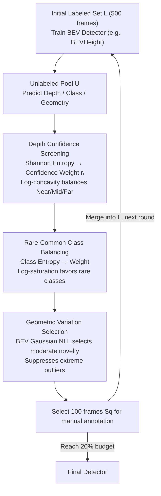

# Learnability-Driven Submodular Optimization for Active Roadside 3D Detection

**Conference**: CVPR2026  
**arXiv**: [2601.01695](https://arxiv.org/abs/2601.01695)  
**Code**: Unreleased  
**Area**: Autonomous Driving  
**Keywords**: Active Learning, Roadside Perception, Monocular 3D Detection, BEV, Submodular Optimization, Learnability, Data Selection

## TL;DR

The LH3D framework is proposed, utilizing a three-stage submodular optimization active learning strategy—"Depth Confidence → Semantic Balance → Geometric Diversity"—to suppress the selection of inherently ambiguous samples in roadside monocular 3D detection. It significantly outperforms traditional uncertainty/diversity-based AL methods using only a 20% annotation budget.

## Background & Motivation

1. **Roadside perception as a key supplement to L5 autonomous driving**: Ego-vehicle sensors suffer from occlusions, intersection blind spots, and insufficient long-range perception. Fixed roadside cameras can significantly extend field-of-view coverage.
2. **Annotation cost as a deployment bottleneck**: Roadside scenes involve dense targets, many small distant objects, and severe occlusions. Single-frame 3D annotation requires inferring depth and occlusion relationships, making manual annotation costs extremely high.
3. **Failure of traditional active learning in roadside scenarios**: Uncertainty-based AL methods prioritize high-uncertainty samples. In roadside scenarios, these are often "inherently ambiguous samples"—distant, blurry, or heavily occluded objects that cannot be reliably annotated from a single viewpoint.
4. **Discovery of inherently ambiguous samples**: Human experts struggle to accurately annotate 3D attributes of distant roadside objects without paired vehicle-side data, revealing a fundamental learnability issue.
5. **Human experiment verification**: Under the same annotation budget and class distribution, detectors trained on ambiguous samples show significantly lower AP for Vehicles and Pedestrians compared to models trained on learnable samples, proving that ambiguous samples provide weaker supervisory signals.
6. **Need for a new paradigm**: The focus should shift from "selecting the uncertain" to "selecting the learnable," transforming the core objective of active learning from uncertainty to learnability.

## Method

### Overall Architecture

LH3D (Learnable Hierarchical 3D) addresses a counter-intuitive dilemma in roadside active learning: traditional uncertainty AL selects the "most uncertain" samples, which in roadside scenarios are often **inherently ambiguous samples** (e.g., distant/occluded targets). Since these cannot be accurately labeled even by humans, training on them hinders performance. LH3D shifts the goal to "selecting what is learnable." Built upon LSS-style BEV detectors (e.g., BEVHeight), it designs a three-stage hierarchical submodular selector filtering by Depth → Semantics → Geometry. Each stage is modeled using a submodular function in concave-over-modular form, supporting greedy optimization with a $(1-1/e)$ approximation guarantee. The three stages share a unified objective:

$$F(S_q) = [\Phi_A(S_q) - \Phi_A(\mathcal{U})] + [\Phi_B(\mathcal{L}_q \cup S_q) - \Phi_B(\mathcal{L}_q)] + [\Phi_C(\mathcal{L}_q \cup S_q) - \Phi_C(\mathcal{L}_q)]$$

In each AL round, starting from the current detector's predictions, the three-stage submodular greedy selection is executed. A batch of images is selected for manual annotation, merged into the labeled set, and the detector is retrained until the budget is exhausted.

### Key Designs

**1. Stage 1 Depth Confidence Screening: Filtering ambiguous scenes with unreliable depth**

Depth is the foundation of BEV detection. Samples with unreliable depth estimation are inherently noisy and should be filtered first. For each image, the normalized Shannon entropy $h_i$ of the depth prediction distribution is mapped to a confidence weight $r_i = e^{-\tau h_i}$. An argmax depth bin histogram $m_i$ is computed and weighted to form a depth coverage vector. The submodular objective $\Phi_A(S) = \sum_{d=1}^{D} \log(\epsilon + Z_d(S))$ utilizes the concavity of the log function to ensure balanced coverage across near, medium, and far distance ranges, preventing a bias toward easy near-field samples.

**2. Stage 2 Rare-Common Class Balancing: Preventing Vehicle dominance**

Roadside targets exhibit a long-tail distribution. Standard selection is dominated by Vehicles, leaving rare classes like Pedestrians and Cyclists with minimal exposure. The detector predicts the object count for each class, normalized into a distribution $p_i(c)$. The semantic diversity entropy $\delta_i$ is mapped to a weight $\alpha_i = 1 + \gamma \delta_i$. The objective $\Phi_B(S) = \sum_{c \in \mathcal{C}} \log(\epsilon + N_c(S))$ leverages log-saturation to diminish marginal gains for well-covered classes, shifting the budget toward rare classes.

**3. Stage 3 Geometric Variation Selection: Seeking new layouts without outlier bias**

Beyond depth and semantics, models require novel geometric layouts to generalize, yet they should avoid extreme outliers. Gaussian models $\mathcal{N}(\mu_c, \Sigma_c)$ for BEV centers and heights are fitted to the labeled set. The Negative Log-Likelihood (NLL) of predicted boxes under these Gaussians serves as a geometric novelty score $s_{i,c}$. The objective $\Phi_C(S) = \sum_{c \in \mathcal{C}} \log(\epsilon + U_c(S))$ encourages selecting layouts with **moderate** deviations from learned patterns while suppressing extreme outliers to avoid noise.

### Loss & Training

- The detector is trained using standard detection losses from the BEV pipeline.
- In each AL round, the model is fine-tuned for 5 epochs from the previous checkpoint using AdamW (lr=2e-4, batch=8).
- The process starts with 500 initial images, selecting 100 images per round, with a total budget of 32K targets.

## Key Experimental Results

### DAIR-V2X-I Val Set (BEVHeight Backbone, 20% Budget, Hard)

| Method | Vehicle | Pedestrian | Cyclist | Average |
|------|---------|------------|---------|---------|
| RANDOM | 51.41 | 13.42 | 39.38 | 34.74 |
| ENTROPY | 54.51 | 16.72 | 38.57 | 36.53 |
| BADGE | 51.33 | 14.98 | 35.35 | 33.89 |
| PPAL | 51.44 | 18.07 | 39.71 | 36.41 |
| HUA | 51.48 | 13.33 | 34.48 | 33.10 |
| **LH3D (Ours)** | **56.03** | **17.67** | **41.79** | **38.50** |

LH3D achieves an Average AP gain of +2.09 over PPAL and +5.40 over HUA in the Hard setting.

### Rope3D Val Set (BEVHeight Backbone, 20% Budget, Hard)

| Method | Vehicle | Pedestrian | Cyclist | Average |
|------|---------|------------|---------|---------|
| RANDOM | 19.65 | 1.50 | 14.80 | 11.99 |
| PPAL | 24.12 | 1.73 | 14.80 | 13.55 |
| **LH3D (Ours)** | **26.12** | **2.04** | **16.69** | **14.95** |

### Ablation Study: Stage Order (BEVHeight, Hard)

| Order | Car | Ped | Cyc | Avg |
|------|-----|-----|-----|-----|
| DC→GV→SB | 50.62 | 16.83 | 37.10 | 34.85 |
| SB→DC→GV | 55.90 | 12.46 | 35.95 | 34.77 |
| GV→DC→SB | 40.04 | 13.02 | 32.67 | 28.58 |
| **DC→SB→GV (Ours)** | **56.03** | **17.67** | **41.79** | **38.50** |

DC must be the first stage (depth is foundational for BEV). Performance degrades significantly when GV is first, as geometric selection without depth filtering introduces excessive ambiguous samples.

### Cross-Backbone Generalization (DAIR-V2X-I, Hard, Average AP)

- BEVHeight: 38.50 (SOTA)
- BEVSpread: 36.07 (SOTA)
- BEVDet: 33.01 (SOTA)

LH3D yields the best results across three different BEV detectors, demonstrating generalizability.

## Highlights & Insights

1. **Novel problem definition**: Clearly identifies the concept of "inherently ambiguous samples" in roadside BEV perception and validates their negative impact on training via human experiments.
2. **Learnability-driven paradigm shift**: Transitions from "uncertainty maximization" to "learnability maximization," which is more practical for roadside scenarios.
3. **Strong theoretical guarantees**: Proofs of monotonicity and submodularity are provided for all three objectives, ensuring a $(1-1/e)$ approximation ratio for the greedy algorithm.
4. **Rational hierarchical design**: The priority order (Depth → Semantics → Geometry) is validated as optimal, aligning with the dependencies of the BEV pipeline.
5. **Thorough evaluation**: Consistently outperforms 7 AL baselines across multiple datasets (DAIR-V2X-I, Rope3D) and 3 different BEV backbones.

## Limitations & Future Work

1. **Evaluated only on monocular BEV detection**: Not yet extended to LiDAR point clouds or multi-modal fusion scenarios.
2. **Limited class count**: Only 3 classes (Car/Ped/Cyc) are considered; finer-grained labels (e.g., vehicle types) might require more complex semantic balancing.
3. **Bottlenecks at long range and high occlusion**: Error analysis shows continued missed detections for distant vehicles and occluded pedestrians/cyclists.
4. **Depth confidence depends on the initial model**: The quality of Stage 1 depth filtering is limited by the initial small-sample model during the cold-start phase.
5. **Lack of detailed computational overhead comparison**: While selection cost is claimed to be negligible, the actual time taken by the three-stage cascade on large pools is not fully reported.
6. **Temporal information ignored**: Roadside video streams contain temporal redundancy; the strategy does not utilize inter-frame correlation for deduplication.

## Related Work & Insights

- **vs BADGE/CORESET**: These classic AL methods focus on uncertainty or embedding space diversity. In roadside scenes, they are misled by ambiguous samples, whereas LH3D explicitly filters them via depth confidence.
- **vs PPAL**: PPAL is a recent SOTA for detection AL combining difficulty-calibrated uncertainty and class similarity, but it lacks specific handling for depth ambiguity inherent in roadside views.
- **vs HUA**: HUA uses Bayesian deep learning for hierarchical uncertainty estimation. However, high-uncertainty samples in roadside settings are often unlearnable, leading to performance drops.
- **vs BEVHeight/BEVSpread**: These are detector backbones, not AL methods. LH3D is a plug-and-play data selection module compatible with any BEV detector.

## Rating

- Novelty: ⭐⭐⭐⭐ — First to introduce learnability to roadside AL; innovative inherent ambiguity definition and human experiment design.
- Experimental Thoroughness: ⭐⭐⭐⭐ — 2 datasets × 3 backbones × 7 baselines plus extensive ablations, though lacking computational cost analysis.
- Writing Quality: ⭐⭐⭐⭐ — Clear logic, rigorous theory, and detailed supplementary materials.
- Value: ⭐⭐⭐⭐ — Practical significance for roadside data efficiency, though limited to monocular BEV detection.

<!-- RELATED:START -->

## Related Papers

- [\[CVPR 2026\] LiDAS: Lighting-driven Dynamic Active Sensing for Nighttime Perception](lidas_lighting-driven_dynamic_active_sensing_for_nighttime_perception.md)
- [\[CVPR 2026\] ActiveAD: Planning-Oriented Active Learning for End-to-End Autonomous Driving](activead_planning-oriented_active_learning_for_end-to-end_autonomous_driving.md)
- [\[CVPR 2026\] GSV2X: Geometry-Aware Uncertainty Modeling and Orthogonal Fusion for Robust Roadside Perception](gsv2x_geometry-aware_uncertainty_modeling_and_orthogonal_fusion_for_robust_roads.md)
- [\[CVPR 2026\] Lipschitz Optimization for Formal Verification of Homographies](lipschitz_optimization_for_formal_verification_of_homographies.md)
- [\[ICCV 2025\] Adaptive Dual Uncertainty Optimization: Boosting Monocular 3D Object Detection under Test-Time Shifts](../../ICCV2025/autonomous_driving/adaptive_dual_uncertainty_optimization_boosting_monocular_3d_object_detection_un.md)

<!-- RELATED:END -->
