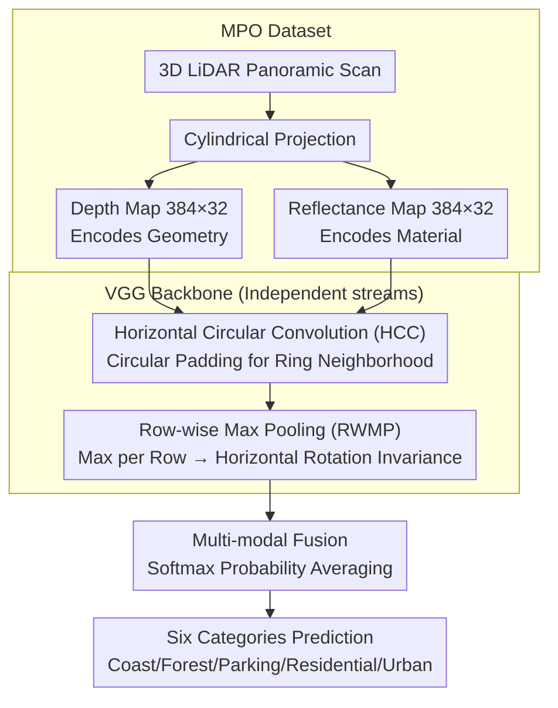

# Learning Geometric and Photometric Features from Panoramic LiDAR Scans for Outdoor Place Categorization

**Conference**: CVPR 2026  
**arXiv**: [2603.12663](https://arxiv.org/abs/2603.12663)  
**Code**: None  
**Area**: Autonomous Driving / Scene Understanding  
**Keywords**: Outdoor place categorization, LiDAR panorama, multi-modal fusion, CNN, depth and reflectance

## TL;DR
This paper utilizes panoramic depth and reflectance maps obtained from 3D LiDAR as inputs for a CNN. It constructs a large-scale outdoor place categorization dataset, MPO, and proposes two optimization strategies: Horizontal Circular Convolution (HCC) and Row-wise Max Pooling (RWMP). The method achieves high-precision classification (up to 97.87%) across six outdoor scene categories, significantly outperforming traditional hand-crafted feature methods.

## Background & Motivation
1. **Background**: Autonomous robots and vehicles require an understanding of their surroundings for navigation and decision-making. Place categorization is a critical task, requiring the robot to determine the semantic category of its current location.
2. **Limitations of Prior Work**: Traditional methods rely heavily on RGB cameras, which face challenges in outdoor environments such as drastic day-night illumination changes and occlusions by pedestrians or vehicles, leading to unstable visual features. Furthermore, existing 3D datasets (e.g., KITTI) are primarily oriented toward localization and mapping, with limited scene category labels (only 4 categories).
3. **Key Challenge**: RGB images are sensitive to lighting changes, whereas depth and reflectance information provided by LiDAR is robust to illumination. However, there is a lack of large-scale outdoor place categorization datasets and specialized CNN architectures for LiDAR data.
4. **Goal**: (1) Construct a large-scale multi-modal LiDAR outdoor scene classification dataset; (2) Design a CNN architecture suitable for panoramic LiDAR images; (3) Explore optimal fusion strategies for depth and reflectance modalities.
5. **Key Insight**: The authors observe that LiDAR panoramas have a ring-like structure (connected end-to-end horizontally). Standard convolutions use zero-padding at the boundaries, which destroys this continuity. Additionally, vehicle yaw movement causes significant horizontal feature shifts.
6. **Core Idea**: Maintain the ring-like properties of panoramas through Horizontal Circular Convolution (HCC), achieve rotation invariance using Row-wise Max Pooling (RWMP), and enhance classification accuracy through depth + reflectance multi-modal fusion.

## Method

### Overall Architecture
The paper addresses outdoor place categorization to enable robots to stably determine location types despite drastic lighting changes and occlusions. The approach moves away from light-sensitive RGB cameras to 3D LiDAR. Specifically, point clouds from a roof-mounted LiDAR are flattened via cylindrical projection into two 2D panoramas ($384 \times 32$): a depth map (encoding geometric structure) and a reflectance map (encoding material properties). These maps are processed individually or jointly by a CNN to predict six outdoor scene categories (Coast, Forest, Indoor Parking, Outdoor Parking, Residential, Urban). Two key modifications revolve around the "circular + rotatable" nature of panoramas, followed by a fusion stage.

### Key Designs

**1. MPO Dataset: Establishing a large-scale LiDAR benchmark**

The primary contribution is the data. Existing datasets are either RGB-only (e.g., Places), which lacks robustness, or 3D datasets for mapping (e.g., KITTI) with insufficient category labels for training a classifier. Using a Velodyne HDL-32e LiDAR at speeds of 30–50 km/h, the authors traversed 10 areas in Fukuoka city across six scene types, collecting 34,200 panoramic scans. Each scan contains both depth and reflectance modalities (59.23 GB total). They also supplemented this with 650 high-resolution scans (Dense MPO) using a FARO Focus 3D S120.

**2. Horizontal Circular Convolution (HCC): Respecting the ring structure**

Panoramas cover 360 degrees; the leftmost and rightmost columns of the image are physically adjacent. Standard convolution uses zero-padding, which essentially inserts a "blank neighborhood" into this continuous seam, causing feature degradation at the boundaries. HCC replaces zero-padding with circular padding: horizontally, pixels from the right end are padded to the left, and vice versa. This ensures the kernel always extracts a true circular neighborhood. Grad-CAM results confirm that HCC allows the model to extract features uniformly across boundaries.

**3. Row-wise Max Pooling (RWMP): Achieving horizontal rotation invariance**

Vehicle yaw and LiDAR mounting angles cause visual concepts to shift horizontally in the panorama. Standard CNNs are not invariant to such shifts. RWMP is inserted between the last convolutional layer and the first fully connected layer. It takes the maximum value of each row across every feature map, compressing each row into a scalar to output a column vector. As long as a visual concept appears in the same row (same elevation angle), the output remains constant regardless of its horizontal position.

**4. Multi-modal Fusion: Comparison of four strategies**

Depth and reflectance provide complementary information. The authors compared four approaches: **Softmax Average** (averaging probabilities from independent single-modal models) performed best (97.87%). **Adaptive Fusion** utilized a gating network but suffered from insufficient training data. **Early Fusion** (concatenating maps into dual channels) performed poorly due to vanishing gradients. **Late Fusion** (merging at the fully connected layer) showed limited gains. The insight is that depth and reflectance focus on different visual cues; independent training preserves discriminative power and avoids optimization difficulties found in early fusion.

### Loss & Training
The model uses Cross-Entropy loss, optimized with SGD (learning rate $10^{-4}$, momentum 0.9), batch size 64, $L_2$ regularization ($5 \times 10^{-4}$), and 50% Dropout. Early stopping is applied (if validation loss does not drop for 10 epochs). Data augmentation includes horizontal flipping and random horizontal circular shifts.

## Key Experimental Results

### Main Results (Single-modal Classification Accuracy %)

| Modality | Method | Coast | Forest | ParkingIn | ParkingOut | Residential | Urban | Total |
| :--- | :--- | :--- | :--- | :--- | :--- | :--- | :--- | :--- |
| Depth | LBP+SVM | 84.25 | 94.93 | 96.41 | 86.86 | 94.58 | 92.71 | 92.00 |
| Depth | VGG (baseline) | 92.73 | 97.26 | 99.94 | 94.23 | 98.35 | 99.20 | **97.18** |
| Reflect | VGG+RWMP+HCC | 91.83 | 98.20 | 91.45 | 95.16 | 97.99 | 98.27 | **95.92** |
| Multi-modal | Softmax Average | - | - | - | - | - | - | **97.87** |

### Ablation Study (Impact of HCC and RWMP)

| Configuration | Depth Accuracy | Reflectance Accuracy | Description |
| :--- | :--- | :--- | :--- |
| VGG baseline | 97.18% | 94.75% | Baseline |
| VGG + RWMP | 97.11% | 95.74% | Row-pooling only |
| VGG + HCC | 96.89% | 95.45% | Circular convolution only |
| VGG + RWMP + HCC | 96.92% | **95.92%** | Combination |

### Key Findings
- Depth modality (97.18%) generally outperforms reflectance (95.92%), though reflectance is superior in Forest and Outdoor Parking categories.
- HCC and RWMP provide a more significant boost to the reflectance modality (+1.17%) than depth, suggesting depth information is inherently less sensitive to horizontal shifts.
- Softmax Average is the simplest and most effective fusion method, yielding a 0.69% improvement over the best single modality.
- Grad-CAM visualization shows that HCC+RWMP eliminates feature attenuation at image boundaries.
- In rotation invariance tests, the HCC+RWMP combination resulted in a flatter accuracy curve, whereas the baseline VGG dropped significantly at 90°/270° rotations.

## Highlights & Insights
- **Intuitive HCC design**: The ring structure of panoramas is a known prior, but few works have explicitly exploited it at the CNN layer level. This idea is transferable to any panoramic/spherical imaging task.
- **Complementarity of Depth vs. Reflectance**: Depth captures geometric structures (building outlines, road shapes), while reflectance captures material properties (vegetation, road texture). This explains why simple probability averaging is effective.
- **Grad-CAM identifies decision logic**: Coast depends on horizon features (center area), Residential on building features in the vehicle's longitudinal direction, and Forest on distributed texture features.

## Limitations & Future Work
- Primarily used Sparse MPO; Dense MPO was underutilized due to size.
- Classification granularity is coarse; finer categories (e.g., specific urban types) were not explored.
- In multi-modal fusion, Early and Late Fusion performed poorly; advanced mechanisms like Transformer-based attention might improve results.
- Data augmentation was limited to horizontal flips and circular shifts.
- Generalization has not been verified on data from other cities or countries.

## Related Work & Insights
- **vs. Places/Places2**: Places uses RGB images; Ours uses LiDAR panoramas, providing robustness to lighting.
- **vs. KITTI**: KITTI has fewer categories and focuses on driving; MPO offers 6 categories specifically for categorization.
- **vs. Song et al. (SUN RGB-D)**: SUN merges features for indoor scenes; Ours focuses on outdoor LiDAR scenes.

## Rating
- Novelty: ⭐⭐⭐ The circular convolution and row-pooling ideas are simple and effective, though technically straightforward.
- Experimental Thoroughness: ⭐⭐⭐⭐ Comparison of model variants, fusion strategies, rotation analysis, and Grad-CAM is comprehensive.
- Writing Quality: ⭐⭐⭐⭐ Clear structure, systematic experimental design, and insightful visualization.
- Value: ⭐⭐⭐ Strong dataset contribution, though the research topic is somewhat niche.

<!-- RELATED:START -->

## Related Papers

- [\[CVPR 2026\] Panoramic Multimodal Semantic Occupancy Prediction for Quadruped Robots](panoramic_multimodal_semantic_occupancy_prediction.md)
- [\[CVPR 2026\] C-LaV: Conditional Latent Velocity Field Denoising for Weather-Robust LiDAR Place Recognition](c-lav_conditional_latent_velocity_field_denoising_for_weather-robust_lidar_place.md)
- [\[CVPR 2025\] LightLoc: Learning Outdoor LiDAR Localization at Light Speed](../../CVPR2025/autonomous_driving/lightloc_learning_outdoor_lidar_localization_at_light_speed.md)
- [\[CVPR 2026\] Test-Time Training for LiDAR Semantic Segmentation under Corruption via Geometric Inlier Discrimination](test-time_training_for_lidar_semantic_segmentation_under_corruption_via_geometri.md)
- [\[CVPR 2026\] SG-NLF: Spectral-Geometric Neural Fields for Pose-Free LiDAR View Synthesis](sgnlf_spectralgeometric_neural_fields_for_posefre.md)

<!-- RELATED:END -->
